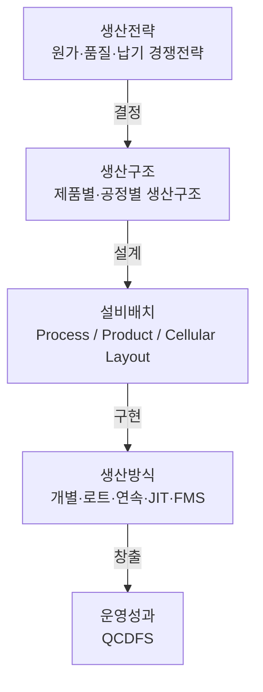
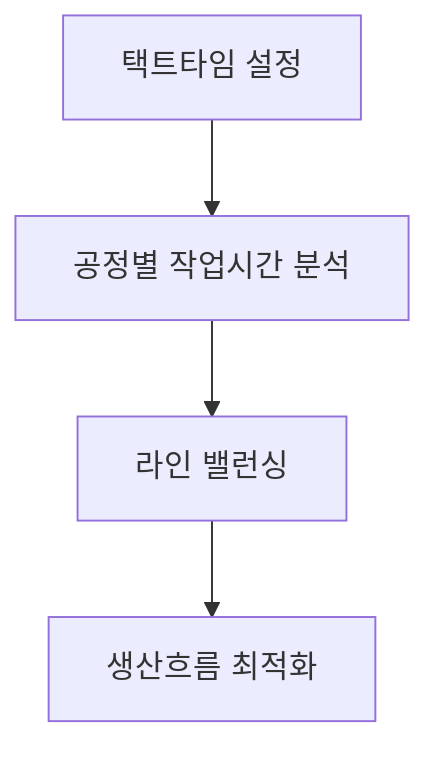

## 생산구조와 생산방식(Layout)

생산구조와 생산방식은 생산전략을 실제 생산현장에 구현하기 위한 핵심 요소이다. 기업은 제품 특성, 생산량, 고객 요구, 납기전략 등을 고려하여 생산구조와 설비배치를 결정하며, 이는 생산성·원가·품질·유연성에 직접적인 영향을 미친다.

### 생산구조의 개요

#### 생산구조의 정의

**생산구조**(Production Structure)란 생산활동을 수행하기 위해 인력, 설비, 자재 및 정보가 조직되는 형태를 의미한다.

#### 생산구조의 구성요소

* 생산설비
* 작업자
* 자재흐름
* 정보흐름
* 생산관리체계

#### 생산구조 결정요인

* 제품 종류
* 생산량
* 품질 요구수준
* 고객 맞춤화 수준
* 설비 투자규모
* 시장 수요변동성

#### 생산구조와 생산방식의 관계

생산구조는 생산시스템의 형태를 결정하며, 생산방식은 이를 운영하는 방법을 의미한다.



### 생산구조의 유형

#### 집중형 생산구조

생산설비와 기능을 특정 공장이나 지역에 집중시키는 방식

##### 특징

* 규모의 경제 확보
* 설비 활용도 향상
* 관리 효율성 증대

##### 단점

* 물류비 증가
* 공급망 리스크 증가

#### 분산형 생산구조

생산기능을 여러 지역에 분산 배치하는 방식

##### 특징

* 시장 대응력 향상
* 물류비 절감
* 지역 밀착 생산 가능

##### 단점

* 투자비 증가
* 관리 복잡성 증가

#### 혼합형 생산구조

집중형과 분산형을 결합한 형태

##### 적용 사례

* 글로벌 생산 네트워크
* 다국적 제조기업 생산체계

#### 유형별 사례

| 구분                  | 특징                    | 대표 사례               |
| ------------------- | --------------------- | ------------------- |
| 집중형 (Centralized)   | 생산설비와 인력을 한 곳에 집중     | 제철소, 정유공장, 반도체 FAB  |
| 분산형 (Decentralized) | 생산거점이 여러 지역에 분산       | 음료공장, 시멘트공장, 식품공장   |
| 혼합형 (Hybrid)        | 핵심공정은 집중, 최종조립·공급은 분산 | 자동차, 전자제품, 글로벌 제조기업 |

## 설비 배치

**설비배치**(Layout)는 생산흐름과 자재이동을 결정하는 핵심 설계요소이며 생산성, 재공품, 리드타임 및 물류비에 큰 영향을 미친다.

### 설비배치의 목적

* 자재이동 최소화
* 생산흐름 최적화
* 설비활용도 향상
* 안전성 확보
* 리드타임 단축

### 설비배치 유형

#### 위치고정형 배치 (Fixed Position Layout)

제품이 고정되고 인력·설비·자재가 이동하는 방식이다.

##### 적용 사례

* 조선
* 항공기
* 건설 프로젝트

##### 장점

* 대형 제품 생산 적합
* 제품 이동 불필요

##### 단점

* 작업관리 복잡
* 설비 활용도 저하

#### 공정별 배치 (Process Layout)

유사 공정을 기능별로 집합 배치하는 방식이다.

##### 적용 사례

* 병원
* 금형공장
* 정비공장

##### 장점

* 높은 유연성
* 다품종 생산 적합

##### 단점

* 운반거리 증가
* 재공품 증가

#### 제품별 배치 (Product Layout)

공정 흐름 순서에 따라 설비를 직선적으로 배치하는 방식이다.

##### 적용 사례

* 자동차 조립라인
* 가전제품 생산라인

##### 장점

* 높은 생산성
* 낮은 단위당 생산비

##### 단점

* 유연성 부족
* 설비투자 증가

#### 그룹기술 기반 배치 (Cellular Layout)

유사 부품군을 하나의 셀 단위로 구성하여 생산하는 방식이다.

##### 적용 사례

* 기계가공 셀
* 전자부품 조립라인
* 다품종 소량 생산

##### 장점

* 운반거리 감소
* 리드타임 단축
* WIP 감소
* 유연성 향상

##### 단점

* GT 분석 필요
* 셀 설계 복잡
* 초기 구축 비용

### Product-Process Matrix

제품 다양성과 생산량에 따라 적합한 생산방식이 결정된다. [^1]


| 생산방식    | 생산량   | 제품 다양성 |
| ------- | ----- | ------ |
| 프로젝트 생산 | 낮음    | 매우 높음  |
| 공정별 배치  | 낮음    | 높음     |
| 셀 생산    | 중간    | 중간     |
| 제품별 배치  | 높음    | 낮음     |
| 연속생산    | 매우 높음 | 매우 낮음  |

[^1]: Hayes & Wheelwright가 제시한 Product-Process Matrix는 생산량과 제품다양성 간의 적합성을 설명하는 대표 이론이다.

## 셀 생산방식(CMS)

### 개요

**CMS**(Cellular Manufacturing System)는 그룹기술(Group Technology)을 기반으로 유사 제품군을 하나의 셀(Cell)에서 생산하는 방식이다.

### 등장 배경

* 다품종 소량생산 증가
* 제품수명주기 단축
* 고객 맞춤생산 확대

### 핵심 특징

* 소규모 자율 생산단위
* 다기능공 활용
* 흐름 생산 구현
* 재공품 감소

### CMS와 컨베이어 생산 비교

| 구분     | CMS  | 컨베이어 생산  |
| ------ | ---- | -------- |
| 생산품종   | 다품종  | 소품종      |
| 생산량    | 중·소량 | 대량       |
| 유연성    | 높음   | 낮음       |
| 작업자 역할 | 다기능공 | 단순 반복작업  |
| 재공품    | 적음   | 상대적으로 많음 |

!!! note "관련 단원"

```
다기능공 육성은 「인력과 직무설계」에서 상세히 설명한다.
```

## 설비배치 분석기법

### SLP(Systematic Layout Planning)

리처드 무더(Richard Muther)가 제안한 체계적 설비배치 기법이다.[^2]

#### 수행절차


##### 1. Q-R-S-T 분석 (출발 데이터 정의 단계)

설비배치의 기초가 되는 **4대 핵심 요구조건을 정의하는 단계**이다.

* Q (Quantity): 생산량, 물류량, 작업 빈도
* R (Route): 공정 흐름 및 작업 경로
* S (Support Services): 유지보수, 창고, 검사, 공기압 등 지원 요소
* T (Time): 생산시간, 택트타임, 리드타임

**핵심 의미**

* “무엇을 얼마나, 어떤 흐름으로, 어떤 조건에서, 얼마나 빨리 생산할 것인가”를 정의
* 이후 모든 배치 의사결정의 기준 데이터 역할

##### 2. 활동관계 분석 (Activity Relationship Analysis)

각 작업장·부서 간의 **상호 관계(밀접도)를 분석**하는 단계이다.

**주요 내용**

* 부서 간 물류 흐름
* 작업 연속성
* 협업 빈도
* 정보/자재 이동 관계

**도구**

* From-To Chart (흐름표)
* 관계도표(Relationship Chart)

**핵심 의미**

* “어떤 작업들이 가까이 있어야 하는가?”를 정하는 단계

##### 3. 활동관련도 작성 (Relationship Rating / Closeness Rating)

활동 간 관계를 **정량 또는 정성 등급으로 표현**하는 단계이다.

**일반 등급 체계** (SLP 표준)

* A (Absolutely necessary) : 반드시 인접
* E (Especially important) : 매우 중요
* I (Important) : 중요
* O (Ordinary) : 보통
* U (Unimportant) : 중요하지 않음
* X (Undesirable) : 분리 필요

**핵심 의미**

* “가까워야 하는 정도 vs 떨어져야 하는 정도”를 수치화

##### 4. 배치대안 작성 (Layout Generation)

앞 단계의 관계도를 바탕으로 **물리적 배치 후보안을 설계**하는 단계이다.

**주요 내용**

* 블록 레이아웃(Block Layout) 작성
* 공정 흐름 최소화
* 공간 활용 고려
* 물류 동선 최적화

**핵심 의미**

* “이론적 관계를 실제 공간 구조로 변환”

##### 5. 최적안 선정 (Evaluation & Selection)

여러 대안 중에서 **평가 기준을 적용하여 최적안을 선택**하는 단계이다.

**평가 기준**

* 물류 이동거리 최소화
* WIP 최소화
* 생산 리드타임
* 공간 활용도
* 확장성 및 유연성
* 비용 (이동/설비/운영)

**기법**

* 정성평가 (점수법)
* 정량평가 (거리, 비용 계산)
* 가중치 평가법

**핵심 의미**

* “효율성과 현실성을 동시에 고려한 최종 의사결정”

[^2]: Richard Muther, *Systematic Layout Planning*, 1961.

### 활동관련도(ARC)

부서 간 중요도를 정성적으로 평가하는 기법

| 기호 | 의미      |
| -- | ------- |
| A  | 절대 필요   |
| E  | 특히 중요   |
| I  | 중요      |
| O  | 보통      |
| U  | 중요하지 않음 |
| X  | 분리 필요   |

### 컴퓨터 활용 설비배치 기법

| 기법      | 특징           |
| ------- | ------------ |
| CRAFT   | 기존 배치 개선     |
| CORELAP | 관계도 기반 초기 배치 |
| ALDEP   | 무작위 탐색 기반 배치 |
| COFAD   | 물류흐름 최적화     |

## 고객주문과 납기전략에 따른 생산방식

고객주문이 생산활동에 영향을 미치는 지점을 주문분기점(Decoupling Point)이라 한다.

### 주문분기점(Decoupling Point)


주문분기점이 뒤로 갈수록 고객 맞춤화 수준이 높아진다.

### 생산방식 비교

| 구분  | 생산시점    | 특징     |
| --- | ------- | ------ |
| MTS | 생산 후 판매 | 대량생산   |
| ATO | 조립 후 출하 | 모듈 생산  |
| MTO | 주문 후 생산 | 맞춤생산   |
| ETO | 주문 후 설계 | 고도 맞춤형 |

## 제품수명주기와 생산방식

제품수명주기에 따라 적합한 생산방식도 변화한다.

| 단계  | 특징     | 적합 생산방식 |
| --- | ------ | ------- |
| 도입기 | 수요 불확실 | 공정별 배치  |
| 성장기 | 수요 증가  | 셀 생산    |
| 성숙기 | 대량 수요  | 제품별 배치  |
| 쇠퇴기 | 수요 감소  | 유연생산    |

## 생산환경 변화와 대응 생산방식

### 다품종 소량생산

#### 특징

* 제품 다양성 증가
* 수요 변동 확대
* 짧은 제품수명주기

#### 대응 전략

* CMS
* SMED
* ERP
* MES
* FMS

### 대량 맞춤 생산(Mass Customization)

#### 개요

대량생산의 효율성과 맞춤생산의 차별화를 동시에 추구하는 생산방식이다.[^3]

#### 구현 전략

* 모듈화 설계
* 플랫폼 전략
* 지연전략(Postponement)
* 디지털 생산기술 활용

#### 장점

* 고객만족 향상
* 재고 감소
* 경쟁우위 확보

#### 단점

* 생산계획 복잡성 증가
* 정보시스템 의존성 증가

[^3]: Pine II, *Mass Customization*, 1993.

### 택트타임 생산방식

#### 개요

고객 수요에 맞추어 생산속도를 동기화하는 생산방식

#### 계산식

$$
택트타임 = \frac{가용 생산시간}{고객 수요량}
$$

#### 라인 밸런싱과의 관계



!!! note "관련 단원"

```
SMED는 「공정개선」, ERP/MES는 「정보화활용기술」, 라인 밸런싱은 「작업방법 및 시간연구」에서 상세히 설명한다.
```
