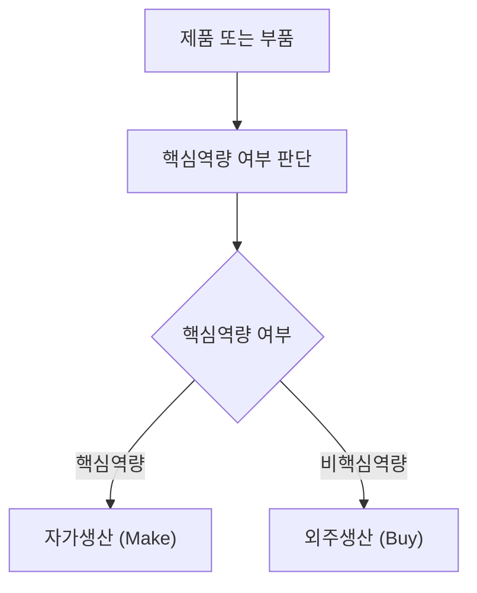
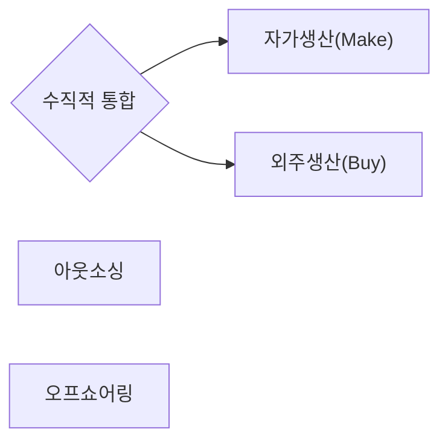

## 구매와 외주전략

**구매**와 **외주전략**은 기업이 필요한 자원과 역량을 내부에서 확보할 것인지 외부에서 조달할 것인지를 결정하는 전략적 의사결정이다. 최근에는 단순한 원가절감 관점을 넘어 공급망 안정성, 핵심역량 강화, 공급망 회복탄력성(Resilience)[^Resilience] 확보가 중요한 전략적 과제로 부각되고 있다.

[^Resilience]: 공급망이 외부 충격을 받았을 때 빠르게 정상 상태로 복구하고, 동시에 기능을 유지하거나 개선할 수 있는 능력을 의미한다.  
여기서 "충격"은 다양한 형태로 나타난다.  
  - 자연재해 (지진, 홍수 등)  
  - 팬데믹 같은 전 세계적 위기  
  - 원자재 부족, 물류 차질  
  - 지정학적 리스크(전쟁, 무역 제한)  
  - 주요 공급업체의 파산이나 생산 중단  

### 구매의 개요

#### 구매와 조달의 정의

**구매**(Purchasing)는 필요한 자재나 서비스를 공급자로부터 획득하는 활동을 의미하며, **조달**(Procurement)은 구매를 포함하여 공급자 선정, 계약, 납기관리, 품질관리 등 전 과정을 포괄하는 개념이다.

| 구분 | 구매(Purchasing) | 조달(Procurement) |
| -- | -------------- | --------------- |
| 관점 | 거래 중심          | 전략 중심           |
| 범위 | 발주 및 구매        | 공급망 전반          |
| 목적 | 필요품 확보         | 가치 창출 및 공급 안정화  |

#### 구매관리의 발전

| 구분     | 전통적 구매 | 현대적 구매      |
| ------ | ------ | ----------- |
| 목적     | 가격 인하  | 총비용 최적화     |
| 공급자 관계 | 단기 거래  | 전략적 파트너십    |
| 관리범위   | 구매업무   | 공급망 관리      |
| 성과지표   | 구매가격   | TCO, 품질, 납기 |

#### 구매의 중요성

* 원가 절감
* 안정적 공급 확보
* 품질 향상
* 공급망 경쟁력 확보

### 구매관리

#### 구매관리의 목적(5R)

**구매관리**는 적정한 자재를 적정한 시점에 적정한 가격으로 확보하여 생산활동을 지원하는 것을 목적으로 한다.

| 항목             | 내용     |
| -------------- | ------ |
| Right Quality  | 적정 품질  |
| Right Quantity | 적정 수량  |
| Right Time     | 적정 시기  |
| Right Price    | 적정 가격  |
| Right Source   | 적정 공급원 |

#### 공급자 관리(SRM)

현대 구매관리에서는 공급자를 단순 거래대상이 아닌 전략적 파트너로 관리한다.

주요 관리항목

* 품질
* 납기
* 원가
* 기술력
* 재무건전성

!!! note "관련 단원"
    공급자 평가는 「공급망 관리」에서 상세히 설명한다.

### 구매가격과 계약방식

#### 가격 결정방식

| 방식       | 특징         |
| -------- | ---------- |
| 비용중심 가격  | 제조원가 기준    |
| 구매자중심 가격 | 구매자 협상력 반영 |
| 경쟁자중심 가격 | 시장가격 기준    |

#### 가격 유형

| 유형   | 내용           |
| ---- | ------------ |
| 시중가격 | 시장에서 형성된 가격  |
| 개정가격 | 가격 변동에 따라 수정 |
| 정가가격 | 사전 결정 가격     |
| 협정가격 | 상호 합의 가격     |
| 교섭가격 | 협상을 통한 가격    |

#### 할인방식

##### 현금할인(Cash Discount)

대금을 조기에 지급할 경우 할인 제공

예시

```text
2/10, Net 30

10일 이내 지급 : 2% 할인
30일 이내 지급 : 정상 지급
```

##### 수량할인(Quantity Discount)

구매수량 증가에 따라 단가를 할인하는 방식

목적

* 구매단가 절감
* 공급자 생산성 향상
* 거래 안정성 확보

### 구매방식 유형

#### 집중구매

본사 또는 중앙조직에서 구매를 통합 수행하는 방식

##### 장점

* 규모의 경제
* 구매력 강화
* 구매표준화

##### 단점

* 현장 대응성 부족
* 구매절차 경직

#### 분산구매

사업장 또는 부서별로 구매를 수행하는 방식

##### 장점

* 신속한 구매
* 현장 맞춤 대응

##### 단점

* 구매비용 증가
* 중복 구매 발생

#### 집중구매와 분산구매 비교

| 구분   | 집중구매 | 분산구매 |
| ---- | ---- | ---- |
| 구매력  | 높음   | 낮음   |
| 유연성  | 낮음   | 높음   |
| 표준화  | 높음   | 낮음   |
| 대응속도 | 느림   | 빠름   |

## 생산 및 외주 의사결정(Make or Buy)

기업은 제품 또는 부품을 자체 생산할 것인지 외부에 위탁할 것인지 결정해야 한다.

### Make or Buy 의사결정



#### 의사결정 고려요인

* 원가
* 품질
* 기술보호
* 생산능력
* 공급위험
* 납기

### 자가생산과 외주생산

#### 자가생산(Make)

기업 내부에서 직접 생산하는 방식

##### 장점

* 품질 확보
* 기술축적
* 기밀 유지

##### 단점

* 투자비 증가
* 생산유연성 부족

#### 외주생산(Buy)

외부 전문기업에 생산을 위탁하는 방식

##### 장점

* 비용 절감
* 생산유연성 향상
* 투자 부담 감소

##### 단점

* 기술 유출 위험
* 품질 통제 어려움
* 공급망 의존성 증가

### 수직적 통합(Vertical Integration)

기업이 공급망 상류 또는 하류로 사업범위를 확대하는 전략이다.

#### 전방통합(Forward Integration)

소비자 방향으로 사업영역 확대

예시

* 제조업체의 직영 판매망 구축

#### 후방통합(Backward Integration)

공급자 방향으로 사업영역 확대

예시

* 제조업체의 원재료 생산 진출

#### 수직적 통합의 효과

* 공급 안정성 확보
* 품질관리 강화
* 거래비용 감소

### 생산 및 외주전략의 관계



## 외주전략

외주전략은 기업 내부 자원보다 외부 전문역량을 활용하여 경쟁력을 확보하는 전략이다.

### 외주전략의 목적

* 핵심역량 집중
* 비용 절감
* 위험 분산
* 경영 효율화
* 생산유연성 확보

### 아웃소싱(Outsourcing)

#### 정의

기업 내부 업무를 외부 전문기업에 위탁하는 경영전략

#### 목적

* 비용 절감
* 핵심역량 집중
* 전문성 확보
* 조직 유연성 확보

#### 유형

| 유형      | 내용         |
| ------- | ---------- |
| BPO[^bpo]     | 경영지원 업무 위탁 |
| IT 아웃소싱 | IT 운영 위탁   |
| 제조 아웃소싱 | 생산활동 위탁    |

[^bpo]: BPO(Business Process Outsourcing)는 기업의 일부 업무 프로세스를 외부 전문 업체에 맡기는 것을 의미한다.
    - 인사(HR) 업무
    - 회계/재무 처리
    - 고객센터(Call Center)
    - 급여 계산
    - IT 운영 일부

#### 장점

* 고정비 감소
* 전문역량 활용
* 투자비 절감

#### 단점

* 기술 유출 위험
* 품질관리 어려움
* 공급자 의존성 증가

## 글로벌 생산 및 소싱 전략

글로벌화에 따라 생산거점과 공급망을 국가 단위로 최적화하는 전략이 중요해지고 있다.

### 오프쇼어링(Offshoring)

생산시설 또는 업무를 해외로 이전하는 전략

#### 목적

* 저임금 활용
* 생산비 절감
* 글로벌 시장 접근

#### 장점

* 원가 경쟁력 확보
* 생산규모 확대

#### 단점

* 공급망 리스크 증가
* 물류비 증가
* 지정학적 위험 노출

### 리쇼어링(Reshoring)

해외 생산거점을 본국으로 회귀시키는 전략

#### 등장 배경

* 공급망 불안정
* 지정학적 리스크
* 자동화 확대
* ESG 요구 증가

#### 효과

* 공급망 안정성 확보
* 리드타임 단축
* 기술유출 방지

### 최근 동향

과거에는 원가 중심의 오프쇼어링이 주류였으나 최근에는 공급망 회복탄력성(Resilience), ESG, 디지털 전환을 고려한 리쇼어링 및 지역화(Localization) 전략이 확대되고 있다.

!!! note "관련 단원"
    공급망 리스크와 회복탄력성은 「공급망 관리」에서 상세히 설명한다.
