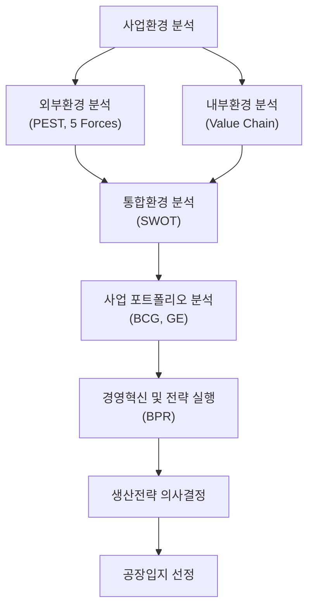
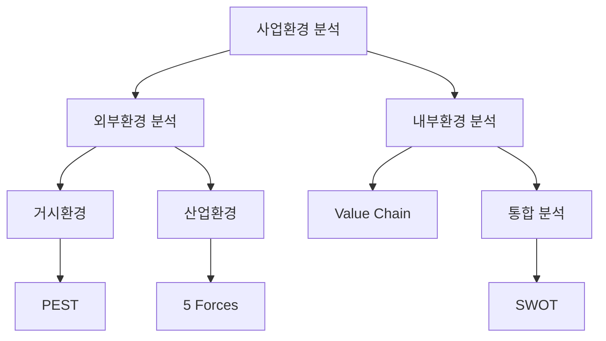

## 사업환경 분석의 개요

사업환경 분석은 기업이 경쟁우위를 확보하기 위하여 외부환경과 내부환경을 체계적으로 분석하는 과정이다. 생산전략, 투자전략, 공장입지, 공급망 설계 등의 의사결정은 모두 사업환경 분석을 기반으로 수행되며, 최근에는 ESG, 디지털 전환, 공급망 리스크와 같은 환경요인의 중요성이 증가하고 있다.

### 사업환경 분석의 정의

**사업환경 분석**(Business Environment Analysis)이란 기업의 경영성과에 영향을 미치는 외부환경과 내부역량을 분석하여 전략적 의사결정을 지원하는 활동이다.

### 사업환경 분석의 목적

* 시장기회 발굴
* 위험요인 사전 대응
* 경쟁우위 확보
* 자원배분 최적화
* 지속가능 성장 기반 구축

### 사업환경의 구성

### 분석도구 활용 시 유의사항

* 단일 분석도구에 의존하지 않는다.
* 정량적 자료와 정성적 자료를 병행한다.
* 산업 특성을 고려하여 해석한다.
* 환경 변화에 따라 지속적으로 갱신한다.

## 외부환경 분석

외부환경은 기업이 직접 통제할 수 없는 환경요인으로 구성된다.

### PEST 분석

#### 개요

PEST 분석은 거시환경(Macro Environment)을 분석하는 대표적 기법이다.

#### 구성요소

| 구분            | 내용       |
| ------------- | -------- |
| Political     | 정치·법률 환경 |
| Economic      | 경제 환경    |
| Social        | 사회·문화 환경 |
| Technological | 기술 환경    |

#### 분석 목적

* 미래환경 예측
* 사업기회 탐색
* 위험요인 식별
* 전략방향 설정

#### 생산관리 적용 사례

| 요인 | 생산관리 영향        |
| -- | -------------- |
| 정치 | 탄소규제, 산업정책     |
| 경제 | 환율, 금리, 원자재 가격 |
| 사회 | 친환경 소비, 고령화    |
| 기술 | AI, 스마트팩토리     |

### 5 Forces Model

#### 개요

마이클 포터(Michael Porter)가 제시한 산업구조 분석모형으로 산업 내 경쟁강도를 분석한다.[^1]

#### 구성요소

| 요인       | 의미           |
| -------- | ------------ |
| 산업 내 경쟁  | 기존 경쟁기업 간 경쟁 |
| 신규진입자 위협 | 신규 기업 진입 가능성 |
| 대체재 위협   | 대체 제품 출현 가능성 |
| 공급자 교섭력  | 공급자의 가격 결정력  |
| 구매자 교섭력  | 고객의 협상력      |

#### 삼성전자 스마트폰 사례

| 요소      | 사례               |
| ------- | ---------------- |
| 산업 내 경쟁 | Apple, Xiaomi 경쟁 |
| 신규진입자   | 진입장벽 높음          |
| 대체재     | 태블릿, 웨어러블        |
| 공급자     | 반도체·디스플레이 공급     |
| 구매자     | 소비자 선택권 확대       |

#### 장점

* 산업구조 이해 용이
* 경쟁전략 수립 지원

#### 한계

* 산업 경계가 명확하다는 가정
* 기술변화 반영 한계
* 플랫폼 비즈니스 분석 한계

[^1]: Michael Porter, *Competitive Strategy*, 1980.

## 내부환경 분석

내부환경 분석은 기업의 경쟁역량과 핵심역량을 파악하는 과정이다.

### 가치사슬(Value Chain)

#### 개요

가치사슬은 기업활동을 가치창출 관점에서 분석하는 기법이다.[^2]

#### 가치사슬 구조

#### 분석 목적

* 핵심역량 파악
* 원가절감 기회 발견
* 차별화 요소 발굴

#### 생산전략과의 관계

가치사슬 분석은 본원적 경쟁전략의 실행기반이 된다.

!!! note "관련 단원"
    가치사슬 분석 결과는 「경쟁우위 생산전략」의 원가우위 전략 및 차별화 전략과 직접 연계된다.

[^2]: Michael Porter, *Competitive Advantage*, 1985.

## 통합환경 분석

### SWOT 분석

#### 개요

SWOT 분석은 외부환경과 내부환경을 통합하여 전략을 도출하는 기법이다.

!][(https://upload.wikimedia.org/wikipedia/commons/thumb/0/0b/SWOT_en.svg/1280px-SWOT_en.svg.png)

#### 구성요소

| 내부환경       | 외부환경          |
| ---------- | ------------- |
| Strengths  | Opportunities |
| Weaknesses | Threats       |

### SWOT 전략 매트릭스

| 구분 | 전략 방향          |
| -- | -------------- |
| SO | 강점을 활용하여 기회 활용 |
| ST | 강점으로 위협 대응     |
| WO | 약점을 보완하여 기회 활용 |
| WT | 약점 최소화 및 위험 회피 |

#### 장점

* 이해가 용이
* 전략 수립 활용성 높음

#### 한계

* 정성적 분석 중심
* 분석자 주관 개입 가능

## 사업 포트폴리오 분석

기업은 복수 사업의 투자우선순위를 결정해야 한다.

### BCG 매트릭스

#### 개요

시장성장률과 시장점유율을 기준으로 사업을 평가하는 기법이다.[^3]

#### 구성

| 구분            | 특징       |
| ------------- | -------- |
| Star          | 고성장·고점유율 |
| Cash Cow      | 저성장·고점유율 |
| Question Mark | 고성장·저점유율 |
| Dog           | 저성장·저점유율 |

#### 전략 방향

| 유형            | 전략       |
| ------------- | -------- |
| Star          | 적극 투자    |
| Cash Cow      | 수익 확보    |
| Question Mark | 선택적 투자   |
| Dog           | 철수 또는 축소 |

### GE 매트릭스

#### 개요

BCG의 한계를 보완한 포트폴리오 분석기법이다.

#### 평가기준

* 산업 매력도(Industry Attractiveness)
* 사업 경쟁력(Business Strength)

#### 9개 영역 전략

- 투자 및 성장
- 선별적 투자
- 수확 및 철수
 
### BCG와 GE 비교

| 구분    | BCG | GE  |
| ----- | --- | --- |
| 평가요소  | 2개  | 다수  |
| 구조    | 4분면 | 9분면 |
| 분석난이도 | 낮음  | 높음  |
| 정확성   | 보통  | 높음  |

[^3]: Boston Consulting Group, Growth-Share Matrix.

## 경영혁신과 사업환경 대응

### BPR(Business Process Reengineering)

#### 개요

BPR은 업무프로세스를 근본적으로 재설계하여 성과를 획기적으로 개선하는 혁신기법이다.[^4]

#### 핵심 개념

* 근본적 재설계
* 프로세스 중심
* 고객 중심
* IT 적극 활용

#### 추진 절차

#### 장점

* 업무 혁신
* 리드타임 단축
* 고객만족 향상

#### 단점

* 조직 저항
* 투자비 증가
* 실패 위험 존재

!!! note "관련 단원"
    BPR의 상세 실행기법은 「공정개선」 및 「생산혁신기술」에서 심화 학습한다.

[^4]: Hammer & Champy, *Reengineering the Corporation*, 1993.

## 공장입지 분석

공장입지는 생산비용과 공급망 경쟁력을 결정하는 장기적 전략 의사결정이다.

### 입지선정 절차

## 국내 공장입지

### 선정요소

* 시장 접근성
* 원재료 공급성
* 교통 인프라
* 노동력 확보
* 토지 비용
* 유틸리티 공급

## 해외 공장입지

### 선정요소

* 시장 접근성
* 생산비용
* 환율
* 정치적 안정성
* 법률 및 규제
* 공급망 안정성

### 최근 고려요소

* 지정학적 리스크
* 탄소규제
* 공급망 회복탄력성
* ESG 요구사항

## 입지 평가방법

### 정성적 평가기법

#### 체크리스트법

입지요소를 항목별로 평가하는 방법

#### 평가행렬법(Factor Rating)

평가항목별 가중치를 적용하여 비교하는 방법

### 정량적 평가기법

#### 중심지법(Center of Gravity)

물류비 최소화를 위한 최적 입지 선정

#### 수송모형(Transportation Model)

총 운송비 최소화 입지 분석

#### 손익분기점 분석

고정비와 변동비를 고려한 경제성 비교

### 종합 의사결정 기법

#### AHP

계층적 의사결정기법으로 정성·정량 요소를 통합 평가한다.

#### MCDM

다기준 의사결정기법으로 복수 평가기준을 동시에 고려한다.

### 입지평가기법 비교

| 구분  | 대표기법            | 특징      |
| --- | --------------- | ------- |
| 정성적 | 체크리스트, 평가행렬     | 사용이 간편  |
| 정량적 | 중심지법, 수송모형, BEP | 경제성 분석  |
| 종합형 | AHP, MCDM       | 종합 의사결정 |

## 사업환경 분석의 종합

사업환경 분석은 외부환경(PEST, 5 Forces), 내부환경(Value Chain), 통합분석(SWOT)을 통해 전략 방향을 도출하고, BCG·GE를 활용하여 투자 우선순위를 결정하며, 최종적으로 생산전략과 공장입지 전략으로 구체화된다. 이는 기업의 지속가능한 경쟁우위를 확보하기 위한 전략경영의 출발점이다.
