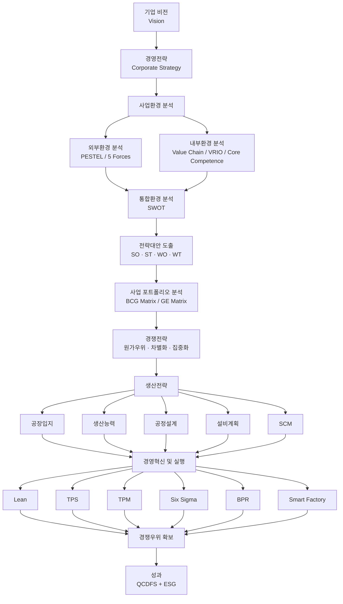
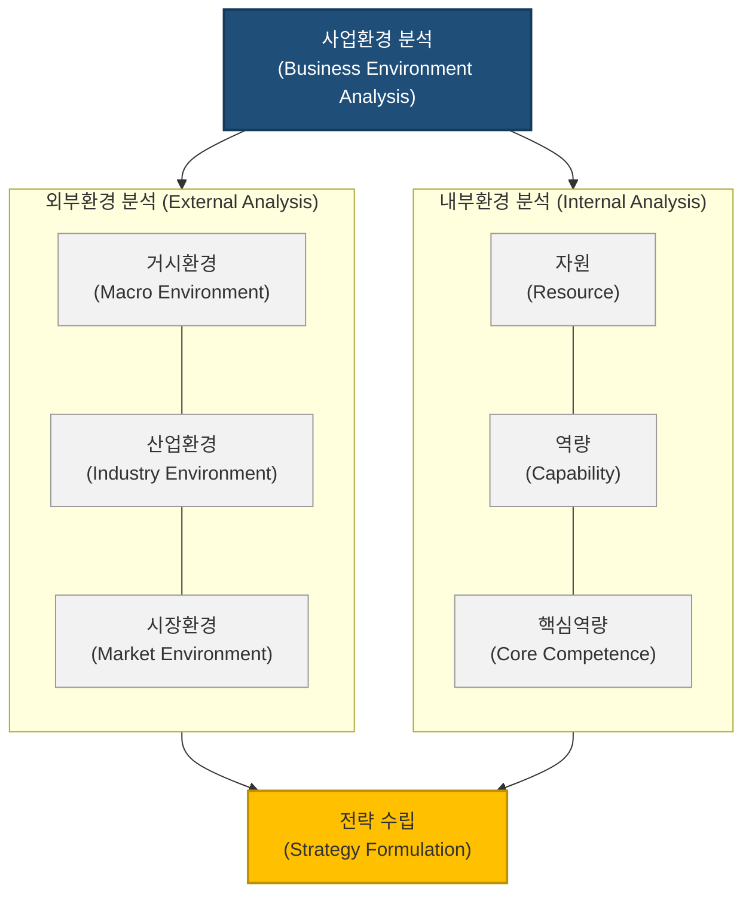

## 사업환경 분석의 개요

**사업환경 분석(Business Environment Analysis)**은 기업이 경쟁우위를 확보하기 위하여 외부환경과 내부환경을 체계적으로 분석하는 과정이다. 사업환경 분석을 통해 생산전략, 공장입지, 생산능력, 설비투자, 공급망(SCM), 스마트팩토리 구축과 같은 의사결정을 수립한다.

```mermaid
flowchart TD

    A["기업 비전<br/>Vision"]
    B["경영전략<br/>Corporate Strategy"]
    C["사업환경 분석"]

    A --> B
    B --> C

    C --> D["외부환경 분석<br/>PESTEL / 5 Forces"]
    C --> E["내부환경 분석<br/>Value Chain / VRIO / Core Competence"]

    D --> F["통합환경 분석<br/>SWOT"]
    E --> F

    F --> G["전략대안 도출<br/>SO · ST · WO · WT"]

    G --> H["사업 포트폴리오 분석<br/>BCG Matrix / GE Matrix"]

    H --> I["경쟁전략<br/>원가우위 · 차별화 · 집중화"]

    I --> J["생산전략"]

    J --> K["공장입지"]
    J --> L["생산능력"]
    J --> M["공정설계"]
    J --> N["설비계획"]
    J --> O["SCM"]

    K --> P["경영혁신 및 실행"]
    L --> P
    M --> P
    N --> P
    O --> P

    P --> Q["Lean"]
    P --> R["TPS"]
    P --> S["TPM"]
    P --> T["Six Sigma"]
    P --> U["BPR"]
    P --> V["Smart Factory"]

    Q --> W["경쟁우위 확보"]
    R --> W
    S --> W
    T --> W
    U --> W
    V --> W

    W --> X["성과<br/>QCDFS + ESG"]
```

사업환경 분석 목적은 급변하는 시장환경 속에서 **기업 경쟁력을 확보**하고 **미래 위험에 선제적으로 대응**하는데 있다.

- 경영전략 수립 지원
- 경쟁우위 확보
- 시장 기회 발굴
- 위험(Risk) 사전 대응
- 투자 의사결정 지원
- 생산전략 및 운영전략 수립
- 지속가능경영 기반 마련

### 사업환경의 구성

```mermaid
flowchart TB

    A["사업환경 분석<br/>(Business Environment Analysis)"]

    subgraph External["외부환경 분석 (External Analysis)"]
        direction TB
        B1["거시환경<br/>(Macro Environment)"]
        B2["산업환경<br/>(Industry Environment)"]
        B3["시장환경<br/>(Market Environment)"]
        
        B1 --- B2 --- B3
    end

    subgraph Internal["내부환경 분석 (Internal Analysis)"]
        direction TB
        C1["자원<br/>(Resource)"]
        C2["역량<br/>(Capability)"]
        C3["핵심역량<br/>(Core Competence)"]
        
        C1 --- C2 --- C3
    end

    D["전략 수립<br/>(Strategy Formulation)"]

    A --> External
    A --> Internal

    External --> D
    Internal --> D


    classDef main fill:#1f4e79,color:#ffffff,stroke:#163a5c,stroke-width:2px;
    classDef detail fill:#f2f2f2,color:#333,stroke:#999;
    classDef result fill:#ffc000,color:#333,stroke:#bf9000,stroke-width:2px;

    class A main;
    class B1,B2,B3,C1,C2,C3 detail;
    class D result;
```

분석도구 활용 시 다음 사항을 유의한다.

* 단일 분석도구에 의존하지 않는다.
* 정량적 자료와 정성적 자료를 병행한다.
* 산업 특성을 고려하여 해석한다.
* 환경 변화에 따라 지속적으로 갱신한다.

## 외부환경 분석

외부환경은 기업이 직접 통제할 수 없는 환경요인으로 구성된다.

### PEST 분석 

**PEST 분석**이란 기업이 직면한 거시적 외부 환경 요인을 정치, 경제, 사회, 기술의 4가지 영역으로 분류하여 파악하는 전략 분석 도구이다.

* 외부 환경 요인 진단  
  기업이 직접 통제하기 어려운 거시적 환경의 변화 흐름 추적
* 전략적 기회 및 위협 도출  
  산업 생태계의 트렌드 변화를 선제적으로 파악하여 리스크 최소화

**PEST 분석의 4가지 주요 요소**

PEST 분석은 정치(Political), 경제(Economic), 사회(Social), 기술(Technological) 요인으로 구성된다.

* 정치적 요인(Political)  
  정부 정책, 법률 제·개정, 규제 변화, 정치적 안정성, 무역 정책 등
* 경제적 요인(Economic)  
  환율, 금리, 물가상승률, 경제성장률, 원자재 가격, 소비 수준 등
* 사회문화적 요인(Social)  
  인구통계학적 변화, 라이프스타일 트렌드, 가치관 변화, 교육 수준 등
* 기술적 요인(Technological)  
  신기술 등장, R&D 투자, 자동화 수준, 특허 환경, 디지털 전환 등

!!! note "PESTLE"

    PESTLE 분석은 기업이나 프로젝트가 외부 환경에 어떻게 영향을 받는지를 체계적으로 분석하는 도구이다. PEST 분석 요소에 법적 요인과 환경적 요인이 추가된다.    
    
    * Legal (법적 요인): 고용 법, 소비자 법, 안전 규정, 국제 무역 법규 등 법적 요인이 기업 활동에 미치는 영향을 분석한다.    
    * Environmental (환경적 요인): 기후 변화, 환경 보호 법규, 지속 가능한 에너지 정책 등 환경과 관련된 요소들이 기업의 운영, 특히 에너지 사용과 원자재 소싱에 미치는 영향을 조사한다.

**PEST 분석의 핵심 목적**

PEST 분석의 핵심 목적은 거시적 트렌드 예측, 신규 시장 진입 결정, 장기 전략 수립이 있다.

* **거시적 트렌드 예측**  
  기업 경영에 영향을 미치는 외부 변수의 장기적 방향성 진단
* **신규 시장 진입 결정**  
  새로운 국가 또는 산업 진출 시 거시적 환경의 적합성 평가
* **장기 전략 수립**  
  외부 기회 요인과 위협 요인을 바탕으로 한 중장기 로드맵 구상

**PEST 분석 요소별 세부 내용 비교**

PEST 분석 각 구성 요소의 세부 특징 및 검토 사항은 다음과 같다.

| 구분 | 주요 영향 요인 | 대표적 검토 항목 |
| :--- | :--- | :--- |
| 정치 (Political) | 정부 정책, 법률, 규제 | 환경 규제, 세제 혜택, 노동법 제정, 무역 장벽 |
| 경제 (Economic) | 거시 지표, 시장 상황 | 금리 인상, 환율 변동, 물가 상승, 소비 심리 |
| 사회 (Social) | 인구 구조, 문화적 트렌드 | 고령화, 1인 가구 증가, ESG 인식, 소비 패턴 |
| 기술 (Technological) | 기술 혁신, 산업 적용성 | AI·자동화 도입, 특허 출원, R&D 투자, 디지털 인프라 |

### 5 Forces Model

**5 Forces 모델**이란 마이클 포터(Michael Porter) 교수가 제안한 산업 구조 분석 도구로, 산업의 매력도와 수익성을 결정하는 5가지 경쟁 요인을 진단하는 프레임워크이다.

<figure markdown>
    

<figcaption>https://en.wikipedia.org/wiki/Porter%27s_five_forces_analysis</figcaption>    

</figure>

* **산업 내 경쟁 환경 진단**  
  개별 기업의 역량 이전에 산업 자체가 가진 수익 창출 가능성 평가
* **전략적 방향성 설정**  
  5가지 요인의 영향력을 파악하여 위협 요소를 회피하고 경쟁 우위를 확보하는 전략 수립

**5 Forces 모델의 5가지 핵심 요인**

5 Forces 모델은 기존 경쟁자, 신규 진입자, 대체재, 구매자, 공급자의 5가지 요인으로 구성된다.

* **기존 기업 간 경쟁 (Rivalry Among Existing Competitors)**  
  동종 산업 내 경쟁 기업의 수, 시장 성장률, 철수 장벽 등에 따른 경쟁 강도
* **신규 진입자의 위협 (Threat of New Entrants)**  
  자본금 요구량, 진입 장벽, 규모의 경제 등에 따른 신규 기업의 진입 가능성
* **대체재의 위협 (Threat of Substitute Products)**  
  타 산업의 대체 상품이나 서비스가 기존 시장을 대체할 위험성
* **구매자의 교섭력 (Bargaining Power of Buyers)**  
  구매자의 수, 구매 규모, 전환 비용 등에 따른 가격 결정권 행사 능력
* **공급자의 교섭력 (Bargaining Power of Suppliers)**  
  원자재 공급업체의 희소성, 대체 공급선 유무 등에 따른 가격 및 품질 통제력

**5 Forces 모델의 핵심 목적**

5 Forces 모델의 핵심 목적은 산업 매력도 평가, 진입 및 철수 결정, 수익성 방어 전략 수립이 있다.

* **산업 매력도 평가**  
  5가지 요인의 영향력이 약할수록 산업 전체의 평균 수익성이 높아짐을 활용한 평가
* **진입 및 철수 결정**  
  신규 사업 진출 여부 및 기존 사업의 지속성/철수 가능성 판단
* **수익성 방어 전략 수립**  
  교섭력이 강한 요인을 제어하거나 경쟁 강도를 낮추는 대응책 마련

**5 Forces 구성 요인별 특징 비교**

5 Forces 각 구성 요소의 영향력이 커지는 주요 조건 및 세부 특징은 다음과 같다.

| 구분 | 영향력 증대 조건 | 산업 수익성에 미치는 영향 |
| :--- | :--- | :--- |
| 기존 기업 간 경쟁 | 기업 수 다수, 시장 성장 정체, 높은 철수 장벽 | 가격 경쟁 심화로 인한 수익성 저하 |
| 신규 진입자의 위협 | 낮은 진입 장벽, 낮은 브랜드 인지도 요구 | 시장 점유율 분산 및 가격 하락 압박 |
| 대체재의 위협 | 대체재의 가성비 우수, 낮은 전환 비용 | 기존 제품의 가격 인상 제한 |
| 구매자의 교섭력 | 구매자 수 소수, 대량 구매, 높은 정보력 | 단가 인하 및 품질 향상 요구 증가 |
| 공급자의 교섭력 | 공급업체 독점, 높은 전환 비용, 대체재 부재 | 원자재 가격 상승으로 인한 원가 부담 증가 |

삼성전자 스마트폰 사례를 예로 들면 다음과 같다.

| 요소      | 사례               |
| ------- | ---------------- |
| 산업 내 경쟁 | Apple, Xiaomi 경쟁 |
| 신규진입자   | 진입장벽 높음          |
| 대체재     | 태블릿, 웨어러블        |
| 공급자     | 반도체·디스플레이 공급     |
| 구매자     | 소비자 선택권 확대       |

## 내부환경 분석

내부환경 분석은 기업의 경쟁역량과 핵심역량을 파악하는 과정이다.

### 가치사슬(Value Chain)

**가치사슬(Value Chain)**이란 마이클 포터(Michael Porter) 교수가 제안한 내부 환경 분석 도구로, 기업이 제품이나 서비스를 창출하기 위해 수행하는 일련의 연계 활동을 체계적으로 분석하는 프레임워크이다.

<figure markdown>
    

<figcaption>https://en.wikipedia.org/wiki/Value_chain</figcaption>

</figure>

* 내부 역량 및 부가가치 창출 구조 진단  
  기업의 활동을 세부적으로 분해하여 어느 단계에서 부가가치가 창출되고 원가가 발생되는지 파악
* 경쟁 우위 요소 도출  
  각 활동별 강점과 약점을 분석하여 원가 우위(Cost Leadership) 또는 차별화 우위(Differentiation) 도출

**가치사슬의 주요 구성 요소**

가치사슬은 **본원적 활동(Primary Activities)**과 **지원 활동(Support Activities)**으로 구분된다.

* **본원적 활동 (Primary Activities)**  
  제품의 생산, 물류, 마케팅, 판매, 서비스 등 제품의 물리적 완성 및 고객 전달에 직접적으로 관련된 활동이다.
    * 입고 물류(Inbound Logistics): 원자재 수령, 보관, 재고 관리
    * 운영/생산(Operations): 원자재를 최종 제품으로 변환하는 가공 및 조립
    * 출하 물류(Outbound Logistics): 최종 제품의 수집, 저장, 유통
    * 마케팅 및 판매(Marketing & Sales): 구매 유도를 위한 가격 결정, 프로모션, 채널 관리
    * 서비스(Service): 제품 판매 후 고객 지원, 수리, 유지보수
* **지원 활동 (Support Activities)**  
  본원적 활동이 원활하게 수행되도록 지원하고 기업 전체를 유지하는 활동이다.
    * 기업 인프라(Firm Infrastructure): 경영 관리, 기획, 재무, 법무 등 전체 관리 조직
    * 인적자원 관리(Human Resource Management): 채용, 교육, 보상, 노사 관리
    * 기술 개발(Technology Development): 제품 및 공정 개선을 위한 R&D, IT 시스템 구축
    * 조달/조달 관리(Procurement): 자재, 설비, 외부 서비스 구매 활동

**가치사슬 분석의 핵심 목적**

가치사슬 분석의 핵심 목적은 원가 구조 파악, 차별화 요인 발굴, 핵심 역량(Core Competency) 식별이 있다.

* **원가 구조 파악**  
  각 활동별 발생 비용을 분석하여 불필요한 비효율성 및 낭비 요소 제거
* **차별화 요인 발굴**  
  경쟁사 대비 높은 부가가치를 창출하는 특정 활동을 파악하여 제품/서비스 차별화
* **핵심 역량 식별**  
  기업 내 핵심적으로 우수한 활동을 파악하여 아웃소싱 여부 및 자원 집중 투자 결정

**가치사슬 구성 요소별 세부 내용 비교**  

가치사슬을 구성하는 본원적 활동과 지원 활동을 정리, 비교하면 다음과 같다.

| 구분 | 본원적 활동 (Primary Activities) | 지원 활동 (Support Activities) |
| :--- | :--- | :--- |
| 역할 | 제품 생산 및 고객 전달에 직접 관여 | 본원적 활동의 효율성을 제고하고 뒷받침 |
| 주요 세부 활동 | 입고 물류, 운영/생산, 출하 물류, 마케팅/판매, 서비스 | 기업 인프라, 인적자원 관리, 기술 개발, 조달 관리 |
| 분석 초점 | 공정 효율성, 물류 최적화, 판매 촉진 | 조직 역량 강화, R&D 투입, 구매 효율화 |
| 핵심 목표 | 직접적인 부가가치 창출 및 매출 발생 | 지속적 경쟁 우위를 위한 기반 환경 제공 |

## 통합환경 분석

### SWOT 분석

**SWOT 분석**이란 기업의 **내부 환경 요인인 강점(Strength)과 약점(Weakness)**, **외부 환경 요인인 기회(Opportunity)와 위협(Threat)**을 종합적으로 진단하여 전략을 도출하는 프레임워크이다.

<figure markdown>

<figcaption>https://en.wikipedia.org/wiki/SWOT_analysis</figcaption>

</figure>

* 내·외부 환경의 종합적 진단  
  내부 역량 분석(가치사슬 등)과 외부 환경 분석(PEST, 5 Forces 등) 결과를 통합하여 전략적 방향성 설정
* 경영 전략 도출의 기초  
  단순한 현황 파악을 넘어 실행 가능한 cross-SWOT 전략 수립 지원

**SWOT 분석의 4가지 핵심 요소**

SWOT 분석은 내부 요인 2가지와 외부 요인 2가지로 구성된다.

* 강점 (Strength)  
  경쟁사 대비 우위에 있는 기업 내부의 핵심 역량 및 자원
* 약점 (Weakness)  
  경쟁사 대비 열세에 있거나 개선이 필요한 기업 내부의 한계점
* 기회 (Opportunity)  
  기업에 유리하게 작용하는 외부 시장 트렌드, 법적 규제 완화, 기술 혁신 등
* 위협 (Threat)  
  기업 경영에 불리하게 작용하는 외부 경쟁 심화, 경기 침체, 법적 규제 강화 등

**SWOT 매트릭스를 통한 전략 도출 (Cross-SWOT)**

SWOT 분석의 핵심은 각 요소를 조합하여 4가지 실행 전략을 도출하는 데 있다.

* SO 전략 (강점-기회)  
  내부 강점을 활용하여 외부 기회를 적극적으로 포착하는 **공격적 전략**
* ST 전략 (강점-위협)  
  내부 강점을 활용하여 외부 위협을 극복하거나 회피하는 **다각화 전략**
* WO 전략 (약점-기회)  
  내부 약점을 보완하여 외부 기회를 활용하는 **만재/Turnaround 전략**
* WT 전략 (약점-위협)  
  내부 약점을 줄이고 외부 위협을 회피하는 **방어적/축소 전략**

**SWOT 전략 유형별 세부 내용 비교**

SWOT 매트릭스를 통해 도출되는 4가지 전략 유형의 세부 특징은 다음과 같다.

| 구분 | 외부 기회 (Opportunity) | 외부 위협 (Threat) |
| :--- | :--- | :--- |
| 내부 강점 (Strength) | SO 전략: 강점을 통한 기회 선점 (공격) | ST 전략: 강점을 통한 위협 극복 (위험 회피) |
| 내부 약점 (Weakness) | WO 전략: 약점 보완을 통한 기회 활용 (재도약) | WT 전략: 약점 최소화 및 위협 회피 (방어/철수) |

## 사업 포트폴리오 분석

기업은 복수 사업의 투자우선순위를 결정해야 한다.

### BCG 매트릭스

**BCG 매트릭스(BCG Matrix)**란 보스턴 컨설팅 그룹(Boston Consulting Group)이 개발한 포트폴리오 분석 도구로, 기업의 제품군이나 사업단위(SBU)를 시장 성장률과 상대적 시장 점유율을 기준으로 평가하는 프레임워크이다.

<figure markdown>

<figcaption></figcaption>

</figure>

* **사업 포트폴리오 진단**  
  각 사업단위가 점유하고 있는 위치를 파악하여 현금 흐름 창출력 평가
* **자원 배분 의사결정**  
  투자, 유지, 수확, 철수 등 제한된 경영 자원의 최적 배분 전략 수립

**BCG 매트릭스의 4가지 영역**

BCG 매트릭스는 **시장 성장률**(높음/낮음)과 **상대적 시장 점유율**(높음/낮음)에 따라 4가지 영역으로 구분된다.

* **스타 (Star: 높은 성장률, 높은 점유율)**  
  빠르게 성장하는 시장에서 높은 점유율을 보유한 영역으로, 점유율 유지를 위해 지속적인 대규모 투자가 필요
* **소 (Cash Cow: 낮은 성장률, 높은 점유율)**  
  성장률은 낮으나 높은 점유율을 바탕으로 안정적인 현금(Cash)을 창출하는 영역으로, 다른 사업의 투자 재원으로 활용
* **물음표 (Question Mark / Problem Child: 높은 성장률, 낮은 점유율)**  
  성장 잠재력은 높으나 점유율이 낮은 영역으로, 스타로 육성하기 위한 집중 투자 여부를 결정해야 함
* **개 (Dog: 낮은 성장률, 낮은 점유율)**  
  시장 성장 가능성이 낮고 점유율도 낮은 영역으로, 이익 창출이 어려워 철수 또는 축소를 고려

**BCG 매트릭스 기반 사업 전략**

각 영역별 특성에 따라 기업은 자원 배분 및 육성 전략을 차별화한다.

* 육성 전략 (Build)  
  **물음표(Question Mark)** 영역에 자원을 집중 투입하여 스타(Star)로 전환
* 유지 전략 (Hold)  
  **소(Cash Cow)**의 시장 지위를 유지하여 지속적인 현금 흐름 확보
* 수확 전략 (Harvest)  
  추가 투자 없이 단기적 현금 창출을 극대화한 후 자금 회수
* 철수 전략 (Divest)  
  **개(Dog)** 영역이나 경쟁력이 없는 물음표 영역의 사업 축소 또는 매각

!!! note "유지 전략 vs. 수확 전략"  

    유지 전략(Hold)과 수확 전략(Harvest) 모두 현금 흐름을 확보하는 데 목적이 있으나 사업 미래 방향성과 자원 투입 방식에서 명확한 차이가 존재한다.
    
    | 구분 | 유지 전략 (Hold) | 수확 전략 (Harvest) |
    | :--- | :--- | :--- |
    | 주요 목적 | 높은 시장 점유율 및 지위의 장기적 유지 | 단기 현금 유입 극대화 및 투자 회수 |
    | 투자 방향 | 점유율 방어를 위한 보전적 투자 지속 | 신규 및 유지 투자 최소화 또는 중단 |
    | 사업 수명 | 장기적 운영 유지 | 중·단기적 운영 후 축소 또는 철수 |
    | 주요 적용 영역 | 우수한 현금창출원 (Cash Cow) | 쇠퇴기 현금창출원, 개 (Dog), 일부 물음표 (Question Mark) |
    | 리스크 요인 | 경쟁 심화 시 방어 비용 증가 가능성 | 제품/서비스 품질 저하 및 고객 이탈 가속화 |

**BCG 매트릭스 영역별 세부 특징 비교**

BCG 매트릭스를 구성하는 4가지 영역의 세부 특징 및 전략 방향은 다음과 같다.

| 구분 | 시장 성장률 / 시장 점유율 | 현금 흐름 (Cash Flow) | 주요 대응 전략 |
| :--- | :--- | :--- | :--- |
| 스타 (Star) | 높음 / 높음 | 수익성 높음, 투자 지출도 큼 (중립적) | 시장 지위 유지를 위한 지속적 투자 |
| 현금창출원 (Cash Cow) | 낮음 / 높음 | 큰 폭의 순 현금 유입 창출 | 현금 확보 및 타 사업 투자 재원 활용 |
| 물음표 (Question Mark) | 높음 / 낮음 | 대규모 투자 필요로 인한 현금 유출 | 스타 육성을 위한 선택적 투자 또는 철수 |
| 개 (Dog) | 낮음 / 낮음 | 현금 창출 불가능 또는 소폭에 그침 | 사업 축소, 매각 또는 구조조정 (철수) |

### GE 매트릭스

**GE 매트릭스(GE-McKinsey Matrix)**란 제너럴 엘렉트릭(GE)사와 맥킨지(McKinsey & Company)가 공동 개발한 다각화 기업의 사업 포트폴리오 분석 도구로 산업 매력도와 사업 경쟁력 두 축을 기준으로 다차원적 평가를 수행한다.

<figure markdown>
    

<figcaption>https://www.cascade.app/blog/ge-matrix</figcaption>

</figure>

* BCG 매트릭스의 한계점 보완  
  단순한 시장 성장률과 점유율 대신 복합적인 요인을 반영하여 사업부의 가치를 다각도로 평가
* 다차원적 평가 체계 구축  
  **산업 매력도(Industry Attractiveness)**와 **사업 경쟁력(Business Unit Strength)**의 두 가지 축을 기준으로 9개 영역(3x3)으로 세분화

**GE 매트릭스의 주요 구성 요소**

GE 매트릭스는 산업 매력도와 사업 경쟁력을 축으로 설정하며, 각 축은 다수의 세부 지표를 종합하여 측정된다.

* **산업 매력도 (Industry Attractiveness)**  
  시장 규모, 시장 성장률, 산업 수익성, 기술적 요인, 사회적/법적 환경 등 외부 환경 요인을 종합 평가 (높음/중간/낮음)
* **사업 경쟁력 (Business Unit Strength)**  
  상대적 시장 점유율, 브랜드 인지도, 원가 경쟁력, 기술력, 자원 확보 능력 등 내부 역량 요인을 종합 평가 (강함/중간/약함)

**GE 매트릭스의 3가지 주요 구역 및 대응 전략**

9개 격자는 크게 투자/육성, 수익 창출/선택적 투자, 수확/철수의 3가지 전략 구역으로 구분된다.

* **투자 및 육성 구역 (Invest / Grow)**  
  산업 매력도가 높고 사업 경쟁력이 강한 우량 사업부 영역으로, 적극적인 자원 투입을 통한 시장 지위 확대
* **수익 창출 및 선택적 투자 구역 (Selectivity / Earnings)**  
  매력도나 경쟁력이 중간 수준인 영역으로, 강점 유지 및 선택적 투자를 통한 수익성 관리
* **수확 및 철수 구역 (Harvest / Divest)**  
  매력도가 낮고 경쟁력이 약한 부실 사업부 영역으로, 신규 투자를 중단하고 단기 현금 회수 후 사업 매각 또는 철수

!!! note "GE 매트릭스와 BCG 매트릭스 세부 비교"

    GE 매트릭스와 BCG 매트릭스의 세부 특징 및 차이점은 다음과 같다.

    | 구분 | BCG 매트릭스 | GE 매트릭스 |
    | :--- | :--- | :--- |
    | 평가 축 | 시장 성장률 (1개 지표), 상대적 점유율 (1개 지표) | 산업 매력도 (다수 지표), 사업 경쟁력 (다수 지표) |
    | 격자 구조 | 4개 영역 (2x2) | 9개 영역 (3x3) |
    | 평가 방식 | 정량적 지표 중심 | 정량 및 정성적 지표의 종합 가중치 평가 |
    | 주된 장점 | 이해가 쉽고 직관적임 | 신뢰도가 높고 세밀한 전략 수립 가능 |
    | 주된 단점 | 요인의 단순화로 인한 왜곡 가능성 | 지표 평가 및 가중치 부여 시 주관성 개입 가능 |

## 경영혁신과 사업환경 대응

### BPR

**BPR(Business Process Reengineering, 업무 프로세스 재설계)**이란 기업의 성과를 극적으로 향상시키기 위해 기존의 업무 프로세스를 근본적으로 재생각하고 파격적으로 재설계하는 경영 혁신 기법이다.

<figure markdown>

<figcaption>https://en.wikipedia.org/wiki/Business_process_re-engineering</figcaption>

</figure>

* 근본적 및 파격적 변화 추구  
  기존 프로세스의 점진적 개선(Kaizen)이 아닌 백지 상태(Clean Slate)에서의 원점 재검토
* 성과 지표의 극적 개선  
  비용, 품질, 서비스, 속도 등 핵심 성과 지표의 획기적 향상 달성

**BPR의 핵심 구성 요소 및 특징**

BPR은 기존의 기능 중심 조직에서 **과정(Process) 중심 조직으로의 전환**을 핵심으로 한다.

* 프로세스 중심 사고  
  부서 간 장벽을 허물고 고객에게 가치를 전달하는 전체 흐름(End-to-End Process)에 집중
* 정보기술(IT)의 적극적 활용  
  IT를 단순한 업무 지원 도구가 아닌 새로운 프로세스 창출을 위한 핵심 동인(Enabler)으로 활용
* 고객 가치 최우선  
  모든 프로세스 재설계의 기준을 내부 관리 편의가 아닌 최종 고객의 가치 증대에 둠

**BPR 추진 단계**

BPR은 추진 프레임워크에 따라 수립, 분석, 설계, 이행의 단계로 진행된다.

* 비전 수립 및 대상 선정  
  기업 전략 목표와 연계하여 혁신이 필요한 핵심 프로세스 선정
* As-Is 프로세스 분석  
  현재 프로세스의 문제점, 병목 구간, 비효율적 요소 진단
* To-Be 프로세스 설계  
  IT 기술을 접목하여 혁신적이고 효율적인 미래 프로세스 모델 구상
* 실행 및 변화 관리  
  새로운 프로세스 적용, 조직 구조 개편, 시스템 구축 및 임직원 변화 관리 수행

!!! note "BPR과 기존 개선 기법 비교"

    BPR과 전통적 공정/업무 개선 기법의 세부 특징 비교는 다음과 같다.
    
    | 구분 | 점진적 업무 개선 (PI / TQM) | BPR (Business Process Reengineering) |
    | :--- | :--- | :--- |
    | 변화의 폭 | 부분적 및 점진적 개선 | 근본적 및 파격적 재설계 |
    | 출발점 | 기존 프로세스 (As-Is) | 백지 상태 (Clean Slate) |
    | 변화 주체 | 하향식/상향식 병행 (현장 중심) | 강력한 탑다운 (최고경영자 주도) |
    | IT의 역할 | 기존 업무의 자동화 및 효율화 | 프로세스 혁신을 가능하게 하는 핵심 기반 |
    | 위험 요소 | 낮은 리스크, 낮은 보상 | 높은 리스크, 높은 성과 (High Risk, High Return) |
    
    
## 공장입지 분석

공장입지 분석(Plant Location Analysis)이란 제조 시설 생산성과 경제성을 극대화하기 위해 원자재 수급, 제품 유통, 노동력 확보, 정부 규제 등 다양한 요인을 고려하여 최적 공장 위치를 선정하는 전략적 의사결겅 과정이다.

* 입지 결정의 중요성  
  초기 대규모 자본이 투입되며 한 번 결정되면 변경이 어려워 기업의 장기적인 원가 구조 및 경쟁력에 결정적 영향 부여
* 전략적 목표
  생산 및 물류 비용 최소화, 고객 대응성 확보, 안정적 작업 인력 확보, 법적·환경적 리스크 관리

[1. 생산전략 > 1. 경쟁우위 생산전략 > 공장 입지](https://yeonkyupark.github.io/pepc3e/0101_competitive_manufacturing_strategy/#_9) 참고한다.

## 기업 성과 관리

### BSC

**BSC(Balanced Scorecard, 균형성과표)**는 기업의 비전과 전략을 측정 가능한 목표로 변환하여 성과를 종합적으로 관리하는 전략적 성과관리 프레임워크다. 1992년 하버드 경영대학원의 로버트 카플란(Robert Kaplan) 교수와 데이비드 노튼(David Norton) 컨설턴트에 의해 개발되었다.

과거의 단기적·재무적 성과 측정 방식에서 벗어나 **재무, 고객, 내부 프로세스, 학습 및 성장**이라는 4가지 핵심 관점을 균형 있게 평가한다.

1. BSC의 4가지 핵심 관점
    
    BSC는 아래 4가지 관점이 서로 원인과 결과(인과관계)로 연결되어 있다고 본다.
    
    | 관점 | 핵심 질문 | 평가 지표 예시 |
    | --- | --- | --- |
    | **재무적 관점** (Financial) | "주주에게 어떻게 보일 것인가?" | 매출 성장률, 영업이익률, ROI, ROE |
    | **고객 관점** (Customer) | "고객에게 어떻게 보일 것인가?" | 고객 만족도, 재구매율, 신규 고객 유치율, 시장 점유율 |
    | **내부 프로세스 관점** (Internal Business Process) | "어떤 핵심 프로세스에서 우수해야 하는가?" | 생산 주기 단축, 불량률 감소, 신제품 출시 기간 |
    | **학습 및 성장 관점** (Learning & Growth) | "비전을 달성하기 위해 어떻게 학습하고 개선할 것인가?" | 직무 교육 시간, 직원 만족도, 핵심 인재 유지율, IT 시스템 도입률 |

2. 4가지 '균형(Balanced)'의 의미

    BSC가 종래 성과평가 도구와 차별화되는 가장 큰 특징은 다각도의 균형을 맞춘다는 점이다.
    
    1. **재무와 비재무의 균형**: 눈에 보이는 매출/이익뿐만 아니라 고객 만족, 기술력 등 비재무적 자산도 정량화한다.
    2. **단기와 장기의 균형**: 당장의 실적(단기)과 연구개발·인재 육성(장기) 간의 균형을 유지한다.
    3. **선행과 후행의 균형**: 결과 지표(후행 지표: 매출)와 결과를 만들어내는 과정 지표(선행 지표: 교육 시간, 개발 속도)를 함께 관리한다.
    4. **내부와 외부의 균형**: 기업 내부 프로세스·조직 역량과 외부 주주·고객 시각을 균형 있게 고려한다.

3. BSC의 작동 원리 (전략 맵, Strategy Map)

BSC에서는 하부 관점의 성과가 상부 관점의 성과를 견인하는 **인과관계 구조**를 가진다.

1. **학습 및 성장**: 직원 교육과 IT 인프라 투자를 늘리면
2. **내부 프로세스**: 업무 효율성이 증가하고 불량률이 줄어들어
3. **고객**: 고객 만족도와 브랜드 신뢰도가 올라가고
4. **재무**: 최종적으로 매출과 영업이익이 증대된다.

4. 장점 및 도입 시 주의점

* **장점**: 기업의 추상적인 비전을 구체적인 실천 지표(KPI)로 전환해 주며, 조직 구성원 전체에게 명확한 목표 방향을 제시한다.
* **주의점**: 지표가 너무 많아지면 관리가 복잡해지며, 단순히 직원을 평가·감시하는 도구로 오용될 경우 구성원의 반발을 살 수 있다.
* 
