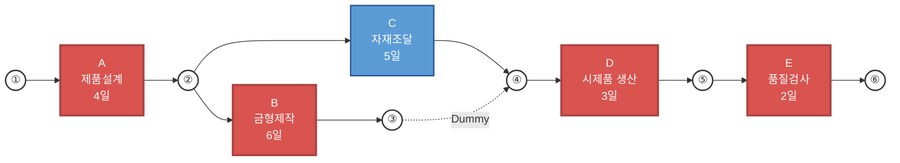

## 프로세스 진도관리

**진도관리(Progress Control)**는 생산운영 및 프로젝트 관리에서 수립된 일정 계획(Schedule) 대비 실제 작업 진행 상황을 지속적으로 모니터링하고, 차질 발생 시 이를 시정하는 관리 활동이다.

* **개념 정의**  
  생산 목표와 일정 계획에 맞춰 제품 생산이나 공정이 차질 없이 진행되고 있는지 파악하고 통제하는 관리 프로세스이다.
* **핵심 목적**  
  납기 준수(On-time Delivery), 공정 병목 해소, 자원 적체 방지 및 계획 대비 오차의 조기 발견을 목표로 한다.

## 진도관리의 주요 절차

진도관리는 실적 측정부터 시정 조치까지의 연속적인 피드백 루프(Feedback Loop) 과정으로 이루어진다.

```
[계획 수립] → [실적 측정 및 수집] → [계획 대비 실적 비교] → [원인 분석 및 시정 조치]

```

* **실적 측정 및 정보 수집**  
  작업장별 착수/완료 시간, 생산 수량, 불량률 등의 현장 데이터를 실시간 또는 주기적으로 수집한다.
* **계획 대비 실적 비교(Variance Analysis)**  
  실제 진도율과 계획된 진도율을 비교하여 공정의 진행 상태(진척, 지연, 정체)를 판단한다.
* **원인 분석 및 시정 조치(Corrective Action)**  
  지연 발생 시 설비 고장, 자재 부족, 작업자 숙련도 등 원인을 파악하여 잔업, 잔여 자원 재배치, 재일정계획(Rescheduling) 등의 시정 조치를 취한다.

### 주요 기법 및 도구

공장의 규모와 시스템 수준에 따라 시각적 도구부터 데이터 기반 도구까지 다양하게 활용된다.

* **간트 차트(Gantt Chart)**  
  시간축에 따라 계획 대비 실제 진행 상황을 막대그래프로 시각화하여 지연 여부를 직관적으로 파악한다.
* **S-커브(S-Curve Chart)**  
  시간 경과에 따른 누적 진도율(계획 vs 실적)을 나타내는 곡선으로, 전체적인 공정 진행 추이를 평가한다.
* **공정 진도표 및 현황판(Progress Board / Kiosk)**  
  생산 현장에 설치된 현황판을 통해 공정별 진도율과 작업 진행 상황을 공유한다.
* **네트워크 기법(화살도표, Arrow Diagramming Method)**
  작업 간 순서 관계와 소요 시간을 화살표 도형으로 표현하여 전체 프로젝트의 완료일과 핵심 관리 공정을 도출하는 기법이다.
* **MES(Manufacturing Execution System) 기반 자동 진도관리**  
  IoT 센서 및 키오스크를 통해 현장 데이터를 자동 수집하여 실시간 진도율과 가동률을 계산한다.

**진도관리 주요 도구 비교**

| 구분 | 간트 차트(Gantt Chart) | S-커브(S-Curve) | MES 기반 실시간 관리 |
| :--- | :--- | :--- | :--- |
| **주요 특징** | 개별 작업별 시간표 및 진도 표시 | 전체 누적 진도율 추이 표현 | 현장 데이터 실시간 자동 수집 |
| **장점** | 직관적이고 직관적인 시각화 가능 | 전체적인 일정 건전성 파악 용이 | 데이터의 정확도 및 즉각적 대응력 우수 |
| **단점** | 복잡한 대규모 공정 수동 관리 한계 | 세부 공정별 지연 원인 파악 어려움 | 초기 시스템 구축 비용 발생 |

### 네트워크 기법

**네트워크 기법(화살도표, Arrow Diagramming Method)**은 프로젝트를 구성하는 개별 작업(Activity)들을 결합점(Node)과 화살표(Arrow)로 연결하여 공정 간의 상호 연결 관계와 진행 순서를 네트워크망으로 표현한 진도관리 기법이다.

* **개념 정의**  
  작업 간 순서 관계와 소요 시간을 화살표 도형으로 표현하여 전체 프로젝트의 완료일과 핵심 관리 공정을 도출하는 기법이다.
* **진도관리에서의 역할**  
  특정 작업에 지연이 발생했을 때, 그 지연이 전체 프로젝트 완료일에 영향을 미치는지 여부를 즉각 파악하고 시정 조치를 취할 수 있게 해준다.

#### 주요 구성 요소

네트워크 기법은 화살표와 결합점, 그리고 여유 시간 계산을 통해 공정을 관리한다.



* **화살표(Arrow / Activity)**  
  시간과 자원이 소요되는 개별 작업이나 공정을 의미하며 화살표의 방향은 작업 진행 방향을 나타낸다.
* **결합점(Node / Event)**  
  작업의 시작과 완료 시점을 나타내는 원형 동그라미로, 자원이나 시간이 소요되지 않는 순간적 시점이다.
* **명목상 작업(Dummy Activity)**  
  실제 시간이나 자원이 소요되지 않으나 작업 간의 논리적 선후 관계를 표현하기 위해 사용하는 점선 화살표이다.
* **임계경로(Critical Path, 주공정)**  
  네트워크 내 시작 결합점에서 종료 결합점까지의 경로 중 **가장 긴 소요 시간이 걸리는 경로**로, 전체 프로젝트의 최소 완료 시간을 결정한다.
* **여유 시간(Float / Slack)**  
  전체 프로젝트 완료일을 지연시키지 않으면서 특정 작업이 가질 수 있는 시간적 여유이다.

네트워크 기법은 표기 방식 및 주요 구성 요소(Node와 Arrow)의 역할에 따라 **AOA(Activity-on-Arrow)** 방식과 **AON(Activity-on-Node)** 방식으로 구분된다.

**1. AOA(Activity-on-Arrow) 방식**

화살도표(Arrow Diagram) 방식으로, 화살표(Arrow)가 실제 작업(Activity)을 나타내고 결합점(Node)은 사건(Event)을 나타내는 네트워크 표기 기법이다.

* **개념 정의**  
  작업을 화살표 상에 배치하여 공정의 흐름을 시각화하는 전통적인 네트워크 기법이다.
* **주요 특징**  
  작업 간의 논리적 선후 관계를 명확히 표현하기 위해 시간과 자원이 소요되지 않는 명목상 작업(Dummy Activity, 점선 화살표)을 사용한다.
* **적용 기법**  
  초기 CPM 및 PERT 기법에서 주로 활용되었다.


**2. AON(Activity-on-Node) 방식**

선후도표(Precedence Diagram) 방식으로, 결합점(Node)이 실제 작업(Activity)을 나타내고 **화살표(Arrow)는 작업 간의 선후 관계**만을 나타내는 네트워크 표기 기법이다.

* **개념 정의**  
  작업을 마디(Node) 사각형 내에 배치하고 화살표로 연결하여 작업 간 의존성을 표현하는 기법이다.
* **주요 특징**  
  명목상 작업(Dummy Activity)을 사용할 필요가 없어 도표 작성이 상대적으로 간결하다.
* **다양한 연관 관계 표현**  
  단순한 FS(Finish-to-Start) 관계 외에도 SS(Start-to-Start), FF(Finish-to-Finish), SF(Start-to-Finish) 등 복잡한 선후 관계를 용이하게 표현할 수 있다.
* **적용 기법**  
  현대의 PDM(Precedence Diagramming Method) 및 주요 프로젝트 관리 소프트웨어(MS Project, Primavera 등)에서 표준으로 사용된다.


!!! note "AOA와 AON 방식 비교"

    | 작업 | 내용     | 선행 작업 |
    | -- | ------ | ----- |
    | A  | 제품 설계  | -     |
    | B  | 금형 제작  | A     |
    | C  | 자재 조달  | A     |
    | D  | 시제품 생산 | B, C  |
    | E  | 품질 검사  | D     |

    **AOA (Activity on Arrow)**
    ```mermaid
    flowchart LR
    
        N1(("①"))
        N2(("②"))
        N3(("③"))
        N4(("④"))
        N5(("⑤"))
    
        N1 -- "A<br/>제품 설계" --> N2
        N2 -- "B<br/>금형 제작" --> N3
        N2 -- "C<br/>자재 조달" --> N4
    
        N3 -. "Dummy" .-> N4
    
        N4 -- "D<br/>시제품 생산" --> N5
        N5 -- "E<br/>품질 검사" --> N6(("⑥"))
    
        %% Style
        classDef event fill:#ffffff,stroke:#333,stroke-width:2px;
        class N1,N2,N3,N4,N5,N6 event;
    ```

    **AON (Activity on Node)**
    
    ```mermaid
    flowchart LR
    
        A["A<br/>제품 설계"]
        B["B<br/>금형 제작"]
        C["C<br/>자재 조달"]
        D["D<br/>시제품 생산"]
        E["E<br/>품질 검사"]
    
        A --> B
        A --> C
        B --> D
        C --> D
        D --> E
    
        %% Style
        classDef activity fill:#5b9bd5,color:#fff,stroke:#2f5597,stroke-width:2px;
    
        class A,B,C,D,E activity;
    ```

    | 구분 | AOA (Activity-on-Arrow) | AON (Activity-on-Node) |
    | :--- | :--- | :--- |
    | **작업(Activity) 위치** | 화살표(Arrow) | 결합점(Node / 마디) |
    | **화살표(Arrow) 역할** | 작업 및 소요 시간 표현 | 작업 간의 연결 및 순서만 표현 |
    | **결합점(Node) 역할** | 착수 및 완료 사건(Event) | 작업(Activity) 자체 |
    | **Dummy Activity 필요성** | 필요함 (점선 표기) | 불필요함 |
    | **복잡한 관계 표현** | 한계 존재 (기본 FS 위주) | 용이함 (FS, SS, FF, SF 지원) |
    | **현대 소프트웨어 활용** | 드묾 | 보편적 표준으로 사용 |

#### 대표적인 네트워크 기법

네트워크 기법은 목적과 소요 시간의 확정성 여부에 따라 CPM과 PERT로 나뉜다.

**네트워크 기법의 진도관리상 장단점**

| 구분 | 장점 | 단점 |
| :--- | :--- | :--- |
| **선후 관계 파악** | 작업 간 의존성 및 선후 관계 시각화 우수 | 공정이 복잡할수록 도표 작성이 어렵고 난해함 |
| **중점 관리 대상** | 임계경로(CP) 식별을 통한 핵심 공정 관리 집중 가능 | 초보자가 이해하고 수정하기에 진입장벽 존재 |
| **지연 영향 분석** | 특정 작업 지연 시 전체 완료일에 미치는 영향 즉시 계산 | 현장 작업자가 실시간 진도율 입력 시 추가 도구 필요 |

**1. CPM(Critical Path Method, 주공정법)**

건설 및 일반 제조 공정 등 과거 데이터가 충분하여 **작업 소요 시간이 확정적인(Deterministic)** 프로젝트에 주로 적용된다. 1957년 미국 화학기업 듀퐁(DuPont)과 컴퓨터 제조사 레밍턴 랜드(Remington Rand)가 공장 정기 보수 일정을 최적화하기 위해 개발하였다.

* **작동 원리**  
  각 작업의 확실한 소요 시간을 바탕으로 임계경로(Critical Path)를 산출한다.
* **진도관리 활용**  
  임계경로 상에 있는 작업의 지연은 프로젝트 전체 지연으로 직결되므로 최우선 관리 대상으로 지정하여 진도를 집중 통제한다.

**2. PERT(Program Evaluation and Review Technique)**

신제품 개발, R&D 연구 등 과거 데이터가 부족하여 **작업 소요 시간이 불확실한(Probabilistic)** 프로젝트에 주로 적용된다. 미국 해군이 1958년 폴라리스 미사일 개발 사업을 추진하면서 대규모 하청업체들과의 복잡한 일정 관리를 위해 개발하였다.

* **작동 원리**  
    낙관치($a$), 모드치/최빈치($m$), 비관치($b$) 3점 추정법을 활용하여 기대 소요 시간을 계산한다.  

    $$\text{기대 소요시간 } t_e = \frac{a + 4m + b}{6}$$

* **진도관리 활용**  
  확률론적 기법을 바탕으로 일정 내 프로젝트 완료 가능 확률을 산출하여 진도 위험을 통제한다.

CPM과 PERT를 비교하면 다음과 같다.

<figure markdown>


<figcaption>https://itwiki.kr/w/PERT/CPM</figcaption>
    
</figure>

| 구분 | PERT (Program Evaluation and Review Technique) | CPM (Critical Path Method) |
| :--- | :--- | :--- |
| **개발 주체** | 미국 해군 특수프로젝트실(US Navy Special Projects Office), 부즈 알렌 해밀턴(Booz Allen Hamilton), 록히드(Lockheed) | 미국 듀퐁(DuPont) 사, 레밍턴 랜드(Remington Rand) 사 |
| **개발 시기** | 1950년대 후반 (1958년) | 1950년대 후반 (1957년) |
| **개발 배경** | 폴라리스(Polaris) 잠수함발사탄도미사일 프로젝트의 불확실한 일정 및 다수 하도급업체 통제 | 플랜트 화학 공장의 정기 점검 및 설비 보수 작업의 정지 시간(Downtime) 최소화 |
| **기본 성격** | 확률론적 모형(Probabilistic) | 확정론적 모형(Deterministic) |
| **중점 관리 요소** | 불확실한 일정 관리 및 프로젝트 적기 완수 확률 추정 | 공기 단축 및 비용 최적화(Cost-Time Trade-off) |
| **작업 소요시간** | 추정치 불확실(3점 추정법 활용) | 과거 경험 데이터 기반으로 확정적 |
| **시간 추정 방식** | 낙관치($a$), 모드치($m$), 비관치($b$) 활용 | 단일 소요시간 추정치 사용 |
| **핵심 기법/개념** | 확률적 기대시간($t_e$) 및 분산, 완수 확률 계산 | 정상 시간/비용, 비상 시간/비용(Crashing) |
| **주요 적용 대상** | R&D, 신제품 개발, 우주항공, 방산 연구 과제 | 건설 공사, 플랜트 건설, 대규모 제조, 설비 정기 보수 |
| **네트워크 표기 방식** | 전통적으로 AOA(Activity-on-Arrow) 위주 | AOA 및 AON(Activity-on-Node) 모두 활용 |

### TOC 병목관리

TOC(제약이론, Theory of Constraints)의 **병목 공정 관리 및 DBR(Drum-Buffer-Rope) 기법**은 진도관리 영역에서 공정 체증을 방지하고 생산 흐름을 최적화하는 데 매우 중요하게 활용되는 핵심 관리 기법이다. 기존 진도관리가 개별 공정의 일정을 단순히 체크하고 통제하는 방식이라면, TOC 관점의 진도관리는 "공장 전체의 출하량(Throughput)은 오직 병목 공정(제약 자원)의 진도에 의해 결정된다"는 전제하에 병목 공정을 집중 관리한다.

**TOC 병목관리의 핵심 개념**

TOC 관점에서의 진도관리는 모든 공정을 동일한 비중으로 관리하는 대신, 시스템 전체의 능력을 제약하는 제약 자원(Bottleneck)을 집중적으로 모니터링하고 제어한다.

* **개념 정의**  
  생산 프로세스 내 가장 가공 능력이 낮은 병목 공정을 식별하고, 해당 공정의 가동이 멈추지 않도록 집중 관리하여 전체 생산성을 극대화하는 진도관리 방식이다.
* **주요 원칙**  
    * 비병목 공정의 가동률 향상은 무의미한 재공품 재고만 증가시킨다.
    * 병목 공정에서의 1시간 손실은 전체 공장 전체의 1시간 손실과 같다.

#### DBR

TOC에서는 DBR(Drum-Buffer-Rope) 체계를 도입하여 병목 공정을 기준으로 전체 현장의 생산 진도를 동기화한다.

```text
                 Rope(투입 통제)
                      │
                      ▼
원자재 → 공정1 → 공정2 → [Buffer] → ★제약공정★ → [Buffer] → 공정3 → 출하
                          ↑                      ↑
                          │                      │
                       시간 보호               출하 보호

                         Drum
                   (제약공정 생산속도)
```

* **Drum(드럼)**  
  병목 공정의 생산 피치(Pitch) 및 일정을 의미하며, 전체 공장의 생산 속도를 결정하는 박자 역할을 수행한다.
* **Buffer(버퍼)**  
  병목 공정이 자재 부족으로 멈추는 것을 방지하기 위해 병목 공정 바로 앞에 형성하는 시간 버퍼(Time Buffer)이다.
* **Rope(로프)**  
  병목 공정의 처리 속도에 맞춰 최전방 투입 공정에 자재 투입을 제어하는 통신/신호 체계이다.

**TOC 버퍼 관리(Buffer Management)를 통한 진도 통제**

TOC 진도관리에서는 시간 버퍼를 3단계로 등분하여 실시간으로 현장 위험도를 감지하고 시정 조치를 취한다.

* **녹색 영역(Green Zone, 상위 1/3)**  
  여유 상태로, 특별한 시정 조치 없이 정상적으로 작업을 진행한다.
* **황색 영역(Yellow Zone, 중위 1/3)**  
  지연 징후 관찰 단계로, 원인을 파악하고 공정 지연 가능성을 모니터링한다.
* **적색 영역(Red Zone, 하위 1/3)**  
  병목 공정 정체 위험 단계로, 즉각적인 우선순위 조정 및 현장 지원 등 시정 조치를 실행한다.

!!! note "전통적 진도관리 vs TOC 병목 진도관리 비교"

    TOC 방식은 모든 공정을 개별 관리하는 대신 병목 공정과 버퍼 진도에 집중하여 관리 효율을 높인다.
    
    | 구분 | 전통적 진도관리 | TOC 병목 진도관리 |
    | :--- | :--- | :--- |
    | **관리 대상** | 모든 개별 공정 및 작업자 | 병목 공정(CCR) 및 버퍼(Buffer) |
    | **목표 가동률** | 모든 설비의 가동률 극대화 | 병목 공정 100% 가동, 비병목 공정 유연 운영 |
    | **재고 관점** | 공정 대기시간 축소 위주 | 병목 전방 버퍼 확보 및 불필요 재공품 차단 |
    | **진도 모니터링** | 개별 공정 진도율 차이(Variance) 측정 | 버퍼 소진율(Buffer Consumption) 실시간 모니터링 |
    
    


