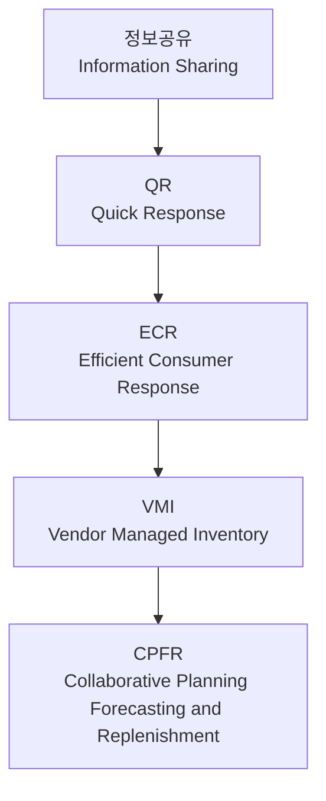

## 공급망관리(SCM)

**공급망관리**(Supply Chain Management, SCM)는 원자재 공급자부터 최종 고객에 이르는 공급망 전체를 통합적으로 관리하여 고객가치를 극대화하고 총비용을 최소화하는 경영활동이다. 글로벌 경쟁 심화와 고객 요구 다양화에 따라 기업 간 경쟁이 아닌 공급망 간 경쟁이 이루어지고 있으며, 최근에는 디지털 기술과 ESG를 접목한 지능형 공급망으로 발전하고 있다.

### 공급망관리의 개요

#### 공급망의 정의

공급망(Supply Chain)이란 원자재의 조달부터 생산, 물류, 판매를 거쳐 최종 고객에게 제품과 서비스가 전달되는 가치창출 네트워크를 의미한다.

#### 공급망의 구조

#### SCM의 정의

SCM은 공급망 내 자재, 정보, 자금의 흐름을 통합적으로 관리하여 전체 공급망의 효율성을 극대화하는 경영기법이다.

#### SCM의 목적

* 총비용(Total Cost) 최소화
* 고객서비스 향상
* 재고 감소
* 납기 단축
* 공급망 가시성 확보
* 공급망 전체 최적화

#### SCM의 필요성

* 글로벌 경쟁 심화
* 고객 요구 다양화
* 제품수명주기 단축
* 공급망 복잡성 증가
* 디지털 기술 발전

## SCM 운영원리

### 공급망 흐름

SCM은 물류, 정보, 자금 흐름을 통합적으로 관리한다.

| 흐름    | 방향       | 내용            |
| ----- | -------- | ------------- |
| 물류 흐름 | 공급자 → 고객 | 원자재, 반제품, 완제품 |
| 정보 흐름 | 양방향      | 주문, 재고, 수요정보  |
| 자금 흐름 | 고객 → 공급자 | 결제 및 정산       |

### Push 전략과 Pull 전략

#### Push 전략

수요예측을 기반으로 생산 및 공급하는 방식

**특징**

* 생산효율 우수
* 규모의 경제 실현
* 재고 증가 가능

**적용**

* MTS(Make To Stock)
* 대량생산체계

#### Pull 전략

실제 고객 주문을 기반으로 생산 및 공급하는 방식

**특징**

* 재고 감소
* 고객 대응력 향상
* 생산 유연성 요구

**적용**

* MTO(Make To Order)
* JIT 생산방식

#### Push-Pull 경계점

Push와 Pull 전략이 만나는 지점을 Decoupling Point라고 한다.

!!! note "관련 단원"
    생산방식별 Decoupling Point는 「생산구조와 방식(Layout)」에서 상세히 설명한다.

## SCM 구성요소

SCM(Supply Chain Management)은 공급망 전반의 자재, 정보, 자금 흐름을 통합적으로 관리하여 고객가치를 극대화하는 활동이다. SCM의 대표적인 프로세스 모델로 SCOR(Supply Chain Operations Reference) 모델이 있으며, 공급망 활동을 Plan, Source, Make, Deliver, Return, Enable의 6개 영역으로 구분한다.[^1]

### Plan

수요와 공급을 균형화하기 위한 계획 수립 단계이다.

#### 주요 활동

* 수요예측(Forecasting)
* 판매 및 운영계획(S&OP)
* 생산계획 및 일정계획
* 재고정책 수립
* 공급망 네트워크 설계

#### 핵심 목표

* 수요와 공급의 최적화
* 재고 최소화
* 서비스 수준 향상

### Source

생산에 필요한 자재와 서비스를 조달하는 단계이다.

#### 주요 활동

* 공급업체 선정 및 평가
* 구매계획 수립
* 발주 및 입고관리
* 공급업체 관계관리(SRM)
* 원자재 재고관리

#### 핵심 목표

* 안정적 자재 확보
* 구매비용 절감
* 공급 리스크 최소화

### Make

원자재를 고객이 요구하는 제품으로 전환하는 생산 단계이다.

#### 주요 활동

* 생산계획 실행
* 제조 및 조립
* 품질관리(QC)
* 설비관리(Maintenance)
* 재공품(WIP) 관리

#### 핵심 목표

* 생산성 향상
* 품질 확보
* 납기 준수

### Deliver

제품을 고객에게 전달하는 물류 및 유통 단계이다.

#### 주요 활동

* 주문관리(Order Management)
* 창고관리(WMS)
* 운송계획 및 배송
* 출하관리
* 고객 서비스

#### 핵심 목표

* 적기 납품(On-Time Delivery)
* 물류비 절감
* 고객 만족도 향상

### Return

반품, 회수 및 역물류(Reverse Logistics)를 관리하는 단계이다.

#### 주요 활동

* 반품 처리
* 불량품 회수
* 재활용 및 재사용
* 폐기물 관리
* A/S 및 클레임 대응

#### 핵심 목표

* 고객 서비스 향상
* 자원 재활용
* 환경규제 대응

### Enable

SCM 전 과정을 지원하는 인프라 및 관리체계 구축 단계이다.

#### 주요 활동

* ERP·MES·APS 구축
* 데이터 및 정보관리
* 성과관리(KPI)
* 인력 및 조직관리
* 공급망 위험관리(SCRM)

#### 핵심 목표

* 공급망 가시성 확보
* 의사결정 지원
* 공급망 운영 역량 강화

### SCOR 모델 흐름

)

[^1]: Supply Chain Council이 개발한 공급망 참조모델.

## 공급망 협업전략

공급망 성과 향상을 위해서는 기업 간 협업과 정보공유가 필수적이다.

### QR(Quick Response)

실제 판매정보를 활용하여 공급망 전체의 대응속도를 향상시키는 전략

#### 특징

* 수요 대응시간 단축
* 재고 감소
* 유통산업 중심 활용

### ECR(Efficient Consumer Response)

제조업체와 유통업체가 협력하여 소비자 만족과 공급망 효율성을 동시에 추구하는 전략

#### 특징

* 유통비용 절감
* 고객서비스 향상
* 정보공유 강화

### VMI(Vendor Managed Inventory)

공급자가 고객의 재고를 직접 관리하는 방식

#### 특징

* 재고 최적화
* 주문업무 감소
* 채찍효과 완화

### CPFR

CPFR(Collaborative Planning, Forecasting and Replenishment)은 공급망 참여자가 공동으로 계획, 예측, 보충활동을 수행하는 협업체계이다.

#### 특징

* 공동 수요예측
* 공급망 가시성 향상
* 재고 및 품절 감소

### 공급망 협업 수준

| 단계   | 협업 수준 | 핵심 개념       |
| ---- | ----- | ----------- |
| 정보공유 | 낮음    | 데이터 공유      |
| QR   | ↑     | 신속 대응       |
| ECR  | ↑↑    | 소비자 중심 대응   |
| VMI  | ↑↑↑   | 공급업체 재고관리   |
| CPFR | 최고    | 공동 계획·예측·보충 |

## 공급망 성과관리

### 성과관리의 목적

* 고객서비스 향상
* 운영효율성 측정
* 공급망 개선
* 전략목표 달성

### 주요 성과지표(KPI)

| 지표                      | 의미        |
| ----------------------- | --------- |
| OTIF                    | 정시·정량 납품률 |
| Fill Rate               | 주문충족률     |
| Inventory Turnover      | 재고회전율     |
| Cash-to-Cash Cycle Time | 현금회전기간    |
| Perfect Order Rate      | 완전주문율     |

### SCOR 성과지표

| 성과영역 | 주요지표     |
| ---- | -------- |
| 신뢰성  | 납기준수율    |
| 대응성  | 주문처리시간   |
| 민첩성  | 공급망 대응속도 |
| 비용   | 총 공급망 비용 |
| 자산   | 재고회전율    |

## 공급망 리스크관리

### 공급망 리스크의 개념

공급망 운영에 부정적 영향을 미치는 불확실성과 위험요인을 의미한다.

### 주요 리스크

#### 공급 리스크

* 공급업체 부도
* 원자재 부족
* 품질문제

#### 운영 리스크

* 설비고장
* 생산중단
* 정보시스템 장애

#### 외부환경 리스크

* 자연재해
* 팬데믹
* 지정학적 갈등
* 환율변동

### 공급망 회복탄력성

**공급망 회복탄력성**(Supply Chain Resilience)은 자연재해, 팬데믹, 지정학적 리스크, 공급중단 등 공급망 충격(Disruption) 발생 시 공급망 기능을 유지하거나 신속하게 복구하여 정상 운영수준으로 회복할 수 있는 능력이다. 공급망 효율성(Efficiency) 중심의 운영에서 최근에는 불확실성 증가에 따라 회복탄력성(Resilience) 확보가 핵심 경쟁요소로 부각되고 있다.

| 구분         | 의미            | 초점 |
| ---------- | ------------- | -- |
| Resilience | 충격 후 신속 복구    | 회복 |
| Robustness | 충격을 받아도 성능 유지 | 예방 |
| Agility    | 환경 변화에 신속 대응  | 적응 |

#### 주요 구성요소

- 가시성(Visibility)
- 유연성(Flexibility)
- 민첩성(Agility)
- 적응성(Adaptability)
- 복원성(Recoverability)

#### 확보방안

- 공급선 다변화(Multi Sourcing)
- Dual Sourcing 구축
- 전략적 안전재고 확보
- 공급망 가시성(Visibility) 강화
- Near-shoring 및 Local Sourcing 확대
- 공급망 위험관리(SCRM) 체계 구축
- 디지털 공급망(Digital Supply Chain) 구축
- AI 기반 수요예측 및 조기경보체계 운영

#### 기대효과

- 공급중단 위험 감소
- 납기 신뢰성 향상
- 공급망 안정성 확보
- 고객 서비스 수준 향상
- 기업 지속가능성 강화

## 채찍효과(Bullwhip Effect)

### 개요

채찍효과는 고객 수요의 작은 변동이 공급망 상류로 전달되면서 점차 확대되는 현상이다.[^2]

### 발생원인

* 수요예측 오류
* 정보지연
* 일괄주문
* 가격할인 정책

### 문제점

* 과잉재고 발생
* 품절 증가
* 생산계획 불안정
* 공급망 비용 증가

### 대응방안

* 실시간 정보공유
* CPFR 도입
* APS 활용
* 주문주기 단축

!!! note "관련 단원"
    채찍효과의 원인과 수요예측 오차는 「수요예측과 일정관리」에서 상세히 설명한다.

[^2]: Forrester Effect라고도 한다.

## 디지털 SCM

### APS

APS(Advanced Planning and Scheduling)는 공급망 제약조건을 고려하여 생산계획과 공급계획을 최적화하는 시스템이다.

### SCM Control Tower

공급망 전체를 실시간으로 모니터링하고 의사결정을 지원하는 통합 플랫폼이다.

### AI 기반 SCM

인공지능을 활용하여 수요예측, 재고관리 및 공급계획을 최적화하는 방식이다.

### 디지털 트윈 SCM

실제 공급망을 가상환경에 구현하여 운영 시뮬레이션을 수행하는 기술이다.

### 주요 활용기술

| 기술           | 활용 분야         |
| ------------ | ------------- |
| IoT          | 실시간 물류 추적     |
| Big Data     | 수요예측          |
| AI           | 공급계획 최적화      |
| Blockchain   | 공급망 추적성 확보    |
| Digital Twin | 시뮬레이션 기반 의사결정 |

## 공급망관리의 최근 동향

### ESG 공급망

환경·사회·지배구조를 고려한 지속가능 공급망을 구축한다.

#### 주요 내용

* 탄소배출 관리
* 친환경 물류
* 공급망 ESG 평가
* 순환경제 구축

### Nearshoring

생산거점을 소비시장 인근 국가로 이전하는 전략이다.

### 공급망 회복탄력성 강화

효율성 중심 공급망에서 안정성과 복원력을 중시하는 방향으로 전환되고 있다.

## 공급망관리의 종합

SCM은 공급자부터 고객까지의 자재, 정보, 자금 흐름을 통합적으로 관리하여 공급망 전체의 최적화를 추구하는 경영활동이다. 현대 SCM은 단순한 물류관리를 넘어 공급망 협업, 리스크 관리, 디지털 전환 및 ESG 경영을 포함하는 전략적 경영체계로 발전하고 있으며, 기업 경쟁력 확보의 핵심 수단으로 자리잡고 있다.
