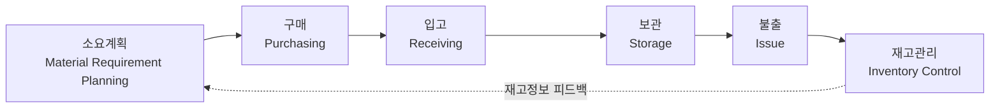
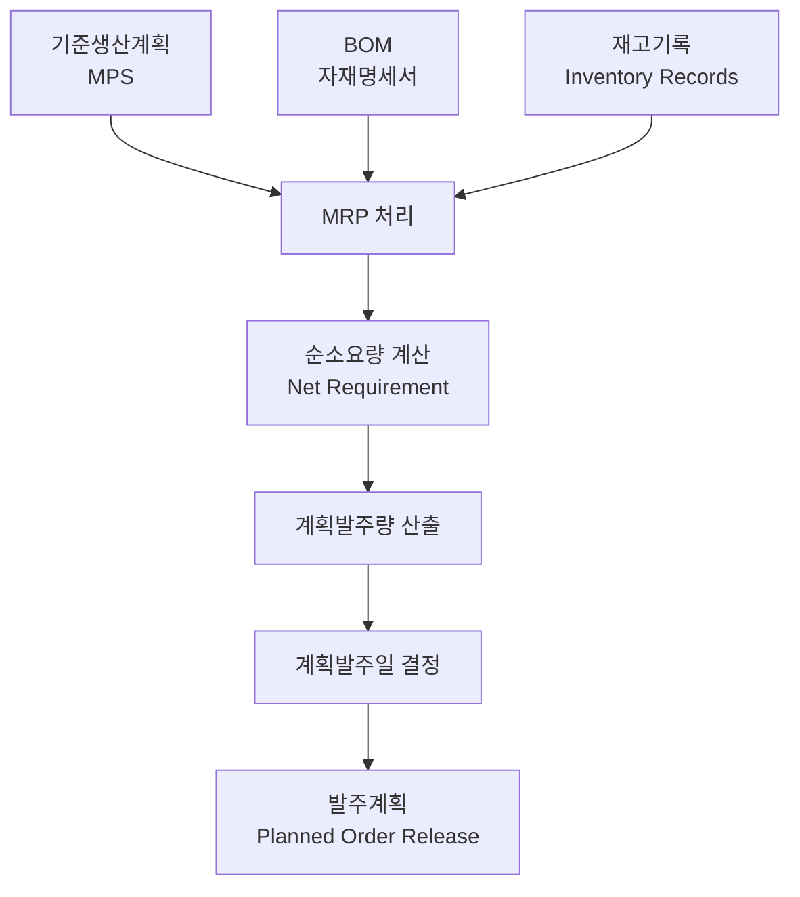

## 물류관리(자재 및 재고관리)

**물류관리**(Logistics Management)는 원자재의 조달부터 생산, 보관, 운송 및 고객에게 전달되는 전 과정을 효율적으로 관리하는 활동이며, 재고관리는 필요한 자재와 제품을 적정 수준으로 유지하여 고객서비스와 운영효율을 동시에 확보하는 관리기법이다. 최근에는 SCM, 스마트물류, AI 기반 재고최적화 기술이 물류관리의 핵심 경쟁력으로 부상하고 있다.

## 물류관리의 개요

### 물류관리의 정의
물류관리(Logistics Management)는 원재료, 반제품 및 완제품의 이동과 보관, 정보흐름을 계획·실행·통제하는 활동이다. 즉, 재화가 공급자에서 소비자에게 이동하고 다시 회수되는 전 과정을 효율적으로 관리하는 활동이다.


### 물류관리의 목적

* 고객서비스 향상
* 물류비 절감
* 리드타임 단축
* 재고 최소화
* 공급망 효율화

### 물류의 기능

**물류 5대 기능**

- **운송**: 생산된 제품을 소비지나 물류센터로 이동시켜 공간적 가치를 창출하는 핵심 기능
- **보관**: 제품을 수요가 발생할 때까지 안전하게 보관하고 재고를 관리하여 시간적 가치를 창출
- **하역**: 물류센터 내에서 이루어지는 상품의 상하차, 분류, 운반 등 인력 및 기계 작업
- **포장**: 제품의 파손을 방지하고 보관·운송의 효율성을 높이기 위한 작업
- **정보처리**: 주문, 재고, 배송 등 물류 전 과정을 전산화하고 데이터를 기반으로 추적·관리유통가공: 단순 보관을 넘어 포장, 라벨링, 조립, 수리 등 제품에 새로운 부가가치를 더하는 기능

 일반적으로 물류기능은 운송, 보관, 하역, 포장, 정보처리 기능 및 유통가공으로 구성된다.

### 물류관리의 7R

물류관리의 기본원칙은 **7 Right**를 만족하는 것이다.

* Right Product(적정 품목)
* Right Quantity(적정 수량)
* Right Condition(적정 품질)
* Right Place(적정 장소)
* Right Time(적정 시간)
* Right Customer(적정 고객)
* Right Cost(적정 비용)

## 자재관리(Material Management)

### 자재관리의 정의

자재관리는 생산활동에 필요한 자재를 경제적으로 조달·보관·공급하는 관리활동이다.

### 자재관리 프로세스



### 소요계획 (Material Requirement Planning)

생산계획에 따라 필요한 자재의 종류, 수량, 시기를 산정하는 단계이다.

#### 주요 활동

* 생산계획 분석
* BOM 전개
* 자재소요량 계산
* 발주 시점 결정

#### 핵심 목표

* 결품 방지
* 과잉재고 방지
* 적정 재고 확보

### 구매 (Purchasing)

소요계획에 따라 공급업체로부터 자재를 조달하는 단계이다.

#### 주요 활동

* 공급업체 선정
* 견적 및 가격 협상
* 발주
* 납기 관리

#### 핵심 목표

* 적기 조달
* 구매원가 절감
* 안정적 공급망 확보

### 입고 (Receiving)

구매한 자재를 수령하고 검수하는 단계이다.

#### 주요 활동

* 입고 확인
* 수량 검수
* 품질 검사
* 전산 등록

#### 핵심 목표

* 입고 정확성 확보
* 불량 자재 차단

### 보관 (Storage)

입고된 자재를 적절한 장소에 저장·관리하는 단계이다.

#### 주요 활동

* 저장 위치 지정
* 로케이션 관리
* FIFO·FEFO 관리
* 보관 환경 유지

#### 핵심 목표

* 자재 손실 방지
* 공간 활용 최적화

### 불출 (Issue)

생산 또는 사용 부서에 자재를 공급하는 단계이다.

#### 주요 활동

* 자재 출고
* 생산라인 공급
* 사용실적 기록

#### 핵심 목표

* 적시 공급
* 생산 차질 방지

### 재고관리 (Inventory Control)

재고 수준을 지속적으로 모니터링하고 최적화하는 단계이다.

#### 주요 활동

* 재고조사
* ABC 분석
* 안전재고 관리
* 재주문점 관리

#### 핵심 목표

* 재고비용 최소화
* 서비스 수준 향상

### 자재관리 5 Right

* Right Material (적정 품목)
* Right Quantity (적정 수량)
* Right Quality (적정 품질)
* Right Time (적정 시기)
* Right Cost (적정 비용)

### 자재관리의 목표

* 자재비 절감
* 안정적 생산지원
* 재고 최소화
* 구매 효율화

!!! note "관련 단원"
    구매전략과 공급자 관리는 「구매와 외주전략」에서 상세히 설명한다.

## 재고관리의 개요

### 재고의 정의

재고(Inventory)는 미래 수요에 대응하기 위하여 일정 기간 보유하는 자재, 반제품 및 완제품을 의미한다.

### 재고의 기능

* 생산과 수요의 완충(Buffer)
* 납기 대응
* 경제적 구매
* 생산 안정화
* 공급망 위험 대응

### 재고의 분류

#### 용도별 분류

| 구분       | 내용       |
| -------- | -------- |
| 원재료 재고   | 생산 투입 자재 |
| 재공품(WIP) | 공정 중 재고  |
| 완제품 재고   | 판매 대기 제품 |
| 소모품      | 간접자재     |

#### 목적별 분류

| 구분     | 목적       |
| ------ | -------- |
| 사이클 재고 | 정상 운영    |
| 안전재고   | 수요 변동 대응 |
| 예비재고   | 공급 중단 대비 |
| 계절재고   | 계절수요 대응  |
| 운송재고   | 운송 중 재고  |

## 재고관리 전략

### 재고관리의 목적

* 품절 방지
* 재고비용 최소화
* 고객서비스 향상
* 자본회전율 향상

### 재고관리 비용

| 비용                  | 내용           |
| ------------------- | ------------ |
| 주문비용(Ordering Cost) | 주문 및 발주 비용   |
| 보관비용(Holding Cost)  | 창고, 보험, 자본비용 |
| 품절비용(Shortage Cost) | 판매기회 손실      |
| 구매비용(Purchase Cost) | 자재 구매비       |

### 재고관리의 상충관계

재고를 증가시키면 품절(Stock-out) 위험이 감소하여 납기준수율과 고객서비스 수준은 향상된다. 그러나 반대로 보관비용, 보험료, 창고운영비 등의 재고유지비용이 증가하고, 재고에 자본이 묶여 자금운용 효율이 저하되는 문제가 발생한다. 따라서 재고관리는 고객서비스 수준과 재고유지비용 간의 상충관계(Trade-off)를 고려하여 최적 재고수준을 결정하는 것이 중요하다.

## 경제적 주문량(EOQ)

### EOQ의 개요

경제적 주문량(Economic Order Quantity)은 주문비용과 재고보관비용의 합이 최소가 되는 최적 주문량이다.

### EOQ 기본모형

```text
EOQ

주문비용
      ╲
       ╲
        ╳ 최소 총비용
       ╱
      ╱
보관비용
```

### EOQ 공식

$$
Q^* = \sqrt{\frac{2DS}{H}}
$$

각 기호의 의미는 다음과 같다.

* $Q^*$ : 경제적 주문량(EOQ)
* $D$ : 연간 수요량(Annual Demand)
* $S$ : 1회 주문비용(Ordering Cost)
* $H$ : 단위당 연간 재고유지비용(Holding Cost)

아래는 관련 공식이며 $TC$(Total Cost)는 총재고비용이며 $EOQ$는 비용을 최소화 하는 주문량이다.

$$
\text{연간 주문횟수} = \frac{D}{Q^*}
$$

$$
\text{주문주기} = \frac{Q^*}{D}
$$

$$
TC = \frac{DS}{Q} + \frac{QH}{2}
$$

### EOQ의 가정

* 수요가 일정
* 납기가 일정
* 품절 없음
* 단가 일정
* 일괄 입고

### EOQ의 한계

* 실제 수요 변동 반영 어려움
* 안전재고 미고려
* 공급망 불확실성 반영 한계

## 발주관리

### 재주문점

재주문점(ROP)은 재고가 일정 수준에 도달했을 때 새로운 주문을 발주해야 하는 시점을 의미한다. 즉, **조달기간(Lead Time) 동안의 수요를 충족하면서 품절을 방지할 수 있는 최소 재고수준**이다.

#### 재주문점 공식

$$
ROP = dL + SS
$$

또는

$$
재주문점 = 일평균수요량 \times 조달기간 + 안전재고
$$

* $ROP$ : 재주문점 (Reorder Point)
* $d$ : 일평균수요량 (Daily Demand)
* $L$ : 조달기간 (Lead Time)
* $SS$ : 안전재고 (Safety Stock)

재고가 재주문점에 도달하면 즉시 발주를 실시하며, 조달기간 동안 발생하는 수요는 재주문점에 포함된 재고로 충당한다.

```text
재고수준
│
│\
│ \
│  \
│   \
│    \ ← 재주문점(ROP)
│     \  주문발생
│      \_________
│                \
│                 \ 품목 입고
└──────────────────→ 시간
      ← Lead Time →
```

#### 예제

일평균수요량이 100개, 조달기간이 5일, 안전재고가 200개인 경우

$$
ROP = (100 \times 5) + 200
$$

$$
ROP = 700
$$

따라서 재고가 **700개 이하가 되는 시점에 발주**하여야 품절을 방지할 수 있다.

#### 안전재고가 필요한 이유

재주문점 공식에서 조달기간 동안의 수요만 고려하면 수요 변동이나 납기 지연 시 품절이 발생할 수 있다. 따라서 다음과 같은 불확실성에 대응하기 위해 안전재고를 추가한다.

* 수요 변동(Demand Variability)
* 공급 지연(Lead Time Variability)
* 품질 문제
* 운송 지연

### 안전재고(Safety Stock)

수요 및 납기 변동에 대비하여 추가로 보유하는 재고를 말한다.

#### 안전재고의 목적

* 품절 방지
* 납기 준수
* 생산 안정화

## 재고관리 기법

### ABC 분석

ABC 분석은 품목의 중요도에 따라 차등 관리하는 기법이다.

#### 파레토 법칙

* A품목 : 소수 품목, 높은 금액
* B품목 : 중간 수준
* C품목 : 다수 품목, 낮은 금액

| 구분 | 관리수준 | 특징      |
| -- | ---- | ------- |
| A  | 집중관리 | 고가·핵심품목 |
| B  | 일반관리 | 중간 중요도  |
| C  | 단순관리 | 저가·다빈도  |

### XYZ 분석

수요 변동성을 기준으로 품목을 분류하는 방법이다.

| 구분 | 특징      |
| -- | ------- |
| X  | 수요 안정   |
| Y  | 계절성 존재  |
| Z  | 수요 변동 큼 |

### FSN 분석

사용빈도를 기준으로 분류하는 기법이다.

| 구분 | 의미          |
| -- | ----------- |
| F  | Fast Moving |
| S  | Slow Moving |
| N  | Non Moving  |

### ABC-XYZ 매트릭스

품목의 중요도와 수요변동성을 동시에 고려하여 관리전략을 수립한다.

## 자재소요계획(MRP)

### MRP 구성요소

자재소요계획(Material Requirements Planning, MRP)는 기준생산계획(MPS)을 바탕으로 제품 생산에 필요한 자재의 종류, 수량 및 소요시점을 계산하여 적시에 자재를 공급하기 위한 계획시스템이다.

MRP는 다음의 3대 입력정보를 기반으로 운영된다.

#### 기준생산계획 (MPS : Master Production Schedule)

최종제품(Finished Goods)의 생산일정과 생산수량을 계획한 것이다.

**주요 역할**

* 고객수요 반영
* 생산일정 수립
* MRP의 출발점 역할

**예시**

| 제품  |   생산수량 | 생산시점 |
| --- | -----: | ---- |
| A제품 | 1,000개 | 1주차  |
| B제품 |   500개 | 2주차  |

#### BOM (Bill of Materials)

제품 1단위를 생산하기 위해 필요한 부품 및 원자재의 구성표이다.

**주요 역할**

* 제품 구조 정의
* 자재소요량 산출
* 부품 전개(Explosion)

**예시**

```text
완제품 A
├─ 부품 B × 2
├─ 부품 C × 3
└─ 부품 D × 1
```

#### 재고기록 파일 (Inventory Records)

현재 보유 중인 재고와 발주잔량을 관리하는 데이터이다.

**주요 정보**

* 현재고(On-hand Inventory)
* 입고예정량(Scheduled Receipts)
* 안전재고(Safety Stock)
* 리드타임(Lead Time)

**주요 역할**

* 순소요량(Net Requirement) 계산
* 과잉발주 방지
* 재고 최적화

### MRP 처리과정

MRP는 MPS, BOM, 재고기록을 입력으로 하여 순소요량을 계산하고 발주계획을 생성한다.



MRP의 기본 논리는 다음과 같다.

```text
총소요량(Gross Requirement)
            -
현재고(On-hand Inventory)
            -
입고예정량(Scheduled Receipt)
            =
순소요량(Net Requirement)
```

따라서 순소요량이 발생하면 리드타임을 고려하여 발주시점과 발주수량을 결정한다.

### MRP 입력물과 출력물

**입력물**

* MPS (무엇을 언제 생산할 것인가?)
* BOM (무엇이 얼마나 필요한가?)
* 재고기록 (현재 얼마나 보유하고 있는가?)

**산출물**

* 계획발주량(Planned Order Quantity)
* 계획발주일(Planned Order Release)
* 자재소요계획(Material Requirement Plan)

!!! note "관련 단원"
    MRP의 계산절차와 상세 알고리즘은 「생산계획수립」에서 설명한다.

## 창고관리(Warehouse Management)

### 창고관리의 목적

* 보관 효율 향상
* 물류비 절감
* 작업 효율 향상
* 재고 정확성 확보

### 보관 원칙

* FIFO(선입선출)
* FEFO(유효기간 우선출고)
* 로케이션 관리
* 바코드·RFID 관리

### 창고관리 시스템(WMS)

WMS(Warehouse Management System)는 입출고, 보관 및 재고정보를 실시간 관리하는 시스템이다.

#### 주요 기능

* 입고관리
* 출고관리
* 재고관리
* 로케이션 관리
* 실시간 재고조회

## 스마트 물류

### 물류자동화

* AS/RS(자동창고)
* AGV/AMR
* Conveyor System
* Picking System

### 디지털 물류

| 기술           | 활용 분야        |
| ------------ | ------------ |
| IoT          | 위치 추적        |
| RFID         | 자동 인식        |
| AI           | 수요예측 및 재고최적화 |
| Big Data     | 물류분석         |
| Digital Twin | 물류 시뮬레이션     |

### 물류 4.0

물류설비와 정보시스템을 연계하여 자율적이고 지능적인 물류 운영을 구현하는 개념이다.

## 최근 동향

### 옴니채널 물류

온라인과 오프라인을 통합하여 고객 중심의 물류서비스를 제공하는 전략

### ESG 물류

* 친환경 운송
* 탄소배출 저감
* 순환물류
* 친환경 포장

### 공급망 회복탄력성

팬데믹과 지정학적 리스크 증가에 대응하기 위해 재고 최적화와 공급망 다변화를 동시에 추구하는 방향으로 발전하고 있다.

## 물류관리와 재고관리의 종합

물류관리와 재고관리는 고객서비스 수준과 운영효율을 동시에 결정하는 핵심 기능이다. 물류관리는 자재와 제품의 흐름을 최적화하고, 재고관리는 적정 재고를 유지하여 비용과 서비스 수준의 균형을 달성한다. 최근에는 SCM, WMS, AI, RFID, 디지털 트윈 등 스마트 물류기술을 활용한 데이터 기반 의사결정이 기업 경쟁력의 핵심 요소로 자리매김하고 있다.

### 단원범위 연계

| 내용            | 관련 단원       |
| ------------- | ----------- |
| 구매 및 조달       | 구매와 외주전략    |
| SCM 협업(VMI 등) | 공급망관리       |
| MRP·MPS       | 생산계획수립      |
| AGV·AS/RS     | 자재취급 및 운반관리 |
| 스마트 물류        | 정보화활용기술     |
