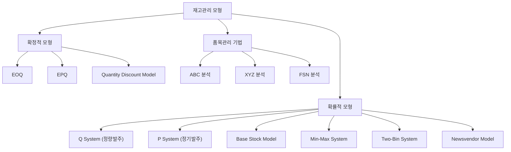

## 물류관리

물류관리(Logistics Management)는 원자재의 수급부터 완제품이 최종 소비자에게 전달되고, 필요시 회수/폐기되는 전 과정에서 **물자(Goods)와 관련 정보(Information)의 효율적인 흐름과 보관을 계획, 실행, 통제하는 관리 활동**이다.

* **개념 정의**  
  공급망(SCM) 내에서 가치 창출을 목적으로 재화의 이동 및 보관을 최적화하여 시간적·장소적 유용성(Utility)을 창출하는 프로세스이다.
* **핵심 목표**  
  고객이 요구하는 서비스 수준을 충족(고객 만족)하는 동시에 물류 총비용(Total Logistics Cost)을 최소화하는 것이다.

### 5대 핵심 영역

물류관리는 크게 5가지 기능적 영역으로 구성된다.

```mermaid
flowchart LR
    A[운송] --> B[보관] --> C[하역] --> D[포장] --> [정보]
```

1. **운송 관리 (Transportation Management)**  

    * 화물을 한 장소에서 다른 장소로 이동시키는 핵심 기능으로, 시간 및 공간적 격차를 해소한다.
    * 도로, 철도, 항공, 해상 등 최적 수송 수단을 선택하고 배차 및 경로를 최적화(TMS 활용)한다.

2. **보관 및 창고 관리 (Warehouse & Inventory Management)**  

    * 생산과 소비 사이의 시간적 격차를 조정하기 위해 재화를 안전하게 보관하고 수급 상황을 조절한다.
    * 창고 관리 시스템(WMS)을 통해 입출고, 재고 정확도, 로케이션(Location)을 관리한다.

3. **하역 관리 (Material Handling)**  

    * 창고나 수송 수단 내부에서 물품을 적재, 하역, 이동, 분류하는 작업이다.
    * 팔레트, 지게차, 자동화 컨베이어, AGV/AMR 등을 활용해 하역 작업의 효율화를 도모한다.

4. **포장 관리 (Packaging)**  

    * 수송 및 보관 과정에서 물품의 파손을 방지하고, 유통 작업의 효율성을 높이기 위해 단위화(Unit Load System)하는 작업이다.

5. **물류 정보 관리 (Logistics Information System)**  

    * 발주, 수주, 재고 현황, 위치 추적 등 물류 활동 전반에 필요한 데이터를 실시간으로 수집하고 공유하여 전체 물류 흐름의 가시성을 제공한다.

### 현대적 분류 

공정에 따른 분류로 물류는 재화가 이동하는 공정상의 위치에 따라 다음과 같이 구분된다.

* **조달물류 (Inbound Logistics)**: 원자재, 부품 등을 공급자로부터 제조 공장까지 수송·보관하는 물류
* **사내/생산물류 (Internal Logistics)**: 공장 내부에서 반제품, 부품의 이동 및 공정 간 대기를 관리하는 물류
* **판매/유통물류 (Outbound Logistics)**: 완성된 제품을 공장/창고에서 최종 소비자나 유통업체로 배송하는 물류
* **역물류 (Reverse Logistics)**: 반품, 교환, 수리, 재활용, 폐기 등을 위해 소비자로부터 공급자 방향으로 거꾸로 이동하는 물류

### 트렌드 및 주요 개념

**3PL / 4PL (제3자 / 제4자 물류)**  

* **3PL:** 물류 전문 업체에 물류 기능(운송, 보관 등)을 외주화하는 방식
* **4PL:** 3PL에 IT 솔루션, 컨설팅, 공급망 기획 기능까지 결합하여 종합 제공하는 방식

**스마트 물류 (Smart Logistics)**  

  IoT, AI 기반 수요 예측, 로봇 기술(AGV, 풀필먼트 로봇), 풀필먼트 센터(Fulfillment Center)를 활용한 자동화 및 실시간 물류 가시성 확보

**풀필먼트 (Fulfillment)**  

  이커머스 환경에서 고객 주문 접수부터 재고 관리, 피킹, 패킹, 배송, 반품 처리까지의 전 과정을 일괄 처리하는 서비스

물류관리 주요 지표 및 영역 요약하면 다음과 같다.

| 구분 | 주요 내용 | 핵심 평가 지표 (KPI) |
| :--- | :--- | :--- |
| **운송 관리** | 배송 경로 최적화 및 운송 수단 선택 | 정시 배송률(OTD), 단위당 운송비 |
| **창고/재고 관리** | 보관 효율화 및 수급 조절 | 재고 정확도, 창고 공간 활용률 |
| **하역 및 포장** | 작업 파손 방지 및 수하물 단위화 | 파손율, 시간당 피킹/하역 수량 |
| **역물류** | 반품, 수리, 폐기 프로세스 전담 | 반품 처리 리드타임, 재활용율 |

### 대표 관리 기법

대표적인 물류 관리 기법(Logistics Management Techniques)는 단순한 화물 이동을 넘어 **재고 최적화, 운송 효율성, 보관 공간 활용, 정보 공유**를 극대화하는 다양한 전문 기법들을 활용한다. 주요 관리 영역별 대표적인 기법들은 다음과 같다.

#### 유통 및 보충 관리 기법

대표적인 유통 및 보충 관리 기법(Replenishment & Distribution)은 다음과 같다.

**크로스도킹 (Cross-Docking)**

창고 입고 후 보관 및 피킹 과정 없이, **입고된 화물을 즉시 출고 분류 구역으로 이동시켜 배송 차량에 재적재**하는 물류 기법이다.

* **장점**: 창고 보관 비용 및 재공품 재고 최소화, 리드타임 단축
* **적용**: 대형 유통업체(예: 월마트), 리테일 배송 센터

**VMI (Vendor Managed Inventory, 공급자 관리 재고)**

구매자(유통/제조사)의 재고 수준 및 POS 데이터를 공유받아, **공급업체(Vendor)가 직접 구매자의 재고 수준과 보충 시점을 관리**하는 기법이다.

* **장점**: 구매자의 발주 부담 감축, 공급자의 생산 및 출하 일정 예측 가능성 향상

**밀크런 (Milk Run, 순회 수집 방식)**

하나의 수송 차량이 **여러 공급업체를 순차적으로 돌며 자재나 제품을 수집**하여 공장이나 창고로 운송하는 방식이다.

* **장점**: 소량 다품종 자재의 운송 효율성 극대화, 차량 적재율 향상 및 운송비 절감

#### 하역 및 단위화 기법

대표적인 하역 및 단위화 기법(Material Handling & Unitization)은 다음과 같다.

**ULS (Unit Load System, 일관 수송 유닛로드 시스템)**

화물을 팔레트(Pallet)나 컨테이너(Container) 등 표준화된 용기에 단위화(Unit)하여 조달, 보관, 하역, 수송까지 일관되게 처리하는 기법이다.

* **장점**: 하역 작업의 기계화/자동화 용이, 화물 파손율 감소 및 하역 시간 대폭 단축

**보관/자동화 시스템 (AS/RS & AGV/AMR)**

* **AS/RS (Automated Storage and Retrieval System)**: 컴퓨터 제어로 화물의 입출고 및 보관을 자동화하는 고층 자동창고 시스템
* **AGV/AMR (무인운반차 / 자율주행로봇)**: 창고 내부에서 자재 및 상품을 지정된 장소로 자동 운반하는 로봇 기술

#### 운송 및 경로 최적화 기법

대표적인 운송 및 경로 최적화 기법(Transportation & Routing)은 다음과 같다.

**수송 경로 최적화 (VRP, Vehicle Routing Problem)**

운송 차량 수, 배송지 위치, 차량 적재 용량, 시간제약 등을 고려하여 **최적의 배송 순서와 이동 경로를 수학적 알고리즘으로 산출**하는 기법이다.

* **장점**: 총 이동 거리 축소, 연료비 절감, 정시 배송률(OTD) 향상.

**복합 운송 (Intermodal / Multimodal Transport)**

도로, 철도, 해상, 항공 등 **둘 이상의 서로 다른 수송 수단을 결합**하여 최적의 경로로 화물을 운송하는 기법이다.

* **장점**: 장거리 운송 시 비용 및 탄소 배출 절감.

#### 재고 및 풀필먼트 관리 기법

대표적인 재고 및 풀필먼트 관리 기법 (Inventory & Fulfillment)은 다음과 같다.

**ABC 분석 (ABC Analysis)**

재고 품목을 매출액이나 사용 빈도 기준(파레토 법칙)으로 A등급(상위 20% 품목이 매출 80% 차지), B등급, C등급으로 분류하여 입출고 주기와 보관 위치를 차등 관리하는 기법이다.

* **장점**: 핵심 품목(A등급)에 관리 역량을 집중하여 재고 회전율 증대.

**웨이브 피킹 / 존 피킹 (Wave & Zone Picking)**

* **Zone Picking:** 창고를 여러 구역(Zone)으로 나누어 작업자가 담당 구역의 상품만 피킹하는 방식
* **Wave Picking:** 동일한 출하 시간대나 배송 지역별 주문을 묶어(Wave) 한 번에 피킹한 뒤 분류하는 방식

대표적인 물류 관리 기법 비교 요약이다.

| 구분 | 대표 기법 | 주요 관리 목표 | 핵심 효과 |
| :--- | :--- | :--- | :--- |
| **보관/유통** | Cross-Docking, VMI | 보관 단계 축소 및 재고 최적화 | 리드타임 단축, 재고 보유 비용 감축 |
| **운송/조달** | Milk Run, VRP | 차량 적재율 향상 및 경로 최적화 | 물류 운송비 절감, 탄소 배출 감소 |
| **하역/보관** | ULS, AS/RS, AMR | 작업 표준화 및 프로세스 자동화 | 하역 파손 방지, 시간당 피킹 수량 증대 |
| **재고/피킹** | ABC 분석, Wave Picking | 품목별 차등 관리 및 피킹 동선 최적화 | 재고 회전율 향상, 피킹 오류 감소 |

## 재고관리

재고관리(Inventory Management)는 기업이 원자재, 반제품, 완제품 등 자재의 흐름을 효율적으로 통제하여 고객의 수요에 적시 대응하는 동시에 재고 보유에 따른 비용을 최소화하는 관리 활동이다

* **개념 정의**  
  생산 및 판매 활동이 원활하게 이루어지도록 적정 수량의 재고를 적시에 확보하고 유지하는 운영 메커니즘이다
* **핵심 목표**  
  고객 서비스 수준(Service Level) 향상과 재고 관련 총비용(Total Inventory Cost) 절감 간의 최적 균형 확보이다

### 재고 보유 목적 및 분류

재고는 형성되는 목적과 공급망 내 존재하는 위치에 따라 아래와 같이 구분된다.

* **안전재고(Safety Stock, 완충재고)**  
  수요의 급증이나 공급 리드타임 지연 등 불확실성에 대비하여 보유하는 재고이다.
* **주기재고/순환재고(Cycle Stock)**  
  구매 또는 생산 시 규모의 경제를 얻기 위해 고정된 로트 크기(Lot Size) 단위로 발주하여 정기적으로 순환하는 재고이다.
* **수송재고/이동재고(Pipeline/Transit Stock)**  
  공급업체, 공장, 물류센터, 대리점 등 공급망의 한 거점에서 다른 거점으로 운송 중(In-Transit)에 있는 재고다.
* **예비재고/예비품재고(Spare Parts/Reserve Stock)**  
  설비의 고장 및 정비(MRO)에 대비하여 유지·보수용으로 미리 확보해 두는 부품 또는 특수 목적용 여유 재고이다.
* **투기재고(Speculative/Anticipation Stock)**  
  원자재 가격 상승, 환율 변동, 계절적 수요 급증, 파업 등 예상되는 시장 변화에 대응해 전략적으로 대량 사전 확보하는 재고이다.
* **불용/재고폐기품(Dead/Obsolete Stock)**  
  수요가 소멸하거나 변질, 구식화되어 더 이상 판매나 사용이 불가능한 재고이다.

주요 재고 분류 유형 비교하면 다음과 같다.

| 재고 유형 | 영어 명칭 | 주요 보유 목적 및 특징 |
| :--- | :--- | :--- |
| **안전재고** | Safety Stock | 수요 및 공급의 불확실성 흡수 |
| **주기재고** | Cycle Stock | 발주/생산 로트 크기 최적화를 통한 단가 절감 |
| **수송재고** | Pipeline Stock | 거점 간 이동 중에 존재하는 불가피한 재고 |
| **예비재고** | Spare Parts Stock | 설비 유지보수 및 비상 교체용 자재 확보 |
| **투기재고** | Speculative Stock | 가격 인상 및 수급 대란 대비 사전 구매 |

### 재고 관련 비용

재고관리는 아래 세 가지 핵심 비용 요소 간 트레이드오프(Trade-off)를 분석하여 총비용을 최소화한다.

$$총\ 재고비용 = 재고유지비용 + 주문/발주비용 + 재고부족비용$$

* **재고유지비용(Holding/Carrying Cost)**  
  창고 보관료, 감가상각비, 보험료, 자본의 기회비용 등 재고를 보유함으로써 발생하는 비용이다.
* **주문/발주비용(Ordering/Setup Cost)**  
  발주서 작성, 수송 및 검수, 설비 교체(Setup) 등 재고를 새로 주문하거나 생산할 때 발생하는 고정 비용이다.
* **재고부족비용(Shortage/Stockout Cost)**  
  품절 발생으로 인한 판매 기회 손실, 고객 신뢰도 하락, 비상 수송 비용 등이다.

## 재고관리 모형

**재고관리 모형(Inventory control model)**은 생산과 판매활동을 원활하게 하기 위해 재고 수준, 주문 시점, 주문량을 결정하는 관리 모델이다. 재고관리 모형은 크게 확정적 모형과 확률적 모형으로 구분된다. 확정적 모형에는 EOQ와 EPQ가 있으며, EOQ는 구매 시 경제적 주문량을 결정하고 EPQ는 자체 생산 시 경제적 생산량을 결정한다. 확률적 모형은 수요와 조달기간의 변동을 고려하는 방식으로 대표적으로 정량발주방식(Q System)과 정기발주방식(P System)이 있다. 실제 제조현장에서는 품목 중요도와 공급 특성에 따라 적절한 재고관리 모형을 적용하며 안전재고와 재주문점을 설정하여 생산라인 중단을 방지하고 재고 비용을 최소화 하는 방향으로 운영한다.

공장관리 관점에서는 재고관리 모형 핵심은 크게 두가지로 볼 수 있다.

1. 언제 주문할 것인가 (When to order)
2. 얼마나 주문할 것인가 (How much order)

**재고관리 모형 분류**  

```mermaid
flowchart TB

    A["재고관리 모형"]

    A --> B["확정적 모형"]
    A ----> C["확률적 모형"]
    A --> D["품목관리 기법"]

    B --> B1["EOQ"]
    B --> B2["EPQ"]
    B --> B3["Quantity Discount Model"]

    C --> C1["Q System (정량발주)"]
    C --> C2["P System (정기발주)"]
    C --> C3["Base Stock Model"]
    C --> C4["Min-Max System"]
    C --> C5["Two-Bin System"]
    C --> C6["Newsvendor Model"]

    D --> D1["ABC 분석"]
    D --> D2["XYZ 분석"]
    D --> D3["FSN 분석"]
```

### 재고관리 기본 개념

제조 현장에서 재고는 단순히 쌓아두는 물품이 아니라 생산 안정성을 확보하기 위한 완충 장치(Buffer)이다. 재고가 부족하면 부품 부족, 조립 라인 정지, 생산 손실 발생, 납기 지연으로 이어질 수 있다. 따라서 일정 수준 재고를 보유해야 한다. 하지만 재고를 너무 많이 보유하게 되면 과잉 재고, 창고 비용 증가, 자금 부담 증가, 불용재고 발생과 같은 문제가 발생한다. 재고관리 모형은 생산 중단 위험과 재고 비용 사이 최적점을 찾는 방법이다.

### 재고관리 비용 요소

1. **구매 비용** (Purchasing cost)  
   제품이나 자재를 구매하는 비용이다. 부품 단가, 원자재 가격 등이 해당된다.
2. **주문 비용** (Ordering cost)  
   주문할 때 발생하는 비용이다. 발주 처리 비용, 구매 담당자 업무 비용, 운송 준비 비용, 검사 비용 등이 해당된다.
3. **재고보유 비용** (Holding cost)  
   재고를 보관하면서 발생하는 비용이다. 창고 비용, 보험료, 자금 이자, 관리 비용, 노후화 비용 등이 해당되며 보유 재고량이 많아질수록 증가한다.
4. **재고부족 비용** (Shorage cost)  
   재고 부족으로 발생하는 손실이다. 생산라인 정지, 긴급 구매 비용, 납기 지연, 고객 불만 등이 해당된다.

### 재고관리 모형 분류

재고관리 모형은 크게 수요 특성과 발주 방식에 따라 구분된다.

#### 확정적 재고관리 모형

**확정적 재고관리 모형(Deterministic Inventory Model)**은 수량과 조달 기간이 일정하다고 가정하는 재고관리 모형이다. 즉, 필요한 양을 알고 언제 도착하는지도 알고 있는 경우이다. 대표적으로 EOQ, EPQ가 있다. 계산이 단순하고 반복 생산 환경에 적합하며 안정적 수요 제품에 적용할 수 있다.

**재고관리 모형 종합비교**

| 구분    | EOQ    | EPQ    | Q System | P System |
| ----- | ------ | ------ | -------- | -------- |
| 수요    | 확정     | 확정     | 변동 가능    | 변동 가능    |
| 목적    | 주문량 결정 | 생산량 결정 | 주문 시점 결정 | 주문 주기 결정 |
| 재고 확인 | 주기적 가정 | 생산 중심  | 실시간      | 주기적      |
| 대표 적용 | 구매품    | 생산품    | 핵심 부품    | 일반 자재    |

1. **EOQ 모형**  
   주문비용과 재고보유비용 합을 최소화하는 최적 주문량을 경정하는 모형이다. 즉, 한 번 주문할 때 몇 개를 주문하는 것이 가장 경제적인가에 대한 해결 모델이다. 연간 사용량이 일정하고 공급이 안정적이며 가격 변화가 적은 상황에 적합하다. 공장에서 사용하는 표준 볼트 주문을 그 예이다.
2. **EPQ 모형**  
   제품을 외부에서 구매하는 것이 아니라 자체 생산하는 경우 경제적 생산량을 결정하는 모형이다.

EOQ는 구매 중심이고 EQP는 생산 중심 관리 모형이다.

| 구분    | EOQ     | EPQ      |
| ----- | ------- | -------- |
| 대상    | 구매      | 자체 생산    |
| 입고 방식 | 한 번에 입고 | 생산하면서 증가 |
| 적용    | 부품 구매   | 제품 생산 배치 |
  
#### 확률적 재고관리 모형

**확률적 재고관리 모형(Probabilistic Inventory Model)**은 수요 또는 조달기간이 불확실한 상황에서 안전재고를 고려하여 재고를 관리하는 모형이다. 실제 제조현장에서 더 많이 사용된다.

1. **정량발주 모형**(Q System, Continuous Review System)  
   재고 수준을 계혹 확인하다가 일정 수준 이하가 되면 정해진 양을 주문하는 방식이다. 언제 주문할지 결정하는 방식이다.
2. **정기발주 모형**(P System, Periodic Review System)  
   일정한 주기마다 재고를 확인하고 필요한 양을 주문하는 방식이다. 관리가 단순하고 발주 일정 관리가 용이하지만 재고 부족 위험이 증가하게 된다.
3. **Two-Bin System**  
   재고를 두 개 저장 구역(Bin)으로 나누어 관리하는 가장 단순한 재고관리 방식이다. 첫 번째 Bin을 모두 사용하면(ROP) 두 번째 Bin을 사용하는 동시에 새로운 주문을 한다. 모델이 매우 단순하고 관리하기가 쉬우며 소모품 관리에 적합하다. 재고 최적화가 어렵고 대량 품목에는 부적합한 단점이 있다. 공장에서는 장갑, 볼트, 청소용품, 윤활유 등 MRO 자재 관리에 많이 사용된다.
4. **Min-Max System**  
   재고가 최소 수준(Min)에 도달하면 최대 수준(Max)가지 주문하는 방식이다. 예를 들면, 재고가 300개 이하이면 1000개까지 주문하는 방식이다. 주문량이 매번 달라지는 특징이 있으며, 관리가 쉽고 ERP에서 많이 사용된다. 일반 부품, 소모성 자재, 포장재 등에 적합하다.
5. **Base Stock Model**  
   제품이 하나 소비될 때마다 동일한 수량을 즉시 보충하여 항상 일정한 재고 수준(Base stock)을 유지하는 방식이다. 예를 들어, 재고 목표가 100인 경우 1개만 사용하더라도 1개를 즉시 발주한다. 즉 항상 100개를 유지하는 방식이다. 재고를 매우 민감하고 실시간 관리가 필요한 반도체, 항공부품, 의료장비, 고가 핵심부품 등에 적합하다. 간단한 예로 편의점 삼각김밥이 하나 팔리게 되면 즉시 본사에 1개 발주하는 시스템 형태이다.
6. **Newsvendor Model**  
   한 번만 주문할 수 있는 제품에서 부족 비용과 과잉 비용을 고려하여 최적 주문량을 결정하는 확률적 재고 모형이다. 즉, 1회성 재고관리 모형이다. 신문, 도시락, 꽃, 케이크, 크리스마스 상품, 계절 상품 등에 적합한 모델이다. 제조업에서도 이벤트 제품, 단기 프로젝트, 계절 생산 등에 활용된다.
7. **(Q,R) Model**
   실무에서 매우 많이 사용되는 모델로, 재고가 재주문점(R)에 도달하면 일정량(Q)을 주문하는 방식이다. 즉 EOP와 ROP를 결합한 모델이다.
8. **(s,S) Model**  
   재고가 s 이하가 되면 S까지 보충하는 모델이다. Min-Max와 매우 유사하지만 확률적 수요를 고려하는 모델이다.
9. **Optional Replenishment Model**
   정기발주(P System)에 있어 대표적인 모델이다. 예를 들면 매주 금요일 재고 조사, 목표 수준까지 보충하는 형태로 마트에서 가장 많이 사용된다.

각 모델별 내용을 정리하면 다음과 같다.

| 모형         | 언제 주문?   | 얼마나 주문? | 적용 대상    |
| ---------- | -------- | ------- | -------- |
| EOQ        | 필요 시     | 항상 일정   | 일반 자재    |
| EPQ        | 생산 계획    | 생산 Lot  | 자체 생산    |
| Q System   | ROP 도달   | 항상 일정   | 핵심 부품    |
| P System   | 정기 점검    | 매번 다름   | 일반 자재    |
| Two-Bin    | 첫 Bin 소진 | 항상 일정   | 소모품      |
| Min-Max    | Min 이하   | Max까지   | 일반 부품    |
| Base Stock | 사용 즉시    | 사용량만큼   | 고가 핵심부품  |
| Newsvendor | 1회 주문    | 확률 계산   | 계절·행사 제품 |
| (s,S)      | s 이하     | S까지     | 수요 변동 품목 |

!!! exmaple "재주문점(Reorder Point, ROP): 재고가 일정 수준에 도달하면 발주하는 기준점"  

    예: 하루 사용량이 100개, 공급기간이 5일, 안전재고 200개이며,  
    
    - $ROP = 일일수요량 \times 조달기간 + 안전재고 = 100 \times 5 + 200 = 700(개)$  
    
    즉, 재고가 700개가 되면 주문해야 한다는 의미이다.  
   

**Q System vs P System**

| 구분    | Q System     | P System |
| ----- | ------------ | -------- |
| 발주 시점 | 재고가 기준 이하일 때 | 정해진 날짜   |
| 주문량   | 일정(Q)        | 변동       |
| 재고 확인 | 계속 확인        | 주기 확인    |
| 적합 분야 | 중요 부품        | 일반 소모품   |
| 관리 수준 | 높음           | 상대적으로 낮음 |

#### EOQ(경제적 주문량)

EOQ(Economic Order Quantity, 경제적 주문량)는 재고관리에서 주문비용과 재고보유비용 합을 최소화하는 경제적 주문량을 결정하는 기법이다. 기업은 자재를 소량 구매하면 주문비용이 증가하고 대량으로 구매하면 재고보유비용이 증가하기 때문에 두 비용이 균형을 이루는 최적 주문량을산출하는 것이 EOQ 목적이다. EOQ는 연간 수요량, 1회 주문비용, 단위당 보과비용을 이용하여 계산하며, 생산현장에서는 원자재 및 부품 구매 Lot Size 결정에 활용된다. 다만 실제 공장에서는 수요 변동과 공급 불확실성이 존재하므로 안전재고, MRP, JIT 등과 함께 활용하여 최적 재고 수준을 유지해야 한다.

즉, EOQ는 "얼마나 자주 주문하고 한번에 얼마만큼 주문해야 총 재고 비용이 가장 낮아지는가"를 계산하는 재고관리 기법이다. 이는 원자재, 부품 구매량(Lot size)을 결정하는 기본적인 재고관리 모델로 활용된다.

재고관리 관점에서 주문량 결정은 EOQ, 재고 수준 관리는 안전재고와 재주문점(ROP)으로 구성된다.

기업은 자재를 구매할 대 두 가지 비용 사이에서 고민을 하게 된다.

1. **소량 주문**  
   매일 필요한 만큼 구매, 재고 감소 및 보곤 장소 감소되지만 주문 횟수가 증가하여 발주 업무 및 운송비가 증가하게 된다.
2. **대량 주문**  
   1년에 한번 대량으로 구매, 주문 횟수가 감소하여 주문 비용이 감소하게 된다. 하지만 재고가 증가하게 되어 창고 비용 및 자금 부담이 증가하게 된다.

따라서 주문 비용과 보관 비용을 최소화하여 총 재고비용을 최소로 하는 주문횟수와 주문량이 찾아야 한다.

일반적인 EOQ 공식은 다음과 같다.

$$EOQ = \sqrt{\frac{2DS}{H}}$$

공식에서 사용된 구성요소는 다음과 같다.  

| 기호 | 의미                      | 설명           |
| -- | ----------------------- | ------------ |
| D  | Demand                  | 연간 수요량       |
| S  | Setup(or Ordering Cost) | 1회 주문 비용     |
| H  | Holding Cost            | 단위당 연간 보관 비용 |

!!! example "EOQ 계산"  

    다음은 간단한 예시이다.
    
    | 항목         |       값 |
    | ---------- | ------: |
    | 연간 수요량(D)  | 10,000개 |
    | 1회 주문비용(S) | 20,000원 |
    | 개당 보관비용(H) |    500원 |
    
    $$
    EOQ = \sqrt{\frac{2DS}{H}} = \sqrt{\frac{2 \times 10,000 \times 20,000}{500}} \approx 894(개)
    $$

EOQ에서 핵심 개념은 다음과 같다.

1. **주문비용(Ordering cost)**  
   주문할 때 발생하는 비용이다. 구매 담당장 업무 비용, 발주 처리 비용, 검사 비용, 운송 준비 비용 등이 해당된다. 주문량이 증가하면 주문 횟수 및 주문비용이 감소하게 된다. 
2. **재고보유비용(Holding cost)**  
   재고를 보유하면서 발생하는 비용이다. 창고 임대료, 보험료, 자금이자, 재고 관리비용, 노후화 비용 등이 해당된다. 주문량이 증가하면 평균 재고 및 보유비용이 증가하게 된다.

EOQ는 제조현장에서는 Lot size 결정에 영향을 주게 된다. 

!!! note "Lot Size에 따른 영향"  

    예로 반도체 공정에서 웨이퍼를 생산한다고 가정한다.
    
    **Lot size가 작은 경우**  
    
    - 생산 준비 횟수 증가
    - 셋업 손실(Setup Loss) 증가
    
    **Lot size가 큰 경우**  
    
    - 재공품 증가
    - 리드타임 증가
    
    따라서 생산관리에서는 EOQ 개념을 확장하여 생산 배치 크기 결정, 구매 단위 결정, 재고 최적화 등에 활용하게 된다.

기본 EOQ 모델은 다음을 가정한다.

| 가정      | 내용              |
| ------- | --------------- |
| 수요 일정   | 연간 수요가 일정       |
| 납기 일정   | 발주 후 일정 시간 뒤 입고 |
| 가격 일정   | 구매 단가 변화 없음     |
| 품절 없음   | 재고 부족 발생하지 않음   |
| 한 품목 관리 | 단일 품목 기준        |

하지만 실제 제조 현장은 이러한 조건이 완벽하게 맞지 않는다.

- 수요 변동
- 공급 지연
- 최소 주문량(MOQ)
- 가격 할인
- 생산능력 제약
- 계절적 수요 변화

따라서 실제 현장에서는 EOQ를 기본으로 하되, 안전재고, MRP, JIT, APS 등과 함께 활용해야 한다.

!!! note "EOQ vs. MRP"

    | 구분    | EOQ          | MRP              |
    | ----- | ------------ | ---------------- |
    | 목적    | 경제적인 주문량 결정  | 필요 자재 계획         |
    | 기준    | 재고 비용 최소화    | 생산계획 기반          |
    | 수요    | 독립수요         | 종속수요             |
    | 적용    | 반복 구매 품목     | 제품 생산용 부품        |
    | 핵심 질문 | 얼마나 주문할 것인가? | 무엇을 언제 얼마나 필요한가? |
    
    **EOQ**, 볼트 구매와 같은 상황에 적합하다.  
    
    - 매달 필요한 수량이 일정
    - 적정 구매량 결정
    
    **MRP**, 자동차 생산과 같은 상황에 적합하다.  
    
    - 엔진 몇 개
    - 볼트 몇 개
    - 필요 날짜
