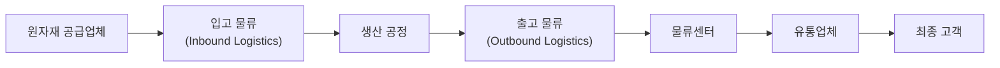
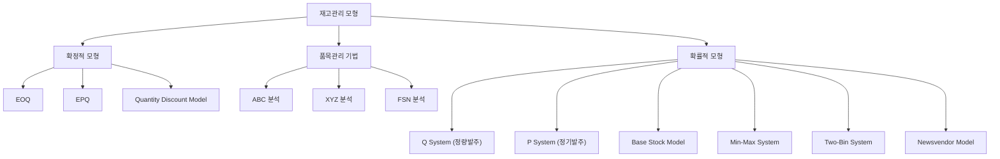

## 물류관리

물류관리(Logistics management)는 원자재, 부품, 완제품을 생산지에서 소비지까지 효율적으로 이동, 보관, 관리하여 고객이 원하는 시점에 필요한 제품을 공급하는 관리 활동이다. 주요 기능으로는 운송, 보관, 하역, 보장, 정보관리가 있으며 조달물류, 생산물류, 판매물류, 회수물류로 구분할 수 있다. 공장에서는 생산라인에 필요한 자재를 적시에 공급하고 완제품을 고객에게 신속하게 출하하는 것이 핵심 역할이다. 최근에는 WMS, TMS, AGV, AMR, RFID와 같은 기술을 활용하여 물류 효율과 정확성을 높이고 있으며 물류관리는 SCM을 구성하는 핵심 기능으로 공급망 전체 경쟁력 향상에 중요한 역할을 한다.

즉, 물류관리는 제품 이동(Transportation)과 보관(Storage)을 최적화하여 비용을 절감하고 고객 만족도를 높이는 활동이다.

### 물류관리 목적

물류관리 궁극적 목적은 **적시에(Just In Time), 적정 수량(Right Quantity)을 적정 장소(Right Place)에 최소 비용으로 공급**하는 것이다.

- 물류비 절감
- 납기 준수(On-Time Delivery)
- 재고 최적화
- 운송 효율 향상
- 고객 만족도 향상
- 원활한 공급망 운영

### 주요 기능

물류관리는 크게 다섯가지 기능으로 구성된다.

| 기능                          | 설명               |
| --------------------------- | ---------------- |
| 운송(Transportation)          | 제품과 자재를 이동       |
| 보관(Warehousing)             | 창고에 보관 및 관리      |
| 하역(Material Handling)       | 상·하차 및 공정 간 이동   |
| 포장(Packaging)               | 제품 보호 및 운송 효율 향상 |
| 정보관리(Logistics Information) | 재고와 배송 정보 관리     |

### 물류 흐름


```mermaid
flowchart LR
    A[원자재 공급업체]
    --> B["입고 물류<br/>(Inbound Logistics)"]
    --> C[생산 공정]
    --> D["출고 물류<br/>(Outbound Logistics)"]
    --> E[물류센터]
    --> F[유통업체]
    --> G[최종 고객]
```

### 물류 종류

1. **조달물류** (Inbound Logistics)  
   원자재와 부품을 공급업체에서 공장으로 운송하는 활동이다. 철강 입고, 반도체 입고, 배터리 입고 등이 해당된다.
2. **생산물류** (Production Logistics)  
   공장 내부에서 자재와 반제품을 공정 간 이동시키는 활동이다. 공정간 자재를 적시에 공급하는 것이 핵심이다.  
   ```mermaid
   flowchart LR
       A[프레스]
       B[용접]
       C[도장]
       D[조립]
   
   A --> B --> C --> D
   ```
3. **판매물류** (Outbound Logistics)  
   완제품을 고객이나 대리점으로 출하하는 활동이다.  
   ```mermaid
   flowchart LR
       A[완제품 창고]
       B[뮬류센터]
       C[대리점]
       D[고객]
   
   A --> B --> C --> D
   ```   
4. **회수물류** (Reverse Logistics)  
   고객으로부터 반품, 불량품, 재활용 제품 등을 회수하는 활동이다. 불량 제품 회수, 리콜, 폐배터리 회수, 재활용 등이 해당된다. 최근 ESG와 순환경제 중요성이 커지면서 회수물류 역활도 확대되고 있다.

### 핵심 관리 대상

| 관리 항목 | 설명            |
| ----- | ------------- |
| 재고관리  | 적정 재고 유지      |
| 창고관리  | 보관 위치 및 공간 관리 |
| 운송관리  | 운송 수단과 경로 최적화 |
| 납기관리  | 고객 납기 준수      |
| 배송관리  | 배송 일정과 추적     |
| 포장관리  | 제품 보호 및 운송 효율 |

### 대표적인 물류 관리 기법과 시스템

1. **JIT** (Just In Time)  
   필요한 자재를 필요한 시점에 필요한 수량만 공급하는 방식이다. 재고 감소와 창고 비용 절감 효과가 있으나 공급이 지연되면 생산라인이 중단될 수 있다.
2. **Cross docking**  
   창고에 장기간 보관하지 않고 입고 즉시 출고하는 방식이다. 즉 트럭 입고 → 분류 → 즉시 출고 형태이다. 창고 비용을 절감하고 배송 시간을 단축시킬 수 있다. 대형 유통업체에서 많이 사용하고 있으며 대표적으로 월마트(WALMART)가 있다.
3. **Milk Run**  
   한 대 차량이 여러 공급업체를 순회하면서 자재를 수거하는 방식이다. 운송 비용을 절감하고 차량 활용률을 향상할 수 있다. 자동차 산업에서 널리 활용된다.
4. **Hub & Spoke**  
   중앙 물류센터(Hub)를 거쳐 각 지역(Spoke)으로 배송하는 방식이다. 운송 경로를 단순화하고 배송 효율을 높일 수 있다.

물류관리 관련 대표적인 시스템은 다음과 같다.

| 시스템                                    | 역할                    |
| -------------------------------------- | --------------------- |
| WMS (Warehouse Management System)      | 창고 관리 및 재고 관리         |
| TMS (Transportation Management System) | 운송 계획 및 차량 관리         |
| MES (Manufacturing Execution System)   | 생산과 생산물류 관리           |
| ERP (Enterprise Resource Planning)     | 구매, 재고, 회계 등 기업 자원 관리 |
| SCM (Supply Chain Management)          | 공급망 전체 최적화            |


## 재고관리

재고관리(Inventory management)는 생산과 판매활동이 원활하게 이루어질 수 있도록 원자재, 재공품, 완제품 등 재고를 적정 수준으로 유지하면서 재고 비용과 결품 위험을 최소화하는 관리 활동이다. 재고가 너무 많으면 보관 비용과 자금 부담이 증가하고 반면 재고가 너무 적으면 생산 중단과 납기 지연이 발생하기 때문에 최적 재고 수준을 유지하는 것이 중요하다. 주요 관리방법으로는 ABC 분석, EOQ, 안전재고, MRP, JIT 등이 있으며 최근에는 ERP, MES, WMS, AI 기반 수요 예측 기술을 활용하여 실시간 재고 최적화를 수행하고 있다.

즉, 재고관리는 **필요한 재고를 확보하되 불필요한 재고는 줄이는 균형 관리**이다.

### 재고관리 목적

기업 입장에서는 재고는 필요하지만 비용을 발생시키는 요소가 된다.

재고가 많은 경우 다음과 같은 문제가 발생한다.

- 보관 비용 증가
- 자금 회전율 저하
- 제품 노후화 및 폐기 발생
- 공간 부족

반대로 재고가 너무 적으면 다음과 같은 문제가 발생한다.

- 생산라인 정지
- 고객 납기 지연
- 긴급 구매 비용 증가

따라서 재고관리 핵심 목적은 다음과 같다.

| 목적        | 설명               |
| --------- | ---------------- |
| 생산 안정화    | 필요한 자재를 안정적으로 공급 |
| 납기 준수     | 고객 주문에 대응        |
| 재고 비용 최소화 | 보관 및 관리 비용 절감    |
| 재고 회전율 향상 | 보유 재고의 효율적 활용    |
| 공급 리스크 대응 | 공급 차질 대비         |

### 재고 종류

#### 생산활동별 기준

제조업에서는 재고를 크게 4가지로 구분한다.

1. **원자재 재고**(Raw Material Inventory)  
   제품 생산 정에 필요한 재료이다. 철강, 반도체 웨이퍼, 플라스틱 원료 등이 해당된다.
2. **재공품** (WIP, Work In Process)  
   생산 과정 중에 있는 제품이다. 이는 아직 완제품이 되지 않은 상태를 의미하며 조립 중인 Sub-ass'y 등이 해당 된다.
3. **완제품 재고** (Finished Goods Inventory)  
   생산이 완료되면 판매 가능한 제품이 된다. 출하 대기 중인 스마트폰, 판매 대기 중인 자동차 등이 해당된다.
4. **MRO 재고** (Maintenance, Repair and Operation)  
   생산 설비 유지보수를 위한 재고이다. 베어링, 공구, 소모품, 윤활유 등이 해당된다.

#### 기능별 분류

재고는 기능에 따라 다음과 같이 분류할 수 있다.

| 구분   | 발생 원인       | 관리 목적    |
| ---- | ----------- | -------- |
| 주기재고 | 주문·생산 주기    | 경제적 구매   |
| 안전재고 | 불확실성 대응     | 생산 중단 방지 |
| 수송재고 | 운송 시간       | 공급 과정 관리 |
| 예측재고 | 미래 수요 대비    | 성수기 대응   |
| 완충재고 | 공정 불균형      | 라인 안정화   |
| 투기재고 | 가격·공급 변화 예상 | 비용 절감    |
| 불용재고 | 사용 중단       | 재고 감축    |

1. **주기재고**(Cycle stock)  
   정기적인 생산 또는 구매할돵에서 발생하는 정상적인 재고로, 주문 도는 생산 주기 때문에 발생하는 기본 재고이다. 이는 기업이 자재를 매일 조금씩 구매하기보다는 일정량을 한 번에 구매하면서 발생한다. 구매를 한번에 진행하는 이유는 주문 비용을 절감하고 운송 효율을 향상하고 구매 관련 편의성 때문이다. 예를 들어 하루 볼트 사용량이 1000개, 매 주문시 일주일치 7000개 입고, 하루 사용하고 나면 남는 6000개가 주기재고가 된다. 주요 관리 방법으로 EOQ, 주문주기 관리, Lot Size 최적화 등이 있다.
2. **안전재고**(Safety stock)  
   수요 변동이나 공급 지연과 같은 불확실성에 대비하기 위해 추가로 보유하는 재고이다. 생산현장에서 매우 중요한 개념으로 현실에서는 계획대로 실행되지 않기 때문에 발생한다. 즉 공급업체 납품 지연, 갑작스러운 생산 증가, 품질 문제로 부품 폐기, 설비 이상 등 이런 상황에 대비하는 보호 재고이다. 안전재고가 많은 경우 재고 비용이 증가하고 너무 적으면 생산라인 정지 위험이 있다. 따라서 적정 안전재고 수준 설정이 필요하다.
3. **수송재고**(Transportation Inventory, Pipeline Inventory)  
   공급 과정에서 이동 중이기 때문에 발생하는 재고이다. 창고에 있는 재고가 아니라 운송 중인 재고를 의미한다. 한국 공장에서 미국 공장으로 부품을 보낼 경우 운송 시간이 30일이라고 가정하면 하루 사용량 1,000개일 때 총 1,000개 * 30일 = 30,000개는 이동중이므로 사용할 수 없다. 이 30,000개가 수송재고이다. 운송 시간이 길어질수록 재고가 증가함으로 운송 거리 단축, 물류 개선, 공급업체 지역화, 운송 방식 개선 등의 감소 방안을 검토해야 한다.
4. **예측재고**(Anticipation Inventory)  
   미래 수요 증가나 공급 부족을 예상하여 미리 확보하는 재고이다. 에어컨 제조업체가 여름 성수기 전 부품 확보 및 완제품을 생산하면서 발생하는 재고이다. 명절 선물세트, 겨울 난방제품, 신제품 출시 초기 물량 등이 이에 해당한다.
5. **완충재고**(Buffer stock)  
   공정 간 생산능력 차이나 작업 불균형을 흡수하기 위한 재고이다. 공장 내부에서 매우 중요하다. 공정 A는 시간당 100개, 공정 B는 시간당 80개 생산할 경우 공정 간 생산 차이가 발생한다. 공정 B에 일정량 재공품을 유지함으로써 작업 불균형을 맞출 수 있다. 이제 보유하는 재고가 완충재고이다.
6. **투기재고**(Speculative Inventory)  
   가격 상승이나 공급 부족을 예상하여 정상 수준보다 많이 확보하는 재고이다. 반도체 원재료 가격 상승이 예상되어 비용 절감 목적으로 현재 가격으로 대량 구매하는 경우가 해당된다. 예측이 잘못될 경우 과잉재고 및 자금 부담과 같은 문제가 발생한다.
7. **불용재고**(Dead Stock)  
   장기간 사용하지 않아 활용 가치가 떨어진 재고이다. 제품 단종, 설계 변경, 수요 감소, 품질 문제 등으로 발생할 수 있다.

### 재고 관리 주요 지표(KPI)

1. **재고회전율** (Inventory Turnover Ratio)  
   재고가 얼마나 빠르게 판매 또는 생산에 사용되는지를 나타내는 지표이다.   
2. **재고일수** (Days Inventory Outstanding)  
   현재 재고가 몇 일동안 운영 가능한지를 나타낸다. 예를 들어 현재 재고가 30일분이면 공급이 중단되어도 약 30일 동안 생산 가능하다는 의미이다.
3. **결품률** (Stockout Rate)  
   필요한 시점에 재고가 부족했던 비율이다. 낮을수록 좋다.
4. **재고 정확도** (Inventory Accuracy)  
   시스템상 재고와 실제 재고가 얼마나 일치하는지 정도를 나타낸다. 예를 들어 ERP 상 재고가 부품 A 1,000개이고 실제 창고 부품 A가 980개이면 재고 정확도가 저하된다.

!!! note "재고회전율"
   연간 매출원가가 10억이고 평균 재고가 2억이면,  
   $\text{재고회전율} = \frac{\text{매출원가}}{\text{평균재고}}$ = \frac{10억}{2억} = 5(회)$     
   이는 1년 동안 재고가 평균 5번 교체되었다는 의미이다. 일반적으로 재고회전율이 높을수록 재고 운영 효율이 좋다고 판단한다.  

### 재고관리 주요 기법

1. **ABC 분석**  
   재고 품목을 중요도와 금액 기준으로 A, B, C 등급으로 분류하여 차별 관리하는 방법이다. 이 방법은 파레토 법칙(80:20법칙)을 기반으로 한다. 즉, 모든 품목을 동일하게 관리하지 않고 중요도에 따라 관리하는 방식이다.
   
    | 구분  | 특징                | 관리 방법  |
    | --- | ----------------- | ------ |
    | A등급 | 품목 수 적음, 금액 비중 높음 | 엄격한 관리 |
    | B등급 | 중간 수준             | 일반 관리  |
    | C등급 | 품목 수 많음, 금액 낮음    | 간단 관리  |
   
2. **EOQ**(Economic Order Quantity, 경제적 주문량)  
   재고 보유 비용과 주문 비용의 합을 최소화하는 최적 주문량을 결정하는 방법이다. 이는 주문 비용, 보관 비용, 연간 수요량 등을 고려하여 결정한다.
3. **안전재고**(Safefy Stock)  
   수요 증가나 공급 지연 등 불확실성에 대비하여 추가로 보유하는 재고이다. 자동차 운전자가 연료 부족을 대비하여 항상 일정량의 기름은 남겨두는 것과 같은 개념이다.
4. **MRP**(Material Requirements Planning)  
   자재소요계획, 생산계획을 기준으로 필요한 자재 종류, 수량, 구매 시점을 계산하는 시스템이다. 생산계획(MPS), 제품 구조(BOM), 재고 현황(IRF)을 입력 정보로 구매 계획, 발주 일정, 생산 일정을 산출한다.
   
    ```mermaid
    flowchart LR
    
    A["생산계획<br/>(MPS: Master Production Schedule)"]
    --> B["제품구조<br/>(BOM: Bill of Materials)"]
    --> C[현재재고 확인]
    --> D["필요 자재 계산<br/>(Net Requirements)"]
    --> E[구매 및 생산 계획]
    
    ```
    
5. **JIT**(Just In Time)
   필요한 부품을 필요한 시점에 필요한 양만큼 공급하여 재고를 최소화하는 생산 방식이다. 대표적으로 도요타 생산방식(TPS)에서 발전했다.

## EOQ(경제적 주문량)

EOQ(Economic Order Quantity, 경제적 주문량)는 재고관리에서 주문비용과 재고보유비용 합을 최소화하는 경제적 주문량을 결정하는 기법이다. 기업은 자재를 소량 구매하면 주문비용이 증가하고 대량으로 구매하면 재고보유비용이 증가하기 때문에 두 비용이 균형을 이루는 최적 주문량을산출하는 것이 EOQ 목적이다. EOQ는 연간 수요량, 1회 주문비용, 단위당 보과비용을 이용하여 계산하며, 생산현장에서는 원자재 및 부품 구매 Lot Size 결정에 활용된다. 다만 실제 공장에서는 수요 변동과 공급 불확실성이 존재하므로 안전재고, MRP, JIT 등과 함께 활용하여 최적 재고 수준을 유지해야 한다.

즉, EOQ는 **얼마나 자주 주문하고 한번에 얼마만큼 주문해야 총 재고 비용이 가장 낮아지는가**를 계산하는 재고관리 기법이다. 이는 원자재, 부품 구매량(Lot size)을 결정하는 기본적인 재고관리 모델로 활용된다.

재고관리 관점에서 주문량 결정은 EOQ, 재고 수준 관리는 안전재고와 재주문점(ROP)으로 구성된다.

### EOQ 목적

기업은 자재를 구매할 대 두 가지 비용 사이에서 고민을 하게 된다.

1. **소량 주문**  
   매일 필요한 만큼 구매, 재고 감소 및 보곤 장소 감소되지만 주문 횟수가 증가하여 발주 업무 및 운송비가 증가하게 된다.
2. **대량 주문**  
   1년에 한번 대량으로 구매, 주문 횟수가 감소하여 주문 비용이 감소하게 된다. 하지만 재고가 증가하게 되어 창고 비용 및 자금 부담이 증가하게 된다.

따라서 주문 비용과 보관 비용을 최소화하여 총 재고비용을 최소로 하는 주문횟수와 주문량이 찾아야 한다.

### EOQ 기본 공식

일반적인 EOQ 공식은 다음과 같다.

$$
EOQ = \sqrt{\frac{2DS}{H}}
$$

공식에서 사용된 구성요소는 다음과 같다.  

| 기호 | 의미                      | 설명           |
| -- | ----------------------- | ------------ |
| D  | Demand                  | 연간 수요량       |
| S  | Setup(or Ordering Cost) | 1회 주문 비용     |
| H  | Holding Cost            | 단위당 연간 보관 비용 |

다음은 간단한 예시이다.

| 항목         |       값 |
| ---------- | ------: |
| 연간 수요량(D)  | 10,000개 |
| 1회 주문비용(S) | 20,000원 |
| 개당 보관비용(H) |    500원 |

$$
EOQ = \sqrt{\frac{2DS}{H}} = \sqrt{\frac{2 \times 10,000 \times 20,000}{500}} \approx 894(개)
$$

### EOQ 핵심 개념

1. **주문비용** (Ordering cost)  
   주문할 때 발생하는 비용이다. 구매 담당장 업무 비용, 발주 처리 비용, 검사 비용, 운송 준비 비용 등이 해당된다. 주문량이 증가하면 주문 횟수 및 주문비용이 감소하게 된다. 
2. **재고보유비용** (Holding cost)
   재고를 보유하면서 발생하는 비용이다. 창고 임대료, 보험료, 자금이자, 재고 관리비용, 노후화 비용 등이 해당된다. 주문량이 증가하면 평균 재고 및 보유비용이 증가하게 된다.

EOQ는 제조현장에서는 Lot size 결정에 영향을 주게 된다. 예로 반도체 공정에서 웨이퍼를 생산한다고 가정하자.

**Lot size가 작은 경우**  

- 생산 준비 횟수 증가
- 셋업 손실(Setup Loss) 증가

**Lot size가 큰 경우**  

- 재공품 증가
- 리드타임 증가

따라서 생산관리에서는 EOQ 개념을 확장하여 생산 배치 크기 결정, 구매 단위 결정, 재고 최적화 등에 활용하게 된다.

### EOQ 가정과 한계

기본 EOQ 모델은 다음을 가정한다.

| 가정      | 내용              |
| ------- | --------------- |
| 수요 일정   | 연간 수요가 일정       |
| 납기 일정   | 발주 후 일정 시간 뒤 입고 |
| 가격 일정   | 구매 단가 변화 없음     |
| 품절 없음   | 재고 부족 발생하지 않음   |
| 한 품목 관리 | 단일 품목 기준        |

하지만 실제 제조 현장은 이러한 조건이 완벽하게 맞지 않는다.

- 수요 변동
- 공급 지연
- 최소 주문량(MOQ)
- 가격 할인
- 생산능력 제약
- 계절적 수요 변화

따라서 실제 현장에서는 EOQ를 기본으로 하되, 안전재고, MRP, JIT, APS 등과 함께 활용해야 한다.

### EOQ와 MRP 비교

| 구분    | EOQ          | MRP              |
| ----- | ------------ | ---------------- |
| 목적    | 경제적인 주문량 결정  | 필요 자재 계획         |
| 기준    | 재고 비용 최소화    | 생산계획 기반          |
| 수요    | 독립수요         | 종속수요             |
| 적용    | 반복 구매 품목     | 제품 생산용 부품        |
| 핵심 질문 | 얼마나 주문할 것인가? | 무엇을 언제 얼마나 필요한가? |

**EOQ**, 볼트 구매와 같은 상황에 적합하다.  

- 매달 필요한 수량이 일정
- 적정 구매량 결정

**MRP**, 자동차 생산과 같은 상황에 적합하다.  

- 엔진 몇 개
- 볼트 몇 개
- 필요 날짜


## 재고관리 모형

재고관리 모형(Inventory control model)은 생산과 판매활동을 원활하게 하기 위해 재고 수준, 주문 시점, 주문량을 결정하는 관리 모델이다. 재고관리 모형은 크게 확정적 모형과 확률적 모형으로 구분된다. 확정적 모형에는 EOQ와 EPQ가 있으며, EOQ는 구매 시 경제적 주문량을 결정하고 EPQ는 자체 생산 시 경제적 생산량을 결정한다. 확률적 모형은 수요와 조달기간의 변동을 고려하는 방식으로 대표적으로 정량발주방식(Q System)과 정기발주방식(P System)이 있다. 실제 제조현장에서는 품목 중요도와 공급 특성에 따라 적절한 재고관리 모형을 적용하며 안전재고아ㅗ 재주문점을 설정하여 생산라인 중단을 방지하고 재고 비용을 최소화 하는 방향으로 운영한다.

공장관리 관점에서는 재고관리 모형 핵심은 크게 두가지로 볼 수 있다.

1. 언제 주문할 것인가 (When to order)
2. 얼마나 주문할 것인가 (How much order)

**재고관리 모형 분류**  


```mermaid
flowchart TB

    A["재고관리 모형"]

    A --> B["확정적 모형"]
    A --> C["확률적 모형"]
    A --> D["품목관리 기법"]

    B --> B1["EOQ"]
    B --> B2["EPQ"]
    B --> B3["Quantity Discount Model"]

    C ---> C1["Q System (정량발주)"]
    C ---> C2["P System (정기발주)"]
    C ---> C3["Base Stock Model"]
    C ---> C4["Min-Max System"]
    C ---> C5["Two-Bin System"]
    C ---> C6["Newsvendor Model"]

    D --> D1["ABC 분석"]
    D --> D2["XYZ 분석"]
    D --> D3["FSN 분석"]
```

### 재고관리 기본 개념

제조 현장에서 재고는 단순히 쌓아두는 물품이 아니라 생산 안정성을 확보하기 위한 완충 장치(Buffer)이다. 재고가 부족하면 부품 부족, 조립 라인 정지, 생산 손실 발생, 납기 지연으로 이어질 수 있다. 따라서 일정 수준 재고를 보유해야 한다. 하지만 재고를 너무 많이 보유하게 되면 과잉 재고, 창고 비용 증가, 자금 부담 증가, 불용재고 발생과 같은 문제가 발생한다. 재고관리 모형은 **생산 중단 위험과 재고 비용 사이 최적점을 찾는 방법**이다.

### 재고관리 비용 요소

1. **구매 비용** (Purchasing cost)  
   제품이나 자재를 구매하는 비용이다. 부품 단가, 원자재 가격 등이 해당된다.
2. **주문 비용** (Ordering cost)  
   주문할 때 발생하는 비용이다. 발주 처리 비용, 구매 담당자 업무 비용, 운송 준비 비용, 검사 비용 등이 해당된다.
3. **재고보유 비용** (Holding cost)  
   재고를 보관하면서 발생하는 비용이다. 창고 비용, 보험료, 자금 이자, 관리 비용, 노후화 비용 등이 해당되며 보유 재고량이 많아질수록 증가한다.
4. **재고부족 비용** (Shorage cost)  
   재고 부족으로 발생하는 손실이다. 생산라인 정지, 긴급 구매 비용, 납기 지연, 고객 불만 등이 해당된다.

### 재고관리 모형 분류

재고관리 모형은 크게 수요 특성과 발주 방식에 따라 구분된다.

#### 확정적 재고관리 모형

확정적 재고관리 모형(Deterministic Inventory Model)은 수량과 조달 기간이 일정하다고 가정하는 재고관리 모형이다. 즉, 필요한 양을 알고 언제 도착하는지도 알고 있는 경우이다. 대표적으로 EOQ, EPQ가 있다. 계산이 단순하고 반복 생산 환경에 적합하며 안정적 수요 제품에 적용할 수 있다.

**재고관리 모형 종합비교**

| 구분    | EOQ    | EPQ    | Q System | P System |
| ----- | ------ | ------ | -------- | -------- |
| 수요    | 확정     | 확정     | 변동 가능    | 변동 가능    |
| 목적    | 주문량 결정 | 생산량 결정 | 주문 시점 결정 | 주문 주기 결정 |
| 재고 확인 | 주기적 가정 | 생산 중심  | 실시간      | 주기적      |
| 대표 적용 | 구매품    | 생산품    | 핵심 부품    | 일반 자재    |


1. **EOQ 모형**  
   주문비용과 재고보유비용 합을 최소화하는 최적 주문량을 경정하는 모형이다. 즉, **한 번 주문할 때 몇 개를 주문하는 것이 가장 경제적인가**에 대한 해결 모델이다. 연간 사용량이 일정하고 공급이 안정적이며 가격 변화가 적은 상황에 적합하다. 공장에서 사용하는 표준 볼트 주문을 그 예이다.
2. **EPQ 모형**  
   제품을 외부에서 구매하는 것이 아니라 자체 생산하는 경우 경제적 생산량을 결정하는 모형이다.

EOQ는 구매 중심이고 EQP는 생산 중심 관리 모형이다.

| 구분    | EOQ     | EPQ      |
| ----- | ------- | -------- |
| 대상    | 구매      | 자체 생산    |
| 입고 방식 | 한 번에 입고 | 생산하면서 증가 |
| 적용    | 부품 구매   | 제품 생산 배치 |

#### 확률적 재고관리 모형

수요 또는 조달기간이 불확실한 상황에서 안전재고를 고려하여 재고를 관리하는 모형이다. 실제 제조현장에서 더 많이 사용된다.

1. **정량발주 모형**(Q System, Continuous Review System)  
   재고 수준을 계혹 확인하다가 일정 수준 이하가 되면 정해진 양을 주문하는 방식이다. 언제 주문할지 결정하는 방식이다.
2. **정기발주 모형**(P System, Periodic Review System)  
   일정한 주기마다 재고를 확인하고 필요한 양을 주문하는 방식이다. 관리가 단순하고 발주 일정 관리가 용이하지만 재고 부족 위험이 증가하게 된다.
3. **Two-Bin System**  
   재고를 두 개 저장 구역(Bin)으로 나누어 관리하는 가장 단순한 재고관리 방식이다. 첫 번째 Bin을 모두 사용하면(ROP) 두 번째 Bin을 사용하는 동시에 새로운 주문을 한다. 모델이 매우 단순하고 관리하기가 쉬우며 소모품 관리에 적합하다. 재고 최적화가 어렵고 대량 품목에는 부적합한 단점이 있다. 공장에서는 장갑, 볼트, 청소용품, 윤활유 등 MRO 자재 관리에 많이 사용된다.
4. **Min-Max System**  
   재고가 최소 수준(Min)에 도달하면 최대 수준(Max)가지 주문하는 방식이다. 예를 들면, 재고가 300개 이하이면 1000개까지 주문하는 방식이다. 주문량이 매번 달라지는 특징이 있으며, 관리가 쉽고 ERP에서 많이 사용된다. 일반 부품, 소모성 자재, 포장재 등에 적합하다.
5. **Base Stock Model**  
   제품이 하나 소비될 때마다 동일한 수량을 즉시 보충하여 항상 일정한 재고 수준(Base stock)을 유지하는 방식이다. 예를 들어, 재고 목표가 100인 경우 1개만 사용하더라도 1개를 즉시 발주한다. 즉 항상 100개를 유지하는 방식이다. 재고를 매우 민감하고 실시간 관리가 필요한 반도체, 항공부품, 의료장비, 고가 핵심부품 등에 적합하다. 간단한 예로 편의점 삼각김밥이 하나 팔리게 되면 즉시 본사에 1개 발주하는 시스템 형태이다.
6. **Newsvendor Model**  
   한 번만 주문할 수 있는 제품에서 부족 비용과 과잉 비용을 고려하여 최적 주문량을 결정하는 확률적 재고 모형이다. 즉, 1회성 재고관리 모형이다. 신문, 도시락, 꽃, 케이크, 크리스마스 상품, 계절 상품 등에 적합한 모델이다. 제조업에서도 이벤트 제품, 단기 프로젝트, 계절 생산 등에 활용된다.
7. **(Q,R) Model**
   실무에서 매우 많이 사용되는 모델로, 재고가 재주문점(R)에 도달하면 일정량(Q)을 주문하는 방식이다. 즉 EOP와 ROP를 결합한 모델이다.
8. **(s,S) Model**  
   재고가 s 이하가 되면 S까지 보충하는 모델이다. Min-Max와 매우 유사하지만 확률적 수요를 고려하는 모델이다.
9. **Optional Replenishment Model**
   정기발주(P System)에 있어 대표적인 모델이다. 예를 들면 매주 금요일 재고 조사, 목표 수준까지 보충하는 형태로 마트에서 가장 많이 사용된다.

각 모델별 내용을 정리하면 다음과 같다.

| 모형         | 언제 주문?   | 얼마나 주문? | 적용 대상    |
| ---------- | -------- | ------- | -------- |
| EOQ        | 필요 시     | 항상 일정   | 일반 자재    |
| EPQ        | 생산 계획    | 생산 Lot  | 자체 생산    |
| Q System   | ROP 도달   | 항상 일정   | 핵심 부품    |
| P System   | 정기 점검    | 매번 다름   | 일반 자재    |
| Two-Bin    | 첫 Bin 소진 | 항상 일정   | 소모품      |
| Min-Max    | Min 이하   | Max까지   | 일반 부품    |
| Base Stock | 사용 즉시    | 사용량만큼   | 고가 핵심부품  |
| Newsvendor | 1회 주문    | 확률 계산   | 계절·행사 제품 |
| (s,S)      | s 이하     | S까지     | 수요 변동 품목 |


!!! note "재주문점(Reorder Point, ROP): 재고가 일정 수준에 도달하면 발주하는 기준점"  
    $ROP = 일일수요량 \times 조달기간 + 안전재고$  
       
    예: 하루 사용량이 100개, 공급기간이 5일, 안전재고 200개이며,  
    $ROP = 100 \times 5 + 200 = 700(개)$  
    즉, 재고가 700개가 되면 주문해야 한다는 의미이다.  
   

**Q System vs P System**

| 구분    | Q System     | P System |
| ----- | ------------ | -------- |
| 발주 시점 | 재고가 기준 이하일 때 | 정해진 날짜   |
| 주문량   | 일정(Q)        | 변동       |
| 재고 확인 | 계속 확인        | 주기 확인    |
| 적합 분야 | 중요 부품        | 일반 소모품   |
| 관리 수준 | 높음           | 상대적으로 낮음 |

   
