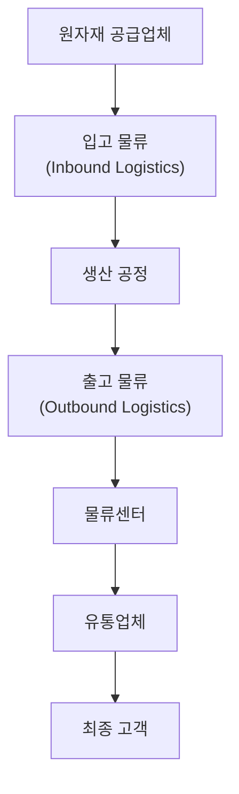

## 물류관리(자재 및 재고관리)

물류관리(Logistics management)는 원자재, 부품, 완제품을 생산지에서 소비지까지 효율적으로 이동, 보관, 관리하여 고객이 원하는 시점에 필요한 제품을 공급하는 관리 활동이다. 주요 기능으로는 운송, 보관, 하역, 보장, 정보관리가 있으며 조달물류, 생산물류, 판매물류, 회수물류로 구분할 수 있다. 공장에서는 생산라인에 필요한 자재를 적시에 공급하고 완제품을 고객에게 신속하게 출하하는 것이 핵심 역할이다. 최근에는 WMS, TMS, AGV, AMR, RFID와 같은 기술을 활용하여 물류 효율과 정확성을 높이고 있으며 물류관리는 SCM을 구성하는 핵심 기능으로 공급망 전체 경쟁력 향상에 중요한 역할을 한다.

즉, 물류관리는 제품 이동(Transportation)과 보관(Storage)을 최적화하여 비용을 절감하고 고객 만족도를 높이는 활동이다.

### 물류관리 목적

물류관리 궁극적 목적은 **적시에(Just In Time), 적정 수량(Right Quantity)을 적정 장소(Right Place)에 최소 비용으로 공급**하는 것이다.

- 물류비 절감
- 납기 준수(On-Time Delivery)
- 재고 최적화
- 운송 효율 향상
- 고객 만족도 향상
- 원활한 공급망 운영

### 주요 기능

물류관리는 크게 다섯가지 기능으로 구성된다.

| 기능                          | 설명               |
| --------------------------- | ---------------- |
| 운송(Transportation)          | 제품과 자재를 이동       |
| 보관(Warehousing)             | 창고에 보관 및 관리      |
| 하역(Material Handling)       | 상·하차 및 공정 간 이동   |
| 포장(Packaging)               | 제품 보호 및 운송 효율 향상 |
| 정보관리(Logistics Information) | 재고와 배송 정보 관리     |

### 물류 흐름


```mermaid
flowchart TD
    A[원자재 공급업체]
    --> B["입고 물류<br/>(Inbound Logistics)"]
    --> C[생산 공정]
    --> D["출고 물류<br/>(Outbound Logistics)"]
    --> E[물류센터]
    --> F[유통업체]
    --> G[최종 고객]
```

### 물류 종류

1. 조달물류 (Inbound Logistics)  
   원자재와 부품을 공급업체에서 공장으로 운송하는 활동이다. 철강 입고, 반도체 입고, 배터리 입고 등이 해당된다.
2. 생산물류 (Production Logistics)  
   공장 내부에서 자재와 반제품을 공정 간 이동시키는 활동이다. 공정간 자재를 적시에 공급하는 것이 핵심이다.

   ```mermaid
   flowchart TD
   
   subgraph Manufacturing[제조 공정]
       A[프레스]
       B[용접]
       C[도장]
       D[조립]
   end
   
   A --> B --> C --> D
   ```

4. 판매물류 (Outbound Logistics)  
   완제품을 고객이나 대리점으로 출하하는 활동이다.

   ```mermaid
   flowchart TD
   
   subgraph Outbound[완제품 출하]
       A[완제품 창고]
       B[뮬류센터]
       C[대리점]
       D[고객]
   end
   
   A --> B --> C --> D
   ```
   
6. 회수물류 (Reverse Logistics)
   고객으로부터 반품, 불량품, 재활용 제품 등을 회수하는 활동이다. 불량 제품 회수, 리콜, 폐배터리 회수, 재활용 등이 해당된다. 최근 ESG와 순환경제 중요성이 커지면서 회수물류 역활도 확대되고 있다.

### 핵심 관리 대상

| 관리 항목 | 설명            |
| ----- | ------------- |
| 재고관리  | 적정 재고 유지      |
| 창고관리  | 보관 위치 및 공간 관리 |
| 운송관리  | 운송 수단과 경로 최적화 |
| 납기관리  | 고객 납기 준수      |
| 배송관리  | 배송 일정과 추적     |
| 포장관리  | 제품 보호 및 운송 효율 |

### 대표적인 물류 관리 기법과 시스템

1. **JIT** (Just In Time)  
   필요한 자재를 필요한 시점에 필요한 수량만 공급하는 방식이다. 재고 감소와 창고 비용 절감 효과가 있으나 공급이 지연되면 생산라인이 중단될 수 있다.
2. **Cross docking**  
   창고에 장기간 보관하지 않고 입고 즉시 출고하는 방식이다. 즉 트럭 입고 → 분류 → 즉시 출고 형태이다. 창고 비용을 절감하고 배송 시간을 단축시킬 수 있다. 대형 유통업체에서 많이 사용하고 있으며 대표적으로 월마트(WALMART)가 있다.
3. **Milk Run**  
   한 대 차량이 여러 공급업체를 순회하면서 자재를 수거하는 방식이다. 운송 비용을 절감하고 차량 활용률을 향상할 수 있다. 자동차 산업에서 널리 활용된다.
4. **Hub & Spoke**  
   중앙 물류센터(Hub)를 거쳐 각 지역(Spoke)으로 배송하는 방식이다. 운송 경로를 단순화하고 배송 효율을 높일 수 있다.

물류관리 관련 대표적인 시스템은 다음과 같다.

| 시스템                                    | 역할                    |
| -------------------------------------- | --------------------- |
| WMS (Warehouse Management System)      | 창고 관리 및 재고 관리         |
| TMS (Transportation Management System) | 운송 계획 및 차량 관리         |
| MES (Manufacturing Execution System)   | 생산과 생산물류 관리           |
| ERP (Enterprise Resource Planning)     | 구매, 재고, 회계 등 기업 자원 관리 |
| SCM (Supply Chain Management)          | 공급망 전체 최적화            |


