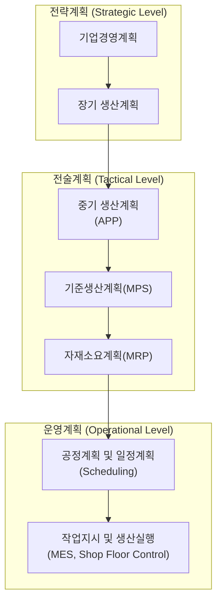
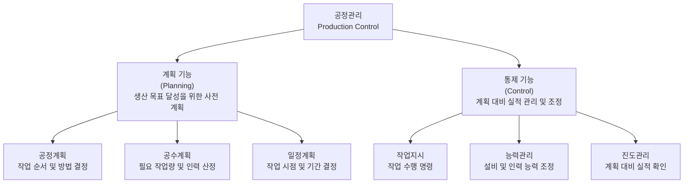

## 생산계획 구조

**생산계획(Production Planning) 구조**는 기업의 비즈니스 목표와 고객 수요를 바탕으로 "**무엇을, 얼마나, 언제, 어떻게 생산할 것인가**"를 결정하는 단계별 수립 체계이다.

* **개념 정의**  
  장기적인 경영 전략부터 일상적인 현장 작업에 이르기까지 시간 지평(Time Horizon)과 상세도(Granularity)에 따라 단계적으로 구체화되는 계층적 구조이다.
* **핵심 목표**  
  생산 능력(Capacity)과 수요(Demand) 간의 균형을 맞추어 설비 가동률을 극대화하고, 납기 준수 및 재고 비용 최소화를 달성하는 것이다.

### 계층적 4대 핵심 단계

생산계획은 상위 단계의 의사결정이 하위 단계의 제약 조건으로 작용하는 Top-Down 구조를 가진다.



**1. 총괄생산계획(S&OP / APP)**

* **시간 지평**: 1년 ~ 3년 이상 (장기)
* **계획 단위**: 제품군(Product Family), 라인 전체
* **주요 내용**
    * 기업의 장기 경영 목표와 연계한 <span class='hl'>대략적인 생산 능력(Capacity) 및 설비 투자 계획을 수립</span>한다.
    * **APP(Aggregate Production Plan, 총괄생산계획)**: 전체 제품군에 대한 분기별/월별 목표 생산량과 인력, 외주 활용 여부를 결정한다.

**2. 주생산계획(MPS, Master Production Schedule)**

* **시간 지평**: 수개월 ~ 1년 (중기)
* **계획 단위**: 완제품(End Item), 개별 품목(SKU)
* **주요 내용**
    * APP를 바탕으로 실제 <span class='hl'>생산할 완제품의 종류, 수량, 완료 시점을 결정</span>하는 핵심 기준 계획이다.
    * 고객 주문(Order)과 수요예측(Forecast)을 결합하여 자재 및 설비의 가동 가능 여부를 검증(RCCP, 개략적 능력계획)한다.

**3. 자재소요계획(MRP, Material Requirements Planning)**

* **시간 지평**: 수주 ~ 수개월 (중단기)
* **계획 단위**: 구성 부품, 반제품, 원자재
* **주요 내용**
    * MPS에서 확정된 완제품 생산 계획과 **자재명세서(BOM, Bill of Materials)**, 현재 재고 데이터를 바탕으로 필요한 <span class='hl'>부품의 종류, 수량, 발주 시점을 산출</span>한다. (입력: MPS, BOM, IRF)
    * 조달 리드타임을 고려하여 내작 생산 지시서 및 외주 발주서를 작성한다.

!!! note "핵심 3대 입력 자료"  
    
    MRP 시스템이 가동되어 필요한 자재의 종류, 수량, 발주 시점을 정확히 계산하기 위해서는 다음 3가지 필수 입력 자료(Input Data)가 정확하게 준비되어야 한다.
    
    **1. 주생산계획 (MPS, Master Production Schedule)**
    
    완제품 단위에서 "무엇을, 얼마나, 언제 생산할 것인가"를 확정한 기준 생산 일정이다.
    
    * **주요 역할:** MRP 시스템의 출발점이며, 종속수요(Dependent Demand) 발생의 근원이 된다.
    * **포함 데이터:** 완제품 품목(SKU), 주별/월별 확정 생산 수량, 생산 완료 예정 시점.
    
    **2. 자재명세서 (BOM, Bill of Materials)**
    
    완제품 1단위를 제조하는 데 필요한 **모든 상위/하위 부품, 반제품, 원자재의 모자(Parent-Child) 관계 및 소요 수량**을 정형화된 트리 구조로 나타낸 구조도이다.
    
    * **주요 역할:** 완제품 생산 수량을 개별 부품 및 원자재의 총 소요량(Gross Requirements)으로 전개(Explosion)하는 기준이 된다.
    * **포함 데이터:** 부품 번호, 투입 단위, 품목 간 계층 구조(Level), 단위당 필요 수량, 손실률(Scrap Rate).
    
    **3. 재고 현황 데이터 (Inventory Status Records, Inventory Record File)**
    
    현재 보유하고 있는 자재의 상태와 향후 수급 예정 정보를 관리하는 데이터베이스이다.
    
    * **주요 역할:** 총 소요량에서 기존 재고와 입고 예정 물량을 차감하여 실제 발주해야 할 순 소요량(Net Requirements)을 산출하는 데 쓰인다.
    * **포함 데이터:** 현재 이용 가능한 온핸드 재고량(On-Hand Inventory), 입고 예정량(Scheduled Receipts), 할당 및 예약 재고량, 조달 리드타임(Lead Time), 발주 단위(Lot Size), 안전재고 수량.
    
    **MRP 입력 자료와 연산 체계 요약**
    
    ```markdown
    [주생산계획 (MPS)] ─┐
    [자재명세서 (BOM)]  ├──> [MRP 연산 엔진] ──> [자재 발주서 및 생산 지시서 출력]
    [재고 현황 데이터]  ─┘
    ```
    
    입력 자료를 정리하면 아래와 같다.  
    
    | 입력 자료 | 주요 질문 | 연산 내 역할 |
    | :--- | :--- | :--- |
    | **주생산계획(MPS)** | 무엇을 언제 만들 것인가? | 완제품 차원의 독립수요 설정 |
    | **자재명세서(BOM)** | 어떤 부품이 얼마만큼 들어가는가? | 하위 부품 단위로 총 소요량 전개 |
    | **재고 현황 데이터** | 현재 얼마나 있고 언제 도착하는가? | 순 소요량 계산 및 발주 시점 결정 |
    

**4. 공정/작업 수립 및 현장 통제(PAC, Production Activity Control / Scheduling)**

* **시간 지평**: 일별, 시별, 단기 현장 조율 (단기)
* **계획 단위**: 개별 설비, 작업자, 작업(Job)
* **주요 내용**
    * MRP에서 내려온 지시를 바탕으로 <span class='hl'>특정 작업대(Work Center)와 라인에 작업을 배치</span>(Gantt Chart 활용)한다.
    * 작업 우선순위 결정, 대기 시간 최소화, 현장 불량 및 설비 고장에 대한 즉각적인 조정을 수행한다.

생산계획 단계별 요약 및 비교하면 다음과 같다.

| 구분 | 장기/총괄계획 (APP) | 주생산계획 (MPS) | 자재요구량계획 (MRP) | 작업 일정 및 통제 (PAC) |
| :--- | :--- | :--- | :--- | :--- |
| **시간 지평** | 1~3년 | 수개월~1년 | 수주~수개월 | 일/시/분 |
| **계획 대상** | 제품군(Product Family) | 완제품(End Item) | 부품 및 원자재 | 작업장, 설비, 작업자 |
| **상세도** | 매우 낮음 (총량 개념) | 중간 수준 | 높음 | 매우 높음 (실시간) |
| **주요 입력** | 사업 계획, 장기 예측 | 확정 주문, 수요예측 | MPS, BOM, 재고 현황 | MRP 지시, 작업장 능력 |
| **능력 검증** | 장기 자원 계획 | RCCP (개략적 능력검증) | CRP (상세 능력검증) | 입력/출력 통제 (I/O Control) |

### 현대 시스템 운영 트렌드

#### APS

APS(Advanced Planning & Scheduling, 상세 생산 계획 및 스케줄링 시스템)는 제조 기업이 리소스(설비, 인력, 자재 등)의 제약 조건을 고려하여 **최적의 생산 계획과 스케줄**을 수립하도록 돕는 차세대 생산 관리 솔루션이다. 전통적인 ERP나 MRP가 가진 한계를 극복하고, 복잡한 제약 조건 속에서 실시간 변화에 유연하게 대응하기 위해 사용된다.

**APS의 핵심 개념 및 특징**

* **제약 조건 기반 계획 (Constraint-based Planning)**  
  단순 수량 계산을 넘어 설비 용량, 작업자 숙련도, 금형/치공구 availability, 자재 수급 상황 등 **실제 현장의 모든 제약 조건을 동시에 반영**한다.
* **유한 능력 계획 (Finite Capacity Scheduling)**  
  기존 MRP가 설비 능력을 무한대(Infinite Capacity)로 가정하여 계획을 세우는 것과 달리, **설비 및 인력의 실제 한계 수량을 초과하지 않도록** 현실적인 스케줄을 산출한다.
* **Memory-based 빠른 연산**  
  인메모리(In-Memory) 기반 연산 Engine을 사용하여 수만 개 공정의 스케줄을 수 초~수 분 내에 다시 계산할 수 있다.
* **What-if 시뮬레이션**  
  "설비 고장이 발생하면?", "긴급 주문이 들어오면?" 과 같은 시나리오를 미리 입력하여 생산 차질 및 납기 변동 영향을 즉시 파악할 수 있다.

**기존 시스템(MRP/ERP)과의 비교**

| 구분 | MRP / ERP | APS |
| --- | --- | --- |
| **능력 가정** | 무한 능력 (Infinite Capacity) | **유한 능력 (Finite Capacity)** |
| **계획 주량** | 일/주/월 단위 (수량 중심) | **분/초/시 단위 (시퀀싱 중심)** |
| **제약 조건** | 리드타임 위주의 단면적 계산 | **설비, 금형, 자재, 인력 등 다차원 복합 반영** |
| **시뮬레이션** | 불가 또는 매우 느림 | **실시간 가능 (What-If 분석)** |
| **주요 목표** | 자재 필요량 및 구매 시점 산출 | **납기 준수율 극대화 및 납기 일정 최적화** |

**APS의 주요 기능**

1. **APS (Planning Level - 중장기 계획)**
  * 수개월~수주일 단위의 수요(Demand)와 공급(Supply) 균형 조정
  * 공장별/라인별 물량 배분, 자재 수급 계획, 목표 재고 수준 수립
2. **Detailed Scheduling (Execution Level - 단기 상세 스케줄링)**
  * 일/시/분 단위의 실제 생산 순서(Sequencing) 결정
  * 작업 교체 시간(Setup Time) 최소화, 작업자 배치, 금형 세팅 스케줄 수립
3. **Dynamic Rescheduling (실시간 재계획)**
  * 현장 변동 사항(설비 장애, 긴급 오더, 자재 지연) 발생 시 시뮬레이션을 거쳐 스케줄 재조정

**도입 기대 효과**

* **납기 준수율 향상**: 정확한 생산 완료 예측 시간을 기반으로 약속 납기를 준수
* **재공(WIP) 및 제품 재고 감소**: 대기 시간을 줄이고 타이트한 라인 흐름을 형성하여 불필요한 재고 방지
* **리드타임 단축**: 투입부터 완제품 출하까지의 생산 cycle time 축소
* **비용 절감**: 준비 교체(Setup) 시간 최소화 배치로 설비 가동률 극대화
* **현장 대응력 강화**: 긴급 주문 투입 시 기존 계획에 미치는 여파를 즉시 파악하고 최적안 적용

**성공적인 구축을 위한 선행 조건 (핵심 요인)**

APS는 매우 강력한 도구이지만, 정확한 기준 정보(Master Data)가 없으면 제대로 동작하지 않는다.

* **정교한 기준 정보**: 정확한 표준 공수(Tact Time), 준비 교체 시간, 공정순서(BOM/Routing) 데이터 보유 필수
* **MES/ERP 연동**: 현장 실적(MES)과 주문/자재 정보(ERP)가 실시간으로 피드백되어야 동적 스케줄링 가능
* **현장 제약 규칙 정의**: 실제 공정의 복잡한 룰(Constraint)을 알고리즘으로 명확히 규정할 수 있어야 함

## 생산통제

**생산통제(Production Control)**는 확정된 생산계획(MPS, MRP, 상세 일정계획 등)을 바탕으로 현장에서 물리적인 생산 작업이 시작된 이후, **계획대로 차질 없이 진행되고 있는지 모니터링하고 일탈 발생 시 즉각 보정하는 공정 관리 활동**이다.

* **개념 정의**  
  생산 현장의 자재, 설비, 인력을 효율적으로 통제하여 예정된 납기 내에 목표 품질과 수량을 최소 비용으로 달성하게 하는 일련의 실행 및 관리 메커니즘이다.
* **핵심 목표**  
  공정 간 대기 시간 및 병목 현상 최소화, 생산 리드타임 단축, 설비 가동률 극대화, 정시 납기 준수율 확보이다.

### 4대 핵심 절차

생산통제는 일반적으로 현장의 작업 흐름에 따라 아래의 4단계 절차를 거쳐 연속적으로 수행된다.

```
[1.라우팅(Routing)] ──> [2.일정계획(Scheduling)] ──> [3.지시(Dispatching)] ──> [4.진도관리(Follow-up)]
```

**1. 공정 순서 결정(Routing)**  

제품을 제조하기 위해 거쳐야 하는 개별 작업 단계, 사용 설비, 순서, 표준 작업 시간(Standard Time)을 정의하는 사전 준비 단계이다.
  
**2. 상세 일정계획(Scheduling)**  

각 공정 및 작업장(Work Center)별로 작업 개시 시점과 완료 시점을 구체적으로 할당하는 단계이다. (간트 차트, CPM/PERT 기법 등 활용)
  
**3. 작업 지시(Dispatching)**  

생산 현장에 작업지시서, 자재 출하 요청서, 공정 도면 등을 하달하여 실제로 생산 작업에 착수하게 하는 통제 시발점 단계이다.
  
**4. 진도관리 및 추적(Follow-up / Expediting)**  

실제 작업 진행 실적을 실시간으로 추적하여 계획과의 차이점(설비 고장, 결품, 불량 발생 등)을 파악하고, 라인 재배치나 잔업 투입 등 보정 시정 조치를 취하는 사후 관리 단계이다.
  

### 주요 생산통제 기법 및 원리

**1. 우선순위 규칙(Dispatching Rules)**

자세한 내용은 [[2. 생산운영 및 뮤류관리 > 1. 수요예측과 일정관리 > 우선순위 정렬 및 우선순위 규칙](https://yeonkyupark.github.io/pepc3e/0201_demand_forecasting_and_scheduling/#_14)]을 참고한다.

**2. 입출력 통제 (Input/Output Control)**

각 작업장에 들어오는 작업량(Input)과 실제로 처리되어 나가는 작업량(Output)을 비교·통제하여 공정 재공품(WIP) 재고가 과다 축적되는 것을 방지하는 기법이다.

**3. 통제 방식에 따른 구분 (Push vs Pull Control)**

* **Push 통제**: 생산계획에 의거해 자재를 다음 공정으로 밀어 넣는 방식이다. (MRP 기반)
* **Pull 통제**: 후공정의 소비 신호(Kanban 등)에 의해 전공정에서 자재를 끌어당겨 생산하는 방식이다. (JIT 기반)

### 주요 성능 평가 지표 (KPI)

| 구분 | 평가 지표 명칭 | 핵심 측정 요소 |
| :--- | :--- | :--- |
| **납기 성과** | 정시 납기 준수율 (OTD, On-Time Delivery) | 계획 대비 실제 납기 준수 비율 |
| **공정 효율** | 제조 리드타임 (Manufacturing Lead Time) | 자재 투입부터 완제품 완성까지 걸린 총 시간 |
| **재고 성과** | 공정 재공품 수준 (WIP, Work-In-Process) | 라인 내 대기 및 가공 중인 미완성 재고량 |
| **설비 성과** | 종합설비효율 (OEE, Overall Equipment Effectiveness) | 설비의 시간가동률, 성능가동률, 양품률의 종합 지수 |

### 현대 핵심 기술 트렌드

#### MES

**MES(Manufacturing Execution System, 제조실행시스템)**는 공장 현장의 생산 활동을 실시간으로 감시하고 제어하여 생산 효율을 최적화하는 시스템이다. 전통적인 생산 현장의 수기 관리 방식에서 벗어나 자재 투입부터 최종 제품 생산까지의 전 과정을 디지털화하여 관리한다.

**1. MES의 핵심 개념 및 특징**

MES는 생산 현장의 작업 명령부터 완제품 출하까지의 과정을 실시간으로 추적하고 관리한다.

* **실시간 데이터 수집**  
  설비, 바코드, 센서 등과 연동하여 현장의 생산 실적과 상태 정보를 즉시 수집한다.
* **생산 공정 추적(Traceability)**  
  자재 투입부터 최종 제품 생산까지의 이력을 추적하여 품질 문제 발생 시 원인을 신속하게 규명한다.
* **현장 중심 제어**  
  계획 수립 단계(ERP)와 실제 설비 제어 단계(PLC/SCADA) 사이에서 실시간 작업 명령 및 가이드를 전달한다.

**2. 기존 시스템(ERP/APS)과의 비교**

MES는 상위 경영 계획 시스템과 하위 설비 제어 시스템 사이에서 실시간 현장 실행을 담당한다.

| 구분 | ERP | APS | MES |
| --- | --- | --- | --- |
| **주요 역할** | 경영 자원 관리 및 전체 계획 | 최적 상세 스케줄링 수립 | **현장 작업 실행 및 실시간 통제** |
| **관리 단위** | 일/주/월 단위 (재무/수량 중심) | 분/초/시 단위 (스케줄 중심) | **실시간/초 단위 (현장 실적 중심)** |
| **주요 대상** | 자금, 자재, 매출, 구매 | 설비 용량, 작업 순서 | **작업자, 설비, 자재, 품질 이력** |
| **데이터 방향** | 탑다운(Top-down) 계획 수립 | 탑다운 및 바텀업 최적화 | **바텀업(Bottom-up) 실적 수집 및 피드백** |

**3. MES의 11대 핵심 기능(MESA 표준)**

MESA(Manufacturing Enterprise Solutions Association)에서는 MES의 표준 기능을 11가지로 정의한다.

1. **자원 할당 및 상태 관리(Resource Allocation and Status)**  
  설비, 공구, 작업자 등 생산 자원의 상태를 실시간으로 파악하고 관리한다
2. **작업 및 상세 일정 관리(Operations/Detail Scheduling)**  
  생산 계획에 따라 작업 순서를 부여하고 현장 스케줄을 조정한다
3. **생산 단위 분배(Dispatching Production Units)**  
  작업 지시서나 롯(Lot) 단위로 현장에 작업을 배분한다
4. **문서 관리(Document Control)**  
  작업 표준서, 도면, 공정 처방 등 현장에 필요한 정보를 공유하고 제어한다
5. **데이터 수집 및 취득(Data Collection/Acquisition)**  
  생산 실적, 설비 데이터, 센서 정보를 실시간으로 수집한다
6. **근태 및 인력 관리(Labor Management)**  
  작업자의 투입 시간, 숙련도, 출석 상태 등을 관리한다
7. **품질 관리(Quality Management)**  
  공정 검사 및 품질 데이터를 분석하여 불량을 예방하고 제어한다
8. **공정 관리(Process Management)**  
  생산 진행 상황을 모니터링하고 예외 발생 시 작업자에게 알린다
9. **설비 보전 관리(Maintenance Management)**  
  설비 가동 시간과 점검 이력을 관리하여 고장을 예방한다
10. **제품 추적 및 이력 관리(Product Tracking and Genealogy)**  
  자재 투입부터 최종 출하까지의 Lot 이력을 관리한다
11. **실적 분석 및 보고(Performance Analysis)**  
  OEE(설비 종합 효율), 가동률, 불량률 등 핵심 지표를 산출한다

**4. 도입 기대 효과**

MES 도입을 통해 생산 현장의 투명성을 확보하고 운영 효율을 극대화한다.

* **생산성 향상**: 실시간 모니터링을 통한 설비 비가동 시간 감소 및 가동률 극대화
* **품질 불량률 감소**: 공정 내 실시간 품질 검사 및 Lot 이력 추적으로 원인 파악 용이
* **리드타임 단축**: 공정 간 대기 시간 축소 및 신속한 작업 지시 전달
* **제조 원가 절감**: 불필요한 재공 재고 감소 및 자원 투입 최적화
* **페이퍼리스(Paperless) 구현**: 현장 수기 기록을 디지털화하여 데이터 정확성 향상

**5. 성공적인 구축을 위한 핵심 고려사항**

정확한 데이터 연동과 현장 사용자 중심의 프로세스 설계를 반영해야 MES가 안착한다.

* **설비 데이터 인터페이스(PLC/IoT)**: 설비와의 직접적인 통신 인프라 구축 필수
* **ERP 및 APS 연동**: 상위 시스템과의 실시간 데이터 송수신 및 피드백 체계 수립
* **현장 작업자 편의성**: 직관적인 UI/UX를 제공하여 현장 작업자의 입력 부담 최소화

#### 디지털 트윈

**디지털 트윈(Digital Twin)**은 현실 공장의 설비, 프로세스, 시스템, 인력 등을 가상 공간에 3차원으로 동일하게 복제하고, 센서 및 IoT 데이터를 통해 실시간으로 동기화하는 기술이다. 생산운영 및 공장관리 관점에서는 단순한 3D 시각화를 넘어 **실시간 모니터링, 사전 예측, 최적화 시뮬레이션**을 가능하게 하는 차세대 공장 지능화의 핵심 체계이다.

**디지털 트윈 핵심 개념**

현장 데이터와 가상 모델을 실시간으로 연결하여 공장 전체의 운영 상황을 가시화하고 제어한다.

* **쌍둥이 모델 구축 (Virtual Replication)**
  설비 배치, 공정 흐름, 자재 이동 등 공장의 모든 물리적 요소와 동작 특성을 가상 공간에 정밀하게 구현한다.
* **실시간 데이터 동기화 (Real-time Synchronization)**  
  IoT, 센서, PLC, MES/ERP 시스템과 연동하여 현장의 상태 변동 정보를 실시간으로 반영한다.
* **양방향 제어 (Closed-loop Control)**  
  가상 공간에서 분석·최적화된 결과를 다시 실제 공장 설비 및 작업 프로세스에 피드백하여 자동 제어 및 조정을 수행한다.

**기존 공장 관리 시스템과의 연계 및 차별점**

디지털 트윈은 독립적인 시스템이 아니라 ERP, APS, MES 등 기존 제조 시스템의 데이터를 통합하여 최적의 판단을 내리는 상위 엔진 역할을 한다.

| 구분 | MES | APS | **디지털 트윈 (Digital Twin)** |
| --- | --- | --- | --- |
| **주 역할** | 현장 실적 수집 및 작업 통제 | 유한 능력 기반 상세 계획 수립 | **전체 공장 가시화, 예측 및 시뮬레이션** |
| **데이터 활용** | 텍스트/트랜잭션 기반 이력 수집 | 수학적 알고리즘 기반 계산 | **3D Spatial 데이터 + 실시간 센서 + AI 연동** |
| **분석 방식** | 사후 분석 및 현황 파악 | 조건에 따른 시퀀스 산출 | **사전 예지(Predictive) 및 What-If 시뮬레이션** |
| **피드백** | 작업자 지시 및 수기 대응 | 계획 수정안 전달 | **가상 검증 후 물리 설비/프로세스 직접 제어** |

**공장 관리 분야별 주요 활용 영역**

* 설비 관리 및 예지보전 (Predictive Maintenance)  
    * **진동·열·전류 데이터 기반 상태 진단**: 설비 고장을 사전에 예측하여 비가동 시간(Downtime)을 최소화한다.
    * **수명 예측**: 주요 부품의 마모도를 가상 모델로 실시간 추적하여 최적의 교체 시기를 산출한다.
* 생산 공정 최적화 및 Bottle-neck 분석  
    * **공정 병목 구간 탐지**: 물류 흐름과 생산 라인 간 대기 시간을 가상 공간에서 시각적으로 확인하고 개선한다.
    * **라인 증설 및 변경 사전 검증**: 신규 라인 구축 시 실제 설비를 배치하기 전 가상 공간에서 타당성을 검증한다.
* 품질 관리 및 수율 향상  
  * **공정 파라미터 추적**: 불량 발생 시 해당 시점의 설비 상태, 온도, 습도, 작업자 등 모든 인자를 3D 이력으로 복원하여 원인을 분석한다.
  * **가상 시운전 (Virtual Commissioning)**: 제품 조건 변경 시 가상 공장에서 미리 시운전을 진행하여 초기 불량률을 줄인다.
* 공장 안전 및 환경 관리
    * **작업자 동선 및 위험 구역 통제**: 유해 가스 누출, 위험 설비 접근 등 이상 상황 발생 시 가상 공간에서 즉시 경보를 발령하고 대피 경로를 안내한다.
    * **에너지 사용량 최적화**: 공장 전체의 전력 소비 현황을 매핑하여 피크 시간대 에너지를 효율적으로 분배한다.

**도입 기대 효과**

* **설비 비가동 시간 단축**: 사전 예지보전을 통해 갑작스러운 설비 정지 사고를 방지한다.
* **신규 라인 구축 리스크 감소**: 가상 검증을 통해 라인 변경 및 증설 시 발생하는 시행착오와 비용을 감축한다.
* **의사결정 속도 향상**: 전체 공장의 운영 상태를 한눈에 파악하여 현장 문제 발생 시 즉각 대응한다.
* **제조 원가 절감**: 불량률 단축, 재공 재고 감소, 에너지 효율화 등을 통해 전체 운영 비용을 절감한다.

**성공적인 구축을 위한 핵심 고려사항**

* **정밀한 3D CAD/GIS 및 데이터 물리 모델 설계**: 실제 설비의 물리적 특성을 정확히 반영한 모델 생성이 선행되어야 한다.
* **고속 데이터 처리 인프라 (Edge Computing/5G)**: 대용량 센서 데이터를 지연 없이 처리하기 위한 통신 및 컴퓨팅 환경이 필수적이다.
* **기존 IT/OT 시스템 통합**: MES, ERP, SCADA와의 원활한 데이터 인터페이스 체계를 마련해야 한다.

## 공정관리 기능

공정관리는 크게 계획 기능과 통제기능으로 구분된다.



### 계획 기능

1. **공정계획(Process Planning)**  
   제품을 생산하기 위한 공정 순서, 작업 순서, 작업 방법, 사용 설비 등을 결정하는 기능이다. 제조 공정 순서, 가공 방법, 사용 기계, 작업 방법, 검사 방법 등을 결정한다. 즉 어떤 방법으로 제품을 만들 것인가를 결정하는 것으로 자동차 부품 생산을 예로 들면 "절삭 → 열처리 → 연삭 → 검사"와 같이 계획을 수립할 수 있다.
2. **공수계획(Man-Hour Planning)**  
   생산에 필요한 작업량(공수)을 계산하고 작업장별 부하를 계산하는 기능이다. 
3. **일정계획(Scheduling)**  
   생산해야 할 제품과 작업을 시간적으로 배정하는 기능이다. "언제 생산할 것인가", 어떤 순서로 생산할 것인가", "어느 섧지에서 생산할 것인가"를 결정한다.

!!! example "공수 계산"  

    예를 들어 작업자 10명이 8시간 작업한다면 공수는 다음과 같이 계산된다.
    
    - $공수 = 작업인원 \times 작업시간 = 10(명) \times 8(시간) = 80(Man-hour)$

    제품 1개 생산 표준시간 30분, 생산량 1,000개인 경우 필요 공수는 다음과 같이 계산된다.

    - $1000(개) \times 0.5(시간) = 500(시간)$

    500시간에 대한 필요 인력은 1일 8시간 작업 기준 다음과 같이 계산된다.

    - $500 \div 8 = 62.5(명일)$

### 통제 기능

1. **작업지시(Dispatching)**  
   일정계획에 따라 현장 작업자와 설비에 작업 내용을 전달하는 기능이다. 작업 대상, 작업 순서, 작업 장소, 작업 시간을 관리한다. "CNC 1호기에서 오전 8시부터 A부펌 500개 가공 실시"를 예로 들 수 있다.
2. **능력관리(Capacitiy Control)**  
   실제 생산능력이 계획된 생산량을 충족할 수 있도록 관리하는 기능이다. 지정한 설비가 월 1,000시간 생산으로 계획하였으나 설비 고장으로 800시간만 가능하다면 잔업, 설비 변경, 외주 처리 등과 같이 조치를 취한다.
3. **진도관리(Processing Control)**  
   계획된 생산 일정과 실제 생산 진행 상황을 비교하여 차이를 관리하는 기능이다. 주요 관리항목으론 생산량, 납기, 공정 진행률, 재공품 등이 있다. 3일 6,000개 생산으로 계획하고 실적이 5,000개 생산이면 차이나는 1,000개에 대한 원인 분석과 조치를 취한다.

