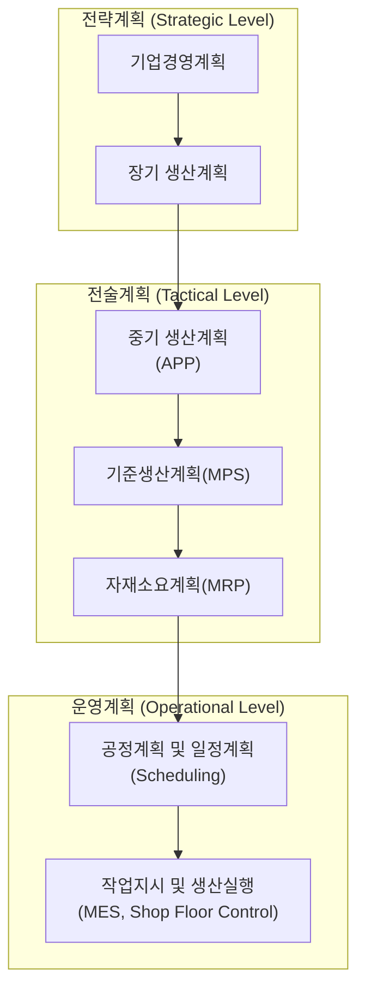
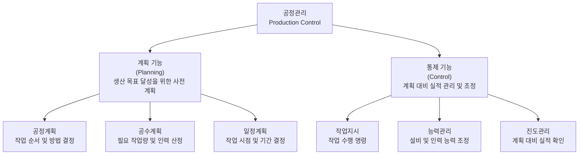

## 생산계획 구조

**생산계획(Production Planning) 구조**는 기업의 비즈니스 목표와 고객 수요를 바탕으로 "**무엇을, 얼마나, 언제, 어떻게 생산할 것인가**"를 결정하는 단계별 수립 체계이다.

* **개념 정의**  
  장기적인 경영 전략부터 일상적인 현장 작업에 이르기까지 시간 지평(Time Horizon)과 상세도(Granularity)에 따라 단계적으로 구체화되는 계층적 구조이다.
* **핵심 목표**  
  생산 능력(Capacity)과 수요(Demand) 간의 균형을 맞추어 설비 가동률을 극대화하고, 납기 준수 및 재고 비용 최소화를 달성하는 것이다.

### 계층적 4대 핵심 단계

생산계획은 상위 단계의 의사결정이 하위 단계의 제약 조건으로 작용하는 Top-Down 구조를 가진다.



**1. 총괄생산계획(S&OP / APP)**

* **시간 지평**: 1년 ~ 3년 이상 (장기)
* **계획 단위**: 제품군(Product Family), 라인 전체
* **주요 내용**
    * 기업의 장기 경영 목표와 연계한 ==대략적인 생산 능력(Capacity) 및 설비 투자 계획==\을 수립한다.
    * **APP(Aggregate Production Plan, 총괄생산계획)**: 전체 제품군에 대한 분기별/월별 목표 생산량과 인력, 외주 활용 여부를 결정한다.

**2. 주생산계획(MPS, Master Production Schedule)**

* **시간 지평**: 수개월 ~ 1년 (중기)
* **계획 단위**: 완제품(End Item), 개별 품목(SKU)
* **주요 내용**
    * APP를 바탕으로 실제 생산할 완제품의 종류, 수량, 완료 시점을 결정하는 핵심 기준 계획이다.
    * 고객 주문(Order)과 수요예측(Forecast)을 결합하여 자재 및 설비의 가동 가능 여부를 검증(RCCP, 개략적 능력계획)한다.

**3. 자재소요계획(MRP, Material Requirements Planning)**

* **시간 지평**: 수주 ~ 수개월 (중단기)
* **계획 단위**: 구성 부품, 반제품, 원자재
* **주요 내용**
    * MPS에서 확정된 완제품 생산 계획과 **자재명세서(BOM, Bill of Materials)**, 현재 재고 데이터를 바탕으로 필요한 ==부품의 종류, 수량, 발주 시점을 산출==한다. (입력: MPS, BOM, IRF)
    * 조달 리드타임을 고려하여 내작 생산 지시서 및 외주 발주서를 작성한다.

**4. 공정/작업 수립 및 현장 통제(PAC, Production Activity Control / Scheduling)**

* **시간 지평**: 일별, 시별, 단기 현장 조율 (단기)
* **계획 단위**: 개별 설비, 작업자, 작업(Job)
* **주요 내용**
    * MRP에서 내려온 지시를 바탕으로 특정 작업대(Work Center)와 ==라인에 작업을 배치==(Gantt Chart 활용)한다.
    * 작업 우선순위 결정, 대기 시간 최소화, 현장 불량 및 설비 고장에 대한 즉각적인 조정을 수행한다.

생산계획 단계별 요약 및 비교하면 다음과 같다.

| 구분 | 장기/총괄계획 (APP) | 주생산계획 (MPS) | 자재요구량계획 (MRP) | 작업 일정 및 통제 (PAC) |
| :--- | :--- | :--- | :--- | :--- |
| **시간 지평** | 1~3년 | 수개월~1년 | 수주~수개월 | 일/시/분 |
| **계획 대상** | 제품군(Product Family) | 완제품(End Item) | 부품 및 원자재 | 작업장, 설비, 작업자 |
| **상세도** | 매우 낮음 (총량 개념) | 중간 수준 | 높음 | 매우 높음 (실시간) |
| **주요 입력** | 사업 계획, 장기 예측 | 확정 주문, 수요예측 | MPS, BOM, 재고 현황 | MRP 지시, 작업장 능력 |
| **능력 검증** | 장기 자원 계획 | RCCP (개략적 능력검증) | CRP (상세 능력검증) | 입력/출력 통제 (I/O Control) |

### 현대 시스템 운영 트렌드

* **APS(Advanced Planning & Scheduling)**  
  기존의 개별적인 MPS/MRP 단계를 넘어 복잡한 공정 제약 조건을 AI 알고리즘 및 시뮬레이션을 통해 동시 최적화하는 시스템이다.
* **S&OP(Sales and Operations Planning)의 고도화**  
  영업, 재무, 생산 부서 간 실시간 데이터를 연동하여 시장 변화에 신속하게 수립 체계를 재조정한다.

## 생산통제

**생산통제(Production Control)**는 확정된 생산계획(MPS, MRP, 상세 일정계획 등)을 바탕으로 현장에서 물리적인 생산 작업이 시작된 이후, **계획대로 차질 없이 진행되고 있는지 모니터링하고 일탈 발생 시 즉각 보정하는 공정 관리 활동**이다.

* **개념 정의**  
  생산 현장의 자재, 설비, 인력을 효율적으로 통제하여 예정된 납기 내에 목표 품질과 수량을 최소 비용으로 달성하게 하는 일련의 실행 및 관리 메커니즘이다.
* **핵심 목표**  
  공정 간 대기 시간 및 병목 현상 최소화, 생산 리드타임 단축, 설비 가동률 극대화, 정시 납기 준수율 확보이다.

### 4대 핵심 절차

생산통제는 일반적으로 현장의 작업 흐름에 따라 아래의 4단계 절차를 거쳐 연속적으로 수행된다.

```
[1. 라우팅(Routing)] ──> [2. 일정계획(Scheduling)] ──> [3. 지시(Dispatching)] ──> [4. 진도관리(Follow-up)]
```

**1. 공정 순서 결정(Routing)**  
  제품을 제조하기 위해 거쳐야 하는 개별 작업 단계, 사용 설비, 순서, 표준 작업 시간(Standard Time)을 정의하는 사전 준비 단계이다.
**2. 상세 일정계획(Scheduling)**  
  각 공정 및 작업장(Work Center)별로 작업 개시 시점과 완료 시점을 구체적으로 할당하는 단계이다. (간트 차트, CPM/PERT 기법 등 활용)
**3. 작업 지시(Dispatching)**  
  생산 현장에 작업지시서, 자재 출하 요청서, 공정 도면 등을 하달하여 실제로 생산 작업에 착수하게 하는 통제 시발점 단계이다.
**4. 진도관리 및 추적(Follow-up / Expediting)**  
  실제 작업 진행 실적을 실시간으로 추적하여 계획과의 차이점(설비 고장, 결품, 불량 발생 등)을 파악하고, 라인 재배치나 잔업 투입 등 보정 시정 조치를 취하는 사후 관리 단계이다.

### 주요 생산통제 기법 및 원리

**1. 우선순위 규칙(Dispatching Rules)**

제세한 내용은 [2. 생산운영 및 뮤류관리 > 1. 수요예측과 일정관리 > 우선순위 정렬 및 우선순위 규칙](https://yeonkyupark.github.io/pepc3e/0201_demand_forecasting_and_scheduling/#_14)을 참고한다.

**2. 입출력 통제 (Input/Output Control)**

각 작업장에 들어오는 작업량(Input)과 실제로 처리되어 나가는 작업량(Output)을 비교·통제하여 공정 재공품(WIP) 재고가 과다 축적되는 것을 방지하는 기법이다.

**3. 통제 방식에 따른 구분 (Push vs Pull Control)**

* **Push 통제**: 생산계획에 의거해 자재를 다음 공정으로 밀어 넣는 방식이다. (MRP 기반)
* **Pull 통제**: 후공정의 소비 신호(Kanban 등)에 의해 전공정에서 자재를 끌어당겨 생산하는 방식이다. (JIT 기반)

### 주요 성능 평가 지표 (KPI)

| 구분 | 평가 지표 명칭 | 핵심 측정 요소 |
| :--- | :--- | :--- |
| **납기 성과** | 정시 납기 준수율 (OTD, On-Time Delivery) | 계획 대비 실제 납기 준수 비율 |
| **공정 효율** | 제조 리드타임 (Manufacturing Lead Time) | 자재 투입부터 완제품 완성까지 걸린 총 시간 |
| **재고 성과** | 공정 재공품 수준 (WIP, Work-In-Process) | 라인 내 대기 및 가공 중인 미완성 재고량 |
| **설비 성과** | 종합설비효율 (OEE, Overall Equipment Effectiveness) | 설비의 시간가동률, 성능가동률, 양품률의 종합 지수 |

### 현대 핵심 기술 트렌드

* **MES (Manufacturing Execution System, 제조실행시스템)**  
  현장의 키오스크, 바코드, IoT 센서 데이터를 실시간 수집하여 공정 진도 현황을 시각화하고 즉각적인 작업 지시를 내리는 핵심 솔루션이다.
* **디지털 트윈 (Digital Twin) 기반 최적 통제**  
  가상 공장을 구축하여 라인 병목이나 고장 요소를 실시간 시뮬레이션하고 자율적으로 공정 흐름을 최적화한다.

## 공정관리 기능

공정관리는 크게 계획 기능과 통제기능으로 구분된다.



### 계획 기능

1. **공정계획(Process Planning)**  
   제품을 생산하기 위한 공정 순서, 작업 순서, 작업 방법, 사용 설비 등을 결정하는 기능이다. 제조 공정 순서, 가공 방법, 사용 기계, 작업 방법, 검사 방법 등을 결정한다. 즉 어떤 방법으로 제품을 만들 것인가를 결정하는 것으로 자동차 부품 생산을 예로 들면 절삭 → 열처리 → 연삭 → 검사와 같이 계획을 수립할 수 있다.
2. **공수계획(Man-Hour Planning)**  
   생산에 필요한 작업량(공수)을 계산하고 작업장별 부하를 계산하는 기능이다. 
3. **일정계획(Scheduling)**  
   생산해야 할 제품과 작업을 시간적으로 배정하는 기능이다. "언제 생산할 것인가", 어떤 순서로 생산할 것인가", "어느 섧지에서 생산할 것인가"를 결정한다.

!!! example "공수 계산"  

    예를 들어 작업자 10명이 8시간 작업한다면 공수는 다음과 같이 계산된다.
    
    - $공수 = 작업인원 \times 작업시간 = 10(명) \times 8(시간) = 80(Man-hour)$

    제품 1개 생산 표준시간 30분, 생산량 1,000개인 경우 필요 공수는 다음과 같이 계산된다.

    - $1000(개) \times 05(시간) = 500(시간)$

    500시간에 대한 필요 인력은 1일 8시간 작업 기준 다음과 같이 계산된다.

    - $500 \div 8 = 62.5(명일)$

### 통제 기능

1. **작업지시(Dispatching)**  
   일정계획에 따라 현장 작업자와 설비에 작업 내용을 전달하는 기능이다. 작업 대상, 작업 순서, 작업 장소, 작업 시간을 관리한다. "CNC 1호기에서 오전 8시부터 A부펌 500개 가공 실시"를 예로 들 수 있다.
2. **능력관리(Capacitiy Control)**  
   실제 생산능력이 계획된 생산량을 충족할 수 있도록 관리하는 기능이다. 지정한 설비가 월 1,000시간 생산으로 계획하였으나 설비 고장으로 800시간만 가능하다면 잔업, 설비 변경, 외주 처리 등과 같이 조치를 취한다.
3. **진도관리(Processing Control)**  
   계획된 생산 일정과 실제 생산 진행 상황을 비교하여 차이를 관리하는 기능이다. 주요 관리항목으론 생산량, 납기, 공정 진행률, 재공품 등이 있다. 3일 6,000개 생산으로 계획하고 실적이 5,000개 생산이면 차이나는 1,000개에 대한 원인 분석과 조치를 취한다.

