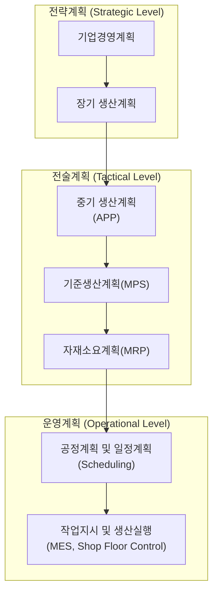
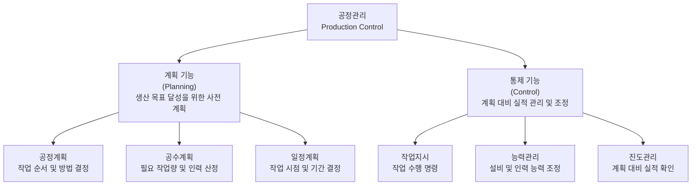

## 생산계획 구조

생산계획 구조(Production Planning Hierachy)는 기업 경영목표를 달성하기 위해 장기적인 생산전략부터 현장 작업지시까지 생산계획을 단계적으로 구체화하는 체계이다. 먼저 장기 생산계획에서는 생산능력과 설비 투자 방향을 결정하고, 총괄생산계획에서는 수요 예측을 방탕으로 생산량과 재고, 인력 운영을 계획한다. 이를 기반으로 기준생산계획에서는 최종 제품 생산일정과 수량을 확정하고 MRP를 통해 필요한 자재 종류와 수량, 발주 시점을 계산한다. 이후 일정계획에서 설비와 작업 순서를 결정하고 MES를 활용하여 작업지시와 생산실행을 관리하다. 즉, 생산계획은 전략적 계획이 점차 구체적인 실행계획으로 전개되는 계층적 구조를 가지며, 이를 통해 생산능력, 자재, 설비, 인력을 효율적으로 운영하고 납기와 생산성을 확보하는 것이 목적이다.

생산계획은 단순히 "얼마를 생산할 것인가"를 결정하는 것이 아니라, "**무엇을, 언제, 얼마나, 어떤 자원으로 생산할 것인가**"를 단계적으로 구체화하는 과정이다.

### 생산계획 구조

공장관리에서 일반적으로 다음과 같은 계층 구조를 사용한다.

생산계획을 학교 축제 준비과정에 비유하면 다음과 같다.

| 생산계획   | 학교 축제         |
| ------ | ------------- |
| 장기계획   | 올해 축제 개최 결정   |
| 총괄생산계획 | 예산, 인원, 일정 수립 |
| MPS    | 프로그램별 일정 확정   |
| MRP    | 필요한 물품 구매     |
| 일정계획   | 행사 시간표 작성     |
| 작업지시   | 담당자별 업무 배정    |

#### 장기 생산계획

장기 생산계획(Long-range Planning)은 1년 이상 장기간을 대상으로 생산능력과 설비 투자 방향을 결정하는 계획이다.

**주요 결정 사항**

- 공장 신설
- 설비 투자(CAPEX)
- 생산능력(Capacity) 결정
- 신제품 생산계획
- 인력 확보 계획

**계획 기간**

- 1 ~ 5년

#### 중기 생산계획

중기 생산계획(Aggregate Planning, 총괄생산계획)은 수요예측을 바탕으로 향후 수개월에서 1년 정도 생산량, 인력, 재고 수준을 결정하는 계획이다. 

**주요 결정 사항**

- 월별 생산량
- 재고 계획
- 잔업 여부
- 외주 생산
- 인력 운영

**계획 기간**

- 3 ~12개월

#### 기준 생산계획

기준생산계획(MPS, Master Production Schedule)은 최종 제품을 언제 얼마나 생산할 것인지를 결정하는 구체적인 생산계획이다. 여기서부터 실제 생산계획이 시작된다.

**예시**

| 제품     |  7월 1주 |  7월 2주 |  7월 3주 |
| ------ | -----: | -----: | -----: |
| 스마트폰 A | 5,000대 | 6,000대 | 5,500대 |
| 스마트폰 B | 3,000대 | 2,500대 | 3,500대 |

이 계획을 기준으로 자재 계획을 수립한다.

#### 자재소요계획

자재소요계획(MRP, Material Requirements Planning)는 MPS를 기준으로 필요한 자재 종류, 수량, 발주 시점을 계산하는 계획이다. 

**입력정보**

- MPS
- BOM(Bill of Materials, 제품구조, 자재명세)
- 현재 재고(IRF, Inventory Record File, 자재기록명세서)
- 조달기간(Lead time)

**출력결과**

- 구매계획
- 발주계획
- 생산지시

#### 일정계획

일정계획(Scheduling)은 생산 순서와 작업 일정을 결정하여 설비와 인력을 효율적으로 운영하는 계획이다.

**결정내용**

- 어떤 설비에서
- 언제
- 어떤 순서로
- 얼마 동안 생산할 것인가

#### 작업지시 및 생산실행

작업지시 및 생산실행은 계획된 내용을 실제 생산현장에서 실행하는 단계이다. 여기서 MES가 중요한 역할을 한다.

**주요 업무**

- 작업지시
- 생산실적 수집
- 품질 관리
- 설비 모니터링
- 진도관리

### 생산계획과 생산통제

생산계획은 "무엇을, 언제, 얼마나 생산할 것인가를 결정하는 활동"이고, 생산통제는 "수립된 계획이 현장에서 제대로 실행되도록 관리하고 조정하는 활동"이다. 즉, 생산계획(Plan) → 생산실행(Do) → 생산통제(Control) → 피드백 및 계획 수정(Feedback)과 같은 순환 구조를 가진다.

| 구분     | 생산계획                 | 생산통제               |
| ------ | -------------------- | ------------------ |
| 영문     | Production Planning  | Production Control |
| 목적     | 생산 목표와 방법 결정         | 계획 실행 및 차이 조정      |
| 시점     | 생산 전                 | 생산 중·후             |
| 관점     | 미래 예측                | 현재 상황 대응           |
| 주요 질문  | 무엇을 언제 얼마나 생산할 것인가?  | 계획대로 진행되고 있는가?     |
| 주요 활동  | 수요예측, MPS, MRP, 일정계획 | 진도관리, 작업지시, 실적관리   |
| 주요 시스템 | ERP, APS             | MES, POP           |

#### 생산계획

생산계획(Production Planning)은 미래 생산 활동을 효과적으로 수행하기 위해 생산량, 생산시기, 생산방법, 필요한 자원 등을 사전에 결정하는 활동이다.

**주요 결정 사항**

| 항목     | 주요 내용                 |
| ------ | --------------------- |
| 생산량 계획 | 얼마나 생산할 것인가           |
| 제품 계획  | 무엇을 생산할 것인가           |
| 일정 계획  | 언제 생산할 것인가            |
| 자원 계획  | 인력·설비·자재를 어떻게 확보할 것인가 |
| 능력 계획  | 생산능력이 충분한지 검토         |

#### 생산통제

생산통제(Production Control)는 생산계획이 실제 현장에서 계획대로 수행되고 있는지 확인하고 차이가 발생하면 조정하는 활동이다. 

**주요 업무**

| 업무   | 설명                   |
| ---- | -------------------- |
| 작업지시 | 작업자와 설비에 생산 명령 전달    |
| 진도관리 | 계획 대비 실제 생산 진행 상태 확인 |
| 일정관리 | 생산 순서 및 납기 관리        |
| 품질관리 | 불량 발생 여부 확인          |
| 실적관리 | 생산량, 시간, 원가 데이터 수집   |
| 공정조정 | 문제 발생 시 일정 변경        |

생산통제 4단계 관리 사이클은 일반적으로 PDCA 사이클과 유사한 구조를 가진다.

**1단계: 계획 확인(Plan)**

- 생산 목표 확인
- 작업 일정 확인
- 필요 자원 확인
  
**2단계: 실행(Do)**

- 작업 수행
- 생산 진행

**3단계: 실적 확인(Check)**

- 생산량 확인
- 불량률 확인
- 설비 가동률 확인

**4단계: 조치(Action)**
- 일정 조정
- 자원 재배치
- 문제 개선

### 주요 시스템

각 계층별 주요 시스템은 다음과 같다.

| 단계        | 대표 시스템             |
| --------- | ------------------ |
| 수요예측      | Forecasting System |
| 총괄생산계획    | ERP, APS           |
| MPS       | ERP, APS           |
| MRP       | ERP                |
| 일정계획      | APS                |
| 생산실행      | MES                |
| 현장 데이터 수집 | POP, IoT           |

특히 최근에는 APS(Advanced Planning and Scheduling)가 생산능력과 설비 제약을 동시에 고려하여 보다 현실적인 생산계획을 수립하는데 널리 활용되고 있다.

## 일정계획

일정계획(Scheduling)은 일반적으로 다음과 같이 구분한다. 생산계획과는 아래와 같은 차이가 있다.

| 구분    | 생산계획 구조       | 대·중·소 일정계획                                |
| ----- | ------------- | ----------------------------------------- |
| 구분 기준 | 계획 기능         | 일정 상세 수준                                  |
| 목적    | 생산 의사결정 단계 구분 | 작업 일정 구체화                                 |
| 시작점   | 경영계획          | 일정계획                                      |
| 최종점   | 생산실행          | 작업지시                                      |
| 대표 용어 | APP, MPS, MRP | Master, Intermediate, Detailed Scheduling |

생산계획 구조가 계획 수준으로 분류한 것이라면 일정계획은 공정 흐름을 기준으로 분류한 것으로 볼 수 있다.

### 총괄 일정계획

총괄 일정계획(Master Scheduling)은 대일정계획, 주일정계획, 기준일정계획이라고 하며 제품 단위 생산계획을 말한다. 즉 "**어떤 제품을 언제까지 얼마나 생산할 것인가**"에 대한 계획 수립이다.

### 공정별 일정계획

공정별 일정계획(Operation Scheduling)은 중일정 계획, 공정 일정계획, 작업장 일정계획이라고 하며, "**어던 공정을 언제 시작하고 종료할 것인가**"에 대한 계획 수립이다. 

### 세부 일정계획

세부 일정계획(Detailed Scheduling)은 소일정 계획, 작업 일정계획, 현장 일정계획이라고 하며, "**누가, 어떤 기계에서, 언제 작업할 것인가**"에 대한 계획 수립이다.

## 공정관리 기능

공정관리는 크게 계획 기능과 통제기능으로 구분된다.

### 계획 기능

1. 공정계획(Process Planning)
   제품을 생산하기 위한 공정 순서, 작업 순서, 작업 방법, 사용 설비 등을 결정하는 기능이다. 제조 공정 순서, 가공 방법, 사용 기계, 작업 방법, 검사 방법 등을 결정한다. 즉 어떤 방법으로 제품을 만들 것인가를 결정하는 것으로 자동차 부품 생산을 예로 들면 절삭 → 열처리 → 연삭 → 검사와 같이 계획을 수립할 수 있다.
2. 공수계획(Man-Hour Planning)
   생산에 필요한 작업량(공수)을 계산하고 작업장별 부하를 계산하는 기능이다. 
3. 일정계획(Scheduling)
   생산해야 할 제품과 작업을 시간적으로 배정하는 기능이다. "언제 생산할 것인가", 어떤 순서로 생산할 것인가", "어느 섧지에서 생산할 것인가"를 결정한다.

!!! note "공수"
    예를 들어 작업자 10명이 8시간 작업한다면 공수는 다음과 같이 계산된다.
    
    - $공수 = 작업인원 \times 작업시간 = 10(명) \times 8(시간) = 80(Man-hour)$

    제품 1개 생산 표준시간 30분, 생산량 1,000개인 경우 필요 공수는 다음과 같이 계산된다.

    - $1000(개) \times 05(시간) = 500(시간)$

    500시간에 대한 필요 인력은 1일 8시간 작업 기준 다음과 같이 계산된다.

    - $500 \div 8 = 62.5(명일)$

### 통제 기능

1. **작업지시**(Dispatching)  
   일정계획에 따라 현장 작업자와 설비에 작업 내용을 전달하는 기능이다. 작업 대상, 작업 순서, 작업 장소, 작업 시간을 관리한다. "CNC 1호기에서 오전 8시부터 A부펌 500개 가공 실시"를 예로 들 수 있다.
2. **능력관리**(Capacitiy Control)  
   실제 생산능력이 계획된 생산량을 충족할 수 있도록 관리하는 기능이다. 지정한 설비가 월 1,000시간 생산으로 계획하였으나 설비 고장으로 800시간만 가능하다면 잔업, 설비 변경, 외주 처리 등과 같이 조치를 취한다.
3. **진도관리**(Processing Control)  
   계획된 생산 일정과 실제 생산 진행 상황을 비교하여 차이를 관리하는 기능이다. 주요 관리항목으론 생산량, 납기, 공정 진행률, 재공품 등이 있다. 3일 6,000개 생산으로 계획하고 실적이 5,000개 생산이면 차이나는 1,000개에 대한 원인 분석과 조치를 취한다.

