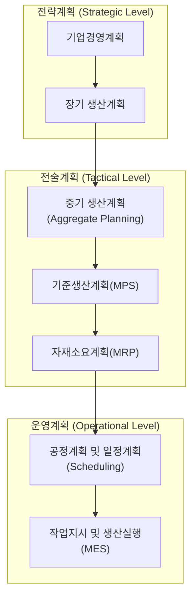

## 생산계획 구조

생산계획 구조(Production Planning Hierachy)는 기업 경영목표를 달성하기 위해 장기적인 생산전략부터 현장 작업지시까지 생산계획을 단계적으로 구체화하는 체계이다. 먼저 장기 생산계획에서는 생산능력과 설비 투자 방향을 결정하고, 총괄생산계획에서는 수요 예측을 방탕으로 생산량과 재고, 인력 운영을 계획한다. 이를 기반으로 기준생산계획에서는 최종 제품 생산일정과 수량을 확정하고 MRP를 통해 필요한 자재 종류와 수량, 발주 시점을 계산한다. 이후 일정계획에서 설비와 작업 순서를 결정하고 MES를 활용하여 작업지시와 생산실행을 관리하다. 즉, 생산계획은 전략적 계획이 점차 구체적인 실행계획으로 전개되는 계층적 구조를 가지며, 이를 통해 생산능력, 자재, 설비, 인력을 효율적으로 운영하고 납기와 생산성을 확보하는 것이 목적이다.

생산계획은 단순히 "얼마를 생산할 것인가"를 결정하는 것이 아니라, "**무엇을, 언제, 얼마나, 어떤 자원으로 생산할 것인가**"를 단계적으로 구체화하는 과정이다.

### 생산계획 구조

공장관리에서 일반적으로 다음과 같은 계층 구조를 사용한다.

