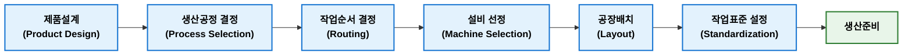

## 공정설계

공정설계(Process Design)는 제품 또는 서비스를 생산하기 위하여 필요한 생산공정(Process)을 설계하고 작업 순서, 생산 방식, 설비, 작업장 배치 및 자원 활용방법을 결정하는 활동이다.  

제품설계(Product Design)가 무엇을 만들 것인가에 대한 활동이라면 공정설계는 어떻게 만들 것인가에 대한 활동이다.

### 공정설계 목적

공정설계 목적은 생산목표(QCD)를 가장 효율적으로 달성할 수 있는 생산시스템을 구축하는 것이다.

**주요 목적**

- 생산성(Productivity) 향상
- 원가(Cost) 절감
- 품질(Quality) 확보
- 납기(Delivery) 준수
- 생산능력(Capacity) 최적화
- 설비 및 인력 효율적 활용

### 공정설계 결정 사항

공정설계에서는 일반적으로 다음 사항을 결정한다.

| 구분                    | 결정 내용                                |
| --------------------- | ------------------------------------ |
| 공정(Process)           | 어떤 공정을 거칠 것인가                        |
| 작업순서(Routing)         | 공정을 어떤 순서로 수행할 것인가                   |
| 생산방식(Process Choice)  | 개별생산, 배치생산, 반복생산, 연속생산 중 무엇을 선택할 것인가 |
| 설비(Machine Selection) | 어떤 설비를 사용할 것인가                       |
| 공장배치(Layout)          | 설비를 어떻게 배치할 것인가                      |
| 작업방법(Method)          | 어떤 작업방법을 사용할 것인가                     |
| 표준시간(Standard Time)   | 작업시간은 얼마인가                           |
| 검사방법(Inspection)      | 품질을 어디서 어떻게 검사할 것인가                  |

### 공정설계 절차

공정설계는 일반적으로 다음과 같은 절차로 진행된다.



### 공정설계 주요 내용

1. **공정선택**(Process Selection)  
   공정선택은 제품 특성과 생산량에 적합한 생산방식을 선택하는 과정이다. Hayes & Wheelwright가 제시한 제품-공정 매트리스(Product-Process Matrix)가 대표적인 이론이다.
      
    | 생산방식             | 특징     | 대표 사례    |
    | ---------------- | ------ | -------- |
    | 프로젝트(Project)    | 소량·고품종 | 조선, 건설   |
    | 개별생산(Job Shop)   | 다품종 소량 | 금형, 특수기계 |
    | 배치생산(Batch)      | 중품종 중량 | 의약품, 식품  |
    | 반복생산(Repetitive) | 소품종 대량 | 자동차 조립   |
    | 연속생산(Continuous) | 대량 연속  | 정유, 제철   |      
3. **작업순서 결정**(Routing)  
   제품이 생산되는 동안 거쳐야 하는 공정 순서와 경로를 결정하는 활동이다. Routing은 공정계획에 있어 핵심 요소이다.     
   ```mermaid
   flowchart LR
    classDef process fill:#E3F2FD,stroke:#1976D2,stroke-width:2px,color:#000,font-weight:bold;
    classDef final fill:#E8F5E9,stroke:#2E7D32,stroke-width:2px,color:#000,font-weight:bold;

    A["원자재"]:::process
    B["절삭"]:::process
    C["열처리"]:::process
    D["연삭"]:::process
    E["검사"]:::process
    F["조립"]:::final

    A --> B
    B --> C
    C --> D
    D --> E
    E --> F
   ```     
4. **설비선정**(Machine Selection)  
   생산량과 제품 특성에 따라 적절한 설비를 선정한다. 생산 능력, 정밀도, 자동화 수준, 경제성, 유지보수성 등을 고려해야 한다.
5. **공장배치**(Layout)  
   공정을 효율적으로 운영하기 위해 설비를 배치한다. 대표적인 배치 방식은 다음과 같다.
      
    | 배치 방식                          | 특징        |
    | ------------------------------ | --------- |
    | 기능별 배치(Process Layout)         | 다품종 소량생산  |
    | 제품별 배치(Product Layout)         | 대량생산      |
    | 셀 배치(Cellular Layout)          | 유사 제품군 생산 |
    | 고정위치 배치(Fixed Position Layout) | 대형 제품 생산  |
7. **작업표준**(Standardization)  
   공정을 표준화하여 품질과 생산성을 확보한다. 작업표준에는 작업방법(Standard Method), 표준시간(Standard Time), 표준작업(Standard Work)과 같은 내용이 있다.

### 관련 이론

1. **제품-공정 메트릭스**(Product-Process Matrix)  
   Haeys & Wheelwright가 제시한 이론으로 제품 다양성(Product variety)과 생산성(Volume)에 따라 적절한 생산공정을 선택해야 한다고 설명했다. 제품 특성과 생산공정이 일치할수록 생산성이 높아진다.  
   
2. **동시공학**(Concurrent Engineering)  
   제품설계와 공정설계를 동시에 수행하여 개발기간 단축, 제조성 향상, 원가절감을 달성하는 기법이다.  
   
3. **DFM**(Design for Manufacturability)
   제조 용이성을 고려하여 제품을 설계하는 기법이다. 제품설계 단계에서 공정설계를 함게 고려하여 생산성을 향상시킨다.


