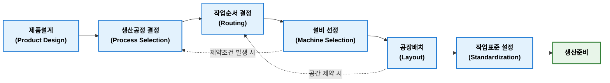

## 공정설계

**공정설계(Process Design)**는 제품 또는 서비스를 생산하기 위하여 필요한 생산공정(Process)을 설계하고 작업 순서, 생산 방식, 설비, 작업장 배치 및 자원 활용방법을 결정하는 활동이다. 제품설계(Product Design)가 무엇을 만들 것인가에 대한 활동이라면 공정설계는 어떻게 만들 것인가에 대한 활동이다.

### 목적

공정설계 목적은 생산목표(QCD)를 가장 효율적으로 달성할 수 있는 생산시스템을 구축하는 것이다.

**주요 목적**

- 생산성(Productivity) 향상
- 원가(Cost) 절감
- 품질(Quality) 확보
- 납기(Delivery) 준수
- 생산능력(Capacity) 최적화
- 설비 및 인력 효율적 활용

### 결정 사항

공정설계에서는 일반적으로 다음 사항을 결정한다.

| 구분                    | 결정 내용                                |
| --------------------- | ------------------------------------ |
| 공정(Process)           | 어떤 공정을 거칠 것인가                        |
| 작업순서(Routing)         | 공정을 어떤 순서로 수행할 것인가                   |
| 생산방식(Process Choice)  | 개별생산, 배치생산, 반복생산, 연속생산 중 무엇을 선택할 것인가 |
| 설비(Machine Selection) | 어떤 설비를 사용할 것인가                       |
| 공장배치(Layout)          | 설비를 어떻게 배치할 것인가                      |
| 작업방법(Method)          | 어떤 작업방법을 사용할 것인가                     |
| 표준시간(Standard Time)   | 작업시간은 얼마인가                           |
| 검사방법(Inspection)      | 품질을 어디서 어떻게 검사할 것인가                  |

### 공정설계 절차

공정설계는 일반적으로 다음과 같은 절차로 진행된다.



**1. 제품설계(Product Design)**

고객의 요구사항과 시장 분석을 바탕으로 제품의 사양, 기능, 외관, 재질 등을 확정하는 단계이다.

* **주요 작업**  
  부품 도면 작성, 3D 모델링, 재질 및 규격 선정, BOM(자원명세서) 초안 작성
* **핵심 결과물**  
  제품 도면, 제품 사양서, 초기 BOM

**2. 생산공정 결정(Process Selection)**

제품을 생산하기 위한 전체적인 가공 방식과 조립 형태를 결정하는 단계이다. 생산 형태(대량 생산, 다품종 소량 생산 등)에 맞는 시스템을 선택한다.

* **주요 작업**  
  가공 및 조립 기술 검토, 연속 생산 / 배치(Batch) 생산 / 셀(Cell) 생산 방식 결정
* **핵심 결과물**  
  공정 계통도, 공정 방식 결정서

**3. 작업순서 결정(Routing)**

원자재가 최종 완제품으로 변환되기까지 거치는 세부 공정의 순서와 경로를 정의하는 단계이다.

* **주요 작업**  
  투입 자재별 가공·조립·검사 순서 체계화, 표준 공정 공수(작업 시간) 산정
* **핵심 결과물**  
  라우팅 공정표, 공정 흐름도(PFD)

**4. 설비 선정(Machine Selection)**

작업순서(Routing)에 따라 각 공정을 수행하는 데 필요한 최적의 기계, 공구, 치공구(Jig), 제어 설비를 선정하는 단계이다.

* **주요 작업**  
  설비 사양 확정, 필요한 설비 수량 산정(소요 공수 기준), CAPEX(초기 투자비) 및 OPEX(운용비) 검토
* **핵심 결과물**  
  설비 도입 사양서, 설비 소요량 산정서

**5. 공장배치(Layout)**

선정된 설비, 작업자 동선, 자재 이동 경로, 창고 공간 등을 공장 건물 내에 최적으로 배치하는 단계이다.

* **주요 작업**  
  자재 흐름 및 물류 동선 분석, 작업 공간 및 이동 통로 확보, 설비 및 레이아웃 도면 작성
* **핵심 결과물**  
  공장 레이아웃 도면(2D/3D CAD), 물류 동선도

**6. 작업표준 설정(Standardization)**

작업자가 안전하고 균일한 품질로 작업을 수행할 수 있도록 세부 작업 방법과 조건, 주기를 표준화하는 단계이다.

* **주요 작업**  
  표준 작업 시간(ST) 측정, 작업 동선 및 가공 조건(온도, 속도 등) 정의, 검사 기준 수립
* **핵심 결과물**  
  표준작업지도서(SOP), QC 공정표, 표준 공수표

**7. 생산준비(Production Readiness)**  

본격적인 양산에 들어가기 전 시운전과 시제품 생산을 통해 문제점을 점검하고 교정하는 최종 단계이다.

* **주요 작업**  
  라인 시운전, 시제품 생산(Pilot Production), 공정 능력 지수($C_p, C_{pk}$) 평가, 작업자 교육
* **핵심 결과물**  
  시제품 검사 보고서, 공정 능력 평가서, 양산 승인서

#### 주요 내용

1. **공정선택**(Process Selection)  
    공정선택은 제품 특성과 생산량에 적합한 생산방식을 선택하는 과정이다. Hayes & Wheelwright가 제시한 [제품-공정 행렬(Product-Process Matrix)](https://yeonkyupark.github.io/pepc3e/0101_competitive_manufacturing_strategy/#-)가 대표적인 이론이다.
      
    | 생산방식             | 특징     | 대표 사례    |
    | ---------------- | ------ | -------- |
    | 프로젝트(Project)    | 소량·고품종 | 조선, 건설   |
    | 개별생산(Job Shop)   | 다품종 소량 | 금형, 특수기계 |
    | 배치생산(Batch)      | 중품종 중량 | 의약품, 식품  |
    | 반복생산(Repetitive) | 소품종 대량 | 자동차 조립   |
    | 연속생산(Continuous) | 대량 연속  | 정유, 제철   |
    
2. **작업순서 결정**(Routing)  
   제품이 생산되는 동안 거쳐야 하는 공정 순서와 경로를 결정하는 활동이다. Routing은 공정계획에 있어 핵심 요소이다.     
   
    ```mermaid
    flowchart LR
    classDef process fill:#E3F2FD,stroke:#1976D2,stroke-width:2px,color:#000,font-weight:bold;
    classDef final fill:#E8F5E9,stroke:#2E7D32,stroke-width:2px,color:#000,font-weight:bold;
    
    A["원자재"]:::process
    B["절삭"]:::process
    C["열처리"]:::process
    D["연삭"]:::process
    E["검사"]:::process
    F["조립"]:::final
    
    A --> B
    B --> C
    C --> D
    D --> E
    E --> F
    ```
   
3. **설비선정**(Machine Selection)  
    생산량과 제품 특성에 따라 적절한 설비를 선정한다. 생산 능력, 정밀도, 자동화 수준, 경제성, 유지보수성 등을 고려해야 한다.  
4. **공장배치**(Layout)  
    공정을 효율적으로 운영하기 위해 설비를 배치한다. 대표적인 배치 방식은 다음과 같다.
   
    | 배치 방식                          | 특징        |
    | ------------------------------ | --------- |
    | 고정위치 배치(Fixed Position Layout) | 대형 제품 생산  |
    | 기능별 배치(Process Layout)         | 다품종 소량생산  |
    | 제품별 배치(Product Layout)         | 대량생산      |
    | 셀 배치(Cellular Layout)          | 유사 제품군 생산 |
   
5. **작업표준**(Standardization)  
    공정을 표준화하여 품질과 생산성을 확보한다. 작업표준에는 작업방법(Standard Method), 표준시간(Standard Time), 표준작업(Standard Work)과 같은 내용이 있다.
