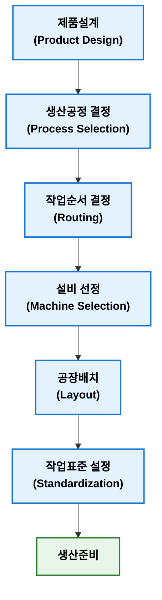

## 공정설계

공정설계(Process Design)는 제품 또는 서비스를 생산하기 위하여 필요한 생산공정(Process)을 설계하고 작업 순서, 생산 방식, 설비, 작업장 배치 및 자원 활용방법을 결정하는 활동이다.  

제품설계(Product Design)가 무엇을 만들 것인가에 대한 활동이라면 공정설계는 어떻게 만들 것인가에 대한 활동이다.

### 공정설계 목적

공정설계 목적은 생산목표(QCD)를 가장 효율적으로 달성할 수 있는 생산시스템을 구축하는 것이다.

**주요 목적**

- 생산성(Productivity) 향상
- 원가(Cost) 절감
- 품질(Quality) 확보
- 납기(Delivery) 준수
- 생산능력(Capacity) 최적화
- 설비 및 인력 효율적 활용

### 공정설계 결정 사항

공정설계에서는 일반적으로 다음 사항을 결정한다.

| 구분                    | 결정 내용                                |
| --------------------- | ------------------------------------ |
| 공정(Process)           | 어떤 공정을 거칠 것인가                        |
| 작업순서(Routing)         | 공정을 어떤 순서로 수행할 것인가                   |
| 생산방식(Process Choice)  | 개별생산, 배치생산, 반복생산, 연속생산 중 무엇을 선택할 것인가 |
| 설비(Machine Selection) | 어떤 설비를 사용할 것인가                       |
| 공장배치(Layout)          | 설비를 어떻게 배치할 것인가                      |
| 작업방법(Method)          | 어떤 작업방법을 사용할 것인가                     |
| 표준시간(Standard Time)   | 작업시간은 얼마인가                           |
| 검사방법(Inspection)      | 품질을 어디서 어떻게 검사할 것인가                  |

### 공정설계 절차

공정설계는 일반적으로 다음과 같은 절차로 진행된다.

