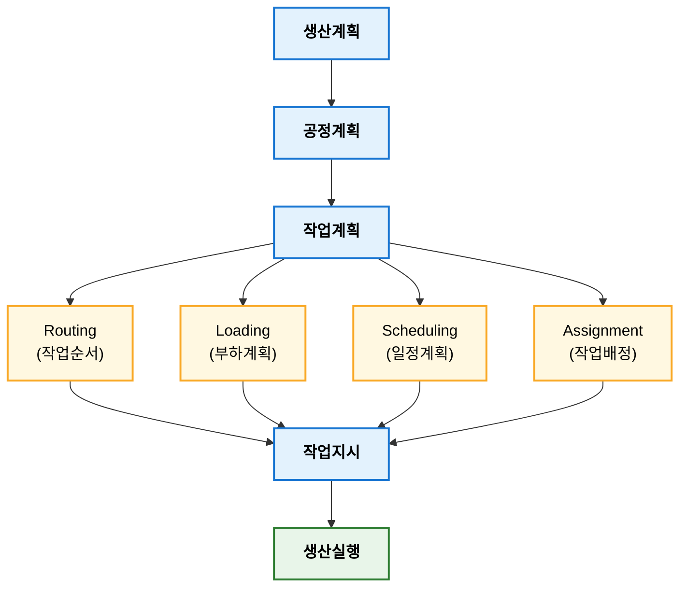

## 작업계획

작업계획(Work Planning)은 생산목표를 달성하기 위한 작업(Job)을 작업자, 설비, 작업순서 및 작업시간에 배정하여 실행 가능한 형태로 구체화하는 계획 활동이다. 주요 내용은 작업순서 결정, 작업 배정, 작업 일정, 작업 지시로 구성되며, 이를 통해 생산계획을 현장에서 실행 가능한 작업 수준으로 전개한다. 작업계획 목적은 작업 표준화와 생산성 향상, 효율적 설비 활용, 납기 준수에 있으며 공정계획이 "어떻게 생산할 것인가"를 결정한다면 작업계획은 "누가, 어디서, 언제 작업할 것인가"를 구체화 하는 역할을 수행한다.

- 생산계획: 무엇을 얼마나 생산할 것인가?
- 공정계획: 어떤 공정을 거쳐 생산할 것인가?
- 작업계획: 누가, 어디서, 언제, 어떤 순서로 작업할 것인가?

### 작업계획 목적

작업계획 목적은 생산계획을 현장에서 실행 가능한 수준으로 구체화하여 생산효율을 높이는 것이다. 

**주요 목적**

- 작업 표준화(Standardization)
- 설비 가동률 향상
- 작업자 생산성 향상
- 공정 간 대기시간 최소화
- 납기 준수
- 작업 부하 균형 유지

### 작업 계획 주요 내용

작업계획 주요 내용은 다음과 같다.

| 구분                     | 주요 내용              |
| ---------------------- | ------------------ |
| 작업순서 결정(Routing)       | 공정을 어떤 순서로 수행할 것인가 |
| 작업시간 결정(Standard Time) | 각 작업의 표준시간 산정      |
| 작업 배정(Assignment)      | 작업자와 설비에 작업 배분     |
| 작업 일정(Scheduling)      | 언제 작업을 수행할 것인가     |
| 작업지시(Dispatching)      | 현장에 작업을 지시         |

### 작업계획 절차

일반적인 작업계획 절차는 다음과 같다.

### 작업계획 구성 요소

1. 작업순서 결정
   제품이 거쳐야 할 공정과 작업순서를 결정하는 활동이다. 작업 흐름 최적화, 물류 이동 최소화, 공정 간 대기시간 감소가 목적이다.
2. 작업 배정
   작업을 설비와 작업자에게 배정하는 활동이다. 작업량이 특정 설비에 집중되지 않도록 부하를 조정한다.
   
    | 설비      | 배정 작업 |
    | ------- | ----- |
    | CNC 1호기 | 제품 A  |
    | CNC 2호기 | 제품 B  |

3. 작업일정
   작업 시작 및 종료 시점과 순서를 결정하는 활동이다. 대표 기법으로 Gantt Chart, PERT/CPM이 있다.

    | 시간          | 작업   |
    | ----------- | ---- |
    | 08:00~10:00 | 제품 A |
    | 10:00~12:00 | 제품 B |

4. 작업지시
   계획된 작업을 작업자에게 실행하도록 지시하는 활동이다. "CNC 2호기에서 오전 9시부터 A제품 300개 가공 실시"가 예이다.

### 주요 기법

**우선순위규칙**(Priority Rules)은 동시에 여러 작업이 대기할 경우 작업순서를 결정하는 규칙이다.

| 기법                             | 내용              | 목적          |
| ------------------------------ | --------------- | ----------- |
| FCFS (First Come First Served) | 먼저 도착한 작업 우선    | 공정성 확보      |
| SPT (Shortest Processing Time) | 가공시간이 짧은 작업 우선  | 평균 흐름시간 최소화 |
| EDD (Earliest Due Date)        | 납기가 가장 빠른 작업 우선 | 납기지연 최소화    |
| CR (Critical Ratio)            | 긴급도가 높은 작업 우선   | 우선순위 동적 관리  |

#### FCFS

FCFS(First Come First Served)는 먼저 도착한 작업을 먼저 처리하는 규칙으로 가장 단순한 작업순서 결정 방법이다.

**평가지표: 평균 흐름시간(Mean Flow Time)**  

$$F_i = C_i - r_i$$

- $F_i$: $i$번째 작업 흐름 시간
- $C_i$: 완료 작업시간(Completion Time)
- $r_i$: 작업 도착시간(Release Time)

평균흐름시간은 다음과 같이 계산하다.

$$
\bar{F} = \frac{\sum{F_i}}{n}
$$

아래와 같이 3개 작업이 도착했다고 가정하고 FCFS를 계산하면 다음과 같다.

| 작업 | 처리시간 |
| -- | ---: |
| A  |  3시간 |
| B  |  5시간 |
| C  |  2시간 |

FCFS 순서: `A → B → C`

작업완료시간은 다음과 같다.

| 작업 | 완료시간 | 흐름시간 |
| -- | ---: | ---: |
| A  |    3 |    3 |
| B  |    8 |    8 |
| C  |   10 |   10 |

위 시간으로 평균 흐름시간을 계산하면 다음과 같다.

$$
\frac{3 + 8 + 10}{3} = 7
$$

#### SPT

STP(Shortest Processing Time)는 처리시간이 짧은 작업부터 수행하는 규칙이다. 이는 평균 흐름시간을 최소화하고 평균 재공픔을 감소하는 것을 목적으로 한다. 평균 흐름시간 최소화에 최적인 규칙으로 알려져 있다.

아래와 같이 작업이 있다고 가정한다.

| 작업 | 처리시간 |
| -- | ---: |
| A  |    3 |
| B  |    5 |
| C  |    2 |

STP 순서: `C → A → B`

완료시간은 다음과 같이 계산된다.

| 작업 | 완료시간 |
| -- | ---: |
| C  |    2 |
| A  |    5 |
| B  |   10 |

평균 흐름시간은 다음과 같다.

$$
\frac{2+5+10}{3} = 5.67
$$

FCFS보다 평균 흐름시간이 감소한 것을 알 수 있다.

#### EDD

EDD(Earliest Due Date)는 납기일(Due date)이 빠른 작업부터 처리하는 규칙이다. 이 기법은 납기 지연을 최소화 하는 것을 목적으로 한다.

**납기지연(Lateness)**

$$L_i = C_i - d_i$$

- $L_i$: 지연시간
- $C_i$: 완료시간
- $d_i$: 납기일

지연시간이 양수이면 납기 초과를 의미한다.

**최대 지연시간**

$$L_{max} = max(L_i)$$

EDD는 최대 지연시간 최소화에 효과적인 규칙이다.

#### CR

CR(Critical Ratio)은 납기 긴급도를 고려하는 동적 우선순위 규칙이다.

$$CR=\frac{납기일까지 남은시간}{잔여작업시간} = \frac{Due Date - 현재시간}{Processing Time}$$

CR 값에 따라 다음과 같이 판단한다.

| CR     | 의미       |
| ------ | -------- |
| CR < 1 | 납기 지연 위험 |
| CR = 1 | 정상       |
| CR > 1 | 여유 있음    |

!!! note "CR"

    다음과 같이 가정한다.

    - 현재: 5일 남음
    - 잔여 작업: 10시간40
    - 하루 8시간 작업 기준: 40시간(5일 * 8시간)

    $$CR = \frac{40}{10} = 4$$

    `CR = 4 > 1`로 여유 있음을 의미한다.

#### 다중 설비 일정계획 기법

단일 설비가 아닌 경우에는 작업이 여러 설비를 거치는 Flwo Shop 또는 Job Shop에서 문제가 된다. 대표적인 방법으로 Jonhson Rule, 헝가리법, 최저고하 모형, 디스패칭 규칙 등이 있다.

1. Johnson Rule(존슨법)

    2대 설비를 거치는 Flow shop에서 전체 작업 완료시간(Makespan)을 최소화하기 위한 최적 일정계획 기법으로 Johnson(1954)이 제안한 알고리즘이다.

    적용조건은 다음과 같다.

    - 작업(Job)은 동일한 순서로 설비를 통과한다.
    - 설비는 2대이다.
    - 모든 작업은 모든 설비를 거친다.

    Johnson Rule 절차는 다음과 같다.

    1. 모든 작업의 M1, M2 처리시간 비교
    2. 가장 작은 처리 시간 선택
    3. 선택시간이 M1에 작업이면 앞쪽에 배치, M2 작업이면 뒤쪽에 배치
    4. 모든 작업 배치가 완료될 때까지 반복
  
!!! note "Johnson Rule"

    | 작업 | M1 | M2 |
    | -- | -: | -: |
    | A  |  3 |  8 |
    | B  |  6 |  4 |
    | C  |  5 |  7 |
    | D  |  8 |  3 |

    **Step1**: 최소값 탐색
    
    - A작업, M1 설비, 따라서 앞쪽에 배치한다. `A . . .`
    - D작업, M2 설비, 따라서 뒤쪽에 배치한다. `A . . D`
    - B작업, M2 설비, 따라서 뒷쪽에 배치한다. `A . B D`    
    - C작업, M1 설비, 따라서 앞쪽에 배치한다. `A C B D`

    **Step2**: 일정 결과

    | 작업 | M1 완료 | M2 완료 |
    | -- | ----: | ----: |
    | A  |     3 |    11 |
    | C  |     8 |    18 |
    | B  |    14 |    22 |
    | D  |    22 |    25 |

    따라서 최종 완료시간(Makespan)은 25시간이다.

    
