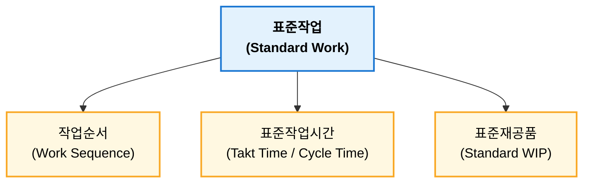
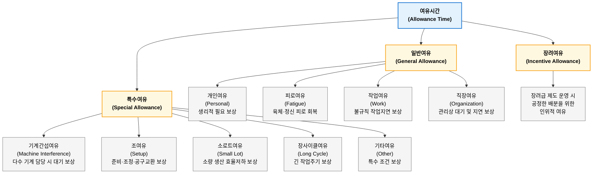
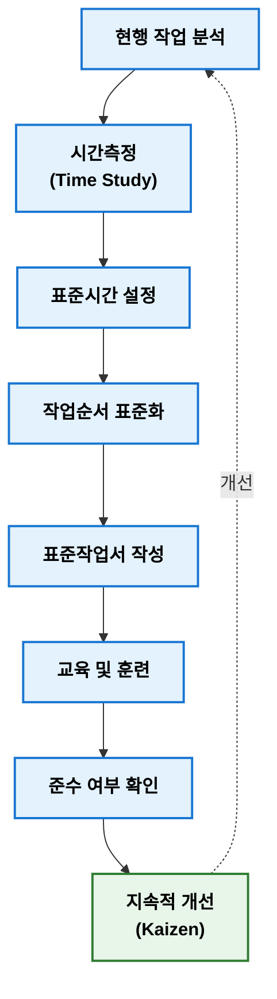
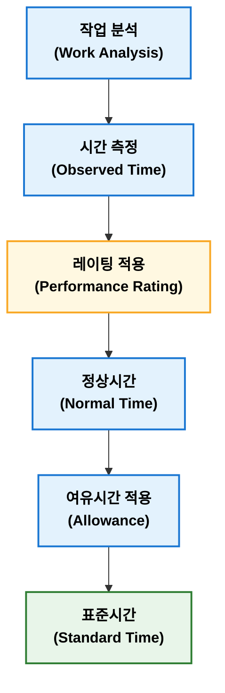
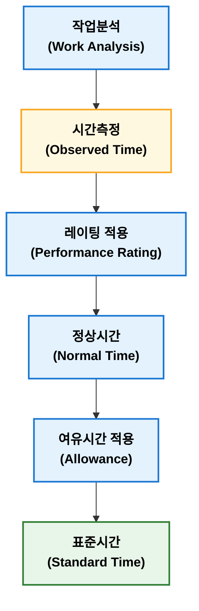
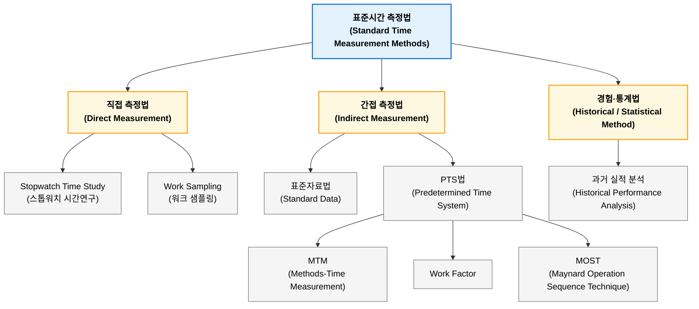

## 표준작업관리

표준작업 관리(Standard Work Management)는 현재 생산조건에서 가장 효율적인 작업방법을 표준화하고 이를 유지, 개설하는 관리 활동이다. 도요타 생산방식에서는 표준작업을 작업순서(Work Sequence), 표준작업시간(Standard Work Time), 표준재공품(Standard Work In Process) 3요소로 구성하며, 이를 통해 품질 균일화, 생산성 향샹 및 작업 편차 감소를 달성한다. 표준작업시간은 산업공학 시간연구(Time Study)를 통해 설정되며, 표준은 교육과 작업표준서를 통해 현장에 적용된다. 또한 표준작업은 개선 기준(Baseline)으로써 Lean 생산과 지속적 개선(Kaizen) 출발점이 되며, 최근에는 MES와 디지털 작업지도서를 활용하여 실시간으로 관리되고 있다.

### 표준작업 관리 목적

표준작업 관리 목적은 생산활동 변동성을 줄여 안정적인 생산체계를 구축하는 것이다.

**주요 목적**

- 품질 균일화
- 작업방법 표준화
- 생산성 향상
- 작업시간 단축
- 작업자 숙려도 차이 최소화
- 안전사고 예방
- 지속적 개선(Kaizen) 기준 제공

중요한 점은 "개선 출발점은 표준화(Standardization)"라는 것이다. 표준이 없으면 개선 효과를 객관적으로 측정할 수 없다.

### 표준작업 3대 요소

도요타 생상방식(TSP)에서는 표준작업을 다음 3가지 요소로 구성한다.

#### 작업순서

작업순서(Work Sequence)는 작업자가 가장 효율적이고 안전하게 수행햐야 하는 작업 순서를 규정하는 것이다.

**고려사항**

- 작업 동선
- 자재 투입 순서
- 검사 순서
- 조립 순서

**예**

모든 작업자가 동일한 순서로 작업해야 품질 편차가 최소화된다.

#### 표준작업시간

표준작업시간(Standard Work Time)은 한 작업을 수행하는 기준시간이다. TSP에서는 일반적으로 다음 용어를 구분한다.

| 구분              | 의미                      |
| --------------- | ----------------------- |
| Takt Time (TT)  | 고객 수요에 맞추기 위해 허용되는 생산시간 |
| Cycle Time (CT) | 실제 1개 생산에 걸리는 시간        |
| Lead Time (LT)  | 투입부터 완료까지 전체 시간         |

**Takt Time**

$$TT = \frac{가용\ 생산시간}{고객\ 요구량}$$

!!! tip "Takt Time"  
    하루 생산 가능한 시간이 480분, 고객 주문이 240개일 때 Takt Time은 다음과 같이 계산할 수 있다.

    $$TT=\frac{480}{240} = 2(분/개)$$

    즉, 2분마다 1개씩 생산해야 고객 수요를 만족하다는 의미이다.

**Cycle Time**

$$CT=\frac{총\ 작업시간}{생산량}$$

!!! tip "Cycle Time"

    총 작업시간이 400분이고 생산량이 200개일 대 CT는 다음과 같이 계살할 수 있다.

    $$CT=\frac{400}{200} = 2(분/개)$$

CT와 LT로 다음과 같은 판단을 할 수 있다.

- CT < TT: 생산능력 여유
- CT = TT: 균형
- CT > TT: 생산능력 부족    

#### 표준재공품

표준재공품(Standard Work in Process)은 공정이 중단 없이 흐르기 위해 반드시 필요한 최소 재공품(WIP) 수량이다. TPS에서는 필요 이상 재고는 낭비(Muda)로 간주한다. 예를 들어 공정 A와 B 사이 최소 2개만 있어도 생산이 가능하다면 표준재공품은 2개가 된다.

### 표준작업 관리 구성

일반적으로 다음 항목을 관리한다.

| 관리 항목                      | 주요 내용       |
| -------------------------- | ----------- |
| 표준작업서(Standard Work Sheet) | 작업순서와 기준 문서 |
| 작업표준서(SOP)                 | 작업방법 및 품질기준 |
| 표준시간(Standard Time)        | 기준 작업시간     |
| 표준재공품                      | 최소 WIP      |
| 표준공정                       | 공정조건        |

### 표준시간

표준시간(Standard Time)은 산업공학(Industrial Engineering)에서 핵심 개념이다. 표준시간은 

- 표준작업환경에서
- 표준작업방법으로
- 숙련된 작업자가
- 보통의 노력으로
- 성실하게 작업을 실시하는데

필요한 시간을 말한다.

일반식은 다음과 같다.

$$ST = NT \times (1 + A)$$

여기서

- ST: Standard Time(표준시간)
- NT: Normal Time(정미시간)
- A: Allowance(여유율)

Normal Time은 다음과 같이 계산된다.

$$NT = OT \times PR$$

- OT: Observed Time
- PR: Performance Rating

!!! tip "표준시간"  
    실측시간이 50초이고 작업 평가 110%, 여유율을 15%로 가정했을 때 NT, ST는 다음과 같이 계산할 수 있다.

    - $NT = 50 \times 1.1 = 55(초)$
    - $ST = 55 \times (1 + 0.15) = 63.25(초)$

#### 여유시간

ILO(International Labour Organization)는 Allowance를 다음과 같이 정의한다.

> 정상적인 작업 수행 과정에서 피할 수 없는 지연과 피로를 보상하기 위해 추가하는 시간

즉, 게으름을 허용하는 시간이 아니라 정상적인 작업을 지속하기 위해 반드시 필요한 시간이다.

#### 여유율

여유율(Allowance Rate)은 정상적인 작업을 수행하는 과정에서 발생하는 개인적 필요, 피로 회복, 불가피한 지연 등을 보상하기 위해 정상시간에 추가하는 시간 비율이다.

$$A = P + F + D$$

- A: 총 여유율(Allowance Rate)
- P: 개인 여유(Personal Allowance)
- F: 피로 여유(Fatigue Allowance)
- D: 지연 여유(Delay Allowance)

**내경법(Inside Allowance Method)**

여유시간을 표준시간 일부로 보고 표준시간 중에서 여유시간이 차지하는 비율로 계산하는 방식이다. 즉, 전체 표준시간 안에서 여유가 차지하는 비율을 의미한다.

$$A_i = \frac{ST-NT}{ST}$$

$$ST = \frac{NT}{1-A_i}$$

!!! tip "내경법"
    정상시간이 85분, 여유율이 15%일 때 표준시간은 다음과 같이 계산된다.

    $$ST = \frac{NT}{1-A_i} = \frac{85}{1-0.15} = 100(분)$$

**외경법(Outside Allowance Method)**

여유시간을 정상시간에 추가되는 시간으로 보고, 정상시간 대비 증가 비율로 계산하는 방식이다. 즉, "작업시간에 몇 %를 더할 것인가"라는 개념이다.

$$A_0 = \frac{ST-NT}{NT}$$

$$ST = NT(1 + A_0)$$

!!! tip "외경법"  
    정상시간 85분, 여유율이 15%일 때 표준시간은 다음과 같이 계산된다.

    $$ST = NT(1 + A_0) = 85(1 + 0.15) = 97.75(분)$$

정상시간과 여유율이 같다고 하더라도 여유율 계산 방식에 따라 표준시간은 다르게 계산된다. 이는 내경법은 표준시간을 기준으로, 외경법은 정상시간을 기준으로 여유율 계산하기 때문이다.

내경법과 외경법을 비교하면 다음과 같다.

| 구분    | 내경법                 | 외경법                |
| ----- | ------------------- | ------------------ |
| 영문    | Inside Allowance    | Outside Allowance  |
| 기준    | 표준시간(ST)            | 정상시간(NT)           |
| 의미    | 표준시간 중 여유 비율        | 정상시간에 추가하는 비율      |
| 공식    | $ST=\frac{NT}{1-A}$ | $ST=NT(1+A)$       |
| 특징    | 여유율이 작게 표시됨         | 여유율이 크게 표시됨        |
| 사용 분야 | REFA, 일부 산업공학 체계    | 일반 생산관리 교재에서 많이 사용 |

### 표준작업 관리 절차

!!! note "표준작업 vs. 작업표준"  

    | 구분 | 표준작업(Standard Work) | 작업표준(Standard Operating Procedure) |
    | -- | ------------------- | ---------------------------------- |
    | 목적 | 생산성 향상              | 품질 및 안전 확보                         |
    | 내용 | 작업순서, 시간, WIP       | 작업방법, 품질기준, 안전기준                   |
    | 중심 | 생산운영(TPS)           | 품질관리(QMS)                          |

    - 표준**작업**(Standard Work)은 생산 흐름 전체를 최적화하기 위한 **운영 기준**이다.
    - 작업**표준**(SOP)은 작업방법을 규정하는 **문서**이다.

### 표준작업 관련 기법

| IE 기법                    | 활용         |
| ------------------------ | ---------- |
| 시간연구(Time Study)         | 표준시간 설정    |
| 동작연구(Motion Study)       | 불필요한 동작 제거 |
| 작업분석(Operation Analysis) | 작업순서 개선    |
| 라인밸런싱(Line Balancing)    | 공정 균형화     |

## 레이팅 기법

레이팅(Rating) 또는 평정(Performace Rate)은 시간연구(Time Study)에서 작업자가 수행한 실제 작업속도를 관찰하여 기준 작업속도에 대비한 작업수행 수준을 평가하는 기법이다. 즉, 작업자가 측정된 시간대로 작업했더라도 그 작업자의 숙련도나 작업 속도가 기준보다 빠르거나 느릴 수 있으므로 이를 보정하여 정상시간(Normal Time)을 산출하기 위한 과정이다.

### 레이팅 목적

스톱워치로 측정한 시간(Observed Time)은 작업자 능률에 영향을 받는다. 예를 들어 동일한 조립 작업이라도 숙련자는 빠르게 수행할 수 있지만 신규 작업자는 느리게 수행할 수도 있다. 따라서 관측시간을 그대로 표준시간으로 사용하면 객관적인 작업시간 산정이 어렵다.

**레이팅 목적**

- 작업자 속도 차이 보정
- 객관적인 정상시간 산출
- 표준시간 설정에 대한 정확성 확보

### 레이팅 계산식

**정상시간(Normal Time)**

$$NT = OT \times R$$ 

또는

$$NT = OT \times \frac{PR}{100}$$

여기서, 

| 기호 | 의미                      |
| -- | ----------------------- |
| NT | Normal Time(정상시간)       |
| OT | Observed Time(관측시간)     |
| R  | Rating Factor(레이팅 계수)   |
| PR | Performance Rating(평정률) |

!!! tip "정상시간(Normal Time)"  

    측정 시간이 50초이고 작업자 속도 평가가 120%일 때, 정상시간(NT)는 다음과 같이 계산된다.

    $$NT = OT \times \frac{PR}{100} = 50 \times 1.2 = 60(초)$$

    즉, 작업자가 기준보다 20% 빠르게 작업했으므로 정상속도 기준 시간은 60초가 된다.

### 레이팅 기준

정상 작업 속도(100%), 100% Rating이란 숙련된 작업자가 무리하지 않고 일정한 노력으로 작업을 수행하는 표준적인 작업 속도를 의미한다. 이 기준은 회사 또는 산업공학 전문가(IE Engineer)가 작업 분석과 표준 자료를 기반으로 설정한다.

| 레이팅  | 의미       |
| ---- | -------- |
| 100% | 정상 속도    |
| 80%  | 느린 작업    |
| 120% | 빠른 작업    |
| 140% | 매우 빠른 작업 |

### 주요 레이팅 기법

대표적인 레이팅 기법은 다음과 같다.

1. 스피드 레이팅법
2. 웨스팅하우스 시스템
3. 객관적 레이팅
4. 합성 레이팅

| 구분               | 특징        | 장점       | 단점       |
| ---------------- | --------- | -------- | -------- |
| Speed Rating     | 속도만 평가    | 간단       | 주관성 높음   |
| Westinghouse     | 4요소 평가    | 객관성 향상   | 평가 복잡    |
| Objective Rating | 속도+난이도 반영 | 작업 차이 반영 | 계산 필요    |
| Synthetic Rating | 표준자료 활용   | 객관성 높음   | 자료 구축 필요 |

#### 스피드 레이팅법

스피드 레이팅법(Speed Rating)은 가장 전통적인 방법으로 **작업자 작업 속도를 기준으로 기준 작업자 속도와 비교하여 평정률 하나로 평가**하는 방법이다.

**평가요소**

- 작업 속도
- 움직임 빠르기
- 작업 리듬

간단하고 현장 적용이 용이하다는 장점이 있으나 관찰자 주관이 개입될 수 있다는 단점이 있다.

!!! tip "스피드 레이팅법"  
    기준 작업자 100%, 관찰 작업자 110%로 평가한 경우 NT은 다음과 같이 계산된다.

    $$NT = OT \times 1.1$$

#### 웨스팅하우스법

웨스팅하우스법(Westinghouse Rating)은 Lowry, Maynard, Stegemerten이 개발한 방법으로 작업자 능률을 여러 요소(**숙련도, 노력, 작업조건, 일관성**)로 나누어 평가하는 방식이다.

**평가요소**

| 요소               | 내용         |
| ---------------- | ---------- |
| Skill(숙련도)       | 작업 기술 수준   |
| Effort(노력)       | 작업 의욕 및 속도 |
| Condition(작업조건)  | 환경 조건      |
| Consistency(일관성) | 작업 속도의 안정성 |

**평가식**

$$Performance = Skill + Effort + Conditions + Consistency$$

기본 평정이 100%인 경우 각 보정값을 적용하여 아래와 같이 계산한다.

$$R = 1 + \sum{Adjustment}$$

!!! tip "웨스팅하우스법"  

    | 항목  |    보정 |
    | --- | ----: |
    | 숙련도 | +0.10 |
    | 노력  | +0.05 |
    | 조건  | -0.02 |
    | 일관성 | +0.03 |

    - 총 보정: $0.10 + 0.05 - 0.02 + 0.03 = 0.16$
      $R = 1 + 0.16 = 1.16$
      
    따라서 레이팅은 116%로 계산된다.

#### 객관적 레이팅

객관적 레이팅(Objective Rating)은 Mundel이 제안한 방법으로 작업 속도뿐만 아니라 **작업 난이도를 함게 고려**하는 방법이다.

**평가식**

$$R = S \times D$$

- S: Speed Rating
- D: Difficulty Factor

!!! tip "객관적 레이팅"  
    속도 평가 110%, 난이도 보정 105%일 때 레이팅은 다음과 같이 계산된다.

    - $R = 1.10 \times 1.05 = 1.155$

    따라서 레이팅은 115.5%로 계산된다.

#### 합성 레이팅

합성 레이팅(Synthetic Rating)은 실제 작업 속도를 평가자가 판단하는 것이 아니라, **기존 표준시간이나 동작시간 자료(PMT)를 이용하여 레이팅 하는 방법**이다. 대표적인 기법으로 MTM(Method Time Measurement), Work Factor, MODAPTS 등이 있다.

**평가식**

$$R = \frac{P_t}{T_0}$$

- $P_t$: 표준 동작시간
- $T_0$: 실제 관측시간

!!! tip "합성 레이팅"  

    표준 동작시간이 40초, 관측 시간이 50초일 때 R은 다음과 같이 계산된다.

    - $$R = \frac{40}{50} 0 =.8$$

    즉, 80% 수준으로 작업한 것으로 판단한다.

### 레이팅과 표준시간 계산

!!! tip "표준시간 계산"  

    **조건**

    - 관측시간: 80초
    - 레이팅: 120%
    - 여유율: 15%(외경법)

    **정상시간(NT)**

    $$NT = 80 \times 1.2 = 96(초)$$

    **표준시간(ST)**

    $$ST = 96(1 + 0.15) = 110.4(초)$$

    따라서 이 작업 표준시간은 110.4초로 계산된다.

## 표준시간 측정 방법

표준시간은 표준 작업방법으로 숙련 작업자가 정상적인 작업속도에서 작업을 수행하고 여유시간을 포함하여 산출한 기준시간이다. 표준시간 측정 방법은 직접 측정법, 간접 측정법, 경험 및 통계법으로 구분하며, 대표적으로 스톱워치법, 워크 샘플링법, 표준자료법, PTS법이 있다. 스톱워치법은 작업시간을 직접 측정한 후 레이팅을 적용하여 정상시간을 산출하고, 개인여유, 피로여유, 지연여유를 반영하여 표준시간을 결정한다. 최근에는 MTM, MOST 등 PTS법과 MES 기반 실적 데이터를 활용하여 표준시간 객관성과 유지관리를 강화하고 있다.

표준시간은 다음 목적으로 활용된다.

- 생산능력 산정(Capacity Planning)
- 작업자 및 설비 부하 계산
- 생산계획 수립
- 원가 산정
- 생산성 평간
- 라인 밸러싱(Line Balancing)

표준시간 산정 구조는 다음과 같다.

### 대표적인 표준시간 측정 방법

| 방법                   | 측정 방식     | 적용 대상  | 특징     |
| -------------------- | --------- | ------ | ------ |
| Stopwatch Time Study | 직접 측정     | 반복 작업  | 가장 일반적 |
| Work Sampling        | 간헐 관찰     | 비반복 작업 | 비율 분석  |
| Standard Data        | 기존 데이터 조합 | 반복 생산  | 효율적    |
| PTS(MTM,MOST)        | 동작 분석     | 수작업    | 높은 객관성 |
| 통계법                  | 실적 분석     | 대량 생산  | 간편     |

#### 스톱워치법

스톱워치법(Stopwatch time study)은 가장 전통적인 표준시간 측정 방법으로, 작업을 직접 관찰하고 스톱워치로 작업시간을 측정한 후 레이팅과 여유를 적용하여 표준시간을 산정하는 방법이다.

**측정 절차**

1. 작업 분해  
   작업을 요소작업으로 분해한다. 예를 들어 조립 작업을 "부품 취출 → 부품 조립 → 나사 체결 → 검사" 등으로 나눈다.
2. 반복 측정  
   동일한 작업을 여러 회 측정한다.  
   
    | 회차 |    시간 |
    | -- | ----: |
    | 1  |   52초 |
    | 2  |   50초 |
    | 3  |   51초 |
    | 4  |   49초 |
    | 평균 | 50.5초 |

3. 평균 관측시간 산출  
   $OT = \frac{\sum{t_i}}{n}$$
4. 레이팅 적용  
   관측시간 50초, 레이팅 110% 적용시 $NT = 50 \times 1.1 = 55(초)$로 계산된다.
5. 여유시간 적용  
   여유율을 15%로 산정, 외경법을 적용하면 $ST = 55(1 + 0.15) = 63.25(초)$로 계산된다.

실제 작업 반영이 가능하고 현장 적용이 용이하다. 그리고 다양한 작업에서 사용 가능하다는 장점이 있다.  
반면 관찰자 주관이 개입되고 측정 시간이 많이 소요될 수 있다. 그리고 작업자가 의식적으로 행동에 변화를 줄 수도 있다는 단점이 있다.

#### 워크 샘플링법

워크 샘플링법(Work Sampling)은 작업자를 계속 측정하지 않고 무작위 관찰을 통해 작업시간 비율을 추정하는 방법이다. 주로 비반복 작업이나 간접 작업에 사용한다.

예로, 작업을 100회 무작위로 관찰했을 때 아래와 같이 측정되었다고 가정한다.

| 상태   |  횟수 |
| ---- | --: |
| 작업 중 | 85회 |
| 대기   | 15회 |

이때 작업 비율을 계산하면 다음과 같다.

$$P = \frac{85}{100} = 85%$$

이 방법은 작업자 가동률을 분석하거나 비부가가치 시간을 분석 또는 간접작업을 분석할 때 주로 활용된다.

#### 표준자료법

표준자료법(Standard Data)은 과거 측정한 작업 요소 시간을 데이터베이스화하여 새로운 작업 표준시간을 조합하는 방법이다.

작업 A가 다음과 같이 데이터베이스화되어 있다고 가정하자.

- 부품 가져오기 = 5초
- 위치 맞춤 = 8초
- 체결 = 12초
- 검사 = 5초

이 경우 표준시간은 다음과 같이 계산된다.

$5 + 8 + 12 + 5 = 30(초)$

측정시간을 단축하고 객관성이 향상되는 장점이 있으며 반복 작업에 효과적이다.

#### PTS법

PTS법(Pre-determined Time Study)은 작업을 기본 동작(Motion)으로 분해하고 각 동작에 미리 정해진 시간을 부여하여 표준시간을 산정하는 방법이다.

대표 방법은 다음과 같다.

- MTM(Method Time Measurement)
- Work Factor
- MOST(Maynard Operation Sequence Techinque)

손동작이 다음과 같다고 가정한다.

- Reach(손 뻗기)
- Move(이동)
- Graps(잡기)
- Position(위치맞춤)

그럼 손동작에 대한 표준시간은 다음과 같이 계산된다.

$$ST = t_1 + t_2 + t_3 + t_4$$

레이팅이 불필요하고, 작업 시작 전 표준시간 산정이 가능하며, 설계 단계에 적용이 가능하다.

#### 경험·통계법

경험·통계법은 과거 생산실적 데이터를 이용하여 표준시간을 추정하는 방법이다.

예로, 과거 1,000개 생산 데이터를 분석한 평균 58초/개를 표준시간 후로로 사용한다.

작업방법 변화 반영이 어렵고 이상 데이터에 영향을 많이 받게 되는 단점이 있다.

