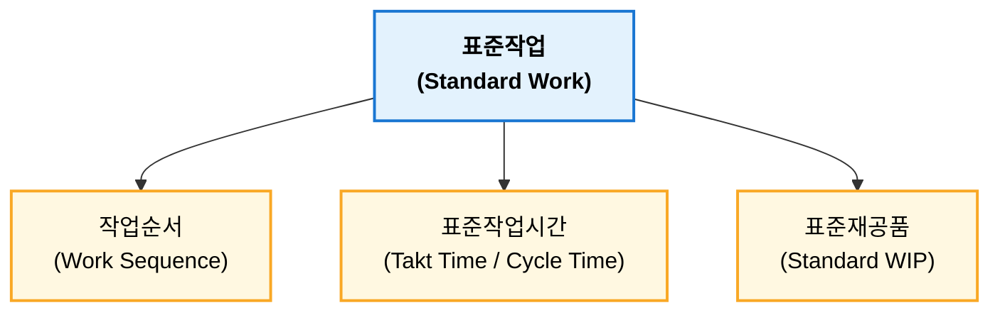
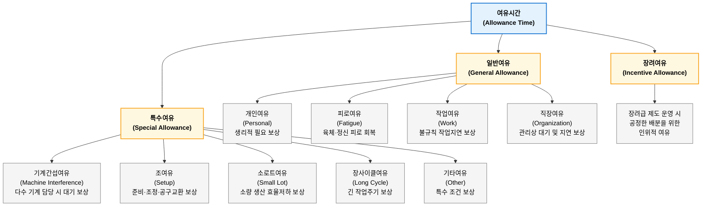
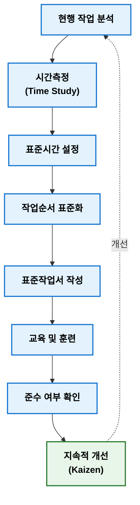

## 표준작업관리

표준작업 관리(Standard Work Management)는 현재 생산조건에서 가장 효율적인 작업방법을 표준화하고 이를 유지, 개설하는 관리 활동이다. 도요타 생산방식에서는 표준작업을 작업순서(Work Sequence), 표준작업시간(Standard Work Time), 표준재공품(Standard Work In Process) 3요소로 구성하며, 이를 통해 품질 균일화, 생산성 향샹 및 작업 편차 감소를 달성한다. 표준작업시간은 산업공학 시간연구(Time Study)를 통해 설정되며, 표준은 교육과 작업표준서를 통해 현장에 적용된다. 또한 표준작업은 개선 기준(Baseline)으로써 Lean 생산과 지속적 개선(Kaizen) 출발점이 되며, 최근에는 MES와 디지털 작업지도서를 활용하여 실시간으로 관리되고 있다.

### 표준작업 관리 목적

표준작업 관리 목적은 생산활동 변동성을 줄여 안정적인 생산체계를 구축하는 것이다.

**주요 목적**

- 품질 균일화
- 작업방법 표준화
- 생산성 향상
- 작업시간 단축
- 작업자 숙려도 차이 최소화
- 안전사고 예방
- 지속적 개선(Kaizen) 기준 제공

중요한 점은 "개선 출발점은 표준화(Standardization)"라는 것이다. 표준이 없으면 개선 효과를 객관적으로 측정할 수 없다.

### 표준작업 3대 요소

도요타 생상방식(TSP)에서는 표준작업을 다음 3가지 요소로 구성한다.

#### 작업순서

작업순서(Work Sequence)는 작업자가 가장 효율적이고 안전하게 수행햐야 하는 작업 순서를 규정하는 것이다.

**고려사항**

- 작업 동선
- 자재 투입 순서
- 검사 순서
- 조립 순서

**예**

모든 작업자가 동일한 순서로 작업해야 품질 편차가 최소화된다.

#### 표준작업시간

표준작업시간(Standard Work Time)은 한 작업을 수행하는 기준시간이다. TSP에서는 일반적으로 다음 용어를 구분한다.

| 구분              | 의미                      |
| --------------- | ----------------------- |
| Takt Time (TT)  | 고객 수요에 맞추기 위해 허용되는 생산시간 |
| Cycle Time (CT) | 실제 1개 생산에 걸리는 시간        |
| Lead Time (LT)  | 투입부터 완료까지 전체 시간         |

**Takt Time**

$$TT = \frac{가용\ 생산시간}{고객\ 요구량}$$

!!! tip "Takt Time"  
    하루 생산 가능한 시간이 480분, 고객 주문이 240개일 때 Takt Time은 다음과 같이 계산할 수 있다.

    $$TT=\frac{480}{240} = 2(분/개)$$

    즉, 2분마다 1개씩 생산해야 고객 수요를 만족하다는 의미이다.

**Cycle Time**

$$CT=\frac{총\ 작업시간}{생산량}$$

!!! tip "Cycle Time"

    총 작업시간이 400분이고 생산량이 200개일 대 CT는 다음과 같이 계살할 수 있다.

    $$CT=\frac{400}{200} = 2(분/개)$$

CT와 LT로 다음과 같은 판단을 할 수 있다.

- CT < TT: 생산능력 여유
- CT = TT: 균형
- CT > TT: 생산능력 부족    

#### 표준재공품

표준재공품(Standard Work in Process)은 공정이 중단 없이 흐르기 위해 반드시 필요한 최소 재공품(WIP) 수량이다. TPS에서는 필요 이상 재고는 낭비(Muda)로 간주한다. 예를 들어 공정 A와 B 사이 최소 2개만 있어도 생산이 가능하다면 표준재공품은 2개가 된다.

### 표준작업 관리 구성

일반적으로 다음 항목을 관리한다.

| 관리 항목                      | 주요 내용       |
| -------------------------- | ----------- |
| 표준작업서(Standard Work Sheet) | 작업순서와 기준 문서 |
| 작업표준서(SOP)                 | 작업방법 및 품질기준 |
| 표준시간(Standard Time)        | 기준 작업시간     |
| 표준재공품                      | 최소 WIP      |
| 표준공정                       | 공정조건        |

### 표준시간

표준시간(Standard Time)은 산업공학(Industrial Engineering)에서 핵심 개념이다. 일반식은 다음과 같다.

$$ST = NT \times (1 + A)$$

여기서

- ST: Standard Time(표준시간)
- NT: Normal Time(정미시간)
- A: Allowance(여유율)

Normal Time은 다음과 같이 계산된다.

$$NT = OT \times PR$$

- OT: Observed Time
- PR: Performance Rating

!!! tip "표준시간"  
    실측시간이 50초이고 작업 평가 110%, 여유율을 15%로 가정했을 때 NT, ST는 다음과 같이 계산할 수 있다.

    - $NT = 50 \times 1.1 = 55(초)$
    - $ST = 55 \times (1 + 0.15) = 63.25(초)$

#### 여유시간

ILO(International Labour Organization)는 Allowance를 다음과 같이 정의한다.

> 정상적인 작업 수행 과정에서 피할 수 없는 지연과 피로를 보상하기 위해 추가하는 시간

즉, 게으름을 허용하는 시간이 아니라 정상적인 작업을 지속하기 위해 반드시 필요한 시간이다.

#### 여유율

여유율(Allowance Rate)은 정상적인 작업을 수행하는 과정에서 발생하는 개인적 필요, 피로 회복, 불가피한 지연 등을 보상하기 위해 정상시간에 추가하는 시간 비율이다.

$$A = P + F + D$$

- A: 총 여유율(Allowance Rate)
- P: 개인 여유(Personal Allowance)
- F: 피로 여유(Fatigue Allowance)
- D: 지연 여유(Delay Allowance)

**내경법(Inside Allowance Method)**

여유시간을 표준시간 일부로 보고 표준시간 중에서 여유시간이 차지하는 비율로 계산하는 방식이다. 즉, 전체 표준시간 안에서 여유가 차지하는 비율을 의미한다.

$$A_i = \frac{ST-NT}{ST}$$

$$ST = \frac{NT}{1-A_i}$$

!!! tip "내경법"
    정상시간이 85분, 여유율이 15%일 때 표준시간은 다음과 같이 계산된다.

    $$ST = \frac{NT}{1-A_i} = \frac{85}{1-0.15} = 100(분)$$

**외경법(Outside Allowance Method)**

여유시간을 정상시간에 추가되는 시간으로 보고, 정상시간 대비 증가 비율로 계산하는 방식이다. 즉, "작업시간에 몇 %를 더할 것인가"라는 개념이다.

$$A_0 = \frac{ST-NT}{NT}$$

$$ST = NT(1 + A_0)$$

!!! tip "외경법"  
    정상시간 85분, 여유율이 15%일 때 표준시간은 다음과 같이 계산된다.

    $$ST = NT(1 + A_0) = 85(1 + 0.15) = 97.75(분)$$

정상시간과 여유율이 같다고 하더라도 여유율 계산 방식에 따라 표준시간은 다르게 계산된다. 이는 내경법은 표준시간을 기준으로, 외경법은 정상시간을 기준으로 여유율 계산하기 때문이다.

내경법과 외경법을 비교하면 다음과 같다.

| 구분    | 내경법                 | 외경법                |
| ----- | ------------------- | ------------------ |
| 영문    | Inside Allowance    | Outside Allowance  |
| 기준    | 표준시간(ST)            | 정상시간(NT)           |
| 의미    | 표준시간 중 여유 비율        | 정상시간에 추가하는 비율      |
| 공식    | $ST=\frac{NT}{1-A}$ | $ST=NT(1+A)$       |
| 특징    | 여유율이 작게 표시됨         | 여유율이 크게 표시됨        |
| 사용 분야 | REFA, 일부 산업공학 체계    | 일반 생산관리 교재에서 많이 사용 |

### 표준작업 관리 절차

!!! note "표준작업 vs. 작업표준"  

    | 구분 | 표준작업(Standard Work) | 작업표준(Standard Operating Procedure) |
    | -- | ------------------- | ---------------------------------- |
    | 목적 | 생산성 향상              | 품질 및 안전 확보                         |
    | 내용 | 작업순서, 시간, WIP       | 작업방법, 품질기준, 안전기준                   |
    | 중심 | 생산운영(TPS)           | 품질관리(QMS)                          |

    - 표준**작업**(Standard Work)은 생산 흐름 전체를 최적화하기 위한 **운영 기준**이다.
    - 작업**표준**(SOP)은 작업방법을 규정하는 **문서**이다.

### 표준작업 관련 기법

| IE 기법                    | 활용         |
| ------------------------ | ---------- |
| 시간연구(Time Study)         | 표준시간 설정    |
| 동작연구(Motion Study)       | 불필요한 동작 제거 |
| 작업분석(Operation Analysis) | 작업순서 개선    |
| 라인밸런싱(Line Balancing)    | 공정 균형화     |

## 레이팅 기법

