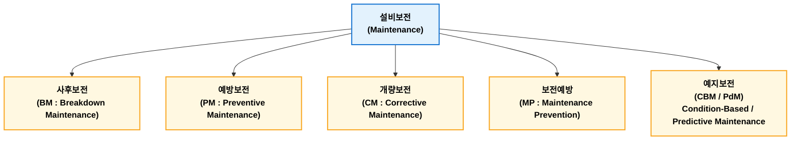
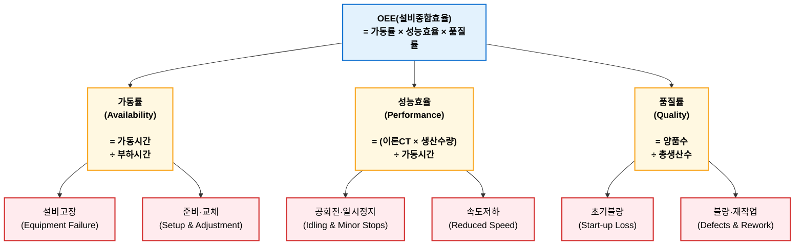
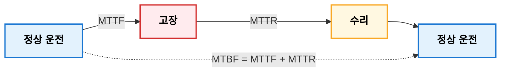

## 설비보전 관리

**설비보전관리(Maintenance)**는 설비가 요구하는 기능을 지속적으로 수행하도록 유지하거나 고장 후 기능을 복원하기 위한 계획적 관리활동이다. 주요 목적은 설비 신뢰성, 가용성, 안전성 및 경제성을 확보하여 생산성을 향상시키는데 있다. 보전 방식은 사후보전, 예방보전, 개량보전, 보전예방, 예지보전으로 구분되며, 최근에는 IoT와 AI를 활용한 상태기반보전과 예지보전이 확대되고 있다. 또한 TPM에서는 전원참여를 통해 설비종합효율(OEE)을 극대화하고 고장 Zero, 불량 Zero, 재해 Zero를 목표로 지속적인 설비 개선을 추진한다.

**ISO 14224 Maintenance 정의**

> "An action intended to retain an item in, or restore it to, a state in which it can perform its required function."  
> 설비가 요구되는 기능을 수행할 수 있는 상태를 유지하거나 복원하기 위한 모든 기술적·관리적 활동

### 설비보전 관리 목적

설비보전에 있어 궁극적인 목적은 **설비 생애주기(Life cycle) 동안 생산능력을 안정적으로 유지하면서 최소 비용으로 운영**하는 것이다.

**주요 목적**

| 목적        | 설명               |
| --------- | ---------------- |
| 설비 가동률 향상 | 고장시간 최소화         |
| 생산성 향상    | 생산 중단 감소         |
| 품질 확보     | 설비 이상으로 인한 불량 감소 |
| 안전 확보     | 설비 사고 예방         |
| 보전비 절감    | 최적의 유지보수 비용 달성   |
| 설비 수명 연장  | 설비 자산의 가치 유지     |

### 설비보전 기본 개념

설비보전은 다음과 같이 두 가지 활동으로 구분된다.

1. **유지(Maintain)**
    - 성능 유지, 고장나지 않도록 예방하는 활동
3. **복원(Restore)**
    - 고장 후 기능 회복, 고장 발생 시 신속히 복구하는 활동

### 설비보전 분류

#### 사후보전

**사후보전(BM : Breakdown Maintenance)**은 고장이 발생한 후 수리하느 방식이다. 초기 보전비용이 적고 관리가 단순하다는 장점이 있다. 반면 생산중단이 발생이나 납기 지연, 긴급수리 비용 증가 등 단점도 있다. 즈로 전등, 소형 팬, 저가 소모품 등에 적용한다.

#### 예방보전

**예방보전(PM : Preventive Maintenance)**은 고장이 발생하기 전에 계획적으로 점검 및 교체하는 방식이다. 대표적인 기법으로 Time-Based Maintenance(TBM)이 있다. 고장 예방, 계획정비 가능한 장점이 있지만 아직 사용할 수 있는 부품도 교체될 수 있고 과잉보전할 가능성이 존재한다.

#### 개량보전

**개량보전(CM : Corrective Maintenance)**은 고장이 반복되는 설비를 근본적으로 개선하는 활동이다. 예로 기존 체인 구동에 주기적인 문제가 발생하여 벨트 구동으로 변경하여 고장 감소 활동을 들 수 있다. 단순 수리가 아니라 설비 자체를 개선하는 활동이다.

#### 보전예방

**보전예방(MP : Maintenance Prevention)**은 설비를 설계·도입하는 단계부터 유지보수가 쉽도록 설계하는 활동이다. 예로 윤활 위치 외부 설치, 모듈화 설계, 점검 공간 확보 등을 들 수 있다.

#### 예지보전

**예지보전(PdM : Predictive Maintenance)**은 설비 상태를 실시간으로 모니터링하여 고장을 예측하고 필요한 시점에 보전하는 방식이다. 상태기준보전(CBM, Condition-Based Maintenance)가 대표적인 형태이다.

**활용 기술**

- 진동 분석
- 열화상
- 오일 분석
- 전류 분석
- AI 기반 이상 진단

불필요한 정비 감소 및 계획 외 정지 최소화 등 장점이 있으나 초기 투자 비용와 센서 및 분석 시스템이 필요하다는 단점이 있다.

### TPM

**TPM(Total Productive Maintenance)**은 다음과 같이 정의한다. (Nakajima, 1998)

> 설비 종합효율을 극대화하기 위해 전원이 참여하는 생산보전 활동

핵심 특징은 "**보전부서만의 활동이 아니라 전원이 참여한다**"는 점이다.

**TPM 목표**

- 고장 Zero
- 불량 Zero
- 재해 Zero

#### TPM 8대 활동(지주)

| 활동      | 내용          |
| ------- | ----------- |
| 개별개선    | 손실 제거       |
| 자주보전    | 작업자의 일상 점검  |
| 계획보전    | 예방보전 체계 구축  |
| 품질보전    | 설비 기인 불량 방지 |
| 초기관리    | 신설비 안정화     |
| 교육훈련    | 보전 기술 향상    |
| 관리간접 개선 | 사무 생산성 향상   |
| 안전·환경   | 무재해 활동      |

**1. 개별개선 (Individual Improvement)**

* **개념**: 특정 설비나 라인의 6대 로스(고장, 작업준비, 일시정지, 속도저하, 불량, 초기수율 저하)를 체계적으로 분석하여 제거하는 활동이다.
* **핵심 목표**: 설비의 종합효율(OEE)을 극대화하고 병목 공정의 만성 로스를 복구·개선한다.

**2. 자주보전 (Autonomous Maintenance)**

* **개념**: "내 설비는 내가 지킨다"는 의식하에 현장 작업자가 직접 수행하는 보전 활동이다.
* **주요 내용**: 청소·점검·주유·체경(점검 및 조이기)의 기본 준수, 불합리 발견 및 개선, 자주점검표 작성 등 7단계를 거쳐 추진한다.

**3. 계획보전 (Planned Maintenance)**

* **개념**: 보전 전문 부서(정비팀)가 주도하여 설비의 신뢰성과 유지보수성을 높이는 정기적·예방적 활동이다.
* **주요 내용**: 시간기준 보전(TBM), 상태기준 보전(CBM), 예방보전(PM) 체계 구축 및 수리비·부품 재고 최적화이다.

**4. 품질보전 (Quality Maintenance)**

* **개념**: 제품의 품질 불량을 발생시키지 않는 설비 조건(Quality-Maintenance Condition)을 설정하고 이를 유지·관리하는 활동이다.
* **주요 내용**: 설비의 마모나 정밀도 이상이 제품 품질에 미치는 영향(M-Q 관계)을 분석하여 불량 원인을 원천 차단한다.

**5. 초기관리 / 제품·설비 개발 보전 (Initial Flow Control)**

* **개념**: 신제품 개발이나 신규 설비 도입 단계부터 고장이 나지 않고 가동이 용이한 설비를 설계·투입하는 활동이다.
* **주요 내용**: 설비 제작 시 LCC(Life Cycle Cost)를 최소화하고, 신규 라인 설치 후 양산까지의 수율 확보 기간을 최단 축소한다.

**6. 교육훈련 (Education & Training)**

* **개념**: 작업자와 정비원에게 필요한 기술 및 보전 역량을 체계적으로 향상시키는 활동이다.
* **주요 내용**: 작업자의 운전·점검 능력 향상, 정비원의 고도 진단 기술 습득, OJT(현장실습교육) 및 기량 인증제 운영이다.

**7. 사무/간접부문 (Administrative TPM)**

* **개념**: 생산 현장을 지원하는 구매, 영업, 관리 등 사무·간접 부문의 업무 효율화를 도모하는 활동이다.
* **주요 내용**: 사무 로스(정보 전달 지연, 서류 작성 중복 등) 제거, 생산 부문 지원 체계 최적화, 업무 표준화 추진이다.

**8. 안전·보건·환경 (Safety, Health & Environment)**

* **개념**: 근로자의 안전한 작업 환경을 조성하고, 환경 오염 요소를 사전 차단하는 활동이다.
* **주요 내용**: 무재해 사업장 구축, 위험성 평가(Risk Assessment), 친환경 공정 구축 및 산업재해 예방이다.

#### 자주보전 7단계

**자주보전**(自主保全, Autonomous Maintenance)은 TPM(Total Productive Maintenance)의 8대 활동 중 하나로, 생산부문의 작업자가 자신의 설비를 스스로 관리하여 설비의 기본 조건을 유지하고 이상을 조기에 발견하는 활동이다. TPM 자주보전은 일반적으로 다음 7단계 전개 과정으로 추진한다.

| 단계  | 명칭          | 핵심 활동                         |
| --- | ----------- | ----------------------------- |
| 1단계 | 초기청소        | 설비 구석구석 청소하며 이상 발견            |
| 2단계 | 발생원·곤란개소 개선 | 오염 발생 원인 제거, 청소·점검하기 쉬운 구조 개선 |
| 3단계 | 청소·급유 기준 작성 | 청소·급유 방법과 주기 표준화              |
| 4단계 | 총점검         | 설비 구조 및 기능 교육, 이상 발견 능력 향상    |
| 5단계 | 자주점검        | 작업자가 스스로 점검 수행                |
| 6단계 | 표준화         | 관리 기준, 작업 방법, 점검 항목 표준화       |
| 7단계 | 자주관리        | 지속적인 개선과 자율적인 설비 관리 정착        |

### 설비효율 지표

대표적인 설비효율 지표로 **OEE(Overall Equipment Effectiveness, 설비 종합효율)**가 있다.

$$OEE = Availability \times Performance \times Quality$$

- 부하시간: 전체 일할 시간에서 미리 정한 쉬는 시간을 제외한 시간(조업시간 - 계획정지시간)
- 이론CT: 이론 또는 표준 Cycle Time

!!! example "설비종합효율(OEE)"  
    가동률 95%, 성능률 90%, 품질률 98%로 가정한면 OEE는 다음과 같이 계산된다.

    $$OEE = 0.95 \times 0.90 \times 0.98 = 0.8379$$

### 신뢰성 지표

대표적인 신뢰성 지표로 **MTBF(Mean Time Between Failures, 평균고장간격)**, **MTTR(Mean Time To Repair, 평균수리시간)**, **Availability(가용도)** 등이 있다.

| 지표       | 의미                                    | 적용 대상                           |
| -------- | ------------------------------------- | ------------------------------- |
| **MTTD** | 고장이 발생한 후 이를 감지하는 데 걸리는 평균 시간         | 모니터링 시스템, IT 운영, 스마트팩토리         |
| **MTTR** | 고장 발생 후 정상 상태로 복구하는 평균 시간             | 수리 가능한 설비(Repairable System)    |
| **MTTF** | 설비가 고장 날 때까지의 평균 운전 시간                | 수리하지 않는 부품(Non-repairable Item) |
| **MTBF** | 한 번의 고장 이후 다음 고장까지의 평균 시간(고장 간 평균 간격) | 수리 가능한 설비(Repairable System)    |

**MTBF**

$$MTBF = \frac{총가동시간}{고장횟수}$$

**MTTR**

$$MTTR = \frac{총수리시간}{고장횟수}$$

**Availability**

$$Availability = \frac{MTBF}{MTBF + MTTR}$$

!!! example "가용도"  

    MTBF 200시간, MTTR 10시간이라 가정했을 때 가용도는 다음과 같이 계산된다.

    $$Availability = \frac{200}{210} = 95.2\%$$

## 설비 6대 로스

설비 6대 로스(6 Big Losses)란 TPM(Total Productive Maintenance)에서 설비종합효율(OEE)을 저해하는 대표적인 생산 손실 요인을 6가지로 분류한 것이다. TPM의 창시자인 Seiichi Nakajima가 제시한 개념으로, 설비가 가진 최대 생산능력을 발휘하지 못하는 원인을 분석하고 개선하기 위한 관리 체계이다.

### 설비 6대 로스 종류

| 구분 | 6대 로스                                       | OEE 영향 |
| -- | ------------------------------------------- | ------ |
| 1  | 고장 정지 로스(Breakdown Loss)                    | 가동률    |
| 2  | 준비·조정 로스(Setup and Adjustment Loss)         | 가동률    |
| 3  | 공회전·순간정지 로스(Idling and Minor Stoppage Loss) | 성능률    |
| 4  | 속도 저하 로스(Reduced Speed Loss)                | 성능률    |
| 5  | 초기 수율 로스(Start-up Yield Loss)               | 품질률    |
| 6  | 불량·재작업 로스(Defect and Rework Loss)           | 품질률    |

1. **고장 정리 로스**  
   설비고장으로 인해 계획되지 않은 정지가 발생하여 생산하지 못하는 시간 손실을 의미한다.  
   예방보전, 예지보전, 고장원인 분석, MTBF 향상을 통해 개선할 수 있다.
2. **준비·조정 로스**  
   제품 변경, 금형 교체, 조건 설정 등 생산 준비 과정에서 발생하는 시간 손실을 의미한다.  
   SMED(Single Minute Exchange of Die), 금형 교환 시간을 한자리 분(minute) 수준으로 단축하는 방법으로 개선할 수 있다.
3. **공회전·순간정지 로스**  
   설비가 일시적으로 멈추거나 공회전하여 발생하는 작은 정지 손실을 의미한다.  
   현상 분석, 센서 개선, 부품 공급 개선, 자주보전을 통해 개선할 수 있다.   
4. **속도 저하 로스**  
   설비가 설계속도 또는 표준속도보다 낮은 속도로 운전하여 발생하는 생산 손실을 의미한다.  
   최적 운전조건 설정, 설비 개선, 마모 관리를 통해 개선할 수 있다.
5. **초기 수율 로스**  
   설비 가동 초기 안정화 과정에서 발생하는 불량 및 손실을 의미한다.  
   조건 표준화, 초품 승인 체계, 설비 초기 완정화를 통해 개선할 수 있다.
6. **불량·재작업 로스**  
   생산 과정에서 발생한 불량품과 재작업으로 인해 발생하는 손실을 의미한다.  
   불량 원인 분석, 공정능력 향상, Fool Proof(Poka-Yoke), 품질보전을 통해 개선할 수 있다.

6대 로스 개선과 TPM 활동을 연결하면 다음과 같이 개선할 수 있다.

| 6대 로스 | 주요 TPM 활동       |
| ----- | --------------- |
| 고장 정지 | 계획보전, 예지보전      |
| 준비 조정 | 개별개선, SMED      |
| 순간정지  | 자주보전, 조건관리      |
| 속도저하  | 개량보전, 설비 개선     |
| 초기수율  | 초기관리, 품질보전      |
| 불량재작업 | 품질보전, Poka-Yoke |

## 욕조곡선

**욕조곡선(Bathtub Curve)**은 설비 수명기간 동안 고장률(Failure Rate)이 시간에 따라 변화하는 형태를 나타낸 신뢰성 이론에 있어 대표적인 모델이다. 시간에 따라 고장율 변화가 욕조 모양과 유사하여 욕조곡선이라고 부른다.

$$\lambda = \frac{단위시간당\ 고장\ 발생수}{생존\ 설비수}$$

### 욕조곡선 3단계

| 수명 단계 | 주요 원인    | 적합한 보전         |
| ----- | -------- | -------------- |
| 초기 고장 | 설계·제작 문제 | 개선보전(CM), 품질개선 |
| 우발 고장 | 불규칙 고장   | 예지보전(PdM), CBM |
| 마모 고장 | 노후화      | 예방보전(PM), 교체   |

#### 초기 고장 영역

**설비 설치 초기(Early Failure Period)**에는 고장률이 높다가 시간이 지나면서 감소하는 영역이다.

**초기 고장 원인**

- 설계 오류
- 제작 불량
- 조립 불량
- 설치 오류
- 초기 품질 문제

**보전 방식(개선 활동 중심)**

- 시운전 강화
- 초기 불량 제거
- 설계 계선
- 공급업체 품질 관리

#### 우발 고장 영역

**우발 고장 영역(Random Failure Period)**은 시간이 지나도 비교적 일정한 고장률을 유지하는 영역이다.

**원인**

- 외부 충격
- 작업 실수
- 예측하기 어려운 부품 결함

**보전방식**

- 예방보전(PM)
- 상태기반보전(CBM)
- 예지보전(PdM)

#### 마모 고장 영역

**마모 고장 영역(Wear-out Failure Period)**은 설비 노후화로 고장률이 급격히 증가한다.

**원인**

- 마찰
- 피로
- 부식
- 마모

**보전방식**

- 예방 교체
- 개량보전
- 설비 갱신

## 만성로스와 돌발로스

TPM에서는 설비종합효율을 저해하는 손실을 로스(Loss)라고 한다. 돌발로스와 만성로스로 구분할 수 있다.

| 구분    | 돌발로스   | 만성로스     |
| ----- | ------ | -------- |
| 발생    | 갑작스러움  | 반복적      |
| 빈도    | 낮음     | 높음       |
| 1회 영향 | 큼      | 작음       |
| 총 영향  | 크거나 중간 | 누적되어 큼   |
| 발견    | 쉬움     | 어려움      |
| 대책    | 복구·예방  | 원인 제거·개선 |

### 돌발로스

**돌발로스**(Breakdown Loss)는 설비에 갑작스러운 고장으로 인해 발생한 비계획 정지 손실 말한다. 즉, 예상하지 못한 설비 정지이다. 발생 빈도가 낮고 1회 발생시 영향이 크며 긴급 복구가 필요하다. 프레스 설비 운행 중 유압 시스템 고장, 모터 손실, PLC 오류 등이 해당된다. 이런 경우 생산라인이 정지된다.

### 만성로스

**만성로스**(Chronic Loss)는 반복적으로 발생하지만 개별 영향이 작아 쉽게 인식되지 않는 지속적인 손실을 의미한다. 반복 발생하지만 원인이 숨겨져 있고 누적 손실이 큰 특징이 있다. 매일 1회 5초씩 C/T이 느린 경우 작은 대기시간으로 인식이 어렵지만 미세한 품질 편차가 발생하고 장기간 누적될 경우 생산량에 비례하여 손실이 발생하게 된다. 현상 분석, 미세 원인 제거, 조건 최적화, 공정 개선 등을 통해 만성로스를 개선할 수 있다.

## 강제열화와 자연열화

열화(Deterioration)는 설비가 사용 과정에서 성능이 저하되어 요구 기능을 만족하지 못하게 되는 현상을 말한다. 자연열화와 강제열화로 구분할 수 있다.

| 구분 | 자연열화   | 강제열화          |
| -- | ------ | ------------- |
| 원인 | 시간 경과  | 잘못된 사용·관리     |
| 발생 | 필연적    | 예방 가능         |
| 속도 | 완만     | 급격            |
| 관리 | 수명관리   | 운전·관리 개선      |
| 대책 | PM, 교체 | 자주보전, 운전조건 개선 |

### 자연열화

**자연열화**(Natural Deterioration)는 설비가 정상 조건에서 사용되면서 시간이 경과함에 따라 자연적으로 발생하는 열화를 말한다. 마모, 피로, 부식, 윤활유 열화 등이 원인이 될 수 있다. 예측 및 관리가 가능하고 수명 곡선과 관련되어 있다. 자연열화 예로 베어링 경우, 사용 시간이 증가하면 윤활 성능이 저하되어 마모가 증가하여 교체가 필요하게 된다.

### 강제열화

**강제열화**(Forced Deterioration)는 정상 사용 조건을 벗어난 운전이나 관리 부족으로 인해 설비 열화가 가속되는 현상을 말한다. 과부하 운전, 정격 초과 사용, 잘못된 사용이 원인이 될 수 있다. 또한 관리 측면에서 윤활 부족, 청소 미흡, 점검 누락도 원인이 될 수 있다. 강제열화 예로 베어링 경우, 정상 1,000rpm 운전에서 1,500rpm으로 과부하 운전을 하게 되면 온도가 상승하여 윤활이 파괴어어 조기 고장으로 이어진다.

