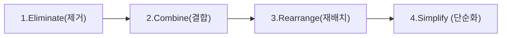

## 공정개선

공정개선 도구와 기법은 개선하고자 하는 목적(낭비 제거, 품질 향상, 시간 단축, 설비 관리 등)에 따라 다양한 프레임워크로 분류된다. 

| 개선 목적 | 대표 적용 기법 |
| --- | --- |
| **전체 프로세스 낭비 및 리드타임 단축** | VSM, TPS (JIT, 간반), ECRS |
| **작업장 환경 및 가시화 구축** | 3정 5S, 포카요케, 안돈(Andon) |
| **작업 시간 단축 및 병목 해소** | 공정분석, 라인 균형화, PTS(MOST/MTM) |
| **품질 불량 원인 분석 및 해결** | QC 7가지 도구, 5 Why, 6 Sigma |
| **설비 교체 및 정지 시간 줄이기** | TPM, SMED |

### 낭비 제거 기법

가공, 이동, 대기 등 프로세스 내 비부가가치(낭비) 요소를 발굴하고 제거하는 데 주력하는 기법이다.

#### VMS

자세한 내용은 [7.생산지원기술 및 기타 > 4. 생산혁신기술 > 주요 생산혁신기술 > VMS](https://yeonkyupark.github.io/pepc3e/0704_production_innovation_technology/#vsm)를 참고한다.

#### 3정 5S

**3정 5S**는 생산 현장 및 사무 환경에서 낭비를 제거하고 효율성, 안전성, 품질을 극대화하기 위해 수행하는 환경 정비 및 관리 개선의 가장 기본적이고 핵심적인 활동이다.

**3정 (3定)**

3정은 <span class='hl'>정해진 위치에, 정해진 물품을, 정해진 수량만큼 배치한다</span>는 가시적 관리(Visual Management)의 원칙이다. 물건을 찾거나 옮기는 데 걸리는 불필요한 이동 및 대기 낭비를 줄이는 것을 목적으로 한다.

* **정품 (正品)**  
    지정된 올바른 물품(부품, 공구, 자재 등)을 배치함
* **정량 (定量)**  
    지정된 적정 수량만큼만 놓아 과잉 재고나 부족을 방지함
* **정위치 (定位置)**  
    지정된 정해진 장소에 배치하여 누구나 쉽게 찾고 반납할 수 있게 함

**5S (5 S)**

5S는 일본의 공장 관리 기법에서 유래한 5가지 핵심 행동 지침으로, 각 항목의 일본어 발음 앞글자(S)를 딴 것이다.

| 구분 | 명칭 (한자/원어) | 주요 내용 및 목적 |
| --- | --- | --- |
| **1S** | **정리 (整理, Seiri)** | 필요한 것과 불필요한 것을 구분하여, 불필요한 것을 현장에서 완전히 처분함 |
| **2S** | **정돈 (整頓, Seiton)** | 필요한 물건을 누구나 쉽게 찾아 쓸 수 있도록 3정(정품·정량·정위치) 원칙에 따라 배치함 |
| **3S** | **청소 (清掃, Seiso)** | 작업장, 설비, 공구 주변의 먼지나 오염을 제거하여 깨끗한 상태를 유지함 (점검 겸함) |
| **4S** | **청결 (清潔, Seiketsu)** | 정리·정돈·청소 상태를 표준화하고 상시적으로 깨끗한 상태를 유지·관리함 |
| **5S** | **습관화 / 습율 (習慣化, Shitsuke)** | 정해진 표준과 규칙을 올바르게 준수하는 태도를 몸에 익히고 정착시킴 |

**3정 5S의 추진 체계 및 기대 효과**

```
[정리] ➔ [정돈] ➔ [청소] ➔ [청결] ➔ [습관화]
          └─ 3정(정품·정량·정위치) 적용
```

* **낭비 제거**  
    공구나 자재를 찾는 시간, 불필요한 이동 동선 단축
* **안전사고 예방**  
    통로 확보 및 오염 물질 제거를 통한 전도(넘어짐) 및 감전, 화재 예방
* **품질 및 설비 가동률 향상**  
    설비 청소를 통한 미세한 이상(누유, 마모 등) 조기 발견 및 품질 불량 방지
* **현장 가시화**  
    누구나 이상 상태를 한눈에 파악할 수 있는 눈으로 보는 관리 체계 완성

#### ECRS 기법

**ECRS 기법**은 공정분석 및 작업개선 단계에서 낭비를 제거하고 효율성을 극대화하기 위해 적용하는 4가지 핵심 원칙(Eliminate, Combine, Rearrange, Simplify)이다. 개선안을 수립할 때 E $\rightarrow$ C $\rightarrow$ R $\rightarrow$ S의 순서를 엄격히 준수하며 접근하는 것이 핵심이다.

**4대 원칙 및 세부 내용**



1. **Eliminate (제거) - "불필요한 공정/작업을 없앨 수 없는가?"**

    가장 먼저 고려해야 하는 가장 강력하고 효과적인 개선 원칙이다. 해당 공정이나 작업 자체가 정말 필요한지 원점 재검토한다.
    
    * **주요 질문**: 이 작업을 안 하면 어떻게 되는가? 꼭 필요한 과정인가?
    * **개선 예시**: 불필요한 이중 검사 절차 폐지, 관습적인 승인 서류 작성 단계 제거, 제품 불필요 보호 비닐 부착 공정 삭제

2. **Combine (결합) - "다른 공정/작업과 합칠 수 없는가?"**

    제거하고 남은 필수 공정 중, 서로 연관된 작업이나 동선을 하나로 통합하여 불필요한 이동 및 대기 시간을 줄인다.
    
    * **주요 질문**: 두 개 이상의 작업을 동시에 수행하거나 한 장소에서 처리할 수 있는가?
    * **개선 예시**: 가공 공정 내 자동 치수 측정기 탑재(작업과 검사의 결합), 2개 이상 부품의 일체화 모듈 설계

3. **Rearrange (재배치/순서 변경) - "공정 순서나 배치를 바꿀 수 없는가?"**

    작업의 순서를 바꾸거나 설비 배치를 변경하여 순탄한 흐름을 만들고 동선 및 병목을 개선한다.
    
    * **주요 질문**: 공정 순서를 바꾸면 이동 거리나 대기 시간이 줄어드는가?
    * **개선 예시**: 작업장 레이아웃 변경을 통한 물류 동선 단축, 가공과 조립의 전후 순서 변경으로 정체 해소

4. **Simplify (단순화) - "작업이나 설비를 더 쉽게 만들 수 없는가?"**

    앞선 E, C, R 단계를 거치고 최종적으로 남은 작업을 작업자가 더 쉽고, 빠르고, 안전하게 수행할 수 있도록 간소화한다.
    
    * **주요 질문**: 작업 도구, 치공구(Jig), 제어 방식을 단순화할 수 있는가?
    * **개선 예시**: 나사 체결 방식을 원터치 클립 방식으로 변경, 전용 치공구(Jig) 제작을 통한 맞춤 작업 손쉬움 확보, 지그재그 동선을 일직선 동선으로 전환

ECRS 적용 시 핵심 유의사항이다.

* **순서 준수의 원칙**  
    제거(E)할 수 있는 작업을 먼저 찾지 않고 단순화(S)부터 시도하면, **불필요한 작업에 비싼 자동화 설비를 도입하는 치명적 오류**가 발생할 수 있다.
* **5W1H(육하원칙)과의 연계**  
    * **Why/What (왜, 무엇을)** $\rightarrow$ **Eliminate (제거)**
    * **Where/When/Who (어디서, 언제, 누구가)** $\rightarrow$ **Combine / Rearrange (결합 / 재배치)**
    * **How (어떻게)** $\rightarrow$ **Simplify (단순화)**
  
#### 실수 방지(포카요케)

**포카요케(Poka-Yoke)**는 <span class='hl'>현장에서 작업자의 실수나 설비의 오작동이 불량으로 이어지지 않도록 원천 차단하는 실수 방지(Fool-Proof) 기법</span>이다. '포카(Poka, 무의식적인 실수)'와 '요케(Yoke, 방지하다)'의 합성어로, 작업자의 주의력이나 숙련도에 의존하지 않고 신체적·물리적 메커니즘을 통해 불량을 사전 예방한다.

**3대 작동 규제 방식**

포카요케는 이상 발생 시 대처하는 방식에 따라 3가지 유형으로 구분한다.

* **정지형(Shut-out Type)**  
    이상 발생 시 다음 공정으로 이동하지 못하도록 설비 가동을 즉시 정지시키는 방식이다.
* **경보형(Warning Type)**  
    이상이나 작업 누락 발생 시 부저, 안돈(Andon) 경광등, 음성 안내 등으로 작업자에게 즉시 알리는 방식이다.
* **규제형(Control Type)**  
    실수가 발생하더라도 자동으로 정상 작업 방향으로 보정하거나 제어하는 방식이다.

**주요 메커니즘 및 구축 방식**

현장에서 주로 적용하는 물리적 감지 기법은 다음과 같다.

* **접촉식(Contact Method)**  
    부품의 형상, 치수, 돌기 유무를 물리적 스위치나 핀으로 직접 감지하여 위치 오류 시 체결을 차단한다.
* **정수식(Fixed-value Method)**  
    작업 횟수, 나사 체결 개수, 부품 투입 수량 등 정해진 횟수를 충족하지 못하면 다음 단계로 넘어가지 않도록 제어한다.
* **동작단계식(Motion-step Method)**  
    미리 정해진 작업 순서나 동선대로 진행하지 않으면 센서가 이를 감지하여 알림을 발생시킨다.

**도입 기대효과**

포카요케 구축을 통해 현장의 작업 질을 높이고 불량률을 감소시킬 수 있다.

* **검사 인력 및 검사 공정 최소화**  
    공정 내 원천 차단으로 전수 검사 효과를 거두어 후공정 검사 부담을 대폭 감소시킨다.
* **작업자 피로도 및 인적 오류(Human Error) 예방**  
    작업자의 주의력 한계로 인한 누락이나 오체결을 시스템적으로 완전 방지한다.
* **품질 불량 비용 절감**  
    불량품 출하 및 재작업에 따른 자원 손실을 원천 차단하여 종합적 제조 품질을 올린다.


#### 간반

**간반(Kanban)**은 후공정 인출(Pull System)을 구현하기 위해 생산 현장에서 사용되는 <span class='hl'>시각적 작업 지시서 겸 물류 통제 도구</span>이다. 기존의 밀어내기 방식(Push System, 계획에 맞춰 전공정이 만들어서 후공정으로 넘기는 방식)과 달리, 후공정이 필요한 시점에 필요한 수량만큼만 전공정에서 가져가는 **인출 방식(Pull System)**을 작동시키는 핵심 매개체 역할을 한다.

**주요 종류**

현장에서는 쓰임새와 목적에 따라 크게 두 가지 종류의 간반을 활용한다.

* **인출간반 (Withdrawal Kanban)**  
    후공정 작업자가 전공정 부품 보관소에서 필요한 부품을 인수/인출할 때 사용하는 표식이다.
* **생산지시간반 (Production-ordering Kanban)**  
    전공정에 부품 제작을 지시하는 표식으로, 부품이 인출되어 비어있는 수량만큼 추가 생산하도록 명령한다.

**5대 운용 규칙**

TPS(도요타 생산 방식)에서 정의하는 간반 운영의 기본 원칙은 다음과 같다.

1. **후공정 인출의 원칙**: 후공정은 반드시 필요한 때에 필요한 수량만큼만 전공정에서 인출한다.
2. **전공정 생산의 원칙**: 전공정은 후공정이 인출해 간 수량만큼만 생산한다.
3. **불량품 전송 금지**: 불량품은 절대로 다음 공정으로 보낼 수 없다.
4. **100% 간반 부착**: 부품 상자나 용기에는 반드시 간반이 부착되어 있어야 한다.
5. **평준화 생산의 준수**: 변동 폭을 줄이기 위해 생산 물량과 종류를 평준화하여 가동한다.

**도입 기대효과**

* **과잉생산의 낭비 원천 차단**  
    필요한 만큼만 만들어 생산 현장의 최대 낭비인 과대 생산을 예방한다.
* **재공품(WIP) 및 대기 시간 감소**  
    공정 간 불필요한 대기열과 중간 재고를 줄여 생산 리드타임을 단축시킨다.
* **눈으로 보는 관리(Visual Management) 구현**  
    복잡한 전산 지시 없이도 간반의 흐름만으로 현장 진척도와 이상 발생을 한눈에 파악한다.

### 작업 및 시간 분석 도구

작업자 동선과 작업 시간을 수치화하여 표준시간을 설정하고 공정 균형을 다듬는 기법이다.

#### 공정분석 

**공정분석(Process Analysis)**은 원자재 투입부터 완제품 출하까지의 전체 흐름을 대상(자재, 작업자, 정보)별로 체계적으로 조사·분석하여 불필요한 낭비를 발견하고 최적의 생산 흐름을 구축하는 기법이다.

**5대 요소 (분석 대상)**

* **작업 (Operation)**: 가공, 조립 등 제품에 부가가치를 부여하는 순수 작업
* **운반 (Transportation)**: 자재, 부품, 작업자의 위치 이동
* **검사 (Inspection)**: 제품의 품질, 수량, 규격 격합 여부 측정 및 판정
* **대기 (Delay)**: 공정 간 차질이나 대기열로 인해 일시적으로 정지된 상태 (비가치)
* **저장 (Storage)**: 계획된 일정에 따라 창고 등에 보관된 정식 보관 상태 (비가치)

**공정분석 표준 기호**

공정분석 표준 기호는 KS / ASME 기준 다음과 같다.

| 구분 | 기호 | 명칭 | 의미 |
| --- | --- | --- | --- |
| **기본 기호** | **○** | **작업 (Operation)** | 제품의 성질이나 형태를 변화시켜 가치를 높이는 행위 |
|  | **➔** | **운반 (Transportation)** | 한 장소에서 다른 장소로 이동하는 상태 |
|  | **□** | **검사 (Inspection)** | 품질(품질검사)이나 수량(수량검사)을 조사·비교하는 행위 |
|  | **D** | **대기 (Delay)** | 다음 공정으로 진행하지 못하고 정체된 상태 |
|  | **▽** | **저장 (Storage)** | 허가 없이 이동할 수 없는 정식 보관 상태 |
| **복합 기호** | **⛋** | **품질/수량 동시검사** | 품질과 수량 검사를 한 단계에서 동시에 수행 |
|  | **🟗**| **작업 겸 검사** | 작업을 수행함과 동시에 검사를 병행 |

**핵심 목적**

* **비가치 시간 제거**: 대기(D), 불필요한 운반(➔), 과도한 저장(▽) 등의 낭비 최소화
* **병목(Bottleneck) 해소**: 공정 간 균형을 다듬어 전체 흐름 가속화
* **리드타임(Lead Time) 단축**: 원자재 투입 후 완제품 출하까지의 소요시간 줄임
* **공정 가시화**: 전체 제조 과정을 표준 기호로 도표화(공정분석표)하여 문제점 한눈에 파악

#### 동작분석

**동작분석(Motion Study)**은 작업자의 신체 움직임을 미세한 단위로 분해하여 불필요한 동작(동작의 낭비)을 발굴하고 제거하는 공정개선 기법이다. 산업공학의 선구자인 길브레스(Frank B. Gilbreth) 부부에 의해 창안되었으며, 인간의 모든 작업 동작을 18가지 기본 요소인 **서블릭(Therblig)** 기호로 체계화하여 분석한다.

**서블릭(Therblig)의 3가지 분류**

18가지 서블릭 기호는 작업의 효율성과 부가가치 창출 여부에 따라 3개 그룹으로 분류한다.

* **제1군: 효율적 동작 (비낭비 동작)**  
    작업의 목적을 직접 달성하는 핵심 동작으로, 가급적 시간을 단축하되 함부로 제거하지 않는다.  
    *(예: 잡기, 이동, 조립, 사용, 놓기 등)*
* **제2군: 불효율적 동작 (개선 대상 동작)**  
    제1군 동작을 수행하기 위해 보조적으로 발생하는 동작으로, ECRS 및 작업장 배치를 통해 줄이거나 통합한다.  
    *(예: 찾기, 고르기, 위치 맞추기, 검사 등)*
* **제3군: 부효율적 동작 (제거 대상 낭비)**  
    작업 진행을 방해하거나 아무런 가치를 창출하지 못하는 순수 낭비 동작으로 즉시 제거해야 한다.  
    *(예: 유지하기/치켜들고 있기, 불가피한 지연, 피할 수 있는 지연, 휴식 등)*

**동작경제의 원칙 (Principles of Motion Economy)**

동작분석을 바탕으로 작업자의 피로를 줄이고 생산성을 높이기 위해 적용하는 3대 기본 원칙이다.

1. **인체 사용에 관한 원칙**  
    두 손은 동시에 시작하고 동시에 끝낼 것, 양손이 동시에 쉬지 않도록 할 것, 신체의 자연스러운 대칭·반대 방향 운동을 이용할 것
1. **작업장 배치에 관한 원칙**  
    모든 공구와 자재는 정해진 위치(3정 5S)에 놓을 것, 작업자 정면에 가깝게 배치하여 동작 범위를 최소화할 것
1. **공구 및 설비 디자인에 관한 원칙**  
    두 개 이상의 공구를 하나로 결합(복합 공구)할 것, 전용 치공구(Jig)를 활용하여 잡고 있는 동작(제3군)을 없앨 것

**도입 기대효과**

* **작업자 피로도 경감**  
    불필요한 구부림, 연장 이동, 무리한 힘 사용을 제거하여 근골격계 질환 및 작업 피로를 예방한다.
* **작업 표준화 및 미세 시간 단축**  
    숙련자와 비숙련자의 동작 차이를 비교 분석하여 최적의 표준 동작 가이드를 수립한다.
* **작업장 레이아웃 최적화**  
    손의 부채꼴 동작 범위(최적 작업역) 내에 자주 쓰는 자재를 배치하여 동선을 최소화한다.

#### PTS

자세한 내용은 [3. 공정관리 > 표준작업관리 > 표준시간 측정법 > PTS법](https://yeonkyupark.github.io/pepc3e/0304_standard_work_management/#pts)을 참고한다.

#### 라인 밸런싱

**라인 균형화(Line Balancing)**는 조립 라인이나 연속 생산 공정에서 각 작업장(Workstation)에 할당된 작업 시간의 편차를 최소화하여 공정 흐름을 균등하게 만드는 생산 관리 기법이다. 특정 공정에 작업이 집중되는 **병목(Bottleneck) 현상**과 이로 인해 발생하는 다른 공정의 대기 낭비(Idle Time)를 동시에 해소하여 전체 생산 라인의 효율을 극대화한다.

**주요 개념 및 핵심 평가지표**

라인 균형화 수준을 정량적으로 측정하기 위해 사용하는 핵심 수치이다.

* **병목 공정 (Bottleneck Process)**  
    라인 내 여러 공정 중 작업 시간이 가장 길어 전체 라인의 생산 속도를 결정짓는 공정이다.
* **라인 균형율 (Line Balancing Efficiency, LBE)**  
    라인 전체가 얼마나 균등하게 편성되어 있는지를 나타내는 비율이다.
    
    $$\text{라인 균형율 (%)} = \frac{\text{각 공정 작업 시간의 총합}}{\text{공정 수} \times \text{병목 공정 작업 시간}} \times 100$$
    
* **밸런스 로스율 (Balance Loss Rate)**  
    공정 간 작업 불균형으로 인해 발생하는 유휴 시간의 비율이다. ($\text{밸런스 로스율} = 100\% - \text{라인 균형율}$)

**라인 균형화 추진 절차**

라인 균형화를 실행할 때 적용하는 표준 4단계 절차이다.

1. **공정 분해 및 작업 시간 실측**  
    전체 공정을 단위 작업으로 분해하고, 표준시간 설정법(Stopwatch법, PTS 등)으로 각 작업 시간을 산정한다.
2. **선행 관계 도표(Precedence Diagram) 작성**  
    어떤 작업을 먼저 수행해야 하는지 공정 간 순서 및 선후 관계를 도출한다.
3. **Takt Time 산정 및 최소 공정 수 계산**  
    고객 요구 수량에 맞춘 Takt Time을 구하고, 이를 만족하기 위한 이론적 최소 작업장 수를 산출한다.
4. **작업 재배치 및 균형화 (ECRS 적용)**  
    ECRS 원칙에 따라 작업 요소를 재분배하여 각 공정의 작업 시간이 Takt Time 이하가 되도록 조정한다.

**라인 균형화 개선 기법**

* **작업 분할 및 결합 (Dividing & Combining)**  
    시간이 길게 걸리는 병목 공정의 일부 작업을 작업 시간이 짧은 인접 공정으로 이관하거나 분할한다.
* **작업자 배치 및 숙련도 활용**  
    숙련도가 높은 작업자를 병목 공정에 배치하거나, 다공정 담당자(Multi-Skilled Worker)를 활용해 대기 시간을 줄인다.
* **치공구 및 자동화 도입**  
    병목 공정에 전용 치공구(Jig)나 자동화 설비를 우선 투입하여 가공·조립 시간을 직접 단축한다.
* **병렬 공정 구축 (Parallel Operations)**  
    단순 분할이 불가능한 병목 공정의 경우 동일 설비를 병렬로 2개 이상 배치하여 실질적 Cycle Time을 절반으로 줄인다.

**도입 기대효과**

* **재공품(WIP) 및 대기 시간 단축**  
    공정 간 체증이 해소되어 공정 내 대기 물량과 리드타임이 크게 줄어든다.
* **생산 능력(Capacity) 증대**  
    병목 공정의 시간 단축으로 동일 시간 내 전체 라인의 완제품 생산량이 증가한다.
* **작업자 부하 평준화**  
    특정 작업자에게 집중되던 작업 피로도(Muri)를 분산시켜 작업 환경을 개선한다.

!!! example "라인 밸런스 개선"  

    **예제 공정 조건**
    
    * **일일 목표 생산량**: 400대
    * **일일 정식 가동시간**: 8시간 (480분 = 28,800초)
    * **조립 공정 순서 및 소요 시간**: 총 5개 세부 공정
    
    | 공정 번호 | 공정 내용 | 작업 시간(초) | 선행 공정 |
    | --- | --- | --- | --- |
    | **A** | 모터 및 메인 서킷 조립 | 30 | - |
    | **B** | 흡입 파이프 및 필터 결합 | 45 | A |
    | **C** | 본체 케이스 체결 (병목) | **60** | B |
    | **D** | 배터리 팩 장착 및 가동 테스트 | 25 | C |
    | **E** | 최종 포장 및 스티커 부착 | 20 | D |
    | **합계** | **총 작업 시간** | **180초** | - |
    
    **주요 지표 산출 계산**
    
    1. Takt Time (타크트 타임) 산출  
        고객 수요에 맞추기 위해 제품 1대를 생산하는 데 걸리는 허용 시간이다.
    
        - $\text{Takt Time} = \frac{\text{일일 가동시간}}{\text{일일 목표 생산량}} = \frac{28,800\text{초}}{400\text{대}} = 72\text{초/대}$
        - **해석**: 72초마다 완제품 1대가 라인 끝에서 나와야 목표 수량을 달성할 수 있다.
    2. 이론적 최소 작업장(공정) 수 계산  
        - $\text{최소 작업장 수} = \frac{\text{총 작업 시간}}{\text{Takt Time}} = \frac{180\text{초}}{72\text{초}} = 2.5 \rightarrow \mathbf{3\text{개}}$
        - **해석**: 이론적으로 최소 3개의 작업장으로 라인을 구성할 수 있다.
    3. 개선 전 라인 균형율 (LBE) 계산  
        현재 5개 공정 그대로 운영할 때의 효율성이다. 라인 내 가장 오래 걸리는 병목 공정(C공정: 60초)이 전체 생산 속도를 지배한다.

        - $\text{라인 균형율 (%)} = \frac{\text{총 작업 시간}}{\text{공정 수} \times \text{병목 공정 시간}} \times 100 = \frac{180}{5 \times 60} \times 100 = \mathbf{60\%}$
        - **개선 전 밸런스 로스율**: $100\% - 60\% = \mathbf{40\%}$ (대기 및 작업 불균형 낭비 40% 발생)
        
    **라인 균형화 개선 (ECRS 및 작업 재배치)**
    
    Takt Time(72초)을 넘지 않는 선에서 선행 관계를 고려해 5개 공정을 3개 작업장(Workstation)으로 재통합한다.
    
    ```text
    [개선 전] WS1(A:30초) ➔ WS2(B:45초) ➔ WS3(C:60초) ➔ WS4(D:25초) ➔ WS5(E:20초)  (균형율 60%)
                                     ↓
    [개선 후] WS1(A+B:75초) ➔ WS2(C:60초) ➔ WS3(D+E:45초)  -- (X: WS1이 Takt Time 72초 초과)
                                     ↓ (재조정)
    [개선 후] WS1(A+D:55초) ➔ WS2(B+E:65초) ➔ WS3(C:60초)  -- (O: 모두 72초 이하 만족)    
    ```
    
    **개선 후 작업장 재배치 결과**
    
    * **작업장 1 (WS 1)**: A(30초) + D(25초) = **55초**
    * **작업장 2 (WS 2)**: B(45초) + E(20초) = **65초** *(새로운 병목 공정)*
    * **작업장 3 (WS 3)**: C(60초) = **60초**
    
    **개선 후 효과 검증**
    
    **개선 후 라인 균형율 (LBE) 재계산**:  $\text{개선 후 라인 균형율 (%)} = \frac{180\text{초}}{3\text{개} \times 65\text{초}} \times 100 \approx \mathbf{92.3\%}$
    
    개선 전·후 비교 표
    
    | 구분 | 개선 전 | 개선 후 | 개선 효과 |
    | --- | --- | --- | --- |
    | **작업장(인원) 수** | 5개 (5명) | 3개 (3명) | **2명 절감 (인력 효율화)** |
    | **병목 공정 시간** | 60초 | 65초 | Takt Time(72초) 충족 |
    | **라인 균형율 (LBE)** | **60.0%** | **92.3%** | **32.3%p 향상** |
    | **밸런스 로스율** | 40.0% | 7.7% | 대기 낭비 대폭 감소 |
    
### 품질 및 문제 해결 기법

품질 변동 요인을 추적하고 원인을 근본적으로 해결하기 위한 도구이다.

#### QC 7가지 도구

자세한 내용은 [5. 작업 및 생산성과 측정과 개선 > 4. 품질관리 > 품질관리 대표 기법 > QC 7가지 도구](https://yeonkyupark.github.io/pepc3e/0504_quality_management/#qc-7)를 참고한다.


#### 5 Why 기법

**5 Why 기법**은 현장에서 문제가 발생했을 때 <span class='hl'>"왜(Why)?"라는 질문을 연속적으로 최소 5회 던짐으로써 표면적인 원인(Symptom)을 넘어 문제의 진짜 원인인 근본 원인(Root Cause)을 찾아내고, 이를 통해 동일한 문제의 재발을 방지하는 문제 해결 기법</span>이다. 도요타 생산 방식(TPS)의 핵심 창시자인 오노 다이이치(Taiichi Ohno)에 의해 정립되었으며, 단순한 임시방편 조치(임시 처방)가 아닌 원천적인 예방 조치를 도출하는 데 목적이 있다.

**표면적 원인 vs 근본 원인 (Symptom vs Root Cause)**

* **표면적 원인 (Symptom)**  
    눈에 보이는 즉각적인 문제 현상으로, 이에 대한 조치는 단기적인 임시 처방(Band-aid Fix)에 그쳐 시간이 지나면 같은 문제가 재발한다.
* **근본 원인 (Root Cause)**  
    문제를 일으킨 체계적·프로세스적 원천으로, 이를 해결하면 문제의 재발 가능성이 원천적으로 차단된다.

**5 Why 적용 예시**

공장 라인의 기계가 갑자기 정지한 경우라고 가정한다.

1. **Why 1**: 기계가 왜 정지했는가?  
    $\rightarrow$ 과부하가 걸려 휴즈가 끊어졌기 때문이다. *(임시 조치: 휴즈 교체)*
2. **Why 2**: 왜 과부하가 걸렸는가?  
    $\rightarrow$ 베어링 부위에 윤활유가 충분히 공급되지 않았기 때문이다.
3. **Why 3**: 왜 윤활유가 충분히 공급되지 않았는가?  
    $\rightarrow$ 윤활유 펌프가 제 기능을 하지 못해 올바르게 작동하지 않았기 때문이다.
4. **Why 4**: 왜 윤활유 펌프가 제 기능을 하지 못했는가?  
    $\rightarrow$ 펌프 축이 마모되어 소음과 함께 정지했기 때문이다.
5. **Why 5**: 왜 펌프 축이 마모되었는가?  
    $\rightarrow$ 여과망(여과기)이 파손되어 여과되지 않은 이물질이 들어갔기 때문이다.  
    *(근본 조치: 여과망 교체 및 정기 점검 표준화)*

**5 Why 수행 시 필수 준수 수칙**

* **사람이 아닌 '시스템/프로세스'를 추궁할 것**  
    "작업자가 실수해서"와 같은 인적 오류로 결론을 내리지 않고, "작업자가 실수하도록 방치한 프로세스나 매뉴얼의 부재가 무엇인가?"로 접근해야 한다.
* **현장·현물(Genba/Genbutsu)에 기반하여 검증할 것**  
    회의실에서의 추측이 아닌 현장에서 눈으로 확인된 논리적 사실만을 원인으로 연결해야 한다.
* **논리적 연결성(Cause & Effect) 검증**  
    마지막 5번째 Why부터 역순으로 "~했기 때문에(Therefore) ~했다"라고 읽었을 때 문맥상 자연스러운지 체크한다.

**도입 기대효과**

* **재발 방지 대책 수립**  
    동일 유형 문제의 재발을 원천 차단하여 품질 비용 단축
* **원인 추적의 구조화**  
    소모적인 책임 전가 문화를 지양하고 시스템적 문제 해결 체계 구축
* **소모 비용 최소화**  
    별도의 복잡한 통계적 도구 없이도 신속하게 문제의 핵심 도출 가능

#### 6 Sigma

자세한 내용은 [7. 생산지원기술 및 기타 > 4. 생산혁신기술 > 주요 생산혁신기술 > 6 Sigma](https://yeonkyupark.github.io/pepc3e/0704_production_innovation_technology/#6-sigma)를 참고한다.

### 설비 중심 개선 기법

설비의 가동률과 신뢰성을 최대로 끌어올리기 위한 기법이다.

#### TPM

자세한 내용은 [7. 생산지원기술 및 기타 > 4. 생산혁신기술 > 주요 생산혁신기술 > TPM](https://yeonkyupark.github.io/pepc3e/0704_production_innovation_technology/#tpm)을 참고한다.

#### SMED

자세한 내용은 [7. 생산지원기술 및 기타 > 4. 생산혁신기술 > 주요 생산혁신기술 > SMED](https://yeonkyupark.github.io/pepc3e/0704_production_innovation_technology/#smed)를 참고한다.


