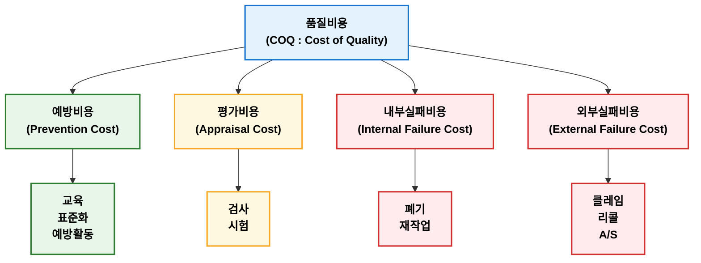
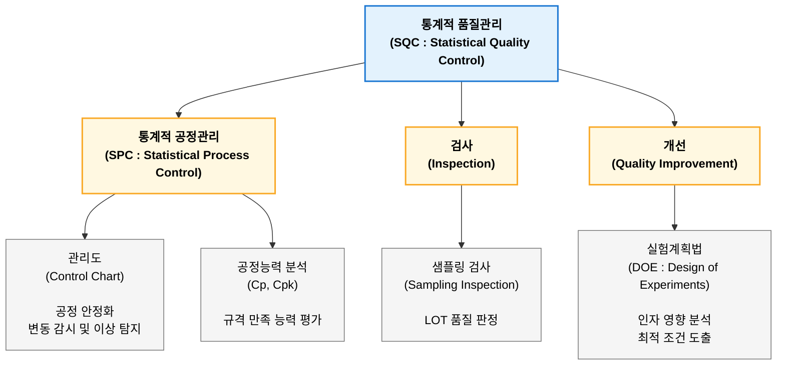
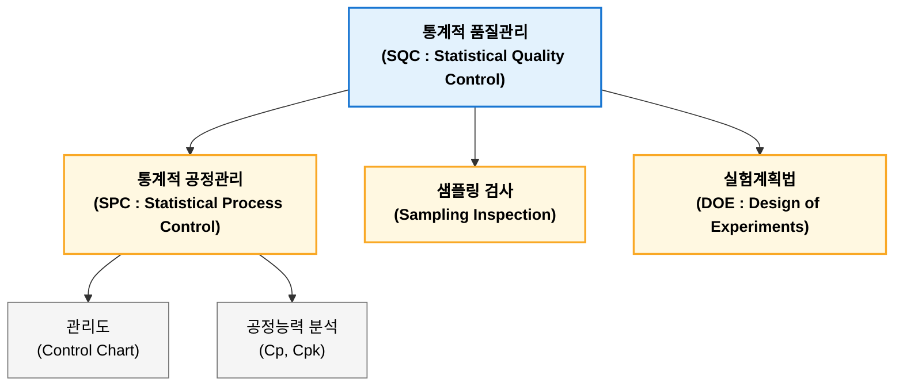
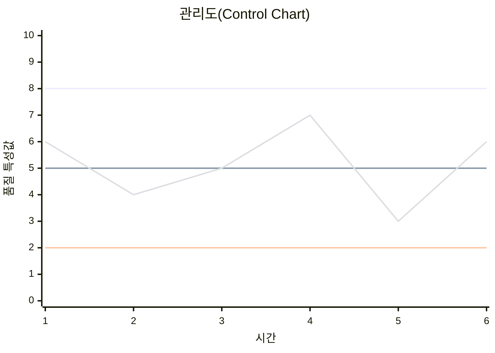
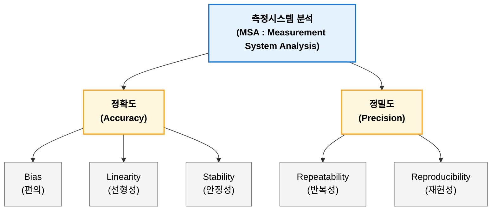
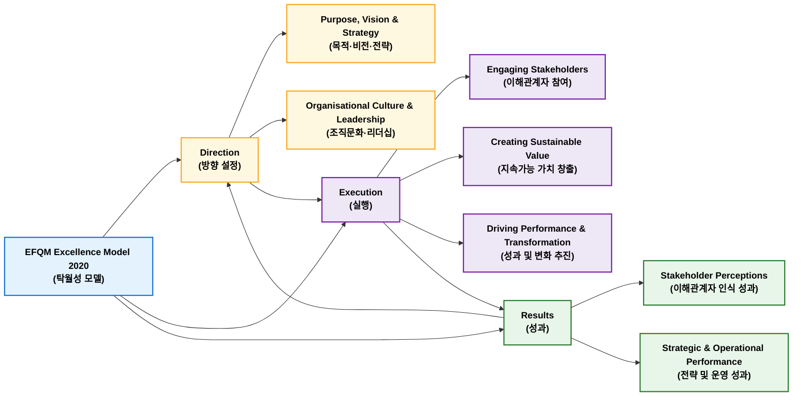
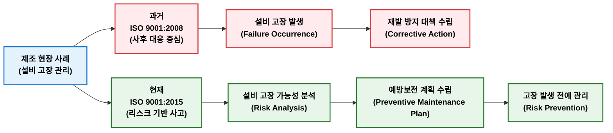

## 품질관리

품질관리(Quality Management)는 고객 요구사항을 만족하는 제품과 서비스를 경제적으로 제공하기 위해 품질을 계획하고, 유지하며, 개선하는 관리활동이다. ISO 9000에서는 품질 요구사항을 충족시키기 위한 운영기법과 활동으로 정의하고 있다. 품질관리 목적은 품질 향상, 원가 절감, 납기 확보 및 고객 만족이며, 품질계획, 품질관리, 품질보증, 품질개선으로 구성된다. 주요 기법으로 (신)QC 7가지 도구, 통계적 품질관리(SQC), 공정능력지수, 관리도, Six Sigma 등이 있으며, 최근 AI와 스마트팩토리를 활용한 데이터 기반 품질관리로 발전하고 있다.

### 품질관리 정의

품질은 단순히 "좋은 제품"을 의미하는 것이 아니라 고객 요구사항을 얼마나 충족하는가를 의미한다. 대표적인 품질 정의는 다음과 같다.

**ISO 9000:2015**

> 객체에 내재된 특성의 집합이 요구사항을 충족하는 정도(Degree to which a set of inherent charatistics fulfills requirements)

**주란(J.M.Juran)**

> 사용 목적에 적합한 정도(Fitness for Use)

**크로스비(Philip B. Crosby)**

> 요구사항에 대한 적합성(Conformance to Requirements)

ISO 9000에서는 품질관리를 다음과 같이 정의한다.

> 품질 요구사항을 충족시키기 위해 품질에 관한 운영기법과 활동을 수행하는 관리 활동

즉, 품질관리란 고객이 요구하는 품질을 경제적으로 생산하기 위하여 품질을 계획하고, 유지하며, 개선하는 일련의 관리활동이다.


!!! note "품질 절대조건"  

    Philip B. Crosby는 저서 'Quality Is Free(1979)'에서 품질은 검사로 확보하는 것이 아니라 예방(Prevention)을 통해서 달성해야 하며, 올바른 품질관리는 오히려 비용을 절감한다고 주장했다. 그는 품질경영 기본 철학을 품질 절대조건(Four Absolutes of Quality Management)이라는 4가지 원칙으로 정리했다.
    
    | 절대조건                  | 핵심 내용                         | 키워드                            |
    | --------------------- | ----------------------------- | ------------------------------ |
    | 1. 품질은 요구사항에 대한 적합성이다. | 품질은 고객 요구사항과 규격을 충족하는 것이다.    | Conformance to Requirements    |
    | 2. 품질 시스템은 예방이다.       | 검사가 아니라 예방으로 품질을 확보한다.        | Prevention                     |
    | 3. 품질의 성과 기준은 무결점이다.   | 목표는 허용 불량이 아닌 Zero Defects이다. | Zero Defects                   |
    | 4. 품질의 측정은 비적합 비용이다.   | 품질 수준은 불량으로 인해 발생한 비용으로 평가한다. | Price of Nonconformance (PONC) |

!!! note "품질 대가 핵심 철학"  

    대표적인 품질 대가로 Deming, Juran, Croby 등이 있으며 다음과 같이 비교된다.

    | 구분    | Deming         | Juran                   | Crosby                                |
    | ----- | -------------- | ----------------------- | ------------------------------------- |
    | 핵심 철학 | 지속적 개선(PDCA)   | 품질계획·관리·개선              | 무결점과 예방                               |
    | 품질 정의 | 고객 만족 및 시스템 개선 | 사용 적합성(Fitness for Use) | 요구사항 적합성(Conformance to Requirements) |
    | 대표 개념 | PDCA, 14원칙     | Juran Trilogy           | Four Absolutes, Zero Defects          |
    | 중점    | 통계적 관리와 시스템    | 경영관리                    | 예방과 품질문화                              |

### 품질관리 목적 

품질관리 목적은 단순히 불량을 줄이는 것이 아니라 고객 만족과 기업 경쟁력을 향상시키는 것이다.

| 목적     | 내용             |
| ------ | -------------- |
| 품질 향상  | 불량 감소 및 신뢰성 확보 |
| 원가 절감  | 재작업·폐기 감소      |
| 납기 확보  | 공정 안정화         |
| 생산성 향상 | 공정 변동 감소       |
| 고객 만족  | 고객 요구 충족       |
| 지속적 개선 | 품질 수준 향상       |

품질은 QCD(Quality, Cost, Delivery) 중 가장 우선되는 요소로 인식된다.

### 품질관리 발전 과정

품질관리는 검사 중심에서 예방 중심으로 발전해 왔다.

| 단계         | 특징            |
| ---------- | ------------- |
| Inspection | 불량 선별         |
| QC         | 품질 유지         |
| SQC        | 통계적 관리        |
| TQC        | 전사 참여         |
| TQM        | 고객 중심의 지속적 개선 |

### 품질관리 기본 기능

품질관리는 일반적으로 품질계획(QP), 품질관리(QC), 품질보증(QA), 품질개선(QI)으로 구분한다.

**품질계획(Quality Planning)**  

- 품질 목표 설정
- 품질 기준 수립
- 관리계획 작성

**품질관리(Quality Control)**  

- 공정 관리
- 검사
- 이상 조치

**품질보증(Quality Assurance)**  

- 고객에게 품질을 보증하는 체계
- ISO 9001 등이 대표적

**품질개선(Quality Improvement)**

- 지속적인 품질 향상
- PDCA, Six Sigma 활용

!!! note "Juran Trilogy"  
    Juran Trilogy에서는 품질계획(Quality Planning), 품질관리(Quality Control), 품질개선(Quality Improvement)을 품질관리의 3대 기능으로 제시한다.
    
    

### 품질관리 주요 활동

1. 품질계획
    - 품질 목표 설정
    - 검사 기준 설정
    - 공정능력 확보
2. 품질유지
    - 공정관리
    - 관리도 운영
    - 설비관리
3. 품질개선
    - 불량 원인 분석
    - 공정 개선
    - 표준화
  
### 품질관리 대표 기법

#### QC 7가지 도구

1950~1960년대 Ishikawa Kaoru를 중심으로 정립된 품질관리의 기본 도구로 현장 문제 해결을 위한 기본 도구이다.

| 도구    | 목적     | 주요 질문             |
| ----- | ------ | ----------------- |
| 체크시트  | 데이터 수집 | 무슨 문제가 얼마나 발생하는가? |
| 히스토그램 | 분포 분석  | 데이터가 어떻게 분포하는가?   |
| 파레토도  | 중점 관리  | 무엇을 먼저 개선할 것인가?   |
| 특성요인도 | 원인 분석  | 왜 문제가 발생했는가?      |
| 산점도   | 상관관계   | 두 변수는 관련이 있는가?    |
| 관리도   | 공정 안정성 | 공정이 관리상태인가?       |
| 층별    | 데이터 분류 | 어디에서 문제가 발생하는가?   |

제조현장 중심, 데이터 분석 중심, 통계적 기초 활용, 문제 발생 후 원인 분석과 같은 특징이 있다.

#### 신 QC 7가지 도구

1979년 JUSE에서 개발한 관리 및 기획 중심의 도구다.

| 도구           | 목적      | 주요 질문                 |
| ------------ | ------- | --------------------- |
| 친화도법         | 아이디어 정리 | 어떤 의견들이 같은 범주인가?      |
| 연관도법         | 인과관계 분석 | 문제의 핵심 원인은 무엇인가?      |
| 계통도법         | 목표 전개   | 목표를 달성하려면 무엇을 해야 하는가? |
| 매트릭스도법       | 관계 분석   | 요소 간 관련성은 어떠한가?       |
| 매트릭스 데이터 해석법 | 정량 분석   | 관계의 중요도는 어느 정도인가?     |
| PDPC         | 리스크 대응  | 예상되는 문제와 대응책은 무엇인가?   |
| 애로우 다이어그램    | 일정 계획   | 작업 순서와 소요기간은 어떻게 되는가? |

언어 데이터 활용, 관리 문제 해결, 신제품 개발, 정책 수립과 같은 특징이 있다.

#### 통계적 품질관리

대표적인 [통계적 품질관리](#sqc) 기법이다.

- 관리도
- 공정능력지수(Cp, Cpk)
- 샘플링 검사
- 실험계획법(DOE)
- Six Sigma DMAIC

### 품질비용

Juran과 Feigenbaum은 품질비용(Cost of Quality, COQ)를 다음과 같이 구분한다.



공장관리에서는 예방비용을 증가시켜 실패비용을 감소시키는 것이 경제적이다.

## 통계적 품질관리 {#sqc}

통계적 품질관리(SQC, Statistical Quality Control)는 통계적 방법을 이용하여 제품과 공정의 변동을 분석하고 품질을 유지·개선하는 관리 방법이다. 주요 구성으로는 통계적 공정관리(SPC), 샘플링 검사, 실험계획법이 있다. SPC에서는 관리도를 이용하여 공정의 안정성을 판단하고, 공정능력지수 Cp와 Cpk를 통해 규격 만족 능력을 평가한다. 또한 샘플링 검사는 표본 검사를 통해 LOT의 합격 여부를 판단하며, 실험계획법은 공정 인자의 영향 분석과 최적 조건 도출에 활용된다. 이러한 통계적 품질관리 기법은 데이터 기반으로 공정 변동을 감소시키고 품질 향상을 달성하기 위한 핵심 방법이다.



### SQC 기본 개념

제조 공정에서는 동일한 조건으로 생산하더라도 제품 특성에는 항상 변동이 발생한다. 변동에는 다음과 같이 우연원인과 이상원인으로 구분된다.

| 구분                  | 내용                    | 대응 방법         |
| ------------------- | --------------------- | ------------- |
| 우연원인(Common Cause)  | 공정 자체에 내재된 일반적인 변동    | 공정 개선, 시스템 개선 |
| 이상원인(Special Cause) | 특정 원인에 의해 발생하는 비정상 변동 | 원인 제거 및 조치    |

SQC 핵심은 **이상원인을 발견하여 제거하고 우연원인만 존재하는 안정된 공정을 유지하는 것**이다.

### 통계적 품질관리 주요 기법

SQC는 일반적으로 다음 세 가지 영역으로 구분한다.



#### 통계적 공정관리

통계적 공정관리(SPC, Statistical Process Control)는 통계적 방법을 이용하여 공정 상태를 분석하고 관리하는 기법이다. 목적은 검사에 의한 불량 제거가 아니라 공정 자체를 안정화하여 불량 발생을 예방하는 것이다.  

제조 현장에서는 다음과 같이 여러 기법을 연결하여 적용한다.

```mermaid
flowchart LR
    classDef start fill:#FFEBEE,stroke:#D32F2F,stroke-width:2px,color:#000,font-weight:bold;
    classDef process fill:#FFF8E1,stroke:#F9A825,stroke-width:2px,color:#000,font-weight:bold;
    classDef final fill:#E8F5E9,stroke:#2E7D32,stroke-width:2px,color:#000,font-weight:bold;


    A["불량 증가 발생<br/>(Defect Increase)"]:::start

    B["① 파레토 분석<br/>(Pareto Analysis)<br/><br/>어떤 불량인가?"]:::process

    C["② 특성요인도<br/>(Fishbone Diagram)<br/><br/>원인은 무엇인가?"]:::process

    D["③ 관리도<br/>(Control Chart)<br/><br/>공정이 안정적인가?"]:::process

    E["④ 공정능력 분석<br/>(Cp / Cpk)<br/><br/>규격 만족 가능한가?"]:::process

    F["⑤ 실험계획법<br/>(DOE)<br/><br/>최적 조건은 무엇인가?"]:::process

    G["⑥ 표준화 및 관리<br/>(Standardization & Control)"]:::final


    A --> B
    B --> C
    C --> D
    D --> E
    E --> F
    F --> G
```



##### 관리도(Control Chart)

관리도는 시간에 따른 품질 데이터를 표시하여 공정이 통계적으로 관리 상태인지 판단하는 도구이다.



**관리한계**

관리도는 일반적으로 3σ 원리를 사용한다.

$$UCL = \mu + 3\sigma$$

$$CL = \mu$$

$$LCL = \mu - 3\sigma$$

**관리도 중료**

1. 계량형 관리도  
   연속적인 측정값을 관리하는 관리도이다.
   
    | 관리도      | 용도          |
    | -------- | ----------- |
    | X̄-R 관리도 | 평균과 범위 관리   |
    | X̄-S 관리도 | 평균과 표준편차 관리 |
    | I-MR 관리도 | 개별 측정값 관리   |
   
2. 계수형 관리도  
    불량 개수나 비율을 관리하는 관리도이다.

    | 관리도    | 용도          |
    | ------ | ----------- |
    | p 관리도  | 불량률 관리      |
    | np 관리도 | 불량 개수 관리    |
    | c 관리도  | 결점 수 관리     |
    | u 관리도  | 단위당 결점 수 관리 |

##### 공정능력 분석

공정능력 분석(Process Capability Analysis)은 공정이 주어진 규격을 만족하는 제품을 생산할 수 있는 능력을 평가하는 방법이다.

관리도는 "공정이 안정적인가"를 판단하고 공정능력지수는 "안정된 공정이 규격을 만족할 능력이 있는가"를 판단한다.

1. Cp (Process Capability Index)

    공정 평균이 규격 중심과 일치한다고 가정한 잠재 공정능력이다.

    $$
    C_p = \frac{USL - LSL}{6\sigma}
    $$

    - $USL$: 규격 상한
    - $LSL$: 규격 하한
    - $\sigma$: 공정 표준편차


2. Cpk (Process Capability Index considering Centering)

    공정 평균의 치우침을 고려한 실제 공정능력이다.

    $$
    C_{pk}=min\left(\frac{USL-\mu}{3\sigma},\frac{\mu-LSL}{3\sigma}\right)
    $$

    - $USL$: 규격 상한
    - $LSL$: 규격 하한
    - $\mu$: 공정 평균
    - $\sigma$: 공정 표준편차

**Cp vs. Cpk**

| 구분       | Cp    | Cpk   |
| -------- | ----- | ----- |
| 평가 대상    | 잠재 능력 | 실제 능력 |
| 평균 위치 고려 | 하지 않음 | 고려    |
| 중심 이탈 영향 | 없음    | 있음    |

#### 샘플링 검사

샘플링 검사(Acceptance Sampling)는 전체 제품(LOT)을 전수 검사하지 않고 일부 표본을 검사하여 LOT 합격 여부를 판정하는 방법이다. 검사 비용 절감, 검사 시간 단축을 목적으로 특히 파괴 검사 시 유용하다.

**검사 종류**

| 구분     | 내용       |
| ------ | -------- |
| 계수형 검사 | 불량 개수 기준 |
| 계량형 검사 | 측정값 기준   |

**위험 요소**

1. 생산자 위험($\alpha$), 좋은 LOT를 불합격 처리하는 위험
2. 소비자 위험($\beta$), 나쁜 LOT를 합격으로 처리하는 위험

!!! example "샘플링 검사"  

    납품 LOT 10,000개, 전체 검사 대신 샘플링 검사를 실시한다. 검사수는 200개, 불량이 4개 발견되었다고 가정한다.

    **불량률**

    $p = \frac{4}{200} = 2\%$

    **검사기준**
    
    | 조건      | 판정  |
    | ------- | --- |
    | 불량 0~5개 | 합격  |
    | 6개 이상   | 불합격 |

    검사기준에 따라 불량이 4개(<5개)이므로 LOT 합격으로 판한다.

    

#### 실험계획법

실험계획법(DOE, Design of Experiments)은 여러 공정 인자가 품질 특성에 미치는 영향을 통계적으로 분석하고 최적 조건을 찾는 방법이다. Fisher가 농업 실험에서 체계화하였으며, 제조 공정 최적화에 널리 활용된다.

**목적**

- 영향 인자 선정
- 최적 조건 도출
- 공정 변동 감소
- 비용 최소화

!!! example "사출 공정 품질 개선"  

    사출 제품 변형량이 증가하는 문제가 발생한다고 가정한다. 품질 특성은 변형량(mm)이고 영향요인은 다음과 같다.

    | 요인       | 수준    |
    | -------- | ----- |
    | A: 금형 온도 | 낮음/높음 |
    | B: 사출 압력 | 낮음/높음 |
    | C: 냉각 시간 | 짧음/김  |
    
    **실험 결과**(일부)
    
    | 조건 | 온도 | 압력 | 냉각시간 |  변형량 |
    | -- | -- | -- | ---- | ---: |
    | 1  | 낮음 | 낮음 | 짧음   | 0.25 |
    | 2  | 높음 | 낮음 | 짧음   | 0.18 |
    | 3  | 낮음 | 높음 | 김    | 0.12 |
    | 4  | 높음 | 높음 | 김    | 0.08 |
    
    **분석 결과**
    
    변형량 영향이 다음과 같다.

    ```
    영향도

    냉각시간  ██████████
    
    온도      ██████
    
    압력      ███
    ```

    **결과 해석**

    - 냉각시간 영향이 가장 큼
    - 냉각시간 증가 필요

    **최적 조건**

    - 높은 온도
    - 높은 압력
    - 긴 냉각시간

**대표 방법**

| 방법             | 특징          |
| -------------- | ----------- |
| 완전요인실험         | 모든 조건 조합 실험 |
| 부분요인실험         | 실험 횟수 감소    |
| 직교배열법(Taguchi) | 효율적인 조건 탐색  |
| 반응표면법(RSM)     | 최적 조건 탐색    |

## 측정시스템 오차

측정시스템 오차는 일반적으로 정확도와 정밀도로 구분한다.  

정확도는 참값과의 근접성을 의미하며 편향(Bias)가 대표적인 평가 항목이다. 또한 측정 범위에 따른 편향 변화를 평가하는 선형성(Linearity)과 시간 변화에 따른 변동을 평가하는 안정성(Stability)도 측정시스템에 있어 중요한 특성으로 관리한다. 정밀도는 측정값 산포를 의미하며 반복성(Repeatability)와 재현성(Reproducibility)로 평가한다.  

제조 현장에서는 AIAG MSA 기준에 따라 Gage R&R을 활용하여 반복성과 재현성을 분석하고 측정 시스템 적합성을 판단한다.



| 구분             | 항목              | 의미             |
| -------------- | --------------- | -------------- |
| 정확도(Accuracy)  | Bias            | 참값과 평균 차이      |
|                | Linearity       | 측정범위별 Bias 변화  |
|                | Stability       | 시간에 따른 Bias 변화 |
| 정밀도(Precision) | Repeatability   | 반복 측정 산포       |
|                | Reproducibility | 측정자 간 산포       |

### 정확도

정확도(Accuracy)는 측정값이 참값(true value)에 얼마나 가까운지를 나타내는 정도이다. 즉 "측정 결과가 얼마나 맞는가"를 의미한다.

1. 편향(Bias)  
    - 측정값 평균과 참값 차이, $Bias = \bar{x} - x_{true}$
    - 일정 방향으로 치우친 오차, Calibration 문제와 관련
2. 선형성(Linearity)  
    - 측정 범위 전체에서 편향이 일정한지를 의미
    - 측정 대상 크기가 변할 때 측정 오차가 일정하게 유지되는가를 평가
    - 센서 특정 문제, 측정기 구조 오차, 교정 범위 오류 등이 원인
    - 온도가 올라 갈수록 체중계 오차가 커지는 경우
3. 안정성(Stability)  
    - 시간에 따라 측정 시스템의 편향이 변하지 않는 정도
    - 측정 시스템이 시간이 지나도 동일한 정확도를 유지하는가를 평가
    - 시간이 지남에 따라 센서 열화로 몸무게가 점점 늘어나는 경우

### 정밀도

정밀도(Precision)는 측정값이 서로 얼마나 일관되게 모여 있는가를 의미한다. 이는 참값과 가까운지는 중요하지 않다.

1. 반복성(Repeatability)  
    - 동일 조건(같은 사람, 같은 장비, 같은 부품) 반복 측정에서 변동 평가
2. 재현성(Reproducibility)  
    - 측정자(측정자1, 측정자2, 측정자3) 변동에 따른 변동 평가

## 품질평가

품질평가(Quality Assessment)는 조직 품질경영 수준과 경영성과를 체계적으로 평가하여 개선 방향을 도출하는 활동이다. 대표적인 품질평가 모델로는 일본 데밍상, 미국 MBNQA, 유럽 EFQM 모델이 있다. 데밍상은 Deming의 PDCA 철학을 기반으로 TQM 활동과 통계적 품질관리를 중점 평가하며, MBNQA는 리더십, 전략, 고객, 측정 및 지식관리, 인력, 운영, 성과의 7개 범주를 통해 조직 전체 경영품질을 평가한다. 최근 품질평가는 제품 중심에서 벗어나 고객 가치 창출과 지속 가능한 경영성과를 평가하는 방향으로 발전하고 있다.

| 구분    | 데밍상                | MBNQA                     | EFQM         | ISO 9001      |
| ----- | ------------------ | ------------------------- | ------------ | ------------- |
| 성격    | 품질상(Quality Award) | 국가 품질상                    | 경영 우수성 모델    | 국제 품질경영시스템 표준 |
| 평가 대상 | 품질경영 활동            | 조직 전체 경영성과                | 조직의 탁월성 수준   | 품질경영시스템 적합성   |
| 접근 방식 | 활동(Process) 중심     | 성과(Result) 중심             | 활동과 성과 연계    | 시스템 및 프로세스 중심 |
| 핵심 철학 | TQM, PDCA          | 경영품질(Business Excellence) | 지속가능한 경영 우수성 | 고객 만족과 지속 개선  |
| 주요 활용 | 품질혁신 수준 평가         | 기업 경쟁력 평가                 | 조직 개선 방향 도출  | QMS 구축 및 인증   |

### 데밍상

데밍상(Deming Prize)은 일본과학기술연맹(JUSE)이 1951년 제정한 품질상으로 W. Edwards Deming의 공헌을 기념하여 만들어졌다. 일본 기업 품질혁신과 TQM 발전에 큰 영향을 준 대표적인 품질평가 제도이다. 데밍상은 결과보다 품질경영 활동 과정(Process)을 중요하게 평가하고 데밍의 핵심 철학인 PDAC를 기반으로 한다.

**특징**

| 항목    | 내용           |
| ----- | ------------ |
| 중점    | TQM 활동       |
| 특징    | 품질관리 과정 중심   |
| 주요 대상 | 기업 및 사업부     |
| 핵심    | PDCA, 지속적 개선 |

**주요 평가 관점**

- 최고경영자 품질경영 철학
- 품질 방침 및 전략
- 품질관리 체계
- 통계적 품질관리 활용
- 교육 및 인재육성
- 지속적 개선 활동

### MBNQA

MBNQA(Malcolm Baldrige National Quality Award)는 미국 국가품질상으로 1987년 제정되었다. 미국 상무부 산하 NIST(National Institute of Standards and Technology)에서 운영한다. 제품 품질뿐 아니라 조직 전체 경영 우수성(Business Excellence)을 함게 평가하는 모델이다. 현재 평가항목은 7개 범주로 구성된다.
 


| 번호 | 항목                                          | 평가 내용        |
| -- | ------------------------------------------- | ------------ |
| 1  | Leadership                                  | 최고경영자의 리더십   |
| 2  | Strategy                                    | 전략 수립 및 실행   |
| 3  | Customers                                   | 고객 중심 경영     |
| 4  | Measurement, Analysis, Knowledge Management | 측정·분석·지식관리   |
| 5  | Workforce                                   | 인적자원 관리      |
| 6  | Operations                                  | 운영 및 프로세스 관리 |
| 7  | Results                                     | 성과 결과        |

MBNQA는 단순히 품질부서만 평가하지 않고, 경영전략, 조직문화, 인력관리, 운영 프로세스, 고객 만족, 재무성과까지 포함한다. 즉, "품질은 품질부서 업무가 아니라 조직 전체 경영 활동이다"라는 TQM 철학을 반영한다.

### EFQM Excellence Model

유럽품질경영재단(EFQM)이 개발한 경영품질 모델이다. 유럽 기업 경쟁력 향상을 위해 개발되었다.



EFQM 2020 모델은 기존 Enablers–Results(가능요인–성과) 구조에서 벗어나 Direction → Execution → Results의 3개 영역으로 재구성되었다.

| 구분     | EFQM 2010          | EFQM 2020                       |
| ------ | ------------------ | ------------------------------- |
| 핵심 구조  | Enablers → Results | Direction → Execution → Results |
| 관점     | 조직 운영 요소 중심        | 지속가능한 가치 창출 중심                  |
| 리더십 위치 | Enabler 항목         | Direction의 핵심 요소                |
| 개선 방식  | 결과 피드백             | 학습·혁신 기반 지속 개선                  |
| 주요 대상  | 조직 내부 운영           | 고객·구성원·사회 등 이해관계자               |


### ISO 9001 품질경영시스템 평가

ISO 9001은 국제표준화기구(ISO)가 제정한 품질경영시스템 요구사항이다. 조직이 고객 요구사항을 만족하는 제품과 서비스를 지속적으로 제공할 수 있는 시스템을 갖추었는지를 평가한다.

| 구분 | ISO 9001:2008 (8대 원칙)                                       | ISO 9001:2015 (7대 원칙)                      | 변경 내용 |
| -- | ----------------------------------------------------------- | ------------------------------------------ | ----- |
| 1  | 고객 중심(Customer Focus)                                       | 고객 중심(Customer Focus)                      | 유지    |
| 2  | 리더십(Leadership)                                             | 리더십(Leadership)                            | 유지    |
| 3  | 전원 참여(Involvement of People)                                | 인원의 참여(Engagement of People)               | 표현 변경 |
| 4  | 프로세스 접근법(Process Approach)                                  | 프로세스 접근법(Process Approach)                 | 유지    |
| 5  | 경영에 대한 시스템 접근(System Approach to Management)                | 삭제 및 프로세스 접근법에 통합                          | 통합    |
| 6  | 지속적 개선(Continual Improvement)                               | 개선(Improvement)                            | 개념 유지 |
| 7  | 의사결정에 대한 사실적 접근(Factual Approach to Decision Making)        | 근거 기반 의사결정(Evidence-based Decision Making) | 표현 변경 |
| 8  | 공급자와의 상호 유익한 관계(Mutually Beneficial Supplier Relationships) | 관계 관리(Relationship Management)             | 확대    |

ISO 9001:2008 대비 ISO 9001:2015 핵심변화는 다음과 같다.

| 항목      | ISO 9001:2008   | ISO 9001:2015                    | 의미             |
| ------- | --------------- | -------------------------------- | -------------- |
| 품질경영 접근 | 품질경영시스템(QMS) 운영 | 조직 경영시스템과 통합                     | 경영 관점 강화       |
| 구조      | 8개 조항 구조        | High Level Structure(HLS) 10개 조항 | ISO 표준 간 구조 통일 |
| 위험관리    | 명시적 요구 없음       | Risk-based Thinking 도입           | 예방 중심 강화       |
| 문서관리    | 문서화 요구 중심       | 문서화된 정보(Documented Information)  | 유연성 증가         |
| 경영책임    | 경영대리인 요구        | 경영진 직접 참여 강조                     | 책임 강화          |
| 공급자 관리  | 구매 프로세스 중심      | 외부 제공자 관리 확대                     | 공급망 관리 강화      |
| 지식관리    | 요구 없음           | 조직 지식 관리 요구                      | 지식 기반 경영 반영    |
| 변경관리    | 부분적 요구          | 계획된 변경 관리 요구                     | 변경 리스크 관리      |

가장 중요한 변화는 위험 기반 사고(Risk-based Thinking)이다. 기존에는 예방조치(Preventive Action)가 별도 요구사항으로 존재했으나 2015에서는 예방조치를 별도 항목으로 두지 않고 모든 프로세스에 위함 기반 사고를 적용했다.


