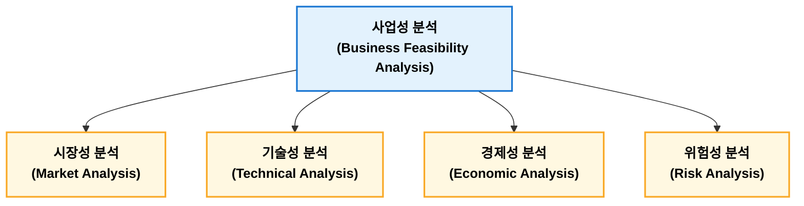

## 사업성 분석

사업성 분석(Business Feasibility Analysis)은 신규 사업이나 설비 투자 의사결정을 위해 시장성, 기술성, 경제성, 위험성을 종합적으로 평가하는 활동이다. 시장성 분석에서는 수요와 경쟁 환경을 검토하고 기술성 분석에서는 생산 기술과 품질 확보 가능성을 평가한다. 경제성 분석에서는 ROI, 회수기간, NPV, IRR 등을 활용하여 투자 가치를 평가하며, 위험성 분석에서는 민감도 분석과 시나리오 분석 등을 통해 불확실성을 검토한다. 공장관리 측면에서는 생산설비 투자, 자동화 구축, 생산 방식 결정 등 주요 의사결정 과정에서 사업성 분석을 활용한다.

| 구분  | 핵심 질문        | 대표 기법           |
| --- | ------------ | --------------- |
| 시장성 | 팔 수 있는가?     | 시장 규모, 수요 예측    |
| 기술성 | 만들 수 있는가?    | 공정능력, 생산기술 평가   |
| 경제성 | 돈이 되는가?      | ROI, NPV, IRR   |
| 위험성 | 위험은 관리 가능한가? | 민감도 분석, 시나리오 분석 |

### 사업성 분석 목적

사업성 분석 주요 목적은 다음과 같다.

| 목적        | 내용                 |
| --------- | ------------------ |
| 투자 타당성 판단 | 투자 대비 경제적 가치 평가    |
| 위험 관리     | 시장·기술·경제적 위험 사전 분석 |
| 최적 대안 선정  | 여러 투자안 비교 평가       |
| 자원 배분     | 한정된 자원의 효율적 활용     |

### 사업성 분석 주요 구성요소

#### 시장성 분석

시장성 분석(Market Feasibility Analysis)은 제품 또는 서비스의 시장 규모, 성장 가능성, 고객 요구, 경쟁 상황 등을 분석하는 활동이다.

| 항목    | 내용            |
| ----- | ------------- |
| 시장 규모 | 현재 및 미래 수요 규모 |
| 성장성   | 시장 확대 가능성     |
| 고객 요구 | 품질, 가격, 납기 요구 |
| 경쟁 분석 | 경쟁사, 대체재 분석   |
| 판매 전망 | 예상 판매량 및 가격   |

!!! example "자동차 부품 신규 생산라인 투자 검토"  

      **시장성 분석**

      - 전기차 시장 성장률
      - 예상 수요
      - 고객사 공급 계획
      - 경쟁 업체 생산능력

      분석 내용을 기반으로 생산량과 예상 매출을 전망한다. (개당 10,000원 가정)

      $$
      50만개 \times 10,000원 = 50억원
      $$

#### 기술성 분석

기술성 분석(Technical Feasibility Analysis)은 요구되는 제품과 생산 목표를 달성할 수 있는 기술적 가능성을 평가한다.

| 항목         | 내용             |
| ---------- | -------------- |
| 생산 기술      | 제조 방법 및 공정 가능성 |
| 설비 능력      | 생산능력(Capacity) |
| 품질 수준      | 요구 품질 확보 가능성   |
| 기술 인력      | 운영 가능 인력       |
| 특허 및 기술 확보 | 기술 확보 여부       |

!!! example "신규 반도체 공정 도입 검토"  

      **평가 내용**

      - 공정 수율
      - 장비 성능
      - 공정 Capacity(Cp, Cpk)
      - 불량률 수준

      평가된 내용 기반으로 현재 기술 수준으로 목표 수율 달서 가능 여부를 판단한다.
      
#### 경제성 분석

경제성 분석(Economic Feasibility Analysis)은 투자 비용과 미래 현금 흐름을 분석하여 투자 가치와 수익성을 평가하는 과정이다. 사업성 분석에 있어 가장 중요하다.

| 방법             | 평가 기준     | 특징          |
| -------------- | --------- | ----------- |
| ROI            | 투자 대비 수익률 | 간단하고 직관적    |
| Payback Period | 투자 회수 기간  | 위험 관리 용이    |
| NPV            | 현재 가치 기준  | 가장 이론적으로 우수 |
| IRR            | 수익률 기준    | 투자안 비교 용이   |

1. 투자수익률법(ROI, Return on Investment)  
    투자 대비 수익성을 나타낸다.

    $$ROI = \frac{투자수익}{투자금액} \times 100$$

2. 회수기간법(Payback Period)  
    투자한 금액을 회수하는데 걸리는 기간이다.

    $$회수기간 = \frac{초기투자액}{연간현금유입}$$

3. 순현재가치(NPV, Net Present Value)  
    미래 발생하는 현금 흐름을 가치로 환산하여 투자 가치를 평가하는 방법이다.

    $$NPV = \sum^{n}_{t=1}\frac{CF_t}{(1+r)^t} - I$$

    - $CF_t$: $t$년도 현금 흐름
    - $r$: 할인율(미래에 들어오거나 나갈 돈의 가치를 현재 기준으로 바꿀 때 쓰는 이자율)
    - $I$: 초기 투자

    | NPV     | 판단       |
    | ------- | -------- |
    | NPV > 0 | 투자 가치 있음 |
    | NPV < 0 | 경제성 부족   |

4. 내부수익률법(IRR, Internal Rate of Return)  
    NPV를 0으로 만드는 할인율이다.

    $$NPV = 0$$

    NPV > 요구수익률이면 투자 타당성이 있다고 판단한다.

#### 위험성 분석

위험성 분석(Risk Analysis)은 사업 추진 과정에서 발생 가능한 위험 요소를 식별하고 대응 방안을 수립하는 활동이다.

**주요 위험**

| 구분    | 내용           |
| ----- | ------------ |
| 시장 위험 | 수요 감소, 경쟁 심화 |
| 기술 위험 | 기술 실패, 품질 문제 |
| 경제 위험 | 원가 상승, 환율 변화 |
| 운영 위험 | 생산 차질, 인력 부족 |

분석 방법으로 민감도 분석과 시나리오 분석이 있다.

**민감도 분석(Sensitivity Analysis)**

특정 변수 변화가 사업성에 미치는 영향을 분석한다. 예로 판매량 감소 10%하면 NPV 변환 분석을 진행하여 사업 위험 요소를 파악한다.

**시나리오 분석(Scenario Analysis)**

여러 상황을 가정하여 평가를 진행하다.

| 상황 |  판매량 |
| -- | ---: |
| 낙관 | 120% |
| 기준 | 100% |
| 비관 |  80% |

