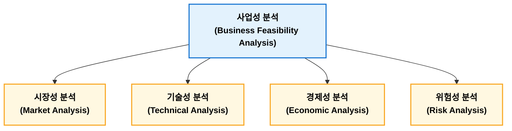

## 사업성 분석

**사업성 분석(Business Feasibility Analysis)**은 신규 사업이나 설비 투자 의사결정을 위해 시장성, 기술성, 경제성, 위험성을 종합적으로 평가하는 활동이다. 시장성 분석에서는 수요와 경쟁 환경을 검토하고 기술성 분석에서는 생산 기술과 품질 확보 가능성을 평가한다. 경제성 분석에서는 ROI, 회수기간, NPV, IRR 등을 활용하여 투자 가치를 평가하며, 위험성 분석에서는 민감도 분석과 시나리오 분석 등을 통해 불확실성을 검토한다. 공장관리 측면에서는 생산설비 투자, 자동화 구축, 생산 방식 결정 등 주요 의사결정 과정에서 사업성 분석을 활용한다.

```text
사업성 분석(Business Feasibility Analysis)
│
├── 1. 사업성 분석 개요
│      ├── Feasibility Study
│      ├── Investment Decision
│      ├── Business Case
│      ├── Economic Evaluation
│      └── Risk Analysis
│
├── 2. 시장성 분석(Market Feasibility)
│      ├── 시장 규모
│      ├── 성장성
│      ├── 고객 분석
│      ├── 경쟁 분석
│      ├── STP
│      ├── SWOT
│      └── 5 Forces
│
├── 3. 기술성 분석(Technical Feasibility)
│      ├── 기술 확보 가능성
│      ├── 생산공정
│      ├── 설비 능력
│      ├── 품질 수준
│      ├── 기술 위험
│      └── 생산 가능성
│
├── 4. 경제성 분석(Economic Feasibility)
│      ├── 투자비(CAPEX)
│      ├── 운영비(OPEX)
│      ├── 매출 추정
│      ├── 손익 분석
│      ├── Cash Flow
│      └── 투자 타당성
│
├── 5. 투자경제성 평가
│      ├── Payback Period
│      ├── ROI
│      ├── NPV
│      ├── IRR
│      ├── B/C Ratio
│      └── Break Even Point
│
├── 6. 위험 분석
│      ├── Sensitivity Analysis
│      ├── Scenario Analysis
│      ├── Risk Assessment
│      ├── Monte Carlo Simulation
│      └── Contingency Plan
│
└── 7. 의사결정
       ├── Go / No-Go
       ├── Investment Priority
       ├── Resource Allocation
       └── Continuous Review
```

사업성 분석 주요 목적은 다음과 같다.

| 목적        | 내용                 |
| --------- | ------------------ |
| 투자 타당성 판단 | 투자 대비 경제적 가치 평가    |
| 위험 관리     | 시장·기술·경제적 위험 사전 분석 |
| 최적 대안 선정  | 여러 투자안 비교 평가       |
| 자원 배분     | 한정된 자원의 효율적 활용     |

사업성 분석에 있어 주요 구성요소와 대표 기법은 다음과 같다.

| 구분  | 핵심 질문        | 대표 기법           |
| --- | ------------ | --------------- |
| 시장성 | 팔 수 있는가?     | 시장 규모, 수요 예측    |
| 기술성 | 만들 수 있는가?    | 공정능력, 생산기술 평가   |
| 경제성 | 돈이 되는가?      | ROI, NPV, IRR   |
| 위험성 | 위험은 관리 가능한가? | 민감도 분석, 시나리오 분석 |

### 주요 구성요소



#### 시장성 분석

시장성 분석(Market Feasibility Analysis)은 제품 또는 서비스의 시장 규모, 성장 가능성, 고객 요구, 경쟁 상황 등을 분석하는 활동이다.

| 항목    | 내용            |
| ----- | ------------- |
| 시장 규모 | 현재 및 미래 수요 규모 |
| 성장성   | 시장 확대 가능성     |
| 고객 요구 | 품질, 가격, 납기 요구 |
| 경쟁 분석 | 경쟁사, 대체재 분석   |
| 판매 전망 | 예상 판매량 및 가격   |

!!! example "자동차 부품 신규 생산라인 투자 검토"  

    **시장성 분석**

    - 전기차 시장 성장률
    - 예상 수요
    - 고객사 공급 계획
    - 경쟁 업체 생산능력

    분석 내용을 기반으로 생산량과 예상 매출을 전망한다. (개당 10,000원 가정)

    $$50만개 \times 10,000원 = 50억원$$

#### 기술성 분석

기술성 분석(Technical Feasibility Analysis)은 요구되는 제품과 생산 목표를 달성할 수 있는 기술적 가능성을 평가한다.

| 항목         | 내용             |
| ---------- | -------------- |
| 생산 기술      | 제조 방법 및 공정 가능성 |
| 설비 능력      | 생산능력(Capacity) |
| 품질 수준      | 요구 품질 확보 가능성   |
| 기술 인력      | 운영 가능 인력       |
| 특허 및 기술 확보 | 기술 확보 여부       |

!!! example "신규 반도체 공정 도입 검토"  

      **평가 내용**

      - 공정 수율
      - 장비 성능
      - 공정 Capacity(Cp, Cpk)
      - 불량률 수준

      평가된 내용 기반으로 현재 기술 수준으로 목표 수율 달서 가능 여부를 판단한다.
      
#### 경제성 분석

경제성 분석(Economic Feasibility Analysis)은 투자 비용과 미래 현금 흐름을 분석하여 투자 가치와 수익성을 평가하는 과정이다. 사업성 분석에 있어 가장 중요하다.

| 방법             | 평가 기준     | 특징          |
| -------------- | --------- | ----------- |
| ROI            | 투자 대비 수익률 | 간단하고 직관적    |
| Payback Period | 투자 회수 기간  | 위험 관리 용이    |
| NPV            | 현재 가치 기준  | 가장 이론적으로 우수 |
| IRR            | 수익률 기준    | 투자안 비교 용이   |

1. **투자수익률법(ROI, Return on Investment)**  
    투자 대비 수익성을 나타낸다.

    $$ROI = \frac{투자수익}{투자금액} \times 100$$

2. **회수기간법(Payback Period)**  
    투자한 금액을 회수하는데 걸리는 기간이다.

    $$회수기간 = \frac{초기투자액}{연간현금유입}$$

3. **순현재가치(NPV, Net Present Value)**  
    미래 발생하는 현금 흐름을 가치로 환산하여 투자 가치를 평가하는 방법이다.

    $$NPV = \sum^{n}_{t=1}\frac{CF_t}{(1+r)^t} - I$$

    - $CF_t$: $t$년도 현금 흐름
    - $r$: 할인율(미래에 들어오거나 나갈 돈의 가치를 현재 기준으로 바꿀 때 쓰는 이자율)
    - $I$: 초기 투자

    | NPV     | 판단       |
    | ------- | -------- |
    | NPV > 0 | 투자 가치 있음 |
    | NPV < 0 | 경제성 부족   |

4. **내부수익률법(IRR, Internal Rate of Return)**  
    NPV를 0으로 만드는 할인율(IRR)이다.

    $$NPV = NPV = \sum^{n}_{t=1}\frac{CF_t}{(1+IRR)^t} - I = 0$$

    NPV > 요구수익률(IRR)이면 투자 타당성이 있다고 판단한다.


#### 위험성 분석

위험성 분석(Risk Analysis)은 사업 추진 과정에서 발생 가능한 위험 요소를 식별하고 대응 방안을 수립하는 활동이다.

**주요 위험**

| 구분    | 내용           |
| ----- | ------------ |
| 시장 위험 | 수요 감소, 경쟁 심화 |
| 기술 위험 | 기술 실패, 품질 문제 |
| 경제 위험 | 원가 상승, 환율 변화 |
| 운영 위험 | 생산 차질, 인력 부족 |

분석 방법으로 민감도 분석과 시나리오 분석이 있다.

**민감도 분석(Sensitivity Analysis)**

특정 변수 변화가 사업성에 미치는 영향을 분석한다. 예로 판매량 감소 10%하면 NPV 변환 분석을 진행하여 사업 위험 요소를 파악한다.

**시나리오 분석(Scenario Analysis)**

여러 상황을 가정하여 평가를 진행하다.

| 상황 |  판매량 |
| -- | ---: |
| 낙관 | 120% |
| 기준 | 100% |
| 비관 |  80% |

#### 사업성 분석 예제

자동화 설비 도입을 검토한다고 가정한다.

**투자비**

| 항목    |   금액 |
| ----- | ---: |
| 설비 구매 |  8억원 |
| 설치비   |  1억원 |
| 교육비   |  1억원 |
| 합계    | 10억원 |

**기대효과**

| 항목     |    효과 |
| ------ | ----: |
| 인건비 절감 | 1.5억원 |
| 불량 감소  | 0.5억원 |
| 생산성 향상 |   1억원 |
| 합계     |   3억원 |

**경제성 평가**

1. ROI  

    $$ROI=\frac{3억}{10억} \times 100 = 30\%$$

2. 회수기간

    $$\frac{10억}{3억} = 3.3년$$

**판단**

- 기술성: 생산 목표 달성 가능
- 시장성: 수요 확보 가능
- 경제성: 3.3년 내 투자 회수 가능

투자 타당성 있다고 판단할 수 있다.

## 손익분기점 분석

**손익분기점 분석(Break-Even Point Analysis, BEP)**이란 총수익(Total Revenue)과 총비용(Total Cost)이 일치하여 이익도 손실도 발생하지 않는 생산량 또는 매출액을 분석하는 기법이다. 즉, 기업이 손실을 보지 않기 위해 최소한 얼마를 생산·판매해야 하는지를 분석하는 방법이다. 손익분기점 생산량은 고정비를 단위당 공헌이익으로 나누어 계산하며, 공헌이익은 판매단가에서 단위변동비를 차감한 금액이다. 제조업에서는 설비 투자, 생산량 결정, 가격 정책, 사업성 분석 등에 활용되며 공정 개선을 통해 변동비를 절감하거나 고정비를 낮추면 손익분기점을 낮출 수 있다.


### 핵심 구성 요소

손익분기점을 산출하고 분석하기 위해서는 비용 구조를 고정비와 변동비로 구분해야 한다.

1. **고정비(Fixed Cost, FC)**  

    생산량이나 판매량의 변동과 관계없이 일정하게 발생하는 고정적인 비용이다.
    
    * **대표 항목**
    사업장 임차료, 설비 감가상각비, 관리직 기본급, 화재보험료

2. **변동비(Variable Cost, VC)**  

    생산량이나 판매량에 직접 비례하여 일정 비율로 증가하거나 감소하는 비용이다.

    * **대표 항목**
    원자재비, 포장재비, 공정 직접 노무비, 판매 수수료

3. **공헌이익(Contribution Margin)**  

    매출액에서 변동비를 차감한 금액으로, 고정비를 회수하고 영업이익 창출에 기여하는 유효 이익이다.

    * **단위당 공헌이익 수식**
    
        $$\text{단위당 공헌이익} = \text{단위당 판매가격}(P) - \text{단위당 변동비}(V)$$    
    
    * **공헌이익률 수식**
    
        $$\text{공헌이익률} = \frac{\text{단위당 공헌이익}}{\text{단위당 판매가격}} = \frac{\text{총 공헌이익}}{\text{총 매출액}}$$


### 산출 공식

손익분기점은 목표로 하는 분석 단위에 따라 판매량 단위 또는 매출액 단위로 계산한다.

1. **손익분기점 수량($Q_{\text{BEP}}$)**  

    고정비를 회수하기 위해 판매해야 하는 최소 제품 개수이다.
    
    $$Q_{\text{BEP}} = \frac{\text{고정비}}{\text{단위당 판매가격} - \text{단위당 변동비}} = \frac{\text{고정비}}{\text{단위당 공헌이익}}$$

2. **손익분기점 매출액($S_{\text{BEP}}$)**  

    손익분기점에 도달하기 위해 달성해야 하는 최소 매출 금액이다.
    
    $$S_{\text{BEP}} = \frac{\text{고정비}}{\text{공헌이익률}} = Q_{\text{BEP}} \times \text{단위당 판매가격}$$


### 활용 및 의의

손익분기점은 가격 설정, 비용 구조 개선 등에 활용될 수 있다.

* **가격 설정 기준 제공**  
    제품의 원가 구조를 파악하여 손실을 면하기 위한 최소 판매 가격 산정
* **목표 판매량 수립**  
    목표 영업이익을 달성하기 위해 필요한 필수 판매 수량 및 매출액 계산
* **안전율(Margin of Safety) 측정**  
    현재 매출액이 손익분기점 매출액을 얼마나 초과하는지 파악하여 매출 감소에 대한 경영 내구성 평가
* **비용 구조 개선**  
    고정비 절감 및 변동비 비율 감소를 통한 손익분기점 인하 전략 수립

!!! note "비용 구조에 따른 손익분기점 특성 비교"

    기업의 비용 구조(고정비 비중 vs 변동비 비중)에 따라 손익분기점의 위험성과 수익 변동성이 달라진다.
    
    | 구분 | 고정비 비중이 높은 구조 | 변동비 비중이 높은 구조 |
    | --- | --- | --- |
    | **특징** | 초기 투자가 많은 장치 산업, 자동화 공정 | 외주 가공 비중이 높거나 유통업 중심 |
    | **손익분기점 위치** | 상대적으로 높음 | 상대적으로 낮음 |
    | **손익분기점 초과 시** | 변동비가 적어 한계이익 급증(영업레버리지 높음) | 매출이 증가해도 이익 증가 폭이 완만함 |
    | **매출 감소 시** | 고정비 부담으로 손실 폭이 커짐 | 비용도 함께 줄어 손실 폭이 작음 |

!!! example "카페 창업 손익분기점"

    카페를 창업했다고 가정한다.

    - 월 임대로 및 인건비(고정비): 5,000,000원
    - 커피 한잔 판매가격: 5,000원
    - 원두·컵 등 재료비(변동비): 2,000원

    1. 공헌이익 계산  

        $$5,000 - 2,000 = 3,000(원)$$

        커피 한잔을 팔 때마다 3,000원씩 고정비를 회수한다.
    2. 손익분기점 계산  

        $$\frac{5,000,000}{3,000} = 1,667(잔)$$

        즉, 한 달에 1,667잔을 판매야햐 손실도 이익도 없는 상태가 된다.

        |    판매량 | 결과         |
        | -----: | ---------- |
        | 1,200잔 | 적자         |
        | 1,667잔 | 손익분기점(BEP) |
        | 2,000잔 | 흑자         |

!!! example "자동차 부품 생산라인 신설"

    자동차 부품 생산라인을 신설한다고 가정한다.

    | 항목                  |        금액 |
    | ------------------- | --------: |
    | 고정비(설비 감가상각, 관리비 등) |      2억 원 |
    | 판매가격                | 50,000원/개 |
    | 단위변동비               | 30,000원/개 |

    1. 공헌이익  

        $$50,000 - 30,,000 = 20,000(원)$$

    2. 손익분기점 생산량  

        $$\frac{200,000,000}{20,000} = 10,000(개)$$

    따라서 10,000개가 손익분기점 생산량으로 10,000개를 초가하면 이익이 발생하지만 10,000 미만으로 판매하면 적자가 발생하게 된다.

### 손익분기점 개선 방법

손익분기점은 다음과 같은 방법으로 낮출 수 있다.

| 방법      | 효과             |
| ------- | -------------- |
| 고정비 절감  | 설비 투자비, 관리비 절감 |
| 변동비 절감  | 원가 절감, 공정 개선   |
| 판매가격 인상 | 공헌이익 증가        |
| 생산성 향상  | 단위당 변동비 감소     |
        
예로, 공정개선으로 변동비를 30,000원에서 25,000원으로 절감하면 공헌이익은 다음과 같이 계산된다.

$$공헌이익 = 50,000 - 25,000 = 25,000(월)$$

손익분기점 판매량은 다음과 같이 계산된다.

$$\frac{200,000,000}{25,000} = 8,000(개)$$

즉, 10,000개에서 8,000개로 감소하여 더 적은 판매량으로도 손익분기점에 도달할 수 있다.

