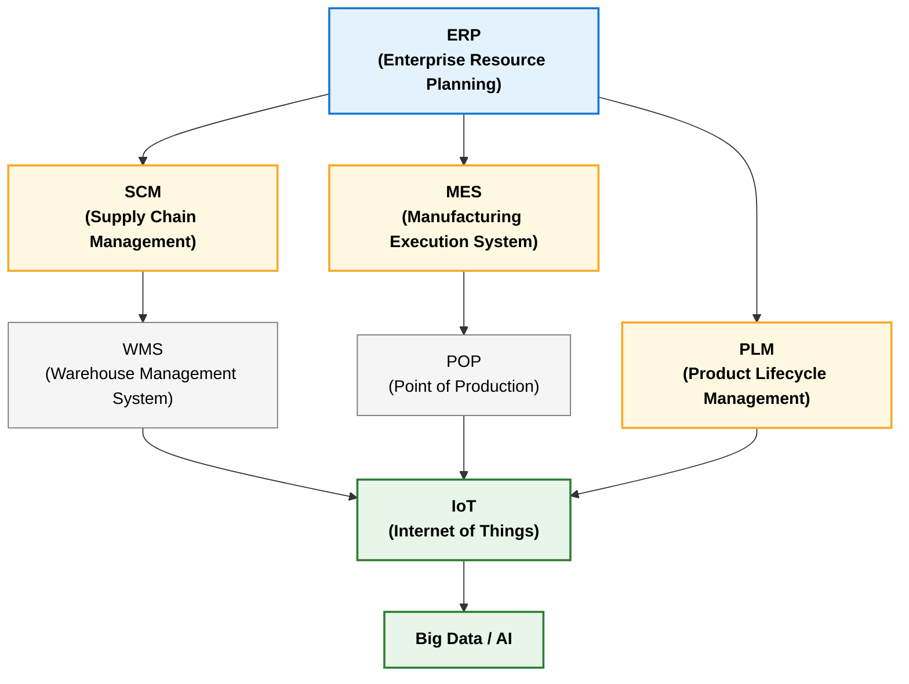
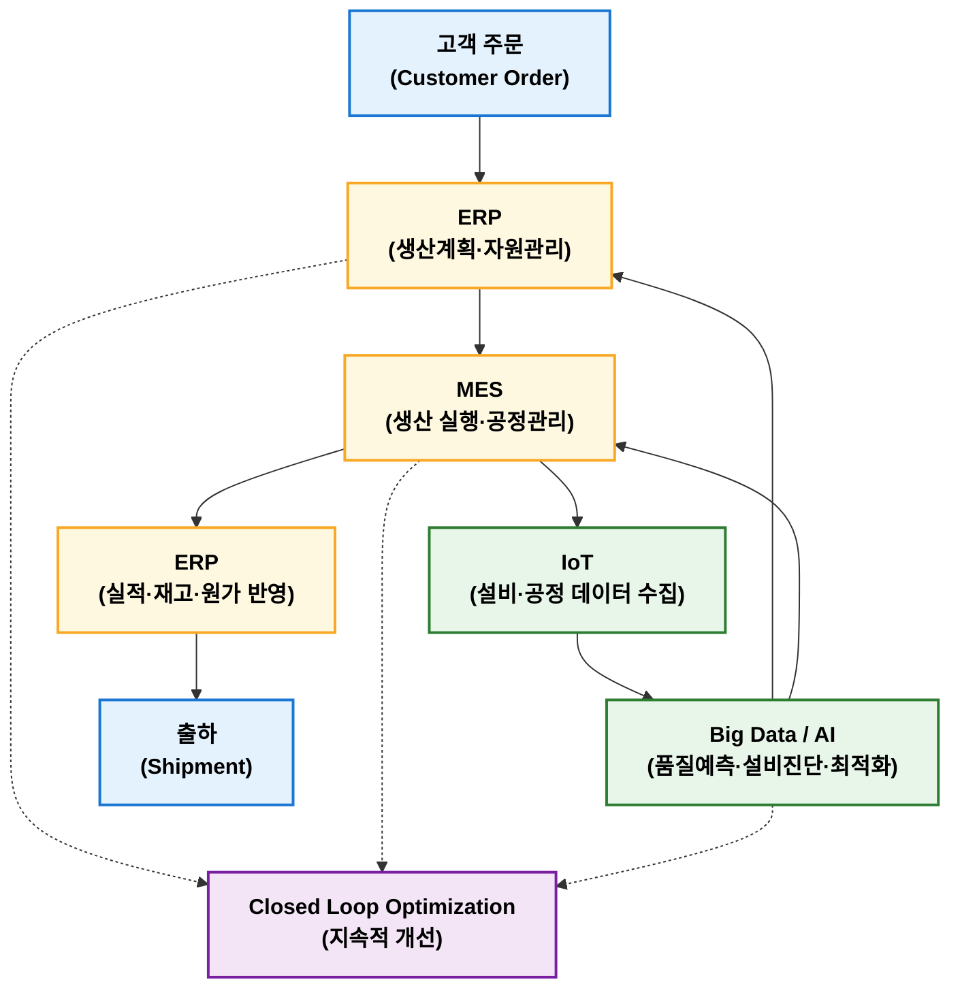
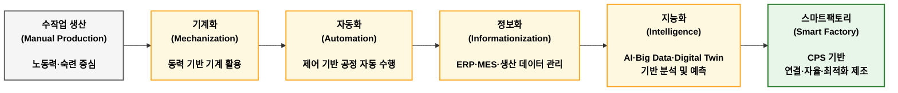
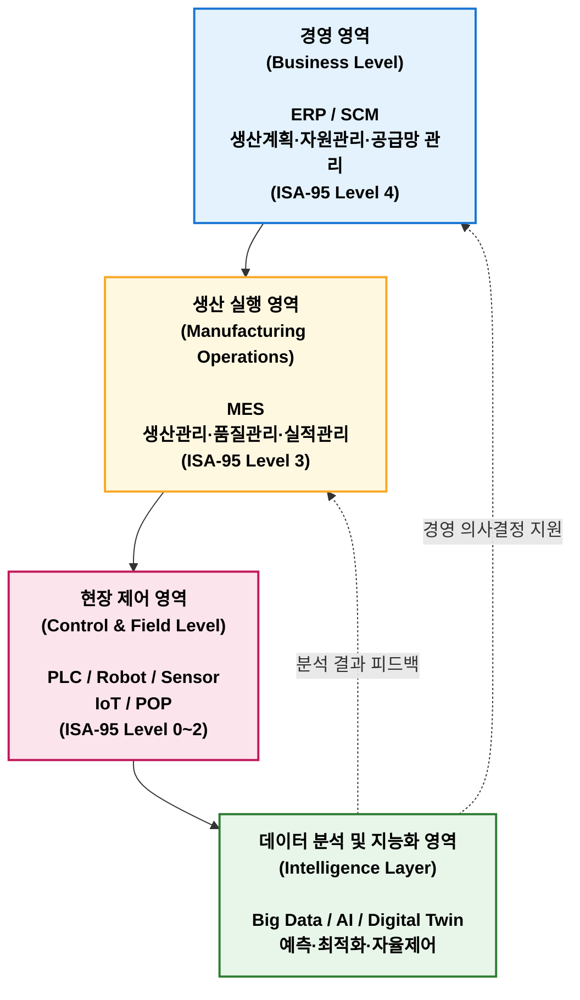

## 정보화 활용기술

정보화 활용 기술(Production Support Technology)은 생산활동을 지원하기 위해 정보통신기술과 정보시스템을 활용하는 기술이다. 주요 시스템으로는 ERP, MES, SCM, PLM, WMS 등이 있으며, ERP는 전사 자원관리, MES는 생산 실행관리, SCM은 공급망 최적화 관리, PLM은 제품 생애주기 관리, WMS는 창고 및 재고 관리를 담당한다. 최근 IoT를 통한 실시간 데이터 수집과 Big Data·AI를 활용한 품질 예측, 설비 예지보전 등으로 발전하고 있으며, 이러한 기술들은 스마트팩토리 구현에 있어 핵심 기반이 된다.

### 정보화 활용 기술 목적

정보화를 통해 다음과 같은 효과를 얻을 수 있다.

| 목적      | 내용             |
| ------- | -------------- |
| 생산성 향상  | 자동화 및 업무 효율 증대 |
| 품질 향상   | 실시간 품질 데이터 관리  |
| 원가 절감   | 재고 및 낭비 최소화    |
| 납기 단축   | 생산 및 물류 정보 공유  |
| 의사결정 지원 | 실시간 데이터 기반 경영  |

### 정보화 활용 기술 구성

대표적인 정보화 기술 관련 시스템이다.

| 시스템           | 역할                         |
| ------------- | -------------------------- |
| ERP           | 기업 전체 자원 및 경영관리            |
| SCM           | 공급망 계획 및 물류 관리             |
| WMS           | 창고 및 재고 관리(SCM의 하위)        |
| MES           | 생산 실행 및 현장 관리              |
| POP           | 생산 실적 및 설비 데이터 수집(MES의 하위) |
| PLM           | 제품 기획부터 폐기까지의 제품 수명주기 관리   |
| IoT           | 설비·물류·제품 데이터 수집 인프라        |
| Big Data / AI | 데이터 분석, 예지보전, 품질예측, 생산 최적화 |

#### ERP

ERP (Enterprise Resource Planning)는 기업 자산(생산, 구매, 재무, 인사 등)을 통합 관리하는 전사적 자원관리 시스템이다.

**주요 기능**

- 생산 계획
- 구매 관리
- 재고 관리
- 회계 관리
- 원가 관리

제조업 경우, 고객 주문이 ERP에 등록되면 생산계획 생성, 자재 구매 요청, 그리고 출하 및 매출 관리를 진행한다.

#### MES 

MES (Manufacturing Execution System)s는 생산계획과 실제 생산현장을 연결하는 생산실행 시스템이다.

**주요 기능**

- 작업지시
- 공정 추적
- 생산실적 관리
- 설비 가동 정보
- 작업자 관리
- 품질 및 불량 관리

제조업 경우, ERP에 주문이 등록되면 생산계획을 수립하고 MES를 통해 작업지시, 설비 생산, 생산실적 자동 수집이 이루어진다.

#### SCM

SCM (Supply Chain Management)은 원자재 조달부터 고객에게 제품이 전달될 때까지 공급방 전체를 최적화하는 시스템이다.

**주요 기능**

- 수요예측
- 공급계획
- 물류관리
- 재고관리
- 협력업체 관리

#### PLM

PLM (Product Lifecycle Management)은 제품 기획부터 설계, 생산, 유지보수, 폐기까지 제품 생애주기를 관리하는 시스템이다.

**주요 기능**

- 도면관리
- BOM 관리
- 설계 변경관리
- 제품 이력관리

#### WMS

WMS (Warehouse Management System)는 창고 운영과 재고를 효율적으로 관리하는 시스템이다.

**주요 기능**

- 입고관리
- 출고관리
- 재고관리
- 위치관리
- 바코드 관리

#### POP

POP (Point of Production)는 생산현장에서 작업 실적을 실시간으로 수집하는 시스템이다.

**주요 기능**

- 생산량 집계
- 작업시간 관리
- 설비 가동율
- 작업자 실적

#### IoT

IoT (Internet of Things)는 설비와 센서를 네트워크로 연결하여 데이터를 실시간 수집하는 기술이다.

**활용 사례**

- 설비 온도 모니터링
- 진동 측정
- 전력 사용량 관리
- 예지보전(Predictive Maintenance)

#### Big Data/AI

Big Data는 대량의 생산 데이터를 저장하고 분석하는 기술이다. AI는 데이터를 기반으로 예측 및 최적화를 수행하는 기술이다. 

**활용 사례**

- 불량 예측
- 수요 예측
- 공정 최적화
- 이상 탐지
- 설비 고장 예

### 정보화 기술 연계

## 스마트팩토리

**스마트팩토리**(Smart Factory)란 제조 전 과정에 정보통신기술(ICT), 자동화 기술, 데이터 분석 기술, 인공지능(AI)을 적용하여 생산 시스템을 지능화한 공장을 의미한다. 단순한 자동화 공장과 차이점은 설비 자동화 자체가 목적이 아니라 생산 데이터를 기반으로 스스로 판단하고 최적화하는 지능형 생산체계 구축에 있다.

> 스마트공장은 제품의 기획부터 판매까지 모든 생산과정을 ICT(정보통신)기술로 통합해 최소 비용과 시간으로 고객 맞춤형 제품을 생산하는 사람 중심의 첨단 지능형 공장이다.  
> 출처: 중소벤처기업부

!!! note "기존 자동화 공장 vs. 스마트팩토리"  

      | 구분     | 자동화 공장     | 스마트팩토리       |
      | ------ | ---------- | ------------ |
      | 목적     | 작업 자동화     | 생산 최적화       |
      | 중심     | 설비         | 데이터          |
      | 운영 방식  | 사전에 설정된 제어 | 데이터 기반 자율 판단 |
      | 데이터 활용 | 제한적        | 실시간 분석 및 활용  |
      | 품질관리   | 검사 중심      | 예측 및 예방 중심   |
      | 설비관리   | 예방보전       | 예지보전         |

### 스마트팩토리 구성 기술

스마트팩토리는 크게 현장 데이터 수집 → 데이터 관리 → 분석 및 의사결정 → 최적화 구조로 구성된다.

### 스마트팩토리 구축 단계

스마트공장 ICT 기술 활용 정도 및 역량 등에 따라 '구축 시스템 스마트화 수준(기초 - 중간1 - 중간2 - 고도)'을 구분하고 있다.

<figure markdown>  
    
      

<figcaption>중소밴처기업부 스마트공장관리시스템 https://www.smart-factory.kr/usr/pr/sf/ma/smrtFctryIntrcn</figcaption>
      
</figure>

### 5대 조건

아래는 스마트공장을 구성하고 수준별로 발전시킴에 있어 꼭 필요한 5가지 조건이다.

1. **4M + 1E의 디지털화**  
    4M+1E의 각 요소 (Man, Machinery, Material, Method, Environment) 들의 실시간으로 디지털 값을 인지하고, 측정 가능한 정보를 제공해야 하며, 통신을 통해 대화가 가능해야 함
2. **지능화**  
    알고리즘 또는 인공지능 등의 솔루션을 이용, 최적해 또는 예측가능한 해를 제공해야 함
3. **통합**  
    사회망과 가치사슬을 통해 단대단 (End-to-end) 의 정보 교류가 이뤄지도록 하는 수평적 통합과 최하위 수준인 기계장치부터 기업비즈니스 수준까지 수직적 통합을 지향
4. **엔지니어링 지식의 창출**  
    지속해서 정보를 확보하고 저장한 후, 이를 바탕으로 자동화를 위한 제조 지식을 점진적으로 창출할 수 있어야함
5. **스마트 시스템과의 연결**  
    향후에 발전할 스마트 제품들과 통신 표준에 의거해 연결이 가능해야함

