## 제품개발기술

### 정의

제품개발기술(Product Development Technology)이란 고객 요구사항을 반영하여 제품 기획, 설계, 시험, 검증, 양산까지 제품을 개발하기 위한 제반 기술과 방법론을 의미한다.

### 목적

제품개발 주요 목적은 경쟁우선순위 QCDFS(Quality, Cost, Delivery, Flexibility, Service) 확보이다.

| 목적        | 내용                |
| --------- | ----------------- |
| 품질 확보(Q)  | 고객 요구 품질 및 신뢰성 확보 |
| 원가 절감(C)  | 설계 단계에서 제조비용 최소화  |
| 납기 단축(D)  | 개발 기간 및 출시 기간 단축  |
| 유연성 확보(F) | 다양한 고객 요구 대응      |
| 서비스 향상(S) | 사용자 만족 및 유지관리성 향상 |

특히 제조업에서는 "설계 단계에서 원가 70~80%가 결정된다"는 관점에서 제품개발 단계는 중요하다.

### 프로세스

일반적인 제품개발 프로세스는 다음과 같다.

```mermaid
flowchart LR

    classDef start fill:#E3F2FD,stroke:#1976D2,stroke-width:2px,color:#000,font-weight:bold;
    classDef process fill:#FFF8E1,stroke:#F9A825,stroke-width:2px,color:#000,font-weight:bold;
    classDef improve fill:#E8F5E9,stroke:#2E7D32,stroke-width:2px,color:#000,font-weight:bold;


    A["고객 요구 분석<br/>(VOC·시장 요구사항)"]:::start

    B["제품 기획<br/>(Product Planning)<br/>제품 사양·사업성 검토"]:::process

    C["개념 설계<br/>(Concept Design)<br/>기능 설계·QFD"]:::process

    D["상세 설계<br/>(Detailed Design)<br/>도면·BOM·공차 설계"]:::process

    E["시제품 제작<br/>(Prototype)<br/>설계 검증"]:::process

    F["시험 및 검증<br/>(Test & Validation)<br/>성능·신뢰성 평가"]:::process

    G["양산 준비<br/>(Production Preparation)<br/>공정 설계·설비·표준화"]:::process

    H["양산 및 개선<br/>(Mass Production & Improvement)<br/>품질 안정화·Kaizen"]:::improve


    A --> B
    B --> C
    C --> D
    D --> E
    E --> F
    F --> G
    G --> H

```



| 단계         | 주요 활동            | 주요 기술 및 기법                                              | 주요 산출물                                       |
| ---------- | ---------------- | ------------------------------------------------------- | -------------------------------------------- |
| ① 고객 요구 분석 | 고객 요구 및 시장 환경 분석 | VOC 분석, 시장조사, 경쟁사 분석, Kano 분석, Benchmarking             | VOC 데이터, 시장분석 보고서, 고객 요구사항 목록                |
| ② 제품 기획    | 제품 목표 및 개발 방향 설정 | 제품 사양 정의, 사업성 분석, QFD, 목표원가(Target Costing)             | 제품 기획서, Product Specification, 개발 계획서, 목표 원가 |
| ③ 개념 설계    | 제품 기능 및 구조 설계    | 기능 분석(Function Analysis), QFD, TRIZ, System Engineering | 기능 구조도, 개념 설계안, 기술 요구사항                      |
| ④ 상세 설계    | 제품 형상 및 부품 설계    | CAD, CAE, 공차 설계, DFM/DFA, FMEA                          | 3D 모델, 도면, BOM, 설계 FMEA, 공차 기준               |
| ⑤ 시제품 제작   | 설계 검증용 제품 제작     | Prototype, Rapid Prototyping, Mock-up, 시험 제작            | 시제품, 제작 결과 보고서, 개선 사항                        |
| ⑥ 시험 및 검증  | 제품 성능 및 신뢰성 검증   | 성능시험, 신뢰성시험, 환경시험, 인증시험, DOE                            | 시험 성적서, 검증 보고서, 개선 결과                        |
| ⑦ 양산 준비    | 생산 가능성 확보        | 공정설계, Layout 설계, PFMEA, Control Plan, 작업표준화             | 공정도, 작업표준서, 검사기준서, 생산능력 평가                   |
| ⑧ 양산 및 개선  | 양산 안정화 및 지속 개선   | SPC, Six Sigma, VE/VA, TPM, Kaizen                      | 양산 품질 데이터, 개선 보고서, 원가 절감 결과                  |

#### 주요 설계 기법

```
제품설계 기법
│
├── 고객 요구 반영
│   ├── QFD
│   └── Kano Model
│
├── 기능·가치 최적화
│   ├── VE
│   └── VA
│
├── 제조·조립성 향상
│   ├── DFM
│   ├── DFA
│   ├── DFMA
│   └── DFX
│
├── 품질·신뢰성 확보
│   ├── FMEA
│   ├── Robust Design
│   └── Tolerance Design
│
├── 개발 효율화
│   ├── Concurrent Engineering
│   ├── Modular Design
│   ├── Platform Design
│   └── TRIZ
│
└── 디지털 설계
    ├── CAD
    ├── CAE
    └── Digital Twin
```

## 제품설계 기법

### 고객 요구 반영

#### QFD

QFD(Quality Function Deployment, 품질기능전개)는 고객 요구사항(VOC)을 제품 설계 요구사항으로 변환하는 체계적인 설계 기법이다. 즉, VOC를 기술 특성으로 전개하는 방법이다. 주요 도구에는 품질의 집(House of Quality)가 있다.

!!! example "VOC → 기술 요구사항으로 변환"  

    **고객요구사항**

    - 자동차 연비가 좋았으면 한다.

    **기술요구사항**

    - 차량 중량 감소
    - 엔진 효율 향상
    - 공기저항 감소

#### Kano Model

카노 모델(Kano Model)은 카노 노리아키에 의해 1980년대에 연구된 제품 개발을 논하는 상품기획이론이다. 어떤 상품을 기획할 때 각각 구성요소에 대해 소비자가 기대하는 것을 **충족, 불충족이라는 객관적인 관계**와 소비자의 **만족, 불만족이라는 주관적인 관계** 사이의 상호관계를 통해 **5가지 품질요소**로 구분하여 설명한다.

<figure markdown>


<figcaption>https://en.wikipedia.org/wiki/Kano_model</figcaption>

</figure>  

1. **매력적 품질요소**(Attractive Quality Element)
    충족되는 경우 만족을 주지만 충족이 안 되더라도 크게 불만없는 품질요소를 말한다. 고객이 미처 기대하지 못했던 것 혹은 기대를 초과하는 만족을 주는 품질요소가 될 수 있다. 이는 단순한 만족에서 고객감동(Customer Delight)의 수준을 달성할 수 있게 한다. 한편 이러한 요소의 존재는 고객들은 모르거나 기대하지 않았기 때문에, 충족이 되지 않더라도 불만을 느끼지 않는다.
2. **일차원적 품질요소**(One-Dimensional Quality Element)
    충족이 되면 만족하고 충족되지 않으면 고객들의 불만을 일으키는 품질요소이다. 가장 일반적인 품질인식요소이다.
3. **당위적 품질요소**(Must-Be Quality Element)
    반드시 있어야만 만족하는 품질요소이다.
4. **무차별 품질요소**(Indifferent Quality Element)
    만족하는 것과 만족하지 못하는 것 사이에 품질의 차이가 느껴지지 않는 요소이다.
5. **역 품질요소**(Reverse Quality Element)
    충족되면 불만족을 일으키고 충족되지 못하면 만족되는 거꾸된 요소이다.

| 기능       | Kano 분류 | 개발 우선순위 |
| -------- | ------- | ------- |
| AI 통역    | 매력적 품질  | 차별화 요소  |
| 배터리 지속시간 | 일원적 품질  | 경쟁력 확보  |
| 전화 기능    | 당연적 품질  | 필수 확보   |
| 기본 앱 증가  | 무관심 품질  | 최소화     |
| 강제 광고 기능 | 역품질     | 제거      |


### 기능·가치 최적화

#### VE

[6. 원가관리 및 경제성 공학 > 3. 가치공학 ](https://yeonkyupark.github.io/pepc3e/0603_value_engineering/)을 참고한다.

### 제조·조립성 향상

#### DFM·DFA·DFMA·DFX


| 구분 | 초점 (Focus) | 주요 목표 | 핵심 내용 |
| :--- | :--- | :--- | :--- |
| **DFM**<br>(Manufacturing) | 부품의 가공 및 생산 | 제조 비용 절감 및 가공 용이성 | 가공하기 쉬운 형상 설계, 표준 자재 사용, 복잡한 공정 최소화 |
| **DFA**<br>(Assembly) | 부품 간의 결합 및 조립 | 조립 시간 단축 및 오류 방지 | 부품 수 최소화, 조립 방향 단순화, 오조립 방지(포카요케) |
| **DFMA**<br>(M&A) | 제조와 조립의 통합 최적화 | 전체 제품 원가 절감 및 기간 단축 | 부품 구조를 단순화하는 동시에 조립 단계의 효율성까지 함께 극대화 |
| **DFX**<br>(Excellence) | 제품 수명 주기 전체 | 제품 전체의 우수성 확보 | 품질(DFQ), 신뢰성(DFR), 원가(DFC), 환경(DFE) 등 모든 요소(X) 고려 |


1. **DFM**(Design for Manufacturing, 제조 고려 설계)  
    제품의 개별 부품을 얼마나 쉽고 경제적으로 가공할 수 있는가에 초점을 맞춘 설계 방식이다.  
    - 목적: 생산 비용 절감 및 불량률 감소
    - 핵심: 가공하기 쉬운 형상 설계, 표준 자재 사용, 복잡한 공정 최소화
2. **DFA**(Design for Assembly, 조립 고려 설계)  
    생산 라인에서 제품을 얼마나 빠르고 쉽게 조립할 수 있는가에 초점을 맞춘 설계 방식이다.
    - 목적: 조립 시간 단축 및 조립 공정의 오류 방지
    - 핵심: 부품 수 최소화, 조립 방향 단순화(위에서 아래로), 오조립 방지(포카요케) 구조 적용
3. **DFMA**(Design for Manufacture and Assembly, 제조 및 조립 고려 설계)  
    DFM과 DFA를 결합한 개념으로, 부품 자체의 제조 효율성과 조립 편의성을 동시에 최적화하는 통합 설계 방법론이다.
    - 목적: 전체적인 제품 개발 기간 단축 및 전반적인 제조 원가 절감
    - 핵심: 부품 구조를 단순화하여 제조 원가를 낮추는 동시에, 조립 단계의 효율성까지 함께 극대화
4. **DFX**(Design for Excellence / X, 우수성 지향 설계)  
    제품 수명 주기(Life Cycle) 내의 모든 특정 요소(X)들을 설계 단계에서부터 고려하는 포괄적인 최적화 설계 개념이다. 여기서 'X'는 DFM, DFA를 포함하여 품질, 신뢰성, 환경 등 다양한 가치를 의미합니다.
    - DFQ (Design for Quality): 품질 및 불량률 최소화 고려
    - DFR (Design for Reliability): 사용 수명과 신뢰성 확보 고려
    - DFC (Design for Cost): 목표 원가 달성을 위한 설계
    - DFE (Design for Environment): 재활용성 및 친환경 제조 고려

### 품질·신뢰성 확보

#### FMEA

**FMEA**(Failure Mode and Effects Analysis, 고장 형태 및 영향 분석)는 제품 설계나 제조 공정에서 발생할 수 있는 잠재적 고장 요소를 사전에 예측하고 평가하여 예방 조치를 취하는 선제적 위험 관리 방법론이다. 문제가 발생한 후 해결하는 '사후 조치'가 아니라 발생 전 차단하는 '사전 예방'에 목적이 있다.

1. FMEA의 핵심 3대 평가 지표  
    고장 위험성을 정량화하기 위해 심각도(S), 발생도(O), 검출도(D)를 각각 1점~10점으로 평가한다.
    - 심각도 (Severity, S): 고장이 발생했을 때 시스템이나 사용자에게 미치는 영향의 치명도
    - 발생도 (Occurrence, O): 해당 고장 원인이 실제로 발생할 수 있는 빈도나 확률
    - 검출도 (Detection, D): 고장이 고객에게 전달되기 전, 현재 시스템에서 결함을 찾아낼 수 있는 능력 (낮을수록 쉽게 검출하므로 점수가 낮고, 찾아내기 어려울수록 점수가 높음)
2. RPN (Risk Priority Number, 위험 우선순위 수치)
    위의 세 가지 지표를 곱하여 위험도의 우선순위를 결정한다.
    
    $$\text{RPN}=\text{심각도(S)}\times \text{발생도(O)}\times \text{검출도(D)}$$
    
    - 점수 범위: 최소 1점 ~ 최대 1000점
    - 활용: RPN 점수가 높거나 심각도(S) 점수가 치명적으로 높은 항목을 최우선 개선 대상으로 선정하여 방지 대책을 수립한다.
3. FMEA의 주요 종류

    | 종류 | 분석 대상 | 주요 목적 |
    | :--- | :--- | :--- |
    | **DFMEA** (Design FMEA) | 제품 설계 및 엔지니어링 단계 | 설계 결함, 부품 수명, 재질 선택 오류 등 예방 |
    | **PFMEA** (Process FMEA) | 제조 공정 및 조립 단계 | 작업자 실수, 장비 오작동, 환경 요인에 의한 불량 예방 |
4. FMEA 수행 5단계 절차
   1. **대상 정의**: 분석할 제품 기능이나 공정 단계를 명확히 설정
   2. **고장 분석**: "무엇이 잘못될 수 있는가?(고장 형태)"와 "그로 인해 어떤 일이 일어나는가?(영향)"를 도출
   3. **위험도 평가**: 심각도, 발생도, 검출도를 점수화하여 RPN을 계산
   4. **개선 대책 수립**: RPN이 높은 항목에 대해 설계 변경, 공정 추가, 검사 강화 등의 대책을 수립
   5. **재평가**: 개선 조치 적용 후 RPN을 재계산하여 위험도가 낮아졌는지 검증

#### 강건설계

#### 공차설계

### 개발 효율화

#### 동시공학

#### 모듈러 디자인

#### 플랫폼 디자인

### 디지털 설계

#### CAD/CAE/CAM

#### 디지털 트윈


