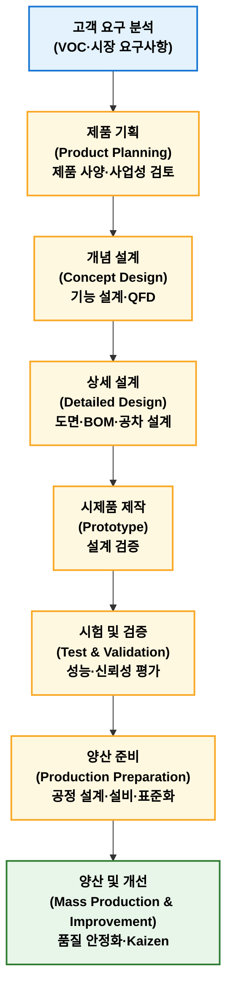
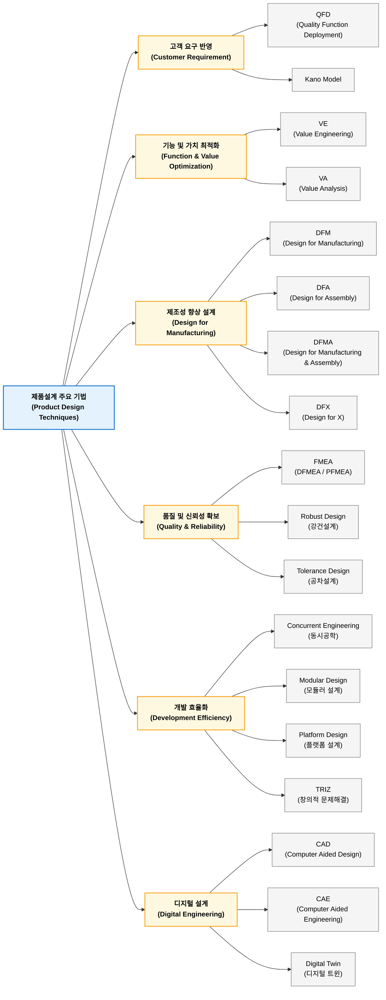

## 제품개발기술

### 정의

제품개발기술(Product Development Technology)이란 고객 요구사항을 반영하여 제품 기획, 설계, 시험, 검증, 양산까지 제품을 개발하기 위한 제반 기술과 방법론을 의미한다.

### 목적

제품개발 주요 목적은 경쟁우선순위 QCDFS(Quality, Cost, Delivery, Flexibility, Service) 확보이다.

| 목적        | 내용                |
| --------- | ----------------- |
| 품질 확보(Q)  | 고객 요구 품질 및 신뢰성 확보 |
| 원가 절감(C)  | 설계 단계에서 제조비용 최소화  |
| 납기 단축(D)  | 개발 기간 및 출시 기간 단축  |
| 유연성 확보(F) | 다양한 고객 요구 대응      |
| 서비스 향상(S) | 사용자 만족 및 유지관리성 향상 |

특히 제조업에서는 "설계 단계에서 원가 70~80%가 결정된다"는 관점에서 제품개발 단계는 중요하다.

### 프로세스

일반적인 제품개발 프로세스는 다음과 같다.

| 단계         | 주요 활동            | 주요 기술 및 기법                                              | 주요 산출물                                       |
| ---------- | ---------------- | ------------------------------------------------------- | -------------------------------------------- |
| ① 고객 요구 분석 | 고객 요구 및 시장 환경 분석 | VOC 분석, 시장조사, 경쟁사 분석, Kano 분석, Benchmarking             | VOC 데이터, 시장분석 보고서, 고객 요구사항 목록                |
| ② 제품 기획    | 제품 목표 및 개발 방향 설정 | 제품 사양 정의, 사업성 분석, QFD, 목표원가(Target Costing)             | 제품 기획서, Product Specification, 개발 계획서, 목표 원가 |
| ③ 개념 설계    | 제품 기능 및 구조 설계    | 기능 분석(Function Analysis), QFD, TRIZ, System Engineering | 기능 구조도, 개념 설계안, 기술 요구사항                      |
| ④ 상세 설계    | 제품 형상 및 부품 설계    | CAD, CAE, 공차 설계, DFM/DFA, FMEA                          | 3D 모델, 도면, BOM, 설계 FMEA, 공차 기준               |
| ⑤ 시제품 제작   | 설계 검증용 제품 제작     | Prototype, Rapid Prototyping, Mock-up, 시험 제작            | 시제품, 제작 결과 보고서, 개선 사항                        |
| ⑥ 시험 및 검증  | 제품 성능 및 신뢰성 검증   | 성능시험, 신뢰성시험, 환경시험, 인증시험, DOE                            | 시험 성적서, 검증 보고서, 개선 결과                        |
| ⑦ 양산 준비    | 생산 가능성 확보        | 공정설계, Layout 설계, PFMEA, Control Plan, 작업표준화             | 공정도, 작업표준서, 검사기준서, 생산능력 평가                   |
| ⑧ 양산 및 개선  | 양산 안정화 및 지속 개선   | SPC, Six Sigma, VE/VA, TPM, Kaizen                      | 양산 품질 데이터, 개선 보고서, 원가 절감 결과                  |

#### 주요 기법

| 구분                     | 검토 내용                                                 |
| ---------------------- | ----------------------------------------------------- |
| QFD                    | 고객 요구사항을 설계 요구사항으로 변환하는 대표적 품질설계 기법으로 적절              |
| Kano Model             | 고객 요구사항의 만족도 특성 분석 기법으로 적절                            |
| VE/VA                  | 가치공학(Value Engineering), 가치분석(Value Analysis)으로 구분 적절 |
| DFM/DFA/DFMA           | 제조·조립 용이성 설계 기법으로 적절                                  |
| FMEA                   | 설계 FMEA(DFMEA), 공정 FMEA(PFMEA) 구분 필요                  |
| Robust Design          | 다구찌(Taguchi) 강건설계와 연계 가능                              |
| Tolerance Design       | 공차설계는 품질 및 제조성 확보 관점에서 적절                             |
| Concurrent Engineering | 동시공학, 설계 초기 제조·품질·구매 부문 참여                            |
| Digital Twin           | 최근 스마트제조 설계 핵심 기술로 적절                                 |

