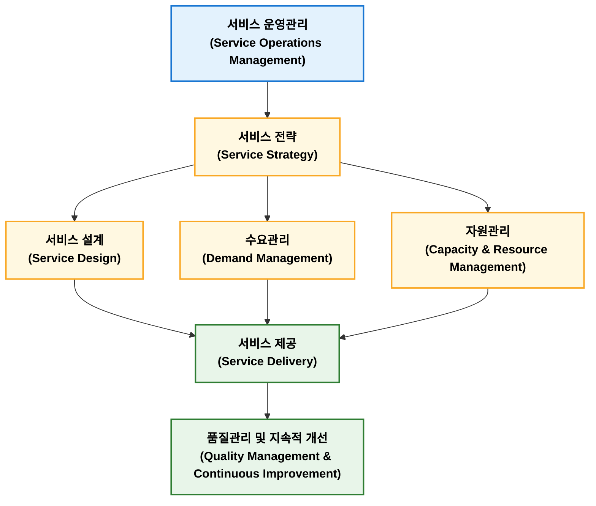

## 서비스운영관리

**서비스 운영관리(Service Operations Management)**는 고객에게 서비스를 효율적이고 일관되게 제공하기 위해 사람, 시설, 정보, 프로세스를 계획·운영·통제·개선하는 관리 활동이다. 서비스는 무형성, 이질성, 비분리성, 소멸성 특성을 가지므로 제조 운영과 다른 접근이 필요하다. 주요 관리 대상은 서비스 설계, 수요관리, 용량관리, 대기행렬 관리 및 서비스 품질관리이여, 대표적인 기법으로는 Service Blueprint, SERVQUAL, Queueing Theory, Lean Service가 있다. 제조업에서도 A/S, 유지보수, 물류, 원격 모니터링 등 서비스 운영관리 중요성이 지속적으로 확대되고 있다.

```text
서비스 운영관리(Service Operations Management)
│
├── 1. 서비스 개요
│      ├── Service
│      ├── Service Operations
│      ├── Service System
│      ├── Service Value
│      └── Customer Experience(CX)
│
├── 2. 서비스 설계
│      ├── Service Design
│      ├── Service Blueprint
│      ├── Service Process
│      ├── Service Package
│      └── Servitization
│
├── 3. 서비스 운영
│      ├── Capacity Planning
│      ├── Queue Management
│      ├── Scheduling
│      ├── Workforce Planning
│      ├── Facility Layout
│      └── Service Recovery
│
├── 4. 품질관리
│      ├── SERVQUAL
│      ├── GAP Model
│      ├── VOC
│      ├── Complaint Management
│      └── Customer Satisfaction
│
├── 5. 서비스 개선
│      ├── Lean Service
│      ├── Six Sigma
│      ├── BPM
│      ├── Process Mining
│      ├── AI Service
│      └── Digital Service
│
└── 6. 주요 KPI
       ├── Waiting Time
       ├── Service Level
       ├── Response Time
       ├── First Contact Resolution
       ├── Customer Satisfaction
       ├── NPS
       └── Utilization
```

서비스 운영관리는 제조와 다른 서비스 특성을 이해하는 것에서 시작한다. 시버스 경영 분야에서는 일반적으로 IHIP(무형성, 이질성, 비분리성, 소멸성) 네가지 특성을 설명한다.

| 특성                   | 내용                      | 예시           |
| -------------------- | ----------------------- | ------------ |
| 무형성(Intangibility)   | 형태가 없어 사전에 품질을 확인하기 어려움 | 컨설팅, 교육      |
| 이질성(Heterogeneity)   | 서비스 제공자나 상황에 따라 품질이 달라짐 | 미용, 의료       |
| 비분리성(Inseparability) | 생산과 소비가 동시에 발생          | 병원 진료, 강의    |
| 소멸성(Perishability)   | 재고로 저장할 수 없음            | 항공 좌석, 호텔 객실 |

서비스 운영관리 목적은 QCDS(Quality, Cost, Delivery, Service)를 달성하는 것이다.

| 목적     | 내용               |
| ------ | ---------------- |
| 품질(Q)  | 일관된 서비스 품질 확보    |
| 원가(C)  | 운영 효율화 및 비용 절감   |
| 납기(D)  | 대기시간 및 처리시간 단축   |
| 서비스(S) | 고객 만족 및 고객 경험 향상 |


### 주요 기능



| 기능          | 주요 내용                                       |
| ----------- | ------------------------------------------- |
| **서비스 전략**  | 서비스 목표, 고객가치, 경쟁전략 수립                       |
| **서비스 설계**  | 서비스 프로세스, 서비스 청사진(Service Blueprint), 표준 설계 |
| **수요관리**    | 수요예측, 예약관리, 대기행렬(Queue) 관리                  |
| **자원관리**    | 인력, 설비, 용량(Capacity) 및 일정 관리                |
| **서비스 제공**  | 서비스 실행, 고객 접점(Moment of Truth) 관리           |
| **품질 및 개선** | SERVQUAL, 고객만족(CS), KPI, PDCA, 지속적 개선       |

### 주요 기법

#### 서비스 청사진

<figure markdown>


<figcaption>https://ixdf.org/literature/topics/service-blueprint</figcaption>

</figure>

서비스 청사진(Service Blueprint)은 세로축을 기준으로 크게 4가지 행동 영역으로 나뉘며 각 영역은 3가지 경계선으로 구분된다.

| 구성 요소 | 명칭 | 설명 |
| :--- | :--- | :--- |
| **행동 영역 1** | **고객 행동 (Customer Actions)** | 고객이 서비스를 이용하는 과정에서 수행하는 모든 행동 단계 |
| *경계선 1* | *상호작용선 (Line of Interaction)* | 고객과 현장 직원이 직접 만나는 접점 |
| **행동 영역 2** | **전방 직원 행동 (Onstage Employee Actions)** | 고객의 눈에 직접 보이는 현장 직원의 서비스 행위 |
| *경계선 2* | *가시선 (Line of Visibility)* | 고객이 볼 수 있는 영역과 볼 수 없는 영역의 구분선 |
| **행동 영역 3** | **후방 직원 행동 (Backstage Employee Actions)** | 고객의 눈에는 보이지 않지만, 전방 서비스를 지원하는 직원의 행위 |
| *경계선 3* | *내부 상호작용선 (Line of Internal Interaction)* | 서비스 지원 직원과 기업 내부 시스템 간의 경계선 |
| **행동 영역 4** | **지원 프로세스 (Support Processes)** | 서비스가 원활히 제공되도록 돕는 내부 시스템, 기술, 인프라 등 |
| **기타 요소** | **물적 증거 (Physical Evidence)** | 각 단계에서 고객이 접하는 유형적 요소 (매장 인테리어, 웹사이트, 영수증 등) |

**핵심 목적**

- 오류 가능 지점(Fail Points) 발견: 서비스 과정 중 실수가 생기기 쉬운 취약점을 미리 파악하여 예방책을 강구
- 대기 시간 관리: 서비스 지연이 발생하는 병목 구간을 시각화하여 대기 시간을 감소
- 부서 간 협업 강화: 전방 직원과 후방 지원 부서가 서로 어떻게 연결되어 있는지 명확히 이해

#### SERVQUAL

SERVQUAL(서비스 품질 측정 모델)은 1988년 파라수라만(A. Parasuraman), 자이탐율(A. Zeithaml), 베리(L. Berry) 교수가 개발한 **서비스 품질 측정 및 평가를 위한 대표적인 정량적 모델**이다. 고객이 기대하는 서비스 수준(**기대, Expectation**)과 실제 제공받았다고 느끼는 서비스 수준(**성과, Perception**) 간의 차이(Gap)를 측정하여 서비스 품질을 산출한다.

1. **SERVQUAL의 핵심 측정 원리** (Gap 모델)

    SERVQUAL은 서비스 품질을 단일 절대 수치가 아닌, 고객의 기대와 지각 간의 격차(Gap)로 정의한다.
    
    $$\text{서비스 품질}(SQ) = \text{지각된 성과}(P) - \text{기대 수준}(E)$$
    
    * **$SQ > 0$ (지각 > 기대)**: 고객이 기대한 것 이상으로 만족함 (고품질/매우 만족)
    * **$SQ = 0$ (지각 = 기대)**: 기대에 부응함 (적정 품질/만족)
    * **$SQ < 0$ (지각 < 기대)**: 기대에 미달함 (저품질/불만족, 서비스 갭 발생)

2. **SERVQUAL의 5대 차원** (RATER 모델)  

    서비스 품질을 평가하는 5가지 핵심 영역으로, 앞 글자를 따 **RATER** 모델이라고도 부른다.

    1. **신뢰성 (Reliability)**
    
        약속한 서비스를 정확하고 신뢰성 있게 이행하는 능력
        
        * **예시**: 약속한 배송 시간 준수, 정밀한 서비스 처리, 주문 오차 없는 이행
        
    1. **확신성 (Assurance)**
    
        직원의 지식, 예의, 그리고 고객에게 신뢰와 확신을 심어주는 능력
        
        * **예시**: 직원의 전문적인 지식수준, 정중하고 친절한 태도, 안전한 거래 보장
    
    1. **유형성 (Tangibles)**
    
        물리적 시설, 장비, 직원들의 외모 및 통신 매체 등의 시각적·외형적 요소
        
    
    1. **공감성 (Empathy)**
    
        고객에게 전달하는 개별적인 관심과 배려하는 마음
        
        * **예시**: 고객 개개인의 요구사항 기억, 맞춤형 서비스 제공, 고객 입장에서의 운영 시간 설정
        * **예시**: 매장의 청결도, 최신 기계 설비, 직원 유니폼의 깔끔함
    
    1. **응답성 (Responsiveness)**
    
        고객을 기꺼이 돕고 신속한 서비스를 제공하려는 자발적 의지
        
        * **예시**: 고객 문의에 대한 신속한 응답, 짧은 대기 시간, 적극적인 문제 해결 태도    

3. **SERVQUAL의 서비스 갭(Gap) 모델**  

    고객 불만족이 발생하는 원인을 5가지 서비스 제공 내부·외부 단계별 격차로 분석한다.
    
    
    
    | 격차 유형 | 명칭 | 발생 원인 (이유) | 해결 방향 |
    | :--- | :--- | :--- | :--- |
    | **Gap 1** | **시장 조사 격차**<br>(고객 기대 - 경영자 인식) | 고객이 무엇을 원하는지 경영진이 정확히 모를 때 발생합니다. | 마케팅 조사 강화, 현장과의 소통 확대 |
    | **Gap 2** | **품질 표준 격차**<br>(경영자 인식 - 서비스 규격) | 고객 니즈는 알지만, 이를 구체적인 서비스 표준이나 시스템으로 만들지 못할 때 발생합니다. | 서비스 프로세스 표준화, 경영진의 품질 개선 의지 |
    | **Gap 3** | **서비스 제공 격차**<br>(서비스 규격 - 실제 제공) | 규격과 매뉴얼은 잘 짜여 있으나, 직원의 숙련도 부족이나 의욕 저하로 실제 현장에서 실행되지 않을 때 발생합니다. | 직원 교육 지원, 팀워크 강화, 적절한 보상 시스템 구축 |
    | **Gap 4** | **외적 커뮤니케이션 격차**<br>(실제 제공 - 외부 광고) | 광고나 홍보를 통해 고객에게 과도한 약속을 하여, 실제 서비스보다 기대치를 너무 높여 놓았을 때 발생합니다. | 과대광고 자제, 부서 간(마케팅-현장) 긴밀한 커뮤니케이션 |
    | **Gap 5** | **최종 서비스 품질 격차**<br>(고객 기대 - 실제 경험) | Gap 1부터 Gap 4까지의 문제들이 누적되어 나타나는 최종 결과물입니다. 고객의 불만족으로 직결됩니다. | Gap 1 ~ Gap 4를 줄이면 자동으로 해결됨 |

4. SERVQUAL의 장단점 및 한계

    * 장점
        * 다양한 서비스 산업(금융, 의료, 외식, 공공 서비스 등)에 보편적으로 적용 가능함
        * 5대 차원별 분석을 통해 서비스 부족 요소와 개선 영역을 명확히 식별할 수 있음
    
    * 한계점 및 비판
        * **설문 중복성**: 서비스 이용 전 기대(E)와 이용 후 성과(P)를 각각 측정해야 하므로 설문 문항이 길어짐(총 44개 문항)
        * **SERVPERF 모델의 등장**: Cronin & Taylor(1992)는 기대치(E) 측정 없이 **지각된 성과(P)만 측정하는 것이 타당도와 예측력이 더 높다**며 SERVPERF 모델을 제시함

**SERVQUAL 차원 요약표**

| 차원 (Dimension) | 핵심 개념 | 평가 질문의 예시 |
| --- | --- | --- |
| **유형성 (Tangibles)** | 물리적 환경 및 장비 | "최신 장비와 깨끗한 시설을 갖추고 있는가?" |
| **신뢰성 (Reliability)** | 약속 이행 및 정확성 | "약속한 서비스를 처음부터 정확히 수행하는가?" |
| **응답성 (Responsiveness)** | 신속성 및 자발성 | "고객의 요청에 즉각적으로 대응하는가?" |
| **확신성 (Assurance)** | 전문성 및 신뢰감 | "직원이 정중하며 질문에 전문적으로 답하는가?" |
| **공감성 (Empathy)** | 개별적 관심 및 배려 | "고객의 상황을 이해하고 맞춤형 배려를 제공하는가?" |


#### 대기행렬

대기행렬 이론(Queueing Theory)은 서비스 시스템에서 발생할 수 있는 대기 현상(줄 서기)을 수학적으로 모델링하여, **고객의 대기 시간을 최소화하고 서비스 시설의 효율성을 극대화**하기 위한 확률적 분석 기법이다.

1. **대기행렬 시스템의 주요 구성 요소**  

    대기행렬 시스템은 크게 **도착 과정**, **대기열 구조**, **서비스 메커니즘**의 3가지 단계로 구성된다.

    ```
    [고객 모집단] ---> (도착) ---> [ 대기열 (줄) ] ---> [ 서비스 창구 ] ---> (퇴장)
    
    ```

    1. **도착 과정 (Arrival Process)**
        
        고객이 시스템에 들어오는 형태를 정의한다.
        
        * **도착 패턴**: 주로 단위 시간당 도착 고객 수가 포아송 분포(Poisson Distribution)를 따르며, 고객 간 도착 간격 시간은 지수 분포(Exponential Distribution)를 따름
        * **모집단 크기**: 무한 모집단(일반 소비재 매장 등)과 유한 모집단(공장 내 특정 기계의 고장 대기 등)으로 구분함
    
    1. **대기열 구조 (Queue Structure)**
    
        고객이 서비스를 받기 전 대기하는 공간 및 규칙이다.
        
        * **대기열 수용 용량**: 무한 대기열 또는 유한 대기열(공간 한계로 일정 수 이상 수용 불가)
        * **대기열 규칙(Queue Discipline / 서비스 순서)**:
        * **FIFO (First-In, First-Out)**: 선착순 서비스 (가장 일반적)
        * **LIFO (Last-In, First-Out)**: 후착순 서비스 (창고 적재, 스택 구조)
        * **PRI (Priority)**: 우선순위 기준 서비스 (응급실, VIP 고객 우선 처리)
        * **SIRO (Service In Random Order)**: 무작위 서비스  
    
    
    1. **서비스 메커니즘 (Service Mechanism)**
    
        서비스 창구의 수와 서비스가 제공되는 시간의 특성을 나타낸다.
        
        * **창구 구조**: 단일 창구(Single-Channel) 또는 다중 창구(Multi-Channel)
        * **서비스 시간**: 고객 1명을 처리하는 데 걸리는 시간으로, 주로 지수 분포를 따름

2. **켄달의 표기법 (Kendall's Notation)**

    대기행렬 모델의 특성을 표준적으로 표현하기 위해 **$A / B / c / K / m / Z$** 형식의 표기법을 사용한다. (보통 앞의 3개 자리가 가장 중요하게 활용됨)
    
    $$\text{표기법}: A / B / c$$
    
    * **$A$ (도착 분포)**: $M$ (포아송/지수 분포), $D$ (확정적/일정 시간), $G$ (일반 확률 분포)
    * **$B$ (서비스 시간 분포)**: $M$ (지수 분포), $D$ (확정적/일정 시간), $G$ (일반 확률 분포)
    * **$c$ (서비스 창구 수)**: $1, 2, 3, \dots, n$
    * **예시**
        * **$M/M/1$**: 도착 및 서비스 시간이 지수 분포를 따르는 **단일 창구** 대기행렬 모델
        * **$M/M/c$**: 도착 및 서비스 시간이 지수 분포를 따르는 **다중 창구($c$개)** 대기행렬 모델


3. **대기행렬의 주요 성능 지표 및 수학적 기호**

    대기행렬을 분석할 때 산출하는 핵심 평가지표이다.
    
    1. 기본 매개변수
    
        * $\lambda$ (라메다): 단위 시간당 평균 도착률 (Arrival Rate)
        * $\mu$ (뮤): 창구 1개당 단위 시간당 평균 서비스 처리율 (Service Rate)
        * $\rho$ (로): 서비스 창구 이용률 (System Utilization) $\rightarrow$ $\rho = \frac{\lambda}{c \cdot \mu}$ ($\rho < 1$이어야 대기열이 무한히 늘어나지 않고 안정 상태를 유지함)
    
    1. 주요 평가지표 수식
    
        * $L$ (시스템 내 평균 고객 수)
        * $L_q$ (대기열 내 평균 고객 수)
        * $W$ (시스템 내 평균 머무름 시간)
        * $W_q$ (대기열 내 평균 대기 시간)


4.** 리틀의 법칙 (Little's Law)**

    대기행렬 이론에서 가장 중요하게 사용되는 관측 법칙으로, 대기열의 상태와 관계없이 안정 상태인 모든 시스템에 적용된다.
    
    $$L = \lambda \cdot W$$
    
    $$L_q = \lambda \cdot W_q$$
    
    * **의의**: 평균 고객 수($L$)와 평균 머무름 시간($W$) 간의 정비례 관계를 설명하여, 하나의 값만 측정해도 다른 값을 쉽게 산출할 수 있게 함


**대기행렬 모델 종합 요약표**

| 모델 구분 | 창구 수 | 특징 및 용도 |
| --- | --- | --- |
| **$M/M/1$** | 단일 ($c=1$) | 계산이 가장 간편함, 소규모 창구나 단일 서버 처리 분석에 활용 |
| **$M/M/c$** | 다중 ($c > 1$) | 은행 창구, 공항 탑승 수속, 호출 센터(Call Center) 분석에 활용 |
| **$M/D/1$** | 단일 ($c=1$) | 서비스 시간이 일정함(자동화 기계 등), 대기 시간이 $M/M/1$의 절반으로 감소 |

#### Lean Service

린 서비스(Lean Service)는 도요타 생산 방식(TPS)에서 유래한 **린(Lean) 사상을 서비스 업종에 맞게 이식 및 재구성한 경영 혁신 방법론**이다. 서비스 가치 전달 프로세스에서 **비가치 창출 요소(낭비, Waste)를 철저히 배제**하고, 고객이 실제 가치를 느끼는 핵심 프로세스만을 연속적으로 흐르게 하여 **서비스 제공 시간 단축, 품질 향상, 원가 절감**을 동시에 달성한다.

1. **린 서비스의 5대 핵심 원칙 (Womack & Jones)**

    린 서비스 활동을 추진할 때 기반이 되는 5단계 기본 원칙이다.
    
    1. 고객 가치 정의 (Define Value)
    
        제조자나 공급자의 시각이 아닌 **최종 고객의 관점에서 무엇이 진정한 가치인가**를 정의한다.
    
        * **적용**: 고객이 기꺼이 지불하고자 하는 서비스 속성(예: 빠른 응답, 정확성, 편의성)을 명확히 함
    
    2. 가치 흐름 분석 (Value Stream Mapping, VSM)
    
        서비스가 기획되어 고객에게 전달되기까지의 **전 과정(가치 흐름)을 시각화**하여 가치 창출 단계와 비가치 창출 단계(낭비)를 구별한다.
    
    3. 흐름 창출 (Create Flow)
    
        정체, 대기, 병목 현상 없이 **서비스 작업이 끊김 없이 연속적으로 흐르도록** 공정을 재설계한다.
        
        * **적용**: 부서 간 단절(Silo) 제거, 불필요한 승인 절차 단축, 병목 구간 개선
    
    4. 당김 방식 적용 (Establish Pull)
        
        공급자가 일방적으로 밀어 넣는 방식(Push)이 아니라, 고객의 실제 수요가 발생했을 때 서비스를 제공하는 당김 방식(Pull)을 구축한다.
        
        * **적용**: 과잉 제공 배제, 고객 요청 즉시 처리 시스템 구축
    
    5. 완벽성 추구 (Pursue Perfection)
    
        단발성 프로젝트로 끝내지 않고 지속적 개선(Kaizen)을 통해 무결점 서비스 상태를 지향한다.

2. **서비스 부문의 7대 낭비 (7 Wastes in Service)**
    
    제조업의 7대 낭비를 서비스 현장의 특성(무형성, 비저장성, 동시성)에 맞추어 재정의한 개념이다.
    
    | 구분 | 낭비 유형 | 서비스 현장의 대표적 사례 |
    | --- | --- | --- |
    | **1** | **대기 (Waiting)** | 고객의 대기 시간, 직원의 서류 승인 대기, 시스템 로딩 시간 |
    | **2** | **과잉 제공 (Over-production)** | 고객이 원하지 않는 과도한 서류 작성 요구, 쓸데없이 복잡한 보고서 |
    | **3** | **불필요한 이동 (Motion)** | 서류/도구를 찾으러 직원이 오가는 동선, 비효율적인 화면 이동 |
    | **4** | **운반 (Transportation)** | 부서 간 불필요한 서류 이동, 정보 전송의 여러 단계 거침 |
    | **5** | **과잉 처리 (Over-processing)** | 불필요한 중복 데이터 입력, 다단계 이중 승인 절차 |
    | **6** | **재고 (Inventory)** | 처리되지 못하고 쌓여 있는 미결 업무, 대기 중인 고객 요청 건 |
    | **7** | **결함/수정 (Defects/Rework)** | 입력 오류로 인한 재작업, 서비스 불만족에 따른 재처리 |

3. **린 서비스의 핵심 추진 기법**

    * **가치흐름지도(VSM, Value Stream Map)**  
        현재 상태의 서비스 프로세스를 도식화(Current State Map)하여 낭비를 찾고, 이상적인 미래 상태(Future State Map)를 설계함
    * **5S 활동**  
        정리(Sort), 정돈(Set in order), 청소(Shine), 청결(Standardize), 습관화(Sustain)를 통해 업무 환경의 효율성을 극대화함
    * **포카요케(Poka-Yoke / 실수 방지)**  
        휴먼 에러(Human Error)가 일어날 수 없도록 시스템적 안전장치를 마련함 (예: 필수 입력 항목 미입력 시 다음 단계 진행 불가)
    * **표준 작업(Standard Work)**  
        최선의 서비스 제공 방법을 표준화하여 모든 직원이 동일한 품질을 유지하게 함
    * **시각적 관리(Visual Management)**  
        진행 상황, 대기자 수, 오류 현황 등을 현황판(Kanban 등)을 통해 누구나 한눈에 파악하도록 시각화함

4. **제조업 린(Lean) vs 린 서비스(Lean Service) 비교**

    | 구분 | 제조업 린 (Manufacturing Lean) | 린 서비스 (Lean Service) |
    | --- | --- | --- |
    | **대체 원자재** | 물리적 부품, 원자재 | 정보, 데이터, 서류, 고객 |
    | **프로세스 가시성** | 눈으로 제품 이동 확인 가능 | 비가시적(컴퓨터/서류상 진행) |
    | **변동성 원인** | 기계 고장, 자재 불량 | 고객 요구의 다양성, 사람의 능력 차이 |
    | **개선 중심** | 공정 라인 배치, 재고 관리 | 정보 흐름 단순화, 표준화, 대기 시간 단축 |
   

### 제품 서비스화

제품 서비스화(Servitization)은 제조업체가 물품을 한 번 팔고 끝내는 대신 유지 보수, 구독, 정기 점검 같은 무형 서비스를 더해 지속적인 이익을 얻는 사업 방식이다. 지속적인 수익창출, 고객과의 관계 유지, 디지털 기술 활용 같은 특징이 있다.

**주요 방식**

- **일회성 판매에서 구독·렌탈로 전환**  
    물건 값을 한 번에 받는 대신 매달 요금을 받고 빌려주거나 관리
- **예측 정비 및 유지보수**  
    기계나 장비에 센서를 달아 고장이 나기 전에 미리 고쳐주거나 점검하는 서비스를 제공
- **맞춤형 솔루션 제공**  
    단순히 물건만 주는 것이 아니라 고객에게 꼭 맞는 사용 방법을 상담하고 관리

### 제조업 생산관리 비교

제조업 생산관리와 서비스 운영관리를 비교하면 다음과 같은 특성이 있다.

| 구분     | 생산 운영관리     | 서비스 운영관리            |
| ------ | ----------- | ------------------- |
| 대상     | 유형 제품       | 무형 서비스              |
| 재고     | 가능          | 불가능                 |
| 품질 확인  | 출하 전 가능     | 제공 중 또는 제공 후 가능     |
| 생산과 소비 | 분리          | 동시 발생               |
| 핵심 관리  | 생산성, 품질, 원가 | 고객 경험, 대기시간, 서비스 품질 |

## 마케팅 믹스 4P

마케팅 믹스 4P는 기업이 목표 시장에서 마케팅 목표를 달성하기 위해 조합하고 통제하는 4가지 핵심 요소를 뜻한다.

| 구성 요소 | 한글 명칭 | 정의 및 개념 | 주요 관리 항목 예시 |
| :--- | :--- | :--- | :--- |
| **Product** | **제품** | 고객의 욕구를 충족시키는 유무형의 상품 | 품질, 디자인, 브랜드명, 기능, 포장, 보증 서비스 |
| **Price** | **가격** | 고객이 제품을 구매하기 위해 지불하는 대가 | 가격 책정 전략, 할인 혜택, 할부 조건, 도매/소매 가격 |
| **Place** | **유통** | 제품이 생산자로부터 고객에게 전달되는 경로 | 유통 채널(온/오프라인), 매장 위치, 재고 관리, 물류 시스템 |
| **Promotion** | **촉진** | 제품의 가치를 고객에게 알리고 구매를 유도하는 활동 | 광고, PR(홍보), 인적 판매, 판매 촉진(이벤트, 쿠폰) |

최근 서비스 마케팅에서는 4P에 사람(People), 프로세스(Process), 물리적 증거(Physical Evidence)를 더해 7P를 주로 사용한다.

- **사람**(People)  
    고객과 직접적으로 만나는 직원이나 서비스 제공자, 고객 경험에 영향을 주는 모든 사람을 의미
- **과정**(Process)  
    제품이나 서비스가 고객에게 전달되는 전체 절차나 과정으로, 효율성과 고객 만족도를 높이기 위한 시스템
- **물리적 증거**(Physical Evidence)  
    서비스가 무형이기 때문에 고객에게 신뢰를 주거나 브랜드 이미지를 형성하는 물리적 환경, 포장, 인테리어 등을 포함
