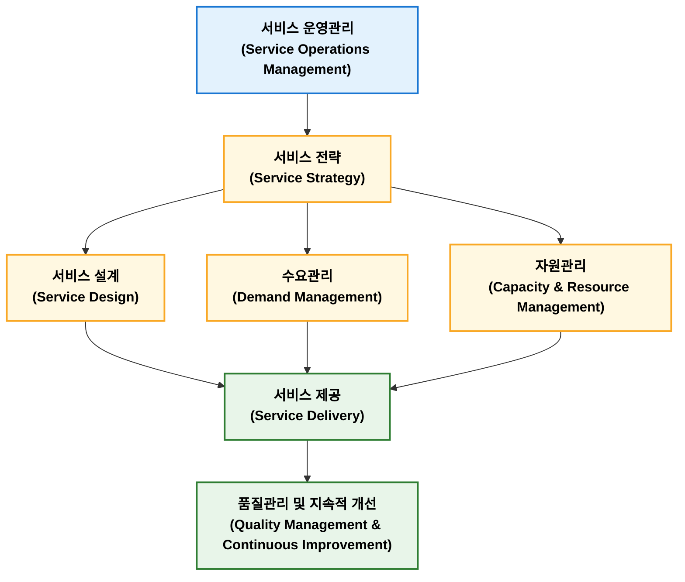

## 서비스운영관리

### 정의

서비스 운영관리(Service Operations Management)는 고객에게 서비스를 효율적이고 일관되게 제공하기 위해 사람, 시설, 정보, 프로세스를 계획·운영·통제·개선하는 관리 활동이다. 서비스는 무형성, 이질성, 비분리성, 소멸성 특성을 가지므로 제조 운영과 다른 접근이 필요하다. 주요 관리 대상은 서비스 설계, 수요관리, 용량관리, 대기행렬 관리 및 서비스 품질관리이여, 대표적인 기법으로는 Service Blueprint, SERVQUAL, Queueing Theory, Lean Service가 있다. 제조업에서도 A/S, 유지보수, 물류, 원격 모니터링 등 서비스 운영관리 중요성이 지속적으로 확대되고 있다.

### 특성

서비스 운영관리는 제조와 다른 서비스 특성을 이해하는 것에서 시작한다. 시버스 경영 분야에서는 일반적으로 IHIP(무형성, 이질성, 비분리성, 소멸성) 네가지 특성을 설명한다.

| 특성                   | 내용                      | 예시           |
| -------------------- | ----------------------- | ------------ |
| 무형성(Intangibility)   | 형태가 없어 사전에 품질을 확인하기 어려움 | 컨설팅, 교육      |
| 이질성(Heterogeneity)   | 서비스 제공자나 상황에 따라 품질이 달라짐 | 미용, 의료       |
| 비분리성(Inseparability) | 생산과 소비가 동시에 발생          | 병원 진료, 강의    |
| 소멸성(Perishability)   | 재고로 저장할 수 없음            | 항공 좌석, 호텔 객실 |

### 목적

서비스 운영관리 목적은 QCDS(Quality, Cost, Delivery, Service)를 달성하는 것이다.

| 목적     | 내용               |
| ------ | ---------------- |
| 품질(Q)  | 일관된 서비스 품질 확보    |
| 원가(C)  | 운영 효율화 및 비용 절감   |
| 납기(D)  | 대기시간 및 처리시간 단축   |
| 서비스(S) | 고객 만족 및 고객 경험 향상 |

### 주요 기능

| 기능          | 주요 내용                                       |
| ----------- | ------------------------------------------- |
| **서비스 전략**  | 서비스 목표, 고객가치, 경쟁전략 수립                       |
| **서비스 설계**  | 서비스 프로세스, 서비스 청사진(Service Blueprint), 표준 설계 |
| **수요관리**    | 수요예측, 예약관리, 대기행렬(Queue) 관리                  |
| **자원관리**    | 인력, 설비, 용량(Capacity) 및 일정 관리                |
| **서비스 제공**  | 서비스 실행, 고객 접점(Moment of Truth) 관리           |
| **품질 및 개선** | SERVQUAL, 고객만족(CS), KPI, PDCA, 지속적 개선       |

### 주요 기법

#### 서비스 청사진

<figure>

<figcaption>https://ixdf.org/literature/topics/service-blueprint</figcaption>

</figure>

서비스 청사진(Service Blueprint)은 세로축을 기준으로 크게 4가지 행동 영역으로 나뉘며 각 영역은 3가지 경계선으로 구분된다.

| 구성 요소 | 명칭 | 설명 |
| :--- | :--- | :--- |
| **행동 영역 1** | **고객 행동 (Customer Actions)** | 고객이 서비스를 이용하는 과정에서 수행하는 모든 행동 단계 |
| *경계선 1* | *상호작용선 (Line of Interaction)* | 고객과 현장 직원이 직접 만나는 접점 |
| **행동 영역 2** | **전방 직원 행동 (Onstage Employee Actions)** | 고객의 눈에 직접 보이는 현장 직원의 서비스 행위 |
| *경계선 2* | *가시선 (Line of Visibility)* | 고객이 볼 수 있는 영역과 볼 수 없는 영역의 구분선 |
| **행동 영역 3** | **후방 직원 행동 (Backstage Employee Actions)** | 고객의 눈에는 보이지 않지만, 전방 서비스를 지원하는 직원의 행위 |
| *경계선 3* | *내부 상호작용선 (Line of Internal Interaction)* | 서비스 지원 직원과 기업 내부 시스템 간의 경계선 |
| **행동 영역 4** | **지원 프로세스 (Support Processes)** | 서비스가 원활히 제공되도록 돕는 내부 시스템, 기술, 인프라 등 |
| **기타 요소** | **물적 증거 (Physical Evidence)** | 각 단계에서 고객이 접하는 유형적 요소 (매장 인테리어, 웹사이트, 영수증 등) |

**핵심 목적**

- 오류 가능 지점(Fail Points) 발견: 서비스 과정 중 실수가 생기기 쉬운 취약점을 미리 파악하여 예방책을 강구
- 대기 시간 관리: 서비스 지연이 발생하는 병목 구간을 시각화하여 대기 시간을 감소
- 부서 간 협업 강화: 전방 직원과 후방 지원 부서가 서로 어떻게 연결되어 있는지 명확히 이해

#### SERVQUAL

A. Parasuraman, Valarie A. Zeithaml, Leonard L. Berry가 제안한 서비스 품질 측정 모형으로  5개 평가 요소가 있다.

| 평가 요소 | 영문 명칭 | 정의 및 개념 | 주요 평가 항목 예시 |
| :--- | :--- | :--- | :--- |
| **유형성** | Tangibles | 물적 시설, 장비, 직원 외모 등 외형적인 요인 | 최신 장비 보유, 깨끗하고 현대적인 시설, 단정한 직원의 용모 |
| **신뢰성** | Reliability | 약속된 서비스를 정확하고 일관되게 수행하는 능력 | 약속한 시간 준수, 정확한 서비스 제공, 문제 발생 시 즉각적 해결 |
| **응답성** | Responsiveness | 고객을 돕고 신속한 서비스를 제공하려는 의지와 열망 | 빠른 업무 처리, 고객 요청에 대한 즉각적인 반응, 자발적인 도움 |
| **확신성** (설득성) | Assurance | 직원의 지식, 예절, 신뢰 및 고객에게 안심을 주는 능력 | 직원의 전문 지식, 예의 바른 태도, 안전한 거래 환경 제공 |
| **공감성** | Empathy | 고객에게 제공하는 개별적인 배려와 맞춤형 관심 | 고객 개개인의 요구 이해, 편리한 이용 시간 운영, 고객 중심의 서비스 |

#### 대기행렬

대기시간을 최소화하기 위한 운영관리 기법이다.평균 대기시간, 평균 대기인원, 시스템 이용률과 같은 지표를 관리한다. 주로 은행, 병원, 공항, 고객센터에서 활용한다.

#### Lean Service

제조 Learn 개념을 서비스에 적용한 기법이다. 낭비 제거, 처리시간 단축, 고객 가치 향상을 목적으로 한다.

### 제품 서비스화

제품 서비스화(Servitization)은 제조업체가 물품을 한 번 팔고 끝내는 대신 유지 보수, 구독, 정기 점검 같은 무형 서비스를 더해 지속적인 이익을 얻는 사업 방식이다. 지속적인 수익창출, 고객과의 관계 유지, 디지털 기술 활용 같은 특징이 있다.

**주요 방식**

- **일회성 판매에서 구독·렌탈로 전환**  
    물건 값을 한 번에 받는 대신 매달 요금을 받고 빌려주거나 관리
- **예측 정비 및 유지보수**  
    기계나 장비에 센서를 달아 고장이 나기 전에 미리 고쳐주거나 점검하는 서비스를 제공
- **맞춤형 솔루션 제공**  
    단순히 물건만 주는 것이 아니라 고객에게 꼭 맞는 사용 방법을 상담하고 관리

### 제조업 생산관리 비교

제조업 생산관리와 서비스 운영관리를 비교하면 다음과 같은 특성이 있다.

| 구분     | 생산 운영관리     | 서비스 운영관리            |
| ------ | ----------- | ------------------- |
| 대상     | 유형 제품       | 무형 서비스              |
| 재고     | 가능          | 불가능                 |
| 품질 확인  | 출하 전 가능     | 제공 중 또는 제공 후 가능     |
| 생산과 소비 | 분리          | 동시 발생               |
| 핵심 관리  | 생산성, 품질, 원가 | 고객 경험, 대기시간, 서비스 품질 |

## 서비스 품질 격차 모형

| 격차 유형 | 명칭 | 발생 원인 (이유) | 해결 방향 |
| :--- | :--- | :--- | :--- |
| **Gap 1** | **시장 조사 격차** (고객 기대 - 경영자 인식) | 고객이 무엇을 원하는지 경영진이 정확히 모를 때 발생합니다. | 마케팅 조사 강화, 현장과의 소통 확대 |
| **Gap 2** | **품질 표준 격차** (경영자 인식 - 서비스 규격) | 고객 니즈는 알지만, 이를 구체적인 서비스 표준이나 시스템으로 만들지 못할 때 발생합니다. | 서비스 프로세스 표준화, 경영진의 품질 개선 의지 |
| **Gap 3** | **서비스 제공 격차** (서비스 규격 - 실제 제공) | 규격과 매뉴얼은 잘 짜여 있으나, 직원의 숙련도 부족이나 의욕 저하로 실제 현장에서 실행되지 않을 때 발생합니다. | 직원 교육 지원, 팀워크 강화, 적절한 보상 시스템 구축 |
| **Gap 4** | **외적 커뮤니케이션 격차** (실제 제공 - 외부 광고) | 광고나 홍보를 통해 고객에게 과도한 약속을 하여, 실제 서비스보다 기대치를 너무 높여 놓았을 때 발생합니다. | 과대광고 자제, 부서 간(마케팅-현장) 긴밀한 커뮤니케이션 |
| **Gap 5** | **최종 서비스 품질 격차** (고객 기대 - 실제 경험) | Gap 1부터 Gap 4까지의 문제들이 누적되어 나타나는 최종 결과물입니다. 고객의 불만족으로 직결됩니다. | Gap 1 ~ Gap 4를 줄이면 자동으로 해결됨 |

## 마케팅 믹스 4P

마케팅 믹스 4P는 기업이 목표 시장에서 마케팅 목표를 달성하기 위해 조합하고 통제하는 4가지 핵심 요소를 뜻한다.

| 구성 요소 | 한글 명칭 | 정의 및 개념 | 주요 관리 항목 예시 |
| :--- | :--- | :--- | :--- |
| **Product** | **제품** | 고객의 욕구를 충족시키는 유무형의 상품 | 품질, 디자인, 브랜드명, 기능, 포장, 보증 서비스 |
| **Price** | **가격** | 고객이 제품을 구매하기 위해 지불하는 대가 | 가격 책정 전략, 할인 혜택, 할부 조건, 도매/소매 가격 |
| **Place** | **유통** | 제품이 생산자로부터 고객에게 전달되는 경로 | 유통 채널(온/오프라인), 매장 위치, 재고 관리, 물류 시스템 |
| **Promotion** | **촉진** | 제품의 가치를 고객에게 알리고 구매를 유도하는 활동 | 광고, PR(홍보), 인적 판매, 판매 촉진(이벤트, 쿠폰) |

최근 서비스 마케팅에서는 4P에 사람(People), 프로세스(Process), 물리적 증거(Physical Evidence)를 더해 7P를 주로 사용한다.

- **사람**(People)  
    고객과 직접적으로 만나는 직원이나 서비스 제공자, 고객 경험에 영향을 주는 모든 사람을 의미
- **과정**(Process)  
    제품이나 서비스가 고객에게 전달되는 전체 절차나 과정으로, 효율성과 고객 만족도를 높이기 위한 시스템
- **물리적 증거**(Physical Evidence)  
    서비스가 무형이기 때문에 고객에게 신뢰를 주거나 브랜드 이미지를 형성하는 물리적 환경, 포장, 인테리어 등을 포함
