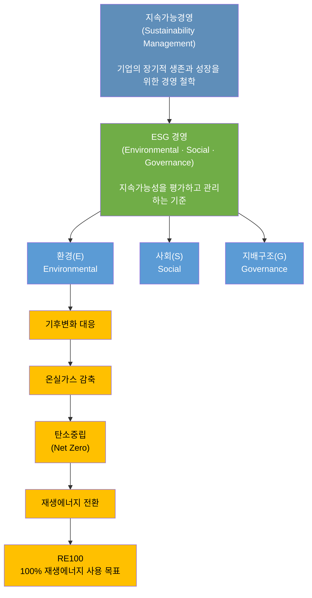

## 지속가능성

최근 제조업에서는 단순히 생산성·원가·품질(QCD) 중심의 경쟁을 넘어 지속가능성(Sustainability) 확보가 기업 경쟁력의 핵심 요소로 부각되고 있다. 특히 기후변화 대응과 환경 규제 강화로 인해 기업은 다음 요구에 대응해야 한다.

- 온실가스 감축
- 에너지 전환
- 친환경 생산체계 구축
- 사회적 책임 강화
- 투명한 지배구조 확보



### 지속가능경영

**지속가능경영(Sustainability Management)**은 현재 세대 필요를 충족하면서 미래 세대의 경제·사회·환경적요구를 훼손하지 않는 경영 방식이다.

**지속가능경영의 3대 축**, 경제, 환경, 사회를 일반적으로 Triple Bottom Line(TBL)이라고 한다.

| 구분              | 내용               |
| --------------- | ---------------- |
| 경제(Economic)    | 기업의 지속적인 성장과 수익성 |
| 환경(Environment) | 환경 보호 및 자원 효율화   |
| 사회(Social)      | 사회적 책임과 이해관계자 가치 |

즉, 기업은 단순 이익만 추구하는 것이 아니라 'Profit + People + Planet'을 동시에 고려해야 한다는 개념이다.

### ESG

**ESG(Environmental, Social, Governance)**는 기업 지속가능성을 평가하기 위한 비재무적 성과 평가 기준이다.

| 요소             | 의미   | 제조업 주요 항목            |
| -------------- | ---- | -------------------- |
| E(Environment) | 환경   | 탄소배출, 에너지, 폐기물, 자원순환 |
| S(Social)      | 사회   | 안전, 인권, 노동, 협력사 관리   |
| G(Governance)  | 지배구조 | 윤리경영, 투명성, 준법경영      |

제조업에서는 특히 환경(Environment) 영역 중요성이 증가하고 있다. 제조 현장에서 ESG 적용 사례는 다음과 같다.

| 영역     | 활동           |
| ------ | ------------ |
| 에너지 관리 | 고효율 설비 도입    |
| 탄소 관리  | 온실가스 배출량 관리  |
| 폐기물 관리 | 재활용 및 자원순환   |
| 공정 개선  | 에너지 절감 공정 개발 |
| 공급망 관리 | 협력사 탄소 관리    |

### 탄소중립

**탄소중립(Carbon Neutrality)**은 배출하는 온실가스 양과 흡수 또는 제거하는 온실가스 양을 균형화하여 순배출량(Net Emission)을 0으로 만드는 것이다.

$$탄소중립 = 순배출량 = 배출량 - 흡수량 = 0$$

탄소중립은 다음과 같은 단계로 추진할 수 있다.

```
온실가스 측정 → 배출량 감축 → 에너지 효율 개선 → 재생에너지 전환 → 불가피한 배출 상쇄
```

다음은 온실가스 배출 범위이다.

| 구분      | 내용       | 제조업 예          | 주요관리 대상 |
| ------- | -------- | -------------- | ----------------|
| Scope 1 | 직접 배출    | 공장 보일러, 차량 연료  | 공정 연료 절감 |
| Scope 2 | 간접 배출    | 전력 사용          | 재생에너지 전환 |
| Scope 3 | 기타 간접 배출 | 원자재, 물류, 사용 단계 | 공급망 관리 |

### RE100

**RE100(Renewable Electricity 100%)**은 기업이 사용하는 전력의 100%를 재생에너지(태양광, 풍력, 수력 등)로 조달하겠다고 선언하는 글로벌 자발적 캠페인이다.글로벌 비영리단체인 더 클라이밋 그룹(The Climate Group)과 CDP(탄소정보공개프로젝트)가 연합하여 2014년에 시작했으며, 오늘날 글로벌 규제 및 공급망 관리의 핵심 기준으로 자리 잡았다.

**RE100 주요 참여 요건 및 목표**

| 구분 | 주요 내용 | 비고 및 세부 기준 |
| :--- | :--- | :--- |
| **가입 대상 기업** | 글로벌 영향력이 있는 연간 전력 소비량 **100GWh 이상** 기업 | 금융, IT, 제조 등 다양한 산업군의 글로벌 기업 참여 |
| **최종 목표** | **2050년까지 100%** 재생에너지 전환 달성 | 기업별로 자체적인 달성 목표 연도 설정 가능 |
| **중간 목표** | **2030년 60%**, **2040년 90%** 달성 권고 | 연차별 이행 실적을 CDP를 통해 의무적 보고 |

**RE100 조달 방법**

| 조달 방식 | 영문 명칭 | 구체적인 실행 메커니즘 | 특징 및 장단점 | **탄소중립 인증 여부** |
| :--- | :--- | :--- | :--- | :--- |
| **1. 자체 건설 (자가발전)** | On-site Generation | 기업의 공장 지붕, 유휴 부지에 태양광 등 발전 설비를 직접 설치해 전력을 소비하는 방식 | 초기 투자 비용이 크지만, 장기적으로 가장 확실한 재생에너지 확보 가능 | **인증 가능**<br>(Scope 1 또는 Scope 2 감축) |
| **2. 지분 투자 (직접 투자)** | Equity Investment | 기업이 재생에너지 발전소 건립 자금을 출자하거나 발전사 지분을 인수하여 전력을 확보하는 방식 | 대규모 자금이 묶이지만 장기적으로 가장 저렴하게 대량의 전력 확보 가능 (**추가성 인정 우수**) | **인증 가능**<br>(단, 투자와 함께 **REC 소유권도 함께 이전**받아야 함) |
| **3. 전력구매계약 (PPA)** | Power Purchase Agreement | 재생에너지 발전사업자와 기업이 장기 계약을 맺고 고정 가격으로 전력을 구매하는 방식 | 글로벌 대기업들이 **가장 선호하는 방식**, 장기적인 전력 가격 변동 리스크 헷징 가능 | **인증 가능**<br>(Scope 2 감축 핵심 수단) |
| **4. 재생에너지 인증서 구매** | REC / EAC | 재생에너지 발전으로 발행된 인증서만 시장에서 별도로 구매하여 친환경 속성을 인정받는 방식 | 가장 쉽고 빠르게 조달할 수 있으나, 전력 요금 외 추가 비용 지출 발생 | **인증 가능**<br>(단, 인증서 소유권 영구 소멸 처리 필수) |
| **5. 녹색 프리미엄** | Green Tariff | 기존 전력회사에 일반 전기요금보다 더 높은 프리미엄 비용을 얹어주고 재생에너지를 구매하는 방식 | 제도가 간편하여 초기 도입률이 높으나, 온전한 탄소 감축 기여도 측면에서 논란이 있음 | **인증 가능**<br>(글로벌 RE100은 인정, 단 국가별 기준 확인 필요) |

RE100은 재생에너지 조달 방식을 넘어 기업 경영에도 영향을 미친다.

| 비즈니스 영역 | 기업의 직면 과제 및 기회 (전략적 가치) | 비즈니스 영향 및 리스크 |
| :--- | :--- | :--- |
| **1. 공급망 규제 및 매출 직결** | 글로벌 빅테크(Apple, BMW 등)의 공급망 탈탄소화 요구 증가. 미이행 시 **협력업체 등록 탈락 및 계약 종료**. | **매출 직접 타격**: 수출 중심 제조 기업(반도체, 배터리, 자동차 부품 등)의 생존을 결정하는 글로벌 '통행세'로 작용. |
| **2. 무역 장벽 및 규제 대응** | EU 탄소국경조정제도(CBAM), 미국 청정경쟁법(CCA) 등 글로벌 환경 규제가 현실화되며 재생에너지 사용이 **관세 절감 수단**이 됨. | **가격 경쟁력 악화**: 화석연료 기반 전력 사용 시 탄소세/관세 부담이 가중되어 수출 단가 경쟁력 상실. |
| **3. 투자 유치 및 금융 비용** | BlackRock 등 글로벌 자산운용사와 주요 금융권이 ESG 평가 지표로 RE100 가입 및 달성률 요구. | **자본 조달 한계**: 미달성 기업은 투자 유치 실패, 신용등급 하락, 금융 대출 금리 가중(조달 금리 상승) 등의 금융 불이익 발생. |
| **4. 전력 비용 리스크 관리** | 장기 PPA(전력구매계약) 등을 통해 화석연료(석탄, 가스) 가격 급등락에 따른 **전력 요금 변동 리스크를 10~20년간 헷징(Hedging)**. | **제조 원가 예측 가능**: 미래 고정 비용 예측이 불가능한 일반 전기요금과 달리, 고정 단가 계약을 통해 제조 원가 안정성 확보. |
| **5. 브랜드 가치 및 마케팅** | 기후 위기에 민감한 MZ세대 및 글로벌 소비자를 대상으로 친환경 브랜드 이미지 선점. **B2B/B2C 시장 전반에서 브랜드 우위 확보**. | **그린워싱 리스크**: 선언만 하고 실천하지 않을 경우 불매운동, 기업 이미지 추락, 주가 하락 등의 심각한 리스크 초래. |

## 미국 무역법 제301조

**미국 무역법 제301조(및 슈퍼 301조)**는 교육 상대국의 불공정 무역 관행에 미국 정부가 단독으로 고율 보복 관세 및 수입 제한을 부과할 수 있는 가장 강력한 통상 무기이다. 과거 상호 관세에 대한 미국 대법원 위헌 판결 이후, 트럼프 행정부는 법적 제동을 우회하고 자국 제조업을 부활시키기 위한 장기적인 대체 수단으로 301조 카드를 전면에 다시 꺼내 들었다.

한국 제조업에 미치는 영향은 다음과 같다.

1. **60개국 전방위 관세 장벽** (강제노동 관련 301조 조치)
    - 직접적 원가 상승: 미국 무역대표부(USTR)는 공급망 내 강제노동 차단 법제 미흡을 사유로 한국, 일본, EU 등 주요 60개 교역국에 10%~12.5%의 신규 관세를 부과했다.
    - 수출 경쟁력 약화: 한국은 실질 실효세율 상한인 12.5% 관세 부과 대상국에 포함됨에 따라, 대미 수출 일반 제조 제품의 가격 경쟁력 저하가 불가피해졌다.
2. **한국 주력 산업에 대한 '구조적 과잉생산' 조사 압박**
    - 타깃형 규제 리스크: 무역법 301조는 특정 국가 및 특정 산업군을 지정하여 제재를 부과하는 정밀 타격형 통상 조치이다.
    - 핵심 제조업 불확실성 증대: 미국 정부는 대미 무역 흑자 지속의 원인을 교역국의 구조적 과잉생산으로 규정하고, 한국을 포함한 16개국을 대상으로 심층 조사를 진행 중이다. 조사 결과에 따라 반도체, 자동차, 배터리 등 한국의 핵심 수출 제조업에 고율의 보복 관세가 추가될 리스크가 상존한다.
3. **글로벌 제조업 공급망(Supply Chain)의 구조적 재편**
    - 미국 내 현지 투자 유도: 고율 관세 장벽을 통해 글로벌 제조 기업의 생산 기지를 미국 본토로 유치하려는 '미국 제조업 부활' 전략이 본격화되고 있다.
    - 공급망 다변화 및 비용 부담: 제조 기업들은 301조 규제 회피를 위해 원자재 조달처를 변경하고, 생산 거점을 미국 현지 또는 대체 제3국으로 이전해야 하는 대규모 자본 지출(CapEx) 압박에 직면했다.
4. **중복 과세 면제 및 통상 합의 영향**
    - 핵심 품목의 중복 과세 제외: 철강, 자동차, 반도체 등 기존 무역법 제232조 등의 특별 관세를 적용받던 핵심 업종은 이번 301조 신규 관세 합산 대상에서 제외되어 최악의 중복 과세 시나리오는 모면했다.
    - 관세 상한선 유지로 불확실성 완화: 미국 정부가 한미 무역 합의 존중 의사를 재확인함에 따라, 한국산 비면제 품목의 총 관세율은 15% 상한선 내에서 관리되어 단기적인 통상 리스크는 일부 통제된 상태이다.

